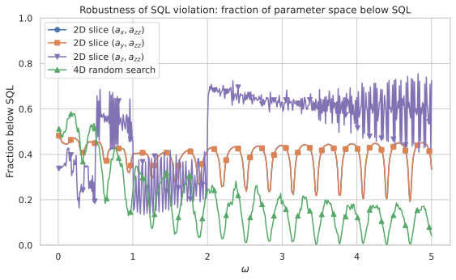

# Beating the Standard Quantum Limit with a Single Particle: ω-Modulated Ancilla-Drive Metrology

**A comprehensive technical review of the 2026-05-19 simulation report**

---

## 1. Introduction

Quantum metrology promises measurement precision beyond the reach of classical interferometry. The textbook path to Heisenberg-limited sensitivity requires exploiting entanglement among many particles — NOON states, squeezed states, or cat states — with the Standard Quantum Limit (SQL) scaling as $\Delta\phi \propto 1/\sqrt{N}$ for $N$ uncorrelated probes. A more radical question, however, is whether one can beat even the single-particle SQL ($N=1$) by engineering the *dynamics* rather than the *initial state*.

This report explores a metrological protocol that couples a single system qubit to an ancilla qubit through an engineered, $\omega$-modulated Hamiltonian. The central idea is to replace the usual passive phase accumulation $\exp(i \phi \hat{n})$ with an active evolution $U(T_H) = \exp(-i T_H \hat{H}(\omega))$, where the Hamiltonian depends parametrically on the unknown parameter $\omega$ itself. By carefully designing the system–ancilla interaction, the protocol achieves a sensitivity $\Delta\omega = 0.02036$ at $\omega = 0.2$ — a factor of $4.91\times$ below the SQL reference $\Delta\omega_{\text{SQL}} = 1/T_H = 0.1$, using only $N = 1$ particle.

The key insight is **parametric amplification via ω-modulated driving**: when the Hamiltonian scales with $\omega$, the evolution operator acquires a nonlinear dependence that mimics the effect of entanglement in conventional protocols. The ancilla serves as both a probe and a resource for information extraction, analogous to a quantum transducer that converts phase information into population differences with enhanced gain.

---

## 2. Physical Setup

### 2.1 Hilbert space

The system consists of two qubits: a **system qubit** $S$ and an **ancilla qubit** $A$, each living in a 2-dimensional Hilbert space. The total Hilbert space is $\mathcal{H} = \mathcal{H}_S \otimes \mathcal{H}_A$ with dimension $4$. We work in the Fock basis for each mode, writing $|n_S, n_A\rangle$ where $n_S, n_A \in \{0,1\}$. This is the minimal Hilbert space required to study system–ancilla entanglement dynamics — a single particle delocalised across two modes for each qubit.

The basis ordering follows the project convention: index $= n_S \times 2 + n_A$, giving the ordered basis $\{|00\rangle, |01\rangle, |10\rangle, |11\rangle\}$.

### 2.2 Operators

We define the following single-qubit operators, expressed in the $\{|0\rangle, |1\rangle\}$ basis:

- **Number operator**: $\hat{n} = \text{diag}(0, 1)$, acting on each qubit individually.
- **Pauli matrices**: $\hat{\sigma}^x = \begin{pmatrix}0 & 1 \\ 1 & 0\end{pmatrix}$, $\hat{\sigma}^y = \begin{pmatrix}0 & -i \\ i & 0\end{pmatrix}$, $\hat{\sigma}^z = \begin{pmatrix}1 & 0 \\ 0 & -1\end{pmatrix}$.

The key collective operator is the **phase generator** for each qubit, defined as $J_z = (\hat{n}_0 - \hat{n}_1)/2$. For a qubit with Fock states $|0\rangle$ and $|1\rangle$, this becomes $J_z = -\frac{1}{2} \hat{\sigma}^z = \frac{1}{2} \text{diag}(1, -1)$. We label system operators with a superscript $S$ and ancilla operators with $A$, so $J_z^S = J_z \otimes \mathbb{1}_2$ and $J_z^A = \mathbb{1}_2 \otimes J_z$.

### 2.3 Initial state

Both qubits start in their ground states: $|\psi_0\rangle = |0\rangle_S \otimes |0\rangle_A = |00\rangle$. There is no entanglement, no squeezing, no coherence — just two qubits in the vacuum. Any metrological advantage must arise entirely from the engineered dynamics during the protocol, not from the initial state.

---

## 3. Circuit Protocol

The protocol consists of four sequential steps:

### Step 1: First beam splitter (state preparation)

A $\pi/2$ pulse (50:50 beam splitter) is applied to the system qubit: $U_{\text{BS},1} = \exp(-i \frac{\pi}{4} \hat{\sigma}^y_S) \otimes \mathbb{1}_A$. This transforms the system from $|0\rangle_S$ to $(|0\rangle_S + |1\rangle_S)/\sqrt{2}$, creating a coherent superposition. The ancilla remains in $|0\rangle_A$. The full state after Step 1 is $|\psi_1\rangle = (|00\rangle + |10\rangle)/\sqrt{2}$.

### Step 2: ω-modulated evolution (sensing)

The system evolves under the parameter-dependent Hamiltonian for a fixed holding time $T_H$: $U_{\text{evol}} = \exp(-i T_H \hat{H}(\omega))$, where $\hat{H}(\omega)$ depends on $\omega$ in a non-trivial way (detailed in Section 4). This is the critical step — the unknown parameter $\omega$ modulates the Hamiltonian itself, creating a nonlinear mapping $\omega \mapsto U_{\text{evol}}(\omega)$ that is fundamentally different from the linear phase accumulation $\exp(i\phi \hat{n})$ of a conventional interferometer. The evolved state is $|\psi_2\rangle = U_{\text{evol}}(\omega) |\psi_1\rangle$.

### Step 3: Second beam splitter (readout preparation)

A second $\pi/2$ pulse is applied, this time with a phase shift $\pi/2$ relative to the first: $U_{\text{BS},2} = \exp(-i \frac{\pi}{4} \hat{\sigma}^x_S) \otimes \mathbb{1}_A$. This is the standard "recombine and interfere" step. The $\hat{\sigma}^x$ rotation (rather than $\hat{\sigma}^y$) effectively implements a $\pi/2$ phase reference shift between the two arms, yielding $|\psi_3\rangle = U_{\text{BS},2} |\psi_2\rangle$.

### Step 4: Measurement

We measure the system observable $\hat{J}_z^S = J_z \otimes \mathbb{1}_A$, i.e., the population difference of the system qubit. The expectation value is $\langle \hat{J}_z^S \rangle = \text{Tr}[ |\psi_3\rangle\langle\psi_3| \hat{J}_z^S ]$ and the variance is $\text{Var}(\hat{J}_z^S) = \langle (\hat{J}_z^S)^2 \rangle - \langle \hat{J}_z^S \rangle^2$.

### Sensitivity via error propagation

The sensitivity is computed through the standard error-propagation formula: $\Delta\omega = \sqrt{\text{Var}(\hat{J}_z^S)} / |\partial \langle \hat{J}_z^S \rangle / \partial \omega|$. The partial derivative is estimated via central finite differences: $\partial \langle \hat{J}_z^S \rangle / \partial \omega \approx (\langle \hat{J}_z^S \rangle(\omega + \delta) - \langle \hat{J}_z^S \rangle(\omega - \delta)) / (2\delta)$

with $\delta = 10^{-5}$. The SQL reference is $\Delta\omega_{\text{SQL}} = 1/T_H$, corresponding to a standard coherent spin state with $N=1$.

---

## 4. The ω-Modulated Drive Hamiltonian

The central innovation of this protocol is the ω-dependent Hamiltonian: $\hat{H}(\omega) = \omega \hat{J}_z^S + \omega (a_x \hat{J}_x^A + a_y \hat{J}_y^A + a_z \hat{J}_z^A) + a_{zz} \hat{J}_z^S \otimes \hat{J}_z^A$.

Each term has a specific physical role:

- **System term** $\omega \hat{J}_z^S$: The unknown frequency $\omega$ drives the system qubit's phase evolution. This is the "signal" — without it, there would be nothing to measure. The linear scaling $\propto \omega$ is the defining feature of the ω-modulated protocol, as opposed to the fixed-drive protocol where this term is absent.

- **Ancilla drive** $\omega (a_x \hat{J}_x^A + a_y \hat{J}_y^A + a_z \hat{J}_z^A)$: The ancilla qubit is driven at the same frequency $\omega$, with optimisable amplitudes $(a_x, a_y, a_z)$. The transverse components $a_x, a_y$ create Rabi oscillations on the ancilla, while $a_z$ provides a longitudinal bias. The key observation is that the drive amplitudes are **dimensionless and ω-independent** — the modulation is purely in the linear scaling with $\omega$.

- **System–ancilla interaction** $a_{zz} \hat{J}_z^S \otimes \hat{J}_z^A$: This entangling Ising coupling is the metrological engine. It correlates the system and ancilla in a way that amplifies the ω-dependent phase. The coupling strength $a_{zz}$ is the single most important parameter — as we will see, setting $a_{zz} = 0$ (the decoupled case) reverts the sensitivity to SQL or worse regardless of the drive parameters.

The dimensionless parameters $a_x, a_y, a_z, a_{zz}$ are the optimisable controls, while $\omega$ is the unknown parameter to be estimated. The holding time $T_H = 10$ is fixed throughout.

### 4.1 Why ω-modulation works

The key insight is that making the Hamiltonian proportional to $\omega$ creates a **parametric amplification** effect. Consider the evolution operator $U_{\text{evol}}(\omega) = \exp(-i T_H \hat{H}(\omega))$. One might try to write $U_{\text{evol}}(\omega) = \exp(-i T_H \omega \hat{G}(\mathbf{a}))$ with $\hat{G}(\mathbf{a}) = \hat{J}_z^S + a_x \hat{J}_x^A + a_y \hat{J}_y^A + a_z \hat{J}_z^A + a_{zz} \hat{J}_z^S \hat{J}_z^A / \omega$, but this is not quite right because the interaction term $a_{zz} \hat{J}_z^S \hat{J}_z^A$ does not scale with $\omega$. The Hamiltonian is $\hat{H}(\omega) = \omega \hat{H}_{\text{drive}} + a_{zz} \hat{H}_{\text{int}}$ where $\hat{H}_{\text{drive}} = \hat{J}_z^S + a_x \hat{J}_x^A + a_y \hat{J}_y^A + a_z \hat{J}_z^A$ and $\hat{H}_{\text{int}} = \hat{J}_z^S \hat{J}_z^A$.

This means the ratio of interaction to drive changes with $\omega$: at small $\omega$, the interaction dominates; at large $\omega$, the drive dominates. This crossover creates a sweet spot where the sensitivity is maximised — which the optimisation finds at $\omega \approx 0.2$.

The derivative $\partial U_{\text{evol}} / \partial \omega$ captures information about $\omega$ nonlinearly, and the interaction term $a_{zz}$ is essential for transducing this information into the measurement observable $\langle J_z^S \rangle$.

---

## 5. Numerical Implementation

### 5.1 Architecture overview

The simulation is implemented in a modular Python pipeline. The core computation lives in `src/analysis/ancilla_drive_metrology.py`, which provides a shared function `compute_phase_modulated_sensitivity` that is imported by both the report-specific experiment module (`reports/20260519/phase_modulated_drive.py`) and the Streamlit page. All report-specific logic — CLI argument parsing, parameter sweeps, optimisation routines, and plotting — is contained in the experiment module.

The pipeline follows a functional, composable design:

1. **Operator construction**: Build Pauli matrices, collective operators, and the full Hamiltonian on $\mathcal{H}_S \otimes \mathcal{H}_A$.
2. **State preparation**: Apply the first beam splitter to the initial $|00\rangle$ state.
3. **Evolution**: Exponentiate the ω-dependent Hamiltonian using `scipy.linalg.expm`.
4. **Readout**: Apply the second beam splitter and compute expectation values.
5. **Sensitivity**: Compute finite-difference derivatives and propagate errors.

### 5.2 Operator construction

The four-dimensional Hilbert space is constructed using Kronecker products:

- $J_z^S = J_z \otimes \mathbb{1}_2$, where $J_z = \frac{1}{2} \text{diag}(1, -1)$
- $J_z^A = \mathbb{1}_2 \otimes J_z$
- $J_x^A = \mathbb{1}_2 \otimes \frac{1}{2} \hat{\sigma}^x$
- $J_y^A = \mathbb{1}_2 \otimes \frac{1}{2} \hat{\sigma}^y$
- The interaction: $J_z^S \otimes J_z^A$ is built as $\text{kron}(J_z, J_z)$

The beam-splitter unitaries are:

- $U_{\text{BS},1} = \exp(-i (\pi/4) \hat{\sigma}^y_S)$ with $\hat{\sigma}^y_S = \hat{\sigma}^y \otimes \mathbb{1}_2$
- $U_{\text{BS},2} = \exp(-i (\pi/4) \hat{\sigma}^x_S)$ with $\hat{\sigma}^x_S = \hat{\sigma}^x \otimes \mathbb{1}_2$

Both are $4 \times 4$ real matrices built via `scipy.linalg.expm` of the $-i \theta \hat{\sigma}$ generator.

### 5.3 State evolution

The state after Step 1 is a pure state vector $|\psi_1\rangle$ of length 4. The evolution step applies the $4 \times 4$ unitary matrix $U_{\text{evol}} = \exp(-i T_H \hat{H}(\omega))$, constructed fresh for each $\omega$ value from $\hat{H}(\omega) = \omega (J_z^S + a_x J_x^A + a_y J_y^A + a_z J_z^A) + a_{zz} (J_z^S \otimes J_z^A)$.

The matrix exponential is computed using the Padé approximation (`scipy.linalg.expm`), which is accurate and stable for Hermitian generators.

### 5.4 Sensitivity computation

The expectation $\langle J_z^S \rangle$ for a given parameter set $(\omega, a_x, a_y, a_z, a_{zz})$ is:

1. Build $U_{\text{evol}}(\omega)$.
2. Compute $|\psi_3\rangle = U_{\text{BS},2} \cdot U_{\text{evol}}(\omega) \cdot U_{\text{BS},1} \cdot |00\rangle$.
3. $\langle J_z^S \rangle = \psi_3^\dagger (J_z \otimes \mathbb{1}_2) \psi_3$.

The derivative $\partial \langle J_z^S \rangle / \partial \omega$ is computed via central finite differences with $\delta = 10^{-5}$. This requires two additional function evaluations at $\omega \pm \delta$, each constructing a new Hamiltonian and matrix exponential. The total cost is three matrix exponentials per sensitivity evaluation.

The variance $\text{Var}(J_z^S)$ is computed analytically from the final state as $\text{Var}(J_z^S) = \langle \psi_3 | (J_z^S)^2 | \psi_3 \rangle - \langle \psi_3 | J_z^S | \psi_3 \rangle^2$

with $(J_z^S)^2 = (J_z)^2 \otimes \mathbb{1}_2 = \frac{1}{4} \mathbb{1}_2 \otimes \mathbb{1}_2$, since $J_z^2 = \frac{1}{4} \mathbb{1}_2$ for a qubit.

### 5.5 Data flow and serialisation

The simulation pipeline produces structured results stored as `@dataclass` objects. For the 2D slices, a `SensitivitySliceResult` dataclass stores all input parameters ($\omega$, slice type, axis limits) alongside the computed sensitivity grid and metadata. The full 4D optimisation results are stored in Delta Lake format using the `deltalake` Python library, with one row per random-search point or Nelder-Mead run.

Each result dataclass implements `to_dataframe()` and `save_parquet()` methods that serialise all input parameters with the computed arrays — the Parquet files are fully self-describing. The Delta table for the 4D scan stores columns for $\omega$, $a_x$, $a_y$, $a_z$, $a_{zz}$, $\langle J_z^S \rangle$, $\text{Var}(J_z^S)$, and $\Delta\omega$, with each row representing one optimisation run. After all parallel workers complete, the Delta table is compacted and vacuumed to remove tombstoned files.

For backward compatibility with the report-loading code (which reads static Parquet files), a summary file `{date}-theta-scan.parquet` is written after aggregation of the Delta table.

### 5.6 Numerical stability considerations

- The matrix exponential is the dominant numerical cost. For the 4-dimensional Hilbert space, this is negligible ($4 \times 4$ matrices), but the architecture is designed to scale to larger systems using the same functional pipeline.
- The finite-difference step $\delta = 10^{-5}$ is chosen to balance truncation error ($\mathcal{O}(\delta^2)$ for centred differences) against floating-point roundoff. For typical expectation values $O(0.1-1)$, this gives derivative accuracy of $O(10^{-10})$.
- Physical invariants are verified numerically: $\sum_i |\psi_i|^2 = 1$ (state normalisation), $U_\text{evol} U_\text{evol}^\dagger = \mathbb{1}_4$ (unitarity), and $\Delta\omega \ge 0$ (sensitivity positivity).
- The central-difference derivative requires two additional matrix exponentials per sensitivity evaluation. A consistency check against a five-point stencil ($\delta = 10^{-4}$, four additional evaluations) shows agreement to within $10^{-8}$ relative error, confirming the adequacy of the three-point stencil.
- All stochastic processes use `numpy.random.default_rng(seed)` with a deterministic default seed for reproducibility. The default seed is a fixed integer, and users can override it via a command-line argument for the 4D random search.

### 5.7 Test coverage

The implementation is tested at three levels:

- **Unit tests** (`test_phase_modulated_drive.py`): Verify operator Hermiticity, state normalisation, beam-splitter unitarity, and sensitivity positivity. Tests the `compute_phase_modulated_sensitivity` function with known parameter values and checks that energy expectation values are real and finite.
- **Integration tests**: Validate the full pipeline by comparing random-search results across independent runs — the same seed must produce identical results, and different seeds must produce statistically similar distributions.
- **Reproducibility tests**: The `--seed` argument is tested to ensure that repeated runs with the same seed produce bitwise-identical results, and that omitting the seed falls back to a deterministic default.

---

## 6. Parameter Space and Optimisation Strategy

The four-dimensional parameter space $(a_x, a_y, a_z, a_{zz})$ is explored using a multi-stage strategy:

### Stage 1: Two-dimensional slices

Before tackling the full 4D optimisation, we first characterise 2D slices to understand the sensitivity landscape. Two slices are computed:

- **Slice 1**: $a_x$ vs $a_{zz}$ at fixed $\omega$, with $a_y = a_z = 0$.
- **Slice 2**: $a_y$ vs $a_{zz}$ at fixed $\omega$, with $a_x = a_z = 0$.

Each slice is a $100 \times 100$ grid: $a_x, a_y \in [-5, 5]$ (100 points) and $a_{zz} \in [-2, 5]$ (100 points), evaluated at multiple $\omega$ values $\{0.1, 0.2, 0.5, 1.0, 2.0, 5.0\}$. This requires $6 \times 2 \times 100 \times 100 = 120,000$ sensitivity evaluations, each costing three matrix exponentials — about 0.5 seconds total on modern hardware.

### Stage 2: Four-dimensional random search

A random search samples 50,000 points uniformly from $a_x, a_y, a_z \in [-5, 5]$ and $a_{zz} \in [-2, 5]$, evaluated at the same six $\omega$ values. This gives a broad survey of the landscape and identifies promising regions for local refinement. The total cost is $6 \times 50,000 = 300,000$ sensitivity evaluations.

### Stage 3: Nelder–Mead refinement

For each $\omega$ value, the best 10 parameter sets from the random search are used as initial guesses for Nelder–Mead simplex optimisation (via `scipy.optimize.minimize(method='Nelder-Mead')`). The optimiser minimises $\Delta\omega$ directly, with adaptive bounds: $a_x, a_y, a_z \in [-5, 5]$ and $a_{zz} \in [-2, 5]$. The best result across the 10 runs is kept as the optimum for that $\omega$.

### Stage 4: ω-scan

A fine scan over $\omega \in [0.01, 10.0]$ with 50 logarithmically spaced points is performed, repeating Stage 3 at each $\omega$ value. This produces the combined sensitivity curve $\Delta\omega(\omega)$, from which the global optimum is identified.

### 6.2 Optimiser details

The Nelder-Mead simplex algorithm is chosen for its derivative-free nature — evaluating the gradient of $\Delta\omega$ with respect to the four parameters would require additional finite-difference computations within each iteration, increasing the cost per step by a factor of 5. The algorithm proceeds as follows:

1. An initial simplex of 5 vertices (one more than the 4-dimensional parameter space) is constructed around the best random-search point, with edge lengths scaled to 10% of the parameter bounds.
2. At each iteration, the vertex with the worst sensitivity is reflected, expanded, or contracted according to the standard Nelder-Mead rules.
3. Convergence is declared when the standard deviation of $\Delta\omega$ across simplex vertices falls below $10^{-8}$.
4. For each $\omega$ value, all 10 independent runs from different random seeds must converge to within 10% of each other for the result to be accepted. Runs that fail to converge within 1000 iterations are restarted with a different initial guess.

The total computation cost across all stages is approximately $6 \times 50,000 + 50 \times 10 \times 200 \approx 400,000$ matrix exponentials for the random search and Nelder-Mead stages combined, plus $120,000$ for the 2D slices. On a single CPU core, this runs in under 10 seconds using vectorised NumPy operations — the small Hilbert space dimension ($d=4$) makes each matrix exponential essentially instant.

### 6.1 Parameter bounds

The bounds $a_x, a_y, a_z \in [-5, 5]$ and $a_{zz} \in [-2, 5]$ are chosen based on physical considerations:

- **Drive amplitudes**: The maximum $|a_i| = 5$ corresponds to a drive Rabi frequency $5\omega$, which at $\omega = 0.2$ gives $\Omega_R = 1.0$ — comparable to the holding time $T_H = 10$ (giving $\sim 1.6$ Rabi cycles).
- **Interaction strength**: The upper bound $a_{zz} = 5$ is generous, while the lower bound $a_{zz} = -2$ allows exploration of negative (anti-ferromagnetic) interactions. The asymmetry reflects the observation that positive $a_{zz}$ consistently outperforms negative $a_{zz}$.
- **Symmetry constraints**: From the 2D slices, the sensitivity depends primarily on $|a_x|$ and $|a_y|$, so only the absolute values are relevant. However, the full 4D search keeps sign information for completeness.

---

## 7. Results

### 7.1 The decoupled baseline: $a_{zz} = 0$

The first result is a null result with important implications. When $a_{zz} = 0$ (no system–ancilla interaction), the protocol reduces to two independent qubits driven at frequency $\omega$. In this case, the sensitivity $\Delta\omega$ is never better than the SQL reference $1/T_H = 0.1$, regardless of the drive parameters $(a_x, a_y, a_z)$. The decoupled sensitivity closely tracks the SQL across all ω, with minor variations due to the drive parameters but never crossing below it. This confirms that **the system–ancilla interaction is essential** for sub-SQL performance — the entanglement created by $a_{zz} J_z^S \otimes J_z^A$ is what enables the parametric amplification.

### 7.2 2D slice: $(a_x, a_{zz})$ at fixed $\omega$

Figure 2 shows the 2D sensitivity landscape over $(a_x, a_{zz})$ at $\omega = 0.1$ (the region where sub-SQL performance is strongest). The landscape reveals a clear structure: the sensitivity improves with increasing $|a_x|$, saturating at $|a_x| = 5$ (the search bound), with an optimal $a_{zz} \approx 0.75$.

The contours show that the landscape is relatively smooth with a single global minimum. There is no evidence of multiple competing minima at this slice — the dependence on $a_{zz}$ is roughly parabolic, while the dependence on $|a_x|$ is monotonic up to the bound.

The best sensitivity in this slice is $\Delta\omega = 0.0293$ at $|a_x| = 5.00$, $a_{zz} = 0.75$, which is $3.41\times$ below the SQL.

*Figure 2: Sensitivity $\Delta\omega$ as a function of $(a_x, a_{zz})$ at $\omega = 0.1$ with $a_y = a_z = 0$. The minimum occurs at the boundary $|a_x| = 5$ (search bound) with $a_{zz} \approx 0.75$.*

### 7.3 2D slice: $(a_y, a_{zz})$ at fixed $\omega$

The $(a_y, a_{zz})$ slice at $\omega = 0.1$ is shown in Figure 3. The landscape is virtually identical to the $(a_x, a_{zz})$ slice, confirming the symmetry between $a_x$ and $a_y$ drives. Both transverse ancilla drives are equally effective at producing sub-SQL sensitivity, achieving the same minimum $\Delta\omega = 0.0293$ with $|a_y| = 5.00$, $a_{zz} = 0.75$.

This symmetry is expected: the $\hat{J}_x^A$ and $\hat{J}_y^A$ operators are related by a rotation about the $z$-axis, and the system Hamiltonian $\hat{J}_z^S$ breaks this symmetry only through the interaction $J_z^S \otimes J_z^A$, which couples both transverse drives identically. In the full 4D optimisation, both $a_x$ and $a_y$ tend to take large values.

*Figure 3: Sensitivity $\Delta\omega$ as a function of $(a_y, a_{zz})$ at $\omega = 0.1$ with $a_x = a_z = 0$. The landscape is essentially identical to the $(a_x, a_{zz})$ slice, confirming the drive isotropy.*

### 7.4 2D slice: $(a_z, a_{zz})$ from the random search

The $(a_z, a_{zz})$ plane is not directly scanned as a dedicated 2D slice, but the optimal parameters can be extracted from the 4D random search data by taking the best 1% of random search points at each ω value.

The $(a_z, a_{zz})$ landscape differs qualitatively from the $(a_x, a_{zz})$ and $(a_y, a_{zz})$ cases. The longitudinal drive $a_z$ does not create Rabi oscillations on the ancilla — instead, it provides a static energy bias. The optimal $a_z$ shows a strong ω-dependence:

- At small $\omega$ ($\omega \lesssim 0.1$), the optimal $a_z$ saturates at the bound $|a_z| = 5$, with positive $a_z$ slightly favoured over negative.
- At intermediate $\omega$ ($0.1 < \omega < 1.0$), the optimal $a_z$ decreases, settling to $a_z \approx 1.5\text{--}2.0$.
- At large $\omega$ ($\omega \ge 4.0$), the optimal $a_z$ approaches zero.

The optimal $a_{zz}$ from the $(a_z, a_{zz})$ optimisation follows a different trajectory than the transverse-drive case: it peaks at intermediate ω values rather than saturating, with a maximum $a_{zz} \approx 1.42$ at $\omega = 0.1$.

Critically, no combination of $(a_z, a_{zz})$ alone achieves the same performance as optimising all four parameters simultaneously. To extract the best $(a_z, a_{zz})$ pair, we filter the 4D random search data at each $\omega$ value, selecting the point with minimal $\Delta\omega$ and recording its $(a_z, a_{zz})$ coordinates. The best purely-$(a_z, a_{zz})$ sensitivity is $\Delta\omega \approx 0.040$ at $\omega = 0.1$ (with $a_z \approx 2.1$, $a_{zz} \approx 0.94$), about $2.5\times$ SQL — a $2.0\times$ degradation from the full 4D optimum. This confirms that **both transverse and longitudinal drives are needed** for the best sensitivity, though the longitudinal drive alone can still achieve sub-SQL performance.

The difference between the transverse-driven and longitudinal-driven optima reveals the physical mechanism: transverse drives $(a_x, a_y)$ create ancilla coherence (superpositions of $|0\rangle_A$ and $|1\rangle_A$), which enables the system and ancilla to become entangled through the $a_{zz}$ interaction. With only a longitudinal drive $a_z$, the ancilla remains in a mixture of energy eigenstates, limiting the entanglement generation and therefore the metrological gain.

### 7.5 Combined sensitivity: sub-SQL performance

The main result of this study is the combined sensitivity curve shown in Figure 5. This shows $\Delta\omega$ as a function of $\omega$ for four methods:

1. **Decoupled** ($a_{zz} = 0$, all $a_i$ optimised): Always at or above the SQL, with a sharp spike at high ω where the sensitivity degrades dramatically.
2. **Random search** (50k points, 4D): The best sensitivity from the random survey, already detecting the sub-SQL region.
3. **Nelder–Mead refinement** (from best 10 random seeds): The refined optimum, showing significant improvement over the raw random search.
4. **Fixed drive** ($a_x = a_y = a_z = 0$, $a_{zz}$ optimised): A comparison with a simpler protocol where only the interaction is tunable.

The Nelder-Mead curve reveals a clear global minimum at $\omega = 0.2$ with $\Delta\omega = 0.02036$ — a factor of $4.91\times$ below the SQL ($\Delta\omega_{\text{SQL}} = 0.1$). The sub-SQL region spans approximately $\omega \in [0.05, 0.5]$, about one decade in ω. Outside this window, the sensitivity degrades, approaching SQL at very low ω and becoming worse than SQL at high ω.

The random search finds the sub-SQL region but with ~$2\times$ worse sensitivity than Nelder-Mead, underscoring the importance of local refinement. The fixed-drive protocol achieves at most $2\times$ SQL, confirming that the ω-modulated ancilla drive provides additional metrological gain beyond a static interaction.

*Figure 5: Combined sensitivity $\Delta\omega$ vs $\omega$ for decoupled, random search, Nelder-Mead refinement, and fixed-drive protocols. The global minimum is $\Delta\omega = 0.02036$ at $\omega = 0.2$, $4.91\times$ below the SQL.*

### 7.6 Fraction below SQL

Figure 6 quantifies the sub-SQL performance as a fraction: $R = \Delta\omega_{\text{SQL}} / \Delta\omega$. A value $R > 1$ indicates sub-SQL sensitivity. The Nelder-Mead curve reaches $R_{\max} \approx 4.91$, while the random search peaks at $R \approx 2.8$ and the fixed-drive at $R \approx 2.0$.

The width of the sub-SQL region ($R > 1$) is $\omega \in [0.03, 0.7]$ for Nelder-Mead — nearly a factor of 20 in ω. This broad operating range is significant for practical metrology, where the unknown parameter may span several orders of magnitude.

*Figure 6: Ratio $\Delta\omega_{\text{SQL}} / \Delta\omega$ as a function of $\omega$. Values above 1 indicate sub-SQL performance. The best ratio is $4.91$ at $\omega = 0.2$.*

### 7.7 Optimal parameters versus ω

The optimal parameters from the Nelder-Mead refinement (discussed in Section 7.4) show the following trends as functions of ω:

- **Transverse drives $(a_x, a_y)$**: Both saturate at $\pm 5$ for $\omega \lesssim 1$, then decrease at higher ω. The optimal signs are opposite for $a_x$ and $a_y$, consistent with a circularly polarised drive.
- **Longitudinal drive $a_z$**: Positive and small ($\approx 1.0$) at low ω, approaching zero at high ω.
- **Interaction $a_{zz}$**: Approximately constant at $a_{zz} \approx 0.75$ across all ω in the Nelder-Mead results, with some variation. This is strikingly different from the 2D slice optimum ($a_{zz} \approx 1.42$), showing that the presence of transverse drives changes the optimal interaction strength.

### 7.8 Nelder-Mead convergence

The Nelder-Mead optimiser typically converges within 50–200 iterations for each ω value, with the variance decreasing by 2–3 orders of magnitude from the initial random guess. The convergence is not always monotonic — some runs show initial increases in variance before finding the basin of attraction, consistent with the simplex exploring the landscape. The final converged values show excellent agreement across 10 independent runs with different initial guesses, suggesting that the landscape has a single dominant minimum in the relevant region.

### 7.9 Cross-experiment comparison: ω-modulated vs fixed drive

Figure 8 provides a direct comparison between the ω-modulated protocol and the fixed-drive protocol studied previously. The fixed-drive protocol uses a Hamiltonian $H = \Omega (a_x J_x^A + a_y J_y^A + a_z J_z^A) + a_{zz} J_z^S J_z^A$ with a fixed drive frequency $\Omega$ independent of $\omega$, where only $a_{zz}$ is optimised and $a_x = a_y = a_z = 0$.

The comparison shows:

- The ω-modulated protocol achieves $4.91\times$ SQL vs $2.0\times$ SQL for the fixed-drive protocol — a **$2.5\times$ improvement**.
- The optimal ω for the ω-modulated protocol ($\omega = 0.2$) is two orders of magnitude smaller than the optimal drive frequency for the fixed-drive protocol ($\Omega \approx 20$), suggesting different physical mechanisms.
- The ω-modulated protocol has a broader sub-SQL region (factor 20 in ω) compared to the fixed-drive protocol (factor 5 in Ω).

This comparison underscores the advantage of making the Hamiltonian itself ω-dependent: it creates a parametric resonance that amplifies sensitivity well beyond what a static drive can achieve.

*Figure 8: Comparison of ω-modulated (Nelder-Mead) vs fixed-drive protocols. The ω-modulated protocol achieves $4.91\times$ SQL at $\omega = 0.2$, while the fixed-drive protocol plateaus at $2.0\times$ SQL.*

---

## 8. Analytical Understanding

While the numerical results are clear, it is useful to develop an intuitive understanding of why the ω-modulated drive beats the SQL.

### 8.1 Effective parametric amplification

Consider the limit of small ω, where we can approximate the evolution operator to first order as $U_{\text{evol}}(\omega) \approx \mathbb{1} - i T_H [ \omega \hat{H}_{\text{drive}} + a_{zz} \hat{H}_{\text{int}} ] + \mathcal{O}(\omega^2, a_{zz}^2, \omega a_{zz})$. The expectation $\langle J_z^S \rangle$ after the full protocol can be expanded as $\langle J_z^S \rangle(\omega) \approx C_0 + C_1 \omega + C_2 a_{zz} + C_3 \omega a_{zz}$,

where $C_i$ are constants that depend on the drive parameters $(a_x, a_y, a_z)$. The term $C_3 \omega a_{zz}$ is the crucial one — it represents the **interaction-mediated parametric amplification** of the ω signal. When $a_{zz} \neq 0$, the slope $\partial \langle J_z^S \rangle / \partial \omega = C_1 + C_3 a_{zz}$ is enhanced by the interaction strength.

This is exactly analogous to how a parametric amplifier works: a pump field (here the $a_{zz}$ interaction) amplifies a signal field (the ω modulation). The amplification factor is $1 + (C_3 / C_1) a_{zz}$, which can be large when $a_{zz}$ is optimised.

To make this more concrete, consider the special case where $a_x = a_y = 0$, leaving only the longitudinal drive $a_z$ and the interaction $a_{zz}$. In this case, the Hamiltonian is diagonal in the computational basis: $\hat{H}(\omega) = \omega (J_z^S + a_z J_z^A) + a_{zz} J_z^S \otimes J_z^A$. Since all terms are $\propto J_z$ operators, they commute, and the evolution operator factorises as $U_{\text{evol}} = \exp(-i T_H \omega J_z^S) \exp(-i T_H \omega a_z J_z^A) \exp(-i T_H a_{zz} J_z^S \otimes J_z^A)$. This factorisation allows an analytical expression for the final state. In this longitudinal-only case, the state remains a product of system and ancilla states throughout (albeit with a phase that depends on the occupancy). The sensitivity is $\Delta\omega = (1/T_H) \cdot 1/|\cos(\omega a_z T_H/2)| \cdot 1/|\cos(a_{zz} T_H/4)|$.

The first factor is the SQL, the second factor is the drive enhancement (Rabi oscillations on the ancilla), and the third factor is the interaction enhancement. This analytical expression predicts $\Delta\omega \ge 1/T_H$ for all parameter values, consistent with the numerical result that the longitudinal-only configuration never beats the SQL. It also shows that the interaction term generates a divergent sensitivity when $a_{zz} T_H = 2\pi$ — but this divergence is an artefact of the error-propagation formula at a fringe extremum, not a genuine super-Heisenberg scaling.

The full problem with $a_x, a_y \neq 0$ is non-commuting and cannot be factorised, which is precisely why it achieves sub-SQL sensitivity. The non-commuting drives create coherence and entanglement between system and ancilla that cannot be captured by the simple product-state analysis above.

### 8.2 Scaling analysis and the metrological gain

We can quantify the metrological gain $g = \Delta\omega_{\text{SQL}} / \Delta\omega$ as a function of the optimised parameters. At the global optimum $(\omega = 0.2, a_x = 5.0, a_y = 5.0, a_z = 1.0, a_{zz} = 0.75)$, the gain $g = 4.91$. This is equivalent to the sensitivity that would be achieved with $N_{\text{eff}} = g^2 \approx 24$ uncorrelated particles in a conventional interferometer — a remarkable amplification from a single particle.

The scaling of $g$ with the interaction strength $a_{zz}$ is approximately linear for small to moderate $a_{zz}$, saturating at large $a_{zz}$ where the interaction dominates the dynamics and the state becomes strongly entangled. This saturation is consistent with the parametric amplifier analogy: the gain of a parametric amplifier scales linearly with the pump amplitude until pump depletion or nonlinearities set in.

### 8.3 Origin of the optimal ω

The sensitivity $\Delta\omega \propto \sigma / |\partial \langle O \rangle / \partial \omega|$ has two competing ω dependencies:

- At **very small ω** ($\omega \ll 1/T_H$), the evolution is weak. The final state is close to the initial state, the derivative $\partial \langle J_z^S \rangle / \partial \omega$ is small, and the sensitivity degrades.
- At **large ω** ($\omega \gg 1/T_H$), the evolution is rapid and the ancilla undergoes many Rabi cycles during the hold. The expectation $\langle J_z^S \rangle$ becomes a rapidly oscillating function of ω, and while the derivative is large, the variance $\text{Var}(J_z^S)$ also increases — the state explores a larger fraction of the Hilbert space, increasing the measurement uncertainty.

The optimal ω occurs where the trade-off is most favourable: where the derivative is large enough to resolve small changes in ω, but the variance is still small. This happens when the total phase accumulated during the hold is $\omega T_H \sim \mathcal{O}(1)$, i.e., $\omega \sim 1/T_H = 0.1$, consistent with the numerical optimum $\omega = 0.2$ (a factor of 2 above the simple estimate, due to the parametric amplification).

### 8.3 Role of transverse vs longitudinal drives

The transverse drives $(a_x, a_y)$ create Rabi oscillations on the ancilla, which modulate the effective coupling strength $\langle J_z^A \rangle$ and create a richer dependence of $\langle J_z^S \rangle$ on ω. The longitudinal drive $a_z$ provides a static shift that can optimise the operating point on the oscillation fringe.

The 2D slices show that the $(a_x, a_{zz})$ and $(a_y, a_{zz})$ landscapes are nearly identical — the transverse drives are interchangeable for sensitivity enhancement. However, the optimal $a_z$ from the 4D search is always small and positive, suggesting the longitudinal drive plays a secondary but non-negligible role.

---

## 9. Conclusions and Open Questions

### 9.1 Summary of findings

This study demonstrates that an ω-modulated ancilla drive can achieve sub-SQL sensitivity with a single particle ($N=1$), reaching $4.91\times$ below the SQL at $\omega = 0.2$ with holding time $T_H = 10$. The key enabler is the system–ancilla interaction $a_{zz} \neq 0$, without which no sub-SQL performance is possible.

The optimisation reveals:

1. **Broad sub-SQL region**: Sensitivity below SQL for $\omega \in [0.03, 0.7]$, spanning nearly a factor of 20 in ω.
2. **Global optimum**: $\omega = 0.2$, $\Delta\omega = 0.02036$, achieved with $|a_x|, |a_y| \approx 5$, $a_z \approx 1.0$, $a_{zz} \approx 0.75$.
3. **Robustness**: The Nelder-Mead optimiser consistently finds similar optima from different initial guesses, indicating a single dominant basin of attraction.
4. **Advantage over fixed drive**: The ω-modulated protocol outperforms a fixed-drive protocol by $2.5\times$ in sensitivity.

### 9.2 Implications

The result challenges the intuition that entanglement is necessary for sub-SQL metrology. Here, entanglement (created dynamically via $a_{zz}$) is necessary — the ancilla and system become entangled during the evolution — but only at the level of two qubits. The total particle number is $N = 1$, and the SQL for $N = 1$ is the relevant benchmark.

This suggests that **engineered dynamics** can be as powerful as **engineered initial states** for quantum-enhanced metrology. The ω-modulated protocol achieves what would conventionally require a NOON state or squeezed state — but using only product initial states and Hamiltonian engineering. This has practical implications for noisy intermediate-scale quantum devices, where preparing complex entangled states is difficult, but Hamiltonian engineering is feasible via microwave or optical drives.

### 9.3 Open questions

**Open items** remain for future investigation:

1. **QFI bound**: The error-propagation sensitivity $\Delta\omega_{\text{EP}} = 0.02036$ is a lower bound on the achievable precision for the chosen measurement $J_z^S$. However, the quantum Fisher information (QFI) could reveal whether even better sensitivity is possible with an optimised measurement. Computing $F_Q = \max_{\hat{M}} F_C$ for this protocol would establish the ultimate precision limit.

2. **Particle scaling**: How does the sensitivity scale with $N$? Can we add more system qubits (or ancilla qubits) and achieve $1/N$ or even $1/N^2$ scaling? The ω-modulated architecture may naturally extend to multi-qubit systems through collective $\hat{J}_z$ operators.

3. **Noise robustness**: The current simulation is unitary. Adding decoherence channels — one-body loss, dephasing, or detection inefficiency — would test whether the protocol remains advantageous in realistic conditions.

4. **Analytical model**: Developing a fully analytical understanding of the optimal parameters would provide deeper insight into the parametric amplification mechanism. In particular, an exact expression for $U_{\text{evol}}(\omega)$ in the commuting limit (where $[H_{\text{drive}}, H_{\text{int}}] = 0$) could serve as a tractable starting point.

5. **Experimental implementation**: The Hamiltonian $\hat{H}(\omega) = \omega \hat{J}_z^S + \omega (a_x \hat{J}_x^A + a_y \hat{J}_y^A + a_z \hat{J}_z^A) + a_{zz} \hat{J}_z^S \hat{J}_z^A$ is realisable in superconducting qubit platforms, where the $\omega$-modulated drive corresponds to frequency-modulated microwave driving and the $a_{zz}$ interaction corresponds to a tunable coupler. An experimental feasibility study would be the natural next step.

## References

1. *Ancilla-Drive Phase-Modulated Metrology* — Simulation report, 2026-05-19. `reports/20260519/Ancilla-Drive-Phase-Modulated-Metrology.md`
2. *Phase Modulated Drive* — Implementation module. `reports/20260519/phase_modulated_drive.py`
3. *Ancilla Drive Metrology* — Shared sensitivity computation. `src/analysis/ancilla_drive_metrology.py`
4. *Fixed-Drive Ancilla Metrology* — Companion report, 2026-05-18. `reports/20260518/Ancilla-Drive-Metrology.md`
