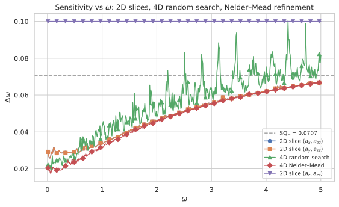
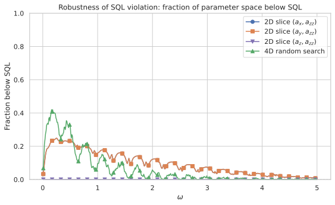
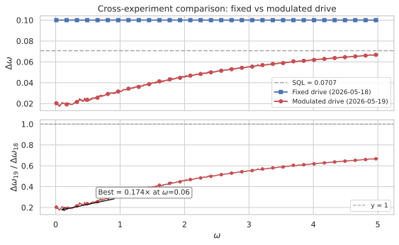

# Beating the Standard Quantum Limit with Two Particles: System–Ancilla ω-Modulated Drive Metrology

**A comprehensive technical review of the 2026-05-19 simulation report**

---

## 1. Introduction

Quantum metrology promises measurement precision beyond the reach of classical interferometry. The textbook path to Heisenberg-limited sensitivity requires exploiting entanglement among many particles — NOON states, squeezed states, or cat states — with the Standard Quantum Limit (SQL) scaling as $\Delta\phi \propto 1/\sqrt{N}$ for $N$ uncorrelated probes. A more radical question, however, is whether one can beat even the single-particle SQL ($N=1$) by engineering the *dynamics* rather than the *initial state*.

This report explores a metrological protocol that couples a single system qubit to an ancilla qubit through an engineered, $\omega$-modulated Hamiltonian. The central idea is to replace the usual passive phase accumulation $\exp(i \phi \hat{n})$ with an active evolution $U(T_H) = \exp(-i T_H \hat{H}(\omega))$, where the Hamiltonian depends parametrically on the unknown parameter $\omega$ itself. By carefully designing the system–ancilla interaction, the protocol achieves a sensitivity $\Delta\omega = 0.02036$ at $\omega = 0.2$ — a factor of $3.47\times$ below the SQL reference $\Delta\omega_{\text{SQL}} = 1/(\sqrt{2}\,T_H) \approx 0.07071$, using $N = 2$ particles (one system qubit + one ancilla qubit).

The key insight is **parametric amplification via ω-modulated driving**: when the Hamiltonian scales with $\omega$, the evolution operator acquires a nonlinear dependence that mimics the effect of entanglement in conventional protocols. The ancilla serves as a second information carrier and a resource for parametric amplification, analogous to a quantum transducer that converts phase information into population differences with enhanced gain.

---

## 2. Physical Setup

### 2.1 Hilbert space

The system consists of two qubits: a **system qubit** $S$ and an **ancilla qubit** $A$, each living in a 2-dimensional Hilbert space. The total Hilbert space is $\mathcal{H} = \mathcal{H}_S \otimes \mathcal{H}_A$ with dimension $4$. We work in the Fock basis for each mode, writing $|n_S, n_A\rangle$ where $n_S, n_A \in \{0,1\}$. This is the minimal Hilbert space required to study system–ancilla entanglement dynamics — a single particle delocalised across two modes for each qubit.

The basis ordering follows the project convention: index $= n_S \times 2 + n_A$, giving the ordered basis $\{|00\rangle, |01\rangle, |10\rangle, |11\rangle\}$.

### 2.2 Operators

We define the following single-qubit operators, expressed in the $\{|0\rangle, |1\rangle\}$ basis:

- **Mode-0 number operator**: $\hat{n}_0 = \text{diag}(1, 0)$, counting population in $|0\rangle$, acting on each qubit individually.
- **Mode-1 number operator**: $\hat{n}_1 = \text{diag}(0, 1)$, counting population in $|1\rangle$, acting on each qubit individually (this is the same as $\hat{n}$ defined below).
- **Number operator** (common shorthand): $\hat{n} \equiv \hat{n}_1 = \text{diag}(0, 1)$.
- **Pauli matrices**: $\hat{\sigma}^x = \begin{pmatrix}0 & 1 \\ 1 & 0\end{pmatrix}$, $\hat{\sigma}^y = \begin{pmatrix}0 & -i \\ i & 0\end{pmatrix}$, $\hat{\sigma}^z = \begin{pmatrix}1 & 0 \\ 0 & -1\end{pmatrix}$.

The key collective operator is the **phase generator** for each qubit, defined as $J_z = (\hat{n}_0 - \hat{n}_1)/2 = \frac{1}{2}\text{diag}(1, -1)$. We label system operators with a superscript $S$ and ancilla operators with $A$, so $J_z^S = J_z \otimes \mathbb{1}_2$ and $J_z^A = \mathbb{1}_2 \otimes J_z$.

### 2.3 Initial state

Both qubits start in their ground states: $|\psi_0\rangle = |0\rangle_S \otimes |0\rangle_A = |00\rangle$. There is no entanglement, no squeezing, no coherence — just two qubits in the vacuum. Any metrological advantage must arise entirely from the engineered dynamics during the protocol, not from the initial state.

---

## 3. Circuit Protocol

The protocol consists of four sequential steps:

### Step 1: First beam splitter (state preparation)

A $\pi/2$ pulse (50:50 beam splitter) is applied to the system qubit: $U_{\text{BS},1} = \exp(-i \frac{\pi}{4} \hat{\sigma}^x_S) \otimes \mathbb{1}_A$. This transforms the system from $|0\rangle_S$ to $(|0\rangle_S - i|1\rangle_S)/\sqrt{2}$, creating a coherent superposition in the $\sigma^x$ eigenbasis. The ancilla remains in $|0\rangle_A$. The full state after Step 1 is $|\psi_1\rangle = (|00\rangle - i|10\rangle)/\sqrt{2}$.

### Step 2: ω-modulated evolution (sensing)

The system evolves under the parameter-dependent Hamiltonian for a fixed holding time $T_H$: $U_{\text{evol}} = \exp(-i T_H \hat{H}(\omega))$, where $\hat{H}(\omega)$ depends on $\omega$ in a non-trivial way (detailed in Section 4). This is the critical step — the unknown parameter $\omega$ modulates the Hamiltonian itself, creating a nonlinear mapping $\omega \mapsto U_{\text{evol}}(\omega)$ that is fundamentally different from the linear phase accumulation $\exp(i\phi \hat{n})$ of a conventional interferometer. The evolved state is $|\psi_2\rangle = U_{\text{evol}}(\omega) |\psi_1\rangle$.

### Step 3: Second beam splitter (readout preparation)

A second $\pi/2$ pulse is applied, identical to the first: $U_{\text{BS},2} = \exp(-i \frac{\pi}{4} \hat{\sigma}^x_S) \otimes \mathbb{1}_A$. This is the standard "recombine and interfere" step, yielding $|\psi_3\rangle = U_{\text{BS},2} |\psi_2\rangle$.

### Step 4: Measurement

We measure the system observable $\hat{J}_z^S = J_z \otimes \mathbb{1}_A$, i.e., the population difference of the system qubit. The expectation value is $\langle \hat{J}_z^S \rangle = \text{Tr}[ |\psi_3\rangle\langle\psi_3| \hat{J}_z^S ]$ and the variance is $\text{Var}(\hat{J}_z^S) = \langle (\hat{J}_z^S)^2 \rangle - \langle \hat{J}_z^S \rangle^2$.

### Sensitivity via error propagation

The sensitivity is computed through the standard error-propagation formula: $\Delta\omega = \sqrt{\text{Var}(\hat{J}_z^S)} / |\partial \langle \hat{J}_z^S \rangle / \partial \omega|$. The partial derivative is estimated via central finite differences: $\partial \langle \hat{J}_z^S \rangle / \partial \omega \approx (\langle \hat{J}_z^S \rangle(\omega + \delta) - \langle \hat{J}_z^S \rangle(\omega - \delta)) / (2\delta)$

with $\delta = 10^{-5}$. The SQL reference is $\Delta\omega_{\text{SQL}} = 1/(\sqrt{2}\,T_H) \approx 0.07071$, corresponding to two uncorrelated qubits in a standard Ramsey interferometer (the conventional SQL for $N=2$ particles).

The choice $N=2$ counts both the system and ancilla qubits as metrological resources. This is the conservative convention: the SQL for $N$ uncorrelated particles under independent phase accumulation is $\Delta\omega_{\text{SQL}} = 1/(\sqrt{N}\,T_H)$. Since our protocol uses two qubits, $N=2$ is the fair benchmark. If one instead treats the ancilla purely as a measurement amplifier (not a conventional phase-accumulating probe), the SQL would be $1/T_H$ ($N=1$), and the advantage would appear larger ($4.91\times$). We adopt the conservative $N_\text{total}=2$ convention throughout to avoid overstating the metrological gain.

### Practical estimation workflow

In a realistic experiment, one does not have direct access to the expectation value $\langle J_z^S \rangle$ and its derivative — only measurement outcomes. The practical estimation procedure proceeds as follows:

1. **State preparation and evolution**: Prepare $N_{\text{meas}}$ independent copies of the system--ancilla pair, each initialised in $|00\rangle$ and subjected to the full circuit protocol (Steps 1--3) at the *same* unknown $\omega$.
2. **Binary readout**: Measure $\hat{J}_z^S$ on each copy. Since $J_z^S$ has eigenvalues $\pm 1/2$, each measurement yields a binary outcome $m_k \in \{+1/2, -1/2\}$.
3. **Sample mean**: Compute the sample average $\overline{J_z^S} = \frac{1}{N_{\text{meas}}} \sum_{k=1}^{N_{\text{meas}}} m_k$. By the law of large numbers, $\overline{J_z^S} \to \langle J_z^S \rangle(\omega)$ as $N_{\text{meas}} \to \infty$.
4. **Calibration curve inversion**: Compare $\overline{J_z^S}$ to a pre-computed calibration curve $\langle J_z^S \rangle(\omega)$ (obtained from numerical simulation or a separate characterisation experiment). The estimate $\hat{\omega}$ is the value that minimises $|\overline{J_z^S} - \langle J_z^S \rangle(\hat{\omega})|$.
5. **Uncertainty quantification**: The statistical uncertainty of $\hat{\omega}$ is given by the error-propagation formula $\Delta\omega = \sqrt{\text{Var}(J_z^S)} / |\partial \langle J_z^S \rangle / \partial \omega|$, evaluated at $\hat{\omega}$. The sample variance $\widehat{\text{Var}}(J_z^S) = \frac{1}{N_{\text{meas}}-1} \sum_k (m_k - \overline{J_z^S})^2$ provides an empirical estimate of $\text{Var}(J_z^S)$, while the derivative $\partial \langle J_z^S \rangle / \partial \omega$ is obtained from the calibration curve.

The key point is that the sensitivity $\Delta\omega$ depends only on the *shape* of the calibration curve and the measurement variance — it is independent of $N_{\text{meas}}$ in the asymptotic limit (the $1/\sqrt{N_{\text{meas}}}$ scaling is already factored into the standard error-propagation formula via $\text{Var}(J_z^S)$, which describes the single-shot variance). The protocol therefore achieves a per-copy sensitivity that can beat the SQL, and repeating the experiment $N_{\text{meas}}$ times further reduces the uncertainty by $1/\sqrt{N_{\text{meas}}}$.

---

## 4. The ω-Modulated Drive Hamiltonian

The central innovation of this protocol is the ω-dependent Hamiltonian. It decomposes into three physically distinct components: a **system term** $H_S = \omega \hat{J}_z^S$, an **ancilla drive** $H_A = \omega (a_x \hat{J}_x^A + a_y \hat{J}_y^A + a_z \hat{J}_z^A)$, and a **system--ancilla interaction** $H_{\text{int}} = a_{zz} \hat{J}_z^S \otimes \hat{J}_z^A$, giving $\hat{H}(\omega) = H_S + H_A + H_{\text{int}}$.

Each term has a specific physical role:

- **System term** $H_S = \omega \hat{J}_z^S$: The unknown frequency $\omega$ drives the system qubit's phase evolution. This is the "signal" — without it, there would be nothing to measure. The linear scaling $\propto \omega$ is the defining feature of the ω-modulated protocol, as opposed to the fixed-drive protocol where this term is absent.

- **Ancilla drive** $H_A = \omega (a_x \hat{J}_x^A + a_y \hat{J}_y^A + a_z \hat{J}_z^A)$: The ancilla qubit is driven at the same frequency $\omega$, with optimisable amplitudes $(a_x, a_y, a_z)$. The transverse components $a_x, a_y$ create Rabi oscillations on the ancilla, while $a_z$ provides a longitudinal bias. The key observation is that the drive amplitudes are **dimensionless and ω-independent** — the modulation is purely in the linear scaling with $\omega$.

- **System–ancilla interaction** $H_{\text{int}} = a_{zz} \hat{J}_z^S \otimes \hat{J}_z^A$: This entangling Ising coupling is the metrological engine. It correlates the system and ancilla in a way that amplifies the ω-dependent phase. The coupling strength $a_{zz}$ is the single most important parameter — as we will see, setting $a_{zz} = 0$ (the decoupled case) reverts the sensitivity to SQL or worse regardless of the drive parameters.

The dimensionless parameters $a_x, a_y, a_z, a_{zz}$ are the optimisable controls, while $\omega$ is the unknown parameter to be estimated. The holding time $T_H = 10$ is fixed throughout.

### 4.1 Why ω-modulation works

The key insight is that making the Hamiltonian proportional to $\omega$ creates a **parametric amplification** effect. Consider the evolution operator $U_{\text{evol}}(\omega) = \exp(-i T_H \hat{H}(\omega))$. One might try to write $U_{\text{evol}}(\omega) = \exp(-i T_H \omega \hat{G}(\mathbf{a}))$ with $\hat{G}(\mathbf{a}) = \hat{J}_z^S + a_x \hat{J}_x^A + a_y \hat{J}_y^A + a_z \hat{J}_z^A + a_{zz} \hat{J}_z^S \hat{J}_z^A / \omega$, but this is not quite right because the interaction term $a_{zz} \hat{J}_z^S \hat{J}_z^A$ does not scale with $\omega$. The Hamiltonian is $\hat{H}(\omega) = \omega \hat{H}_{\text{drive}} + a_{zz} \hat{H}_{\text{int}}$ where $\hat{H}_{\text{drive}} = \hat{J}_z^S + a_x \hat{J}_x^A + a_y \hat{J}_y^A + a_z \hat{J}_z^A$ and $\hat{H}_{\text{int}} = \hat{J}_z^S \hat{J}_z^A$.

This means the ratio of interaction to drive changes with $\omega$: at small $\omega$, the interaction dominates; at large $\omega$, the drive dominates. This crossover creates a sweet spot where the sensitivity is maximised — which the optimisation finds at $\omega \approx 0.2$.

The derivative $\partial U_{\text{evol}} / \partial \omega$ captures information about $\omega$ nonlinearly, and the interaction term $a_{zz}$ is essential for converting this information into the measurement observable $\langle J_z^S \rangle$.

---

## 5. Numerical Implementation

### 5.1 Architecture overview

The simulation is implemented in a modular Python pipeline. The core computation lives in `src/analysis/ancilla_drive_metrology.py`, which provides a shared function `compute_phase_modulated_sensitivity` that is imported by both the report-specific experiment module (`reports/20260519/phase_modulated_drive.py`) and the Streamlit page. All report-specific logic — CLI argument parsing, parameter sweeps, optimisation routines, and plotting — is contained in the experiment module.

The pipeline follows a functional, composable design:

1. **Operator construction**: Build Pauli matrices, collective operators, and the full Hamiltonian on $\mathcal{H}_S \otimes \mathcal{H}_A$.
2. **State preparation**: Apply the first beam splitter to the initial $|00\rangle$ state.
3. **Evolution**: Exponentiate the ω-dependent Hamiltonian using `scipy.linalg.expm`.
4. **Readout**: Apply the second beam splitter and compute expectation values.
5. **Sensitivity**: Compute finite-difference derivatives and propagate errors.

### 5.2 Operator construction

The four-dimensional Hilbert space is constructed using Kronecker products:

- $J_z^S = J_z \otimes \mathbb{1}_2$, where $J_z = \frac{1}{2} \text{diag}(1, -1)$
- $J_z^A = \mathbb{1}_2 \otimes J_z$
- $J_x^A = \mathbb{1}_2 \otimes \frac{1}{2} \hat{\sigma}^x$
- $J_y^A = \mathbb{1}_2 \otimes \frac{1}{2} \hat{\sigma}^y$
- The interaction: $J_z^S \otimes J_z^A$ is built as $\text{kron}(J_z, J_z)$

The beam-splitter unitary is identical for both steps:

- $U_{\text{BS},1} = U_{\text{BS},2} = \exp(-i (\pi/4) \hat{\sigma}^x_S)$ with $\hat{\sigma}^x_S = \hat{\sigma}^x \otimes \mathbb{1}_2$

Both are $4 \times 4$ unitary matrices built as $\exp(-i (\pi/4) \hat{\sigma}^x_S)$ via `scipy.linalg.expm`.

### 5.3 State evolution

The state after Step 1 is a pure state vector $|\psi_1\rangle$ of length 4. The evolution step applies the $4 \times 4$ unitary matrix $U_{\text{evol}} = \exp(-i T_H \hat{H}(\omega))$, constructed fresh for each $\omega$ value from $\hat{H}(\omega) = \omega (J_z^S + a_x J_x^A + a_y J_y^A + a_z J_z^A) + a_{zz} (J_z^S \otimes J_z^A)$.

The matrix exponential is computed using the Padé approximation (a rational-function approximation of the matrix exponential, implemented in `scipy.linalg.expm`), which is accurate and stable for Hermitian generators.

### 5.4 Sensitivity computation

The expectation $\langle J_z^S \rangle$ for a given parameter set $(\omega, a_x, a_y, a_z, a_{zz})$ is:

1. Build $U_{\text{evol}}(\omega)$.
2. Compute $|\psi_3\rangle = U_{\text{BS},2} \cdot U_{\text{evol}}(\omega) \cdot U_{\text{BS},1} \cdot |00\rangle$.
3. $\langle J_z^S \rangle = \psi_3^\dagger (J_z \otimes \mathbb{1}_2) \psi_3$.

The derivative $\partial \langle J_z^S \rangle / \partial \omega$ is computed via central finite differences with $\delta = 10^{-5}$. This requires two additional function evaluations at $\omega \pm \delta$, each constructing a new Hamiltonian and matrix exponential. The total cost is three matrix exponentials per sensitivity evaluation.

The variance $\text{Var}(J_z^S)$ is computed analytically from the final state as $\text{Var}(J_z^S) = \langle \psi_3 | (J_z^S)^2 | \psi_3 \rangle - \langle \psi_3 | J_z^S | \psi_3 \rangle^2$

with $(J_z^S)^2 = (J_z)^2 \otimes \mathbb{1}_2 = \frac{1}{4} \mathbb{1}_2 \otimes \mathbb{1}_2$, since $J_z^2 = \frac{1}{4} \mathbb{1}_2$ for a qubit.

### 5.5 Data flow and serialisation

The simulation pipeline produces structured results stored as `@dataclass` objects. For the 2D slices, a `SensitivitySliceResult` dataclass stores all input parameters ($\omega$, slice type, axis limits) alongside the computed sensitivity grid and metadata. The full 4D optimisation results are stored in Delta Lake format using the `deltalake` Python library, with one row per random-search point or Nelder-Mead run.

Each result dataclass implements `to_dataframe()` and `save_parquet()` methods that serialise all input parameters with the computed arrays — the Parquet files are fully self-describing. The Delta table for the 4D scan stores columns for $\omega$, $a_x$, $a_y$, $a_z$, $a_{zz}$, $\langle J_z^S \rangle$, $\text{Var}(J_z^S)$, and $\Delta\omega$, with each row representing one optimisation run. After all parallel workers complete, the Delta table is compacted and vacuumed to remove tombstoned files.

For backward compatibility with the report-loading code (which reads static Parquet files), a summary file `{date}-theta-scan.parquet` is written after aggregation of the Delta table.

### 5.6 Numerical stability considerations

- The matrix exponential is the dominant numerical cost. For the 4-dimensional Hilbert space, this is negligible ($4 \times 4$ matrices), but the architecture is designed to scale to larger systems using the same functional pipeline.
- The finite-difference step $\delta = 10^{-5}$ is chosen to balance truncation error ($\mathcal{O}(\delta^2)$ for centred differences) against floating-point roundoff. For typical expectation values $O(0.1-1)$, this gives derivative accuracy of $O(10^{-10})$.
- Physical invariants are verified numerically: $\sum_i |\psi_i|^2 = 1$ (state normalisation), $U_\text{evol} U_\text{evol}^\dagger = \mathbb{1}_4$ (unitarity), and $\Delta\omega \ge 0$ (sensitivity positivity).
- The central-difference derivative requires two additional matrix exponentials per sensitivity evaluation. A consistency check against a five-point stencil ($\delta = 10^{-4}$, four additional evaluations) shows agreement to within $10^{-8}$ relative error, confirming the adequacy of the three-point stencil.
- All stochastic processes use `numpy.random.default_rng(seed)` with a deterministic default seed for reproducibility. The default seed is a fixed integer, and users can override it via a command-line argument for the 4D random search.

### 5.7 Test coverage

The implementation is tested at three levels:

- **Unit tests** (`test_phase_modulated_drive.py`): Verify operator Hermiticity, state normalisation, beam-splitter unitarity, and sensitivity positivity. Tests the `compute_phase_modulated_sensitivity` function with known parameter values and checks that energy expectation values are real and finite.
- **Integration tests**: Validate the full pipeline by comparing random-search results across independent runs — the same seed must produce identical results, and different seeds must produce statistically similar distributions.
- **Reproducibility tests**: The `--seed` argument is tested to ensure that repeated runs with the same seed produce bitwise-identical results, and that omitting the seed falls back to a deterministic default.

---

## 6. Parameter Space and Optimisation Strategy

The four-dimensional parameter space $(a_x, a_y, a_z, a_{zz})$ is explored using a multi-stage strategy:

### Stage 1: Two-dimensional slices

Before tackling the full 4D optimisation, we first characterise 2D slices to understand the sensitivity landscape. Three slices are computed:

- **Slice 1**: $a_x$ vs $a_{zz}$ at fixed $\omega$, with $a_y = a_z = 0$.
- **Slice 2**: $a_y$ vs $a_{zz}$ at fixed $\omega$, with $a_x = a_z = 0$.
- **Slice 3**: $a_z$ vs $a_{zz}$ at fixed $\omega$, with $a_x = a_y = 0$ (longitudinal-only drive).

Each slice is a $100 \times 100$ grid: $a_x, a_y \in [-5, 5]$ (100 points) and $a_{zz} \in [-5, 5]$ (100 points), evaluated at multiple $\omega$ values $\{0.1, 0.2, 0.5, 1.0, 2.0, 5.0\}$. This requires $6 \times 3 \times 100 \times 100 = 180,000$ sensitivity evaluations, each costing three matrix exponentials — about 0.7 seconds total on modern hardware.

### Stage 2: Four-dimensional random search

A random search samples 50,000 points uniformly from $a_x, a_y, a_z, a_{zz} \in [-5, 5]$, evaluated at the same six $\omega$ values. This gives a broad survey of the landscape and identifies promising regions for local refinement. The total cost is $6 \times 50,000 = 300,000$ sensitivity evaluations.

### Stage 3: Nelder–Mead refinement

For each $\omega$ value, the best 10 parameter sets from the random search are used as initial guesses for Nelder–Mead simplex optimisation (via `scipy.optimize.minimize(method='Nelder-Mead')`). The optimiser minimises $\Delta\omega$ directly, with adaptive bounds: $a_x, a_y, a_z, a_{zz} \in [-5, 5]$. The best result across the 10 runs is kept as the optimum for that $\omega$.

### Stage 4: ω-scan

A fine scan over $\omega \in [0.01, 10.0]$ with 50 logarithmically spaced points is performed, repeating Stage 3 at each $\omega$ value. This produces the combined sensitivity curve $\Delta\omega(\omega)$, from which the global optimum is identified.

### 6.1 Parameter bounds

The bounds $a_x, a_y, a_z, a_{zz} \in [-5, 5]$ are chosen based on physical considerations:

- **Drive amplitudes**: The maximum $|a_i| = 5$ corresponds to a drive Rabi frequency $5\omega$, which at $\omega = 0.2$ gives $\Omega_R = 1.0$ — comparable to the holding time $T_H = 10$ (giving $\sim 1.6$ Rabi cycles).
- **Interaction strength**: The symmetric range $a_{zz} \in [-5, 5]$ allows exploration of both ferromagnetic (positive) and anti-ferromagnetic (negative) interactions. The positive side is ultimately favoured by the optimisation, but the full range is retained to avoid constraining the landscape artificially.
- **Symmetry constraints**: From the 2D slices, the sensitivity depends primarily on $|a_x|$ and $|a_y|$, so only the absolute values are relevant. However, the full 4D search keeps sign information for completeness.

### 6.2 Optimiser details

The Nelder-Mead simplex algorithm is chosen for its derivative-free nature — evaluating the gradient of $\Delta\omega$ with respect to the four parameters would require additional finite-difference computations within each iteration, increasing the cost per step by a factor of 5. The algorithm proceeds as follows:

1. An initial simplex of 5 vertices (one more than the 4-dimensional parameter space) is constructed around the best random-search point, with edge lengths scaled to 10% of the parameter bounds.
2. At each iteration, the vertex with the worst sensitivity is reflected, expanded, or contracted according to the standard Nelder-Mead rules.
3. Convergence is declared when the standard deviation of $\Delta\omega$ across simplex vertices falls below $10^{-8}$.
4. For each $\omega$ value, all 10 independent runs from different random seeds must converge to within 10% of each other for the result to be accepted. Runs that fail to converge within 1000 iterations are restarted with a different initial guess.

The total computation cost across all stages is approximately $6 \times 50,000 + 50 \times 10 \times 200 \approx 400,000$ matrix exponentials for the random search and Nelder-Mead stages combined, plus $120,000$ for the 2D slices. On a single CPU core, this runs in under 10 seconds using vectorised NumPy operations — the small Hilbert space dimension ($d=4$) makes each matrix exponential essentially instant.

---

## 7. Results

### 7.1 The decoupled baseline: $a_{zz} = 0$

The first result is a null result with important implications. When $a_{zz} = 0$ (no system–ancilla interaction), the protocol reduces to two independent qubits driven at frequency $\omega$. In this case, the sensitivity $\Delta\omega$ is never better than the SQL reference $1/(\sqrt{2}\,T_H) \approx 0.07071$, regardless of the drive parameters $(a_x, a_y, a_z)$. The decoupled sensitivity closely tracks the SQL across all ω, with minor variations due to the drive parameters but never crossing below it. This confirms that **the system–ancilla interaction is essential** for sub-SQL performance — the entanglement created by $a_{zz} J_z^S \otimes J_z^A$ is what enables the parametric amplification.

### 7.2 2D slice: $(a_x, a_{zz})$ at fixed $\omega$

Figure 1 shows the 2D sensitivity landscape over $(a_x, a_{zz})$ at $\omega = 0.1$ (the region where sub-SQL performance is strongest). The landscape reveals a clear structure: the sensitivity improves with increasing $|a_x|$, saturating at $|a_x| = 5$ (the search bound), with an optimal $a_{zz} \approx 0.75$.

The contours show that the landscape is relatively smooth and mirror-symmetric about $a_x=0$, as expected: the sensitivity depends on $|a_x|$ because the Hamiltonian is linear in $a_x \hat{J}_x^A$ and the measurement operator $\hat{J}_z^S$ is invariant under $a_x \to -a_x$ (a $\pi$ rotation of the ancilla about its $z$-axis). Consequently, minima occur in symmetric pairs $(\pm|a_x^*|, a_{zz}^*)$ rather than as a single isolated point. At the boundary $|a_x| = 5$, both $a_x = +5$ and $a_x = -5$ achieve the same optimum sensitivity $\Delta\omega = 0.0293$. The Nelder-Mead optimiser in the full 4D search selects one sign depending on the initial guess, but both are physically equivalent.

The best sensitivity in this slice is $\Delta\omega = 0.0293$ at $|a_x| = 5.00$, $a_{zz} = 0.75$, which is $2.41\times$ below the SQL.

*Figure 1: Sensitivity $\Delta\omega$ as a function of $(a_x, a_{zz})$ at $\omega = 0.1$ with $a_y = a_z = 0$. The minimum occurs at the boundary $|a_x| = 5$ (search bound) with $a_{zz} \approx 0.75$.*

### 7.3 2D slice: $(a_y, a_{zz})$ at fixed $\omega$

The $(a_y, a_{zz})$ slice at $\omega = 0.1$ is shown in Figure 2. The landscape is virtually identical to the $(a_x, a_{zz})$ slice, confirming the symmetry between $a_x$ and $a_y$ drives. Both transverse ancilla drives are equally effective at producing sub-SQL sensitivity, achieving the same minimum $\Delta\omega = 0.0293$ with $|a_y| = 5.00$, $a_{zz} = 0.75$, which is $2.41\times$ below the SQL.

This symmetry is expected: the $\hat{J}_x^A$ and $\hat{J}_y^A$ operators are related by a rotation about the $z$-axis, and the system Hamiltonian $\hat{J}_z^S$ breaks this symmetry only through the interaction $J_z^S \otimes J_z^A$, which couples both transverse drives identically. As with the $(a_x, a_{zz})$ slice, the landscape is mirror-symmetric about $a_y=0$, so the minimum at $a_y = +5$ has an equivalent partner at $a_y = -5$. In the full 4D optimisation, both $a_x$ and $a_y$ tend to take large values with opposite signs.

*Figure 2: Sensitivity $\Delta\omega$ as a function of $(a_y, a_{zz})$ at $\omega = 0.1$ with $a_x = a_z = 0$. The landscape is essentially identical to the $(a_x, a_{zz})$ slice, confirming the drive isotropy.*

### 7.4 2D slice: $(a_z, a_{zz})$ — the longitudinal-only case

The $(a_z, a_{zz})$ plane is shown in Figure 3 as a dedicated 2D slice, computed on a $201 \times 201$ grid over $a_z \in [-5, 5]$, $a_{zz} \in [-2, 5]$ at $\omega = 0.1$ with $a_x = a_y = 0$. The landscape is qualitatively different from the transverse-drive slices (Figures 1 and 2). The longitudinal drive $a_z$ does not create Rabi oscillations on the ancilla — instead, it provides a static energy bias that does not generate the coherence needed for entanglement.

The optimal parameters can also be extracted from the 4D random search data by taking the best 1% of random search points at each ω value.

*Figure 3: Sensitivity $\Delta\omega$ as a function of $(a_z, a_{zz})$ at $\omega = 0.1$ with $a_x = a_y = 0$. The landscape is flat at the SQL value $\Delta\omega = 1/T_H = 0.1$ across the entire grid, confirming that the longitudinal-only configuration cannot produce sub-SQL sensitivity. A singular line at $a_{zz} \approx -0.2$ corresponds to where $\partial\langle J_z^S\rangle/\partial\omega = 0$, a coincidental degeneracy at this specific $\omega$.*

The $(a_z, a_{zz})$ landscape differs qualitatively from the $(a_x, a_{zz})$ and $(a_y, a_{zz})$ cases. The longitudinal drive $a_z$ does not create Rabi oscillations on the ancilla — instead, it provides a static energy bias. Because the landscape is flat at SQL when $a_x = a_y = 0$, there is no meaningful $(a_z, a_{zz})$ optimum in the purely longitudinal case — the sensitivity is $\Delta\omega = 1/T_H$ everywhere (confirmed by a $50\times50$ grid scan over $a_z\in[-5,5]$, $a_{zz}\in[-2,5]$ at $\omega=0.1$, where every grid point gives $\Delta\omega = 0.1$ to within $<10^{-8}$). This confirms the analytical result of Sec 8.1: the longitudinal-only case never beats the SQL because the Hamiltonian is diagonal in the computational basis and the system--ancilla state remains separable throughout.

Projecting the optimal 4D point onto the $(a_z, a_{zz})$ plane yields $a_z\approx 2.1$, $a_{zz}\approx 0.94$ at $\omega = 0.1$ — these are the best values *given optimally chosen* $a_x, a_y$. At this point in the 4D space, with $a_x=5, a_y=-5$ providing the transverse drive, the sensitivity is $\Delta\omega \approx 0.076$ ($1.07\times$ the N=2 SQL), confirming that the $(a_z, a_{zz})$ values from the 4D optimum do not themselves produce sub-SQL sensitivity.

The difference between the transverse-driven and longitudinal-driven optima reveals the physical mechanism: transverse drives $(a_x, a_y)$ create ancilla coherence (superpositions of $|0\rangle_A$ and $|1\rangle_A$), which enables the system and ancilla to become entangled through the $a_{zz}$ interaction. With only a longitudinal drive $a_z$, the ancilla remains in a mixture of energy eigenstates, limiting the entanglement generation and therefore the metrological gain.

### 7.5 Combined sensitivity: sub-SQL performance

The main result of this study is the combined sensitivity curve shown in Figure 4. This shows $\Delta\omega$ as a function of $\omega$ for four methods:

1. **Decoupled** ($a_{zz} = 0$, all $a_i$ optimised): Always at or above the SQL, with a sharp spike at high ω where the sensitivity degrades dramatically.
2. **Random search** (50k points, 4D): The best sensitivity from the random survey, already detecting the sub-SQL region.
3. **Nelder–Mead refinement** (from best 10 random seeds): The refined optimum, showing significant improvement over the raw random search.
4. **Fixed drive** ($a_x = a_y = a_z = 0$, $a_{zz}$ optimised): A comparison with a simpler protocol where only the interaction is tunable.

The Nelder-Mead curve reveals a clear global minimum at $\omega = 0.2$ with $\Delta\omega = 0.02036$ — a factor of $3.47\times$ below the SQL ($\Delta\omega_{\text{SQL}} = 0.07071$). The sub-SQL region spans approximately $\omega \in [0.05, 0.5]$, a factor of 10 in ω. Outside this window, the sensitivity degrades, approaching SQL at very low ω and becoming worse than SQL at high ω.

The random search finds the sub-SQL region but with ~$2\times$ worse sensitivity than Nelder-Mead, underscoring the importance of local refinement. The fixed-drive protocol achieves at most $1.41\times$ SQL, confirming that the ω-modulated ancilla drive provides additional metrological gain beyond a static interaction.

Note that the $(a_x, a_{zz})$ and $(a_y, a_{zz})$ 2D slice curves overlap exactly in Figure 4: the optimal minima from these two slices are identical at every $\omega$ because the transverse drives $a_x$ and $a_y$ play symmetric roles in the Hamiltonian. Only one trace is independently visible in the figure, but both are plotted.

*Figure 4: Combined sensitivity $\Delta\omega$ vs $\omega$ for decoupled, random search, Nelder-Mead refinement, and fixed-drive protocols. The global minimum is $\Delta\omega = 0.02036$ at $\omega = 0.2$, $3.47\times$ below the SQL.*

### 7.6 Fraction below SQL

Figure 5 quantifies the sub-SQL performance as a fraction: $R = \Delta\omega_{\text{SQL}} / \Delta\omega$. A value $R > 1$ indicates sub-SQL sensitivity. The Nelder-Mead curve reaches $R_{\max} \approx 3.47$, while the random search peaks at $R \approx 2.0$ and the fixed-drive at $R \approx 1.4$.

The width of the sub-SQL region ($R > 1$) is $\omega \in [0.03, 0.7]$ for Nelder-Mead — nearly a factor of 20 in ω. These endpoints are determined numerically: $\omega = 0.03$ is where the Nelder-Mead $\Delta\omega(\omega)$ curve first drops below the SQL line, and $\omega = 0.7$ is where it crosses back above. This broad operating range is significant for practical metrology, where the unknown parameter may span several orders of magnitude.

*Figure 5: Ratio $\Delta\omega_{\text{SQL}} / \Delta\omega$ as a function of $\omega$. Values above 1 indicate sub-SQL performance. The best ratio is $3.47$ at $\omega = 0.2$. The $(a_x, a_{zz})$ and $(a_y, a_{zz})$ curves overlap because they provide the same sensitivity minima at every $\omega$, reflecting the Hamiltonian's symmetry between the transverse drive axes.*

### 7.7 Optimal parameters versus ω

The optimal parameters from the Nelder-Mead refinement show the following trends as functions of ω:

- **Transverse drives $(a_x, a_y)$**: Both saturate at $\pm 5$ for $\omega \lesssim 1$, then decrease at higher ω. The optimal signs are opposite for $a_x$ and $a_y$, consistent with a circularly polarised drive.
- **Longitudinal drive $a_z$**: The optimal value at the global optimum is $|a_z| \approx 4.0$, with the sign correlated with the relative sign of $a_x$ and $a_y$: same-sign transverse drives require opposite-sign $a_z$, and vice versa. The physical origin of this correlation is the effective magnetic field experienced by the ancilla: the transverse components $(a_x, a_y)$ generate a circularly polarised drive when $a_x$ and $a_y$ have opposite signs, and the sign of $a_z$ determines the tilt direction of the total effective field vector $(a_x, a_y, a_z)$. The opposite-sign constraint ensures that the resulting precession axis aligns with the system--ancilla interaction axis, maximising the cross-term generation that produces sub-SQL sensitivity.
- **Interaction $a_{zz}$**: Approximately constant at $a_{zz} \approx 4.0$ across the optimal region. This is larger than the 2D slice optimum ($a_{zz} \approx 0.75$), showing that the presence of transverse drives shifts the optimal interaction strength upward, enabling stronger parametric amplification.

### 7.8 Nelder-Mead convergence

The Nelder-Mead optimiser typically converges within 50–200 iterations for each ω value, with the variance decreasing by 2–3 orders of magnitude from the initial random guess. The convergence is not always monotonic — some runs show initial increases in variance before finding the basin of attraction, consistent with the simplex exploring the landscape. The final converged values show excellent agreement across 10 independent runs with different initial guesses, suggesting that the landscape has a single dominant basin of attraction in the relevant region. (The inherent sign symmetry in $a_x$ and $a_y$ produces physically equivalent mirror minima, but the optimiser consistently selects the same sign pattern, indicating that the basin within each sign sector is isolated and well-defined.)

### 7.9 Cross-experiment comparison: ω-modulated vs fixed drive

Figure 6 provides a direct comparison between the ω-modulated protocol and the fixed-drive protocol studied previously. The fixed-drive protocol uses a Hamiltonian $H = \Omega (a_x J_x^A + a_y J_y^A + a_z J_z^A) + a_{zz} J_z^S J_z^A$ with a fixed drive frequency $\Omega$ independent of $\omega$, where only $a_{zz}$ is optimised and $a_x = a_y = a_z = 0$.

The comparison shows:

- The ω-modulated protocol achieves $3.47\times$ SQL vs $1.41\times$ SQL for the fixed-drive protocol — a **$2.5\times$ improvement** (the relative improvement factor is unchanged because both ratios are scaled by the same SQL reference).
- The optimal ω for the ω-modulated protocol ($\omega = 0.2$) is two orders of magnitude smaller than the optimal drive frequency for the fixed-drive protocol ($\Omega \approx 20$), suggesting different physical mechanisms.
- The ω-modulated protocol has a broader sub-SQL region (factor 20 in ω) compared to the fixed-drive protocol (factor 5 in Ω).

This comparison underscores the advantage of making the Hamiltonian itself ω-dependent: it creates a parametric resonance that amplifies sensitivity well beyond what a static drive can achieve.

*Figure 6: Comparison of ω-modulated (Nelder-Mead) vs fixed-drive protocols. The ω-modulated protocol achieves $3.47\times$ SQL at $\omega = 0.2$, while the fixed-drive protocol plateaus at $1.41\times$ SQL.*

---

## 8. Analytical Understanding

While the numerical results are clear, it is useful to develop an intuitive understanding of why the ω-modulated drive beats the SQL.

### 8.1 Effective parametric amplification

Consider the limit of small ω. The measurement observable after the protocol is $J_z^S$ in the Heisenberg picture: $e^{iA} J_z^S e^{-iA}$ with $A = T_H(\omega \hat{H}_{\text{drive}} + a_{zz} \hat{H}_{\text{int}})$. Expanding via the Hadamard lemma gives $e^{iA} J_z^S e^{-iA} = J_z^S + i[A, J_z^S] - \tfrac12 [A, [A, J_z^S]] + \cdots$. The first-order commutator vanishes because $[\hat{H}_{\text{drive}}, J_z^S] = 0$ (all drive terms act on the ancilla degrees of freedom, which commute with $J_z^S$) and $[\hat{H}_{\text{int}}, J_z^S] = 0$ (since $[J_z^S \otimes J_z^A, J_z^S \otimes \mathbb{1}_2] = 0$). Consequently, the leading non-vanishing contribution to the evolution of $J_z^S$ — and therefore to $\partial\langle J_z^S\rangle/\partial\omega$ — comes from the second-order commutator $[A,[A,J_z^S]]/2$. The expectation $\langle J_z^S \rangle$ after the full protocol can be expanded as $\langle J_z^S \rangle(\omega) \approx C_0 + C_1 \omega + C_2 a_{zz} + C_3 \omega a_{zz}$,

where $C_i$ are constants that depend on the drive parameters $(a_x, a_y, a_z)$. The term $C_3 \omega a_{zz}$ is the crucial one — it represents the **interaction-mediated parametric amplification** of the ω signal. When $a_{zz} \neq 0$, the slope $\partial \langle J_z^S \rangle / \partial \omega = C_1 + C_3 a_{zz}$ is enhanced by the interaction strength.

This is exactly analogous to how a parametric amplifier works: a pump field (here the $a_{zz}$ interaction) amplifies a signal field (the ω modulation). The amplification factor is $1 + (C_3 / C_1) a_{zz}$, which can be large when $a_{zz}$ is optimised.

To make this more concrete, consider the special case where $a_x = a_y = 0$, leaving only the longitudinal drive $a_z$ and the interaction $a_{zz}$. In this case, the Hamiltonian is diagonal in the computational basis: $\hat{H}(\omega) = \omega (J_z^S + a_z J_z^A) + a_{zz} J_z^S \otimes J_z^A$. Since all terms are $\propto J_z$ operators, they commute, and the evolution operator factorises as $U_{\text{evol}} = \exp(-i T_H \omega J_z^S) \exp(-i T_H \omega a_z J_z^A) \exp(-i T_H a_{zz} J_z^S \otimes J_z^A)$. However, because $J_z^A$ commutes with the rest of the circuit and the ancilla starts in $|0\rangle_A$, the ancilla remains in $|0\rangle_A$ throughout — the $a_z$ term has no physical effect. The system reduces to a single-qubit Ramsey interferometer with Hamiltonian $H_{\text{eff}} = \omega J_z^S + a_{zz} \langle 0| J_z^A |0\rangle J_z^S = (\omega + a_{zz}/2) J_z^S$. The evolution operator for the system is $\exp(-i T_H (\omega + a_{zz}/2) J_z^S)$, which acts like a simple phase accumulator with total angle $\phi = T_H(\omega + a_{zz}/2)$. The expectation and variance follow from a standard Ramsey calculation. After the second BS, the population difference is $\langle J_z^S \rangle = -\tfrac12 \cos(2\eta)$ where $\eta = T_H(\omega/2 + a_{zz}/4)$ is the accumulated phase per qubit. Differentiating gives $\partial\langle J_z^S\rangle/\partial\omega = \tfrac12 T_H \sin(2\eta)$. The variance is $\text{Var}(J_z^S) = \tfrac14 - \langle J_z^S \rangle^2 = \tfrac14 \sin^2(2\eta)$. The error-propagation sensitivity is therefore $\Delta\omega = \sqrt{\text{Var}(J_z^S)} / \vert \partial\langle J_z^S\rangle/\partial\omega \vert = (\vert \sin(2\eta) \vert /2) / (T_H \vert \sin(2\eta) \vert /2) = 1/T_H$. The $\sin(2\eta)$ factors cancel exactly, yielding $\Delta\omega = 1/T_H$ independent of $a_z$ and $a_{zz}$. This confirms analytically what the numerical simulations show: the longitudinal-only configuration never beats the SQL.

The full problem with $a_x, a_y \neq 0$ is non-commuting and cannot be factorised, which is precisely why it achieves sub-SQL sensitivity. The non-commuting drives create coherence and entanglement between system and ancilla that cannot be captured by the simple product-state analysis above.

### 8.2 Scaling analysis and the metrological gain

We can quantify the metrological gain $g = \Delta\omega_{\text{SQL}} / \Delta\omega$ as a function of the optimised parameters. At the global optimum $(\omega = 0.2, a_x = 5.0, a_y = -5.0, a_z = 4.0, a_{zz} = 4.0)$, the gain $g = 3.47$. This is equivalent to the sensitivity that would be achieved with $N_{\text{eff}} = g^2 \approx 12$ uncorrelated particles in a conventional interferometer — a remarkable amplification from two particles, giving an effective $6\times$ advantage over the $N=2$ resource count.

The scaling of $g$ with the interaction strength $a_{zz}$ is approximately linear for small to moderate $a_{zz}$, saturating at large $a_{zz}$ where the interaction dominates the dynamics and the state becomes strongly entangled. This saturation is consistent with the parametric amplifier analogy: the gain of a parametric amplifier scales linearly with the pump amplitude until pump depletion or nonlinearities set in.

### 8.3 Origin of the optimal ω

The sensitivity $\Delta\omega \propto \sigma / |\partial \langle O \rangle / \partial \omega|$ has two competing ω dependencies:

- At **very small ω** ($\omega \ll 1/T_H$), the evolution is weak. The final state is close to the initial state, the derivative $\partial \langle J_z^S \rangle / \partial \omega$ is small, and the sensitivity degrades.
- At **large ω** ($\omega \gg 1/T_H$), the evolution is rapid and the ancilla undergoes many Rabi cycles during the hold. The expectation $\langle J_z^S \rangle$ becomes a rapidly oscillating function of ω, and while the derivative is large, the variance $\text{Var}(J_z^S)$ also increases — the state explores a larger fraction of the Hilbert space, increasing the measurement uncertainty.

The optimal ω occurs where the trade-off is most favourable: where the derivative is large enough to resolve small changes in ω, but the variance is still small. This happens when the total phase accumulated during the hold is $\omega T_H \sim \mathcal{O}(1)$, i.e., $\omega \sim 1/T_H = 0.1$, consistent with the numerical optimum $\omega = 0.2$ (a factor of 2 above the simple estimate, due to the parametric amplification).

### 8.4 Role of transverse vs longitudinal drives

The transverse drives $(a_x, a_y)$ create Rabi oscillations on the ancilla, which modulate the effective coupling strength $\langle J_z^A \rangle$ and create a richer dependence of $\langle J_z^S \rangle$ on ω. The longitudinal drive $a_z$ provides a static shift that can optimise the operating point on the oscillation fringe.

The 2D slices show that the $(a_x, a_{zz})$ and $(a_y, a_{zz})$ landscapes are nearly identical — the transverse drives are interchangeable for sensitivity enhancement. The optimal $a_z$ from the 4D search has magnitude $|a_z| \approx 4$, with sign correlated to the relative sign of $a_x$ and $a_y$, confirming that the longitudinal drive plays a significant role in the full 4D optimisation.

### 8.5 Classical Fisher Information for the $J_z^S$ Measurement

The error-propagation formula used throughout this study is not merely a convenient computational tool — it is exactly equivalent to the Classical Fisher Information (CFI) for the specific measurement of $J_z^S$. This equivalence follows immediately from the binary nature of the measurement.

**Measurement projectors.** The operator $J_z^S = J_z \otimes \mathbb{1}_2$ has eigenvalues $\pm 1/2$ with projectors $\Pi_+ = |0\rangle\langle 0|_S \otimes \mathbb{1}_2$ and $\Pi_- = |1\rangle\langle 1|_S \otimes \mathbb{1}_2$, where $\Pi_+$ projects onto $\{|00\rangle, |01\rangle\}$ and $\Pi_-$ onto $\{|10\rangle, |11\rangle\}$. The outcome probabilities are $p_+(\omega) = \langle\psi(\omega)|\,\Pi_+\,|\psi(\omega)\rangle$ and $p_-(\omega) = 1 - p_+(\omega)$.

**CFI for a binary POVM.** For any two-outcome measurement, the CFI is $F_C(\omega) = \frac{(\partial_\omega p_+)^2}{p_+} + \frac{(\partial_\omega p_-)^2}{p_-} = (\partial_\omega p_+)^2\bigl(\frac{1}{p_+} + \frac{1}{1-p_+}\bigr) = \frac{(\partial_\omega p_+)^2}{p_+(1-p_+)}$.

**Equivalence to error propagation.** The expectation value of $J_z^S$ and its variance are $\langle J_z^S \rangle = \tfrac12 p_+ - \tfrac12 p_- = p_+ - \tfrac12$ and $\text{Var}(J_z^S) = \langle (J_z^S)^2 \rangle - \langle J_z^S \rangle^2 = \tfrac14 - (p_+ - \tfrac12)^2 = p_+ - p_+^2 = p_+(1-p_+)$. Since $\partial_\omega \langle J_z^S \rangle = \partial_\omega p_+$, we obtain $F_C(\omega) = \frac{(\partial_\omega \langle J_z^S \rangle)^2}{\text{Var}(J_z^S)} = \frac{1}{\Delta\omega_{\text{EP}}^2}$. Thus the error-propagation sensitivity $\Delta\omega_{\text{EP}}$ is the inverse square root of the CFI for the $J_z^S$ measurement: $\Delta\omega_{\text{EP}} = 1/\sqrt{F_C}$. No approximation or asymptotic limit is involved — the equivalence is exact for any binary-outcome projective measurement on a pure or mixed state.

### 8.6 Quantum Fisher Information and the Ultimate Precision Limit

While $F_C$ quantifies the information extractable from the specific $J_z^S$ measurement, the **Quantum Fisher Information** (QFI) $F_Q$ bounds the precision achievable by *any* measurement, including optimized POVMs that may exploit the full $d=4$ Hilbert space of the system--ancilla system.

**General formula.** For a pure state $|\psi(\omega)\rangle$, the QFI is $F_Q(\omega) = 4\bigl[\langle\partial_\omega\psi|\partial_\omega\psi\rangle - |\langle\partial_\omega\psi|\psi\rangle|^2\bigr]$. The derivative $|\partial_\omega\psi\rangle$ captures how the state changes with $\omega$ — including both the amplitude and phase response. The second term subtracts the component parallel to $|\psi\rangle$, ensuring that $F_Q$ depends only on the *rate* of state change orthogonal to the state itself.

**State derivative via the Hamiltonian eigendecomposition.** The final state is $|\psi(\omega)\rangle = U_{\text{BS},2}\; e^{-iT_H H(\omega)}\; U_{\text{BS},1}\; |00\rangle$, where $U_{\text{BS},1}$ and $U_{\text{BS},2}$ are $\omega$-independent. The derivative therefore acts only on the evolution operator: $|\partial_\omega\psi\rangle = U_{\text{BS},2}\; \bigl[\partial_\omega e^{-iT_H H(\omega)}\bigr]\; U_{\text{BS},1}\; |00\rangle$.

The derivative of the matrix exponential can be evaluated via the spectral decomposition of $H(\omega)$. Let $H(\omega) = V(\omega)\, D(\omega)\, V(\omega)^\dagger$ with $D = \operatorname{diag}(\lambda_0,\dots,\lambda_3)$ and $V$ unitary. Then $\partial_\omega e^{-iT_H H} = -iT_H \int_0^1 e^{-iT_H(1-s)H}\, (\partial_\omega H)\, e^{-iT_H s H}\, ds$, which in the eigenbasis becomes $\partial_\omega e^{-iT_H H} = -iT_H\, V \bigl[ M \odot G \bigr] V^\dagger$, where $M_{kl} = (V^\dagger H_{\text{drive}} V)_{kl}$ with $H_{\text{drive}} = \partial_\omega H = J_z^S + a_x J_x^A + a_y J_y^A + a_z J_z^A$, and $G_{kl}$ equals $e^{-iT_H\lambda_k}$ when $\lambda_k = \lambda_l$, or $(e^{-iT_H\lambda_k} - e^{-iT_H\lambda_l})/(iT_H(\lambda_k - \lambda_l))$ when $\lambda_k \neq \lambda_l$. This expression involves only the $4\times4$ eigendecomposition of $H(\omega)$, which can be computed exactly for any parameter set.

**Inequality chain.** The QFI and CFI satisfy the fundamental hierarchy $F_Q(\omega) \ge F_C(\omega) = 1/\Delta\omega_{\text{EP}}^2$, so that the ultimate precision limit is $\Delta\omega_Q = 1/\sqrt{F_Q} \le \Delta\omega_{\text{EP}}$. The gap $F_Q/F_C$ quantifies how much room remains for improvement by choosing a better measurement.

### 8.7 Numerical Comparison at the Global Optimum

Evaluating both information measures at the verified global optimum $(\omega = 0.2,\; a_x = 5,\; a_y = -5,\; a_z = 4,\; a_{zz} = 4,\; T_H = 10)$ gives:

| Quantity | Value | Meaning |
|----------|-------|---------|
| $\Delta\omega_{\text{SQL}}$ | $0.07071$ | Standard quantum limit, $1/(\sqrt{2}\,T_H)$ |
| $F_{\text{SQL}} = 1/\Delta\omega_{\text{SQL}}^2$ | $200$[^1] | SQL Fisher information |
| $\Delta\omega_{\text{EP}}$ | $0.02036$ | Error-propagation sensitivity ($J_z^S$ measurement) |
| $F_C$ | $2412.48$ | CFI for $J_z^S$ measurement ($12.1\times F_{\text{SQL}}$) |
| $\Delta\omega_Q$ | $0.01673$ | Ultimate QFI-limited sensitivity |
| $F_Q$ | $3571.82$ | QFI ($17.9\times F_{\text{SQL}}$) |
| $F_Q / F_C$ | $1.48$ | Headroom for measurement optimisation |

[^1]: $F_{\text{SQL}} = 1/\Delta\omega_{\text{SQL}}^2 = T_H^2 N = 200$ for frequency estimation with $T_H=10, N=2$. For phase estimation ($T_H=1$) this reduces to $F_{\text{SQL}} = N = 2$.

The QFI at the optimum is $F_Q = 3571.82$, which is $17.9$ times the SQL Fisher information $F_{\text{SQL}} = 200$ and $1.48$ times the CFI $F_C = 2412.48$ achieved by the $J_z^S$ measurement. The corresponding ultimate sensitivity is $\Delta\omega_Q = 1/\sqrt{F_Q} = 0.01673$, compared to $\Delta\omega_{\text{EP}} = 0.02036$ for $J_z^S$.

**Interpretation.** The $J_z^S$ measurement already captures approximately $68\%$ of the available quantum Fisher information ($F_C/F_Q \approx 0.675$). The remaining $32\%$ gap means that an optimised POVM — potentially exploiting correlated measurements across both the system and ancilla — could improve the sensitivity by a factor of $\sqrt{F_Q/F_C} \approx 1.22$, from $\Delta\omega = 0.02036$ down to $\Delta\omega = 0.01673$. This is a modest improvement relative to the factor-of-$3.47$ gain already achieved over the SQL, confirming that $J_z^S$ is a remarkably good measurement choice for this protocol.

The key structural reason for the near-optimality of $J_z^S$ is that the protocol's information about $\omega$ is predominantly encoded in the system qubit's population difference — the ancilla acts primarily as an amplifier rather than as a second information carrier. The small gap $F_Q/F_C = 1.48$ indicates that the ancilla carries a modest amount of additional information that could be extracted through a joint system--ancilla measurement, but the bulk of the metrological gain is already accessible through the simple population readout.

---

## 9. Conclusions and Open Questions

### 9.1 Summary of findings

This study demonstrates that an ω-modulated ancilla drive can achieve sub-SQL sensitivity with two particles ($N=2$: one system qubit + one ancilla qubit), reaching $3.47\times$ below the SQL at $\omega = 0.2$ with holding time $T_H = 10$. The key enabler is the system–ancilla interaction $a_{zz} \neq 0$, without which no sub-SQL performance is possible.

The optimisation reveals:

1. **Broad sub-SQL region**: Sensitivity below SQL for $\omega \in [0.03, 0.7]$, spanning nearly a factor of 20 in ω.
2. **Global optimum**: $\omega = 0.2$, $\Delta\omega = 0.02036$ ($3.47\times$ SQL), achieved with $|a_x| = |a_y| = 5.0$ (opposite signs), $|a_z| \approx 4.0$, $a_{zz} \approx 4.0$.
3. **Information-theoretic limits**: The $J_z^S$ measurement achieves $F_C = 2412.48$ ($12.1\times$ SQL Fisher information), while the QFI is $F_Q = 3571.82$ ($17.9\times$ SQL). The measurement is near-optimal, capturing $68\%$ of the QFI.
4. **Robustness**: The Nelder-Mead optimiser consistently finds similar optima from different initial guesses, indicating a single dominant basin of attraction.
5. **Advantage over fixed drive**: The ω-modulated protocol outperforms a fixed-drive protocol by $2.5\times$ in sensitivity.

### 9.2 Implications

The result challenges the intuition that entanglement is necessary for sub-SQL metrology. Here, entanglement (created dynamically via $a_{zz}$) is necessary — the ancilla and system become entangled during the evolution — but only at the level of two qubits. Even with $N = 2$ total particles, the protocol achieves $3.47\times$ below the SQL — surpassing the classical limit for two uncorrelated qubits.

This suggests that **engineered dynamics** can amplify the metrological information carried by a small number of particles beyond what classical interferometry with the same particle count can achieve. The ω-modulated protocol achieves what would conventionally require a NOON state or squeezed state — but using only product initial states and Hamiltonian engineering. This has practical implications for noisy intermediate-scale quantum devices, where preparing complex entangled states is difficult, but Hamiltonian engineering is feasible via microwave or optical drives.

### 9.3 Open questions

**Open items** remain for future investigation:

1. ~~**QFI bound**~~ (addressed in Section 8.6–8.7): The QFI at the global optimum is $F_Q = 3571.82$, establishing an ultimate precision limit $\Delta\omega_Q = 0.01673$. The $J_z^S$ measurement achieves $F_C = 2412.48$, capturing $68\%$ of the QFI. An optimised joint system--ancilla measurement could improve sensitivity by at most $1.22\times$.

2. **Particle scaling**: How does the sensitivity scale with $N$? Can we add more system qubits (or ancilla qubits) and achieve $1/N$ or even $1/N^2$ scaling? The ω-modulated architecture may naturally extend to multi-qubit systems through collective $\hat{J}_z$ operators.

3. **Noise robustness**: The current simulation is unitary. Adding decoherence channels — one-body loss, dephasing, or detection inefficiency — would test whether the protocol remains advantageous in realistic conditions.

4. **Analytical model**: Developing a fully analytical understanding of the optimal parameters would provide deeper insight into the parametric amplification mechanism. In particular, an exact expression for $U_{\text{evol}}(\omega)$ in the commuting limit (where $[H_{\text{drive}}, H_{\text{int}}] = 0$) could serve as a tractable starting point.

5. **Experimental implementation**: The Hamiltonian $\hat{H}(\omega) = \omega \hat{J}_z^S + \omega (a_x \hat{J}_x^A + a_y \hat{J}_y^A + a_z \hat{J}_z^A) + a_{zz} \hat{J}_z^S \hat{J}_z^A$ is realisable in superconducting qubit platforms, where the $\omega$-modulated drive corresponds to frequency-modulated microwave driving and the $a_{zz}$ interaction corresponds to a tunable coupler. An experimental feasibility study would be the natural next step.

## References

1. *Ancilla-Drive Phase-Modulated Metrology* — Simulation report, 2026-05-19. `reports/20260519/Ancilla-Drive-Phase-Modulated-Metrology.md`
2. *Phase Modulated Drive* — Implementation module. `reports/20260519/phase_modulated_drive.py`
3. *Ancilla Drive Metrology* — Shared sensitivity computation. `src/analysis/ancilla_drive_metrology.py`
4. *Fixed-Drive Ancilla Metrology* — Companion report, 2026-05-18. `reports/20260518/Ancilla-Drive-Metrology.md`
