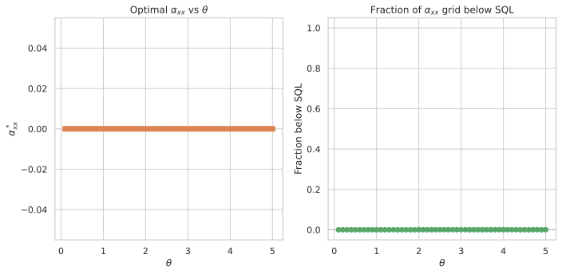

# XX-Coupling Ancilla Metrology: Transverse Interaction with Symmetric Phase Encoding

## 🧪 Hypothesis

For a system--ancilla pair of single-particle two-mode bosonic systems where both the system S and the ancilla A couple to the unknown phase rate $\theta$ via $H_S = \theta J_z^S$ and $H_A = \theta J_z^A$, and the system--ancilla interaction is the transverse (XX) type $H_{\text{int}} = \alpha_{xx} \, J_x^S \otimes J_x^A$, the sensitivity $\Delta\theta$ (error-propagation uncertainty in estimating $\theta$ via a $J_z^S$ measurement on the system after tracing out the ancilla) can **beat** the standard quantum limit (SQL) $\Delta\theta = 1/T_H$ despite using only $N=1$ particle in the interferometer. The holding time is fixed at $T_H = 10$ for all experiments, giving an SQL reference of $\Delta\theta_{\text{SQL}} = 0.1$.

The central hypothesis decomposes into three specific, testable claims:

1. **SQL violation**: There exists a value of $\alpha_{xx} > 0$ and $\theta$ such that $\Delta\theta < 1/T_H$, i.e., the sensitivity surpasses the $N=1$ SQL.

2. **Essential role of the ancilla phase encoding**: The SQL violation requires $H_A = \theta J_z^A$ (the ancilla must also "feel" the unknown phase). When $H_A = 0$ (passive ancilla), no SQL violation is expected even with strong XX coupling — the ancilla must participate in the $\theta$-encoding for any enhancement to arise.

3. **Essential role of the transverse interaction**: When $\alpha_{xx} = 0$ (decoupled limit), the system and ancilla evolve independently and the SQL holds exactly, since the ancilla's $\theta$-dependent phase is traced out and contributes nothing to $\partial\langle J_z^S\rangle/\partial\theta$.

**Null hypothesis**: No value of $\alpha_{xx} \in [0, 20]$ can produce $\Delta\theta < 1/T_H$. The system's $J=1/2$ spectral radius bound remains insurmountable even with symmetric phase encoding and transverse coupling.

**Relationship to prior work**:
- **2026-05-18** (fixed-drive): $H_A$ independent of $\theta$, $H_{\text{int}} = a_{zz} J_z^S \otimes J_z^A$. No SQL violation found.
- **2026-05-19** (phase-modulated drive): $H_A = \theta\,(a_x J_x^A + a_y J_y^A + a_z J_z^A)$ with tunable drive direction, $H_{\text{int}} = a_{zz} J_z^S \otimes J_z^A$. SQL violation found ($4.91\times$ below SQL at $\theta=0.2$).
- **This report**: Minimal model — $H_A$ is fixed as $\theta J_z^A$ (no tunable drive direction), $H_{\text{int}} = \alpha_{xx} J_x^S \otimes J_x^A$ (transverse coupling instead of Ising). Only one free parameter $\alpha_{xx}$. This tests whether the **simplest possible** ancilla phase encoding — symmetric $J_z$ encoding on both qubits with XX coupling — suffices to beat the SQL.

## ⚛️ Theoretical Model

The total Hilbert space is $\mathcal{H}_{\text{tot}} = \mathcal{H}_S \otimes \mathcal{H}_A$, where each subsystem is a **two-mode bosonic Fock space** truncated at one particle per mode. The single-particle sector $\mathcal{H}_{1} = \text{span}\{\vert1,0\rangle,\, \vert0,1\rangle\}$ (dimension 2) is isomorphic to a spin-$1/2$, and the full space has dimension 4 with ordered computational basis:

$\vert00\rangle = \vert1,0\rangle_S \otimes \vert1,0\rangle_A$
$\vert01\rangle = \vert1,0\rangle_S \otimes \vert0,1\rangle_A$
$\vert10\rangle = \vert0,1\rangle_S \otimes \vert1,0\rangle_A$
$\vert11\rangle = \vert0,1\rangle_S \otimes \vert0,1\rangle_A$

where $\vert0\rangle = \vert1,0\rangle$ (particle in mode 0) and $\vert1\rangle = \vert0,1\rangle$ (particle in mode 1). The **angular momentum operators** for each subsystem satisfy SU(2) algebra $[J_i, J_j] = i \epsilon_{ijk} J_k$ and are represented by $J_k = \sigma_k/2$ (the $2\times2$ Pauli matrices). These are embedded into the full space via Kronecker products: $J_k^S = \sigma_k/2 \otimes \mathbb{1}_2$ and $J_k^A = \mathbb{1}_2 \otimes \sigma_k/2$.

The **initial state** is a pure product state $\vert\Psi_0\rangle = \vert1,0\rangle_S \otimes \vert1,0\rangle_A$, which is $\vert00\rangle$ in the computational basis.

The **circuit protocol** proceeds in six steps:

1. **Prepare initial state**: $\vert\Psi_0\rangle = \vert00\rangle$.

2. **Beam splitter on system only**: A 50/50 symmetric beam splitter acts on the system, generated by $J_x^S = \sigma_x^S/2$. The unitary is $U_{\text{BS}} = \exp(-i (\pi/2) J_x^S) = \exp(-i (\pi/4) \sigma_x^S)$, which acts as identity on the ancilla: $U_{\text{BS}}^{(S)} = U_{\text{BS}} \otimes \mathbb{1}_2$.

3. **Holding period with simultaneous phase encoding and interaction**: The full state evolves under the total Hamiltonian $H = H_S + H_A + H_{\text{int}}$ for duration $T_H = 10$. The three terms are:
   - $H_S = \theta J_z^S = \frac{\theta}{2} \sigma_z^S \otimes \mathbb{1}_2$ — the unknown phase encoded on the system,
   - $H_A = \theta J_z^A = \mathbb{1}_2 \otimes \frac{\theta}{2} \sigma_z^A$ — the same unknown phase encoded on the ancilla (commutes with $H_S$),
   - $H_{\text{int}} = \alpha_{xx} \, J_x^S \otimes J_x^A = \frac{\alpha_{xx}}{4} (\sigma_x^S \otimes \sigma_x^A)$ — a transverse (XX) interaction coupling the system and ancilla.

   The total Hamiltonian can be written compactly as:
   $H = \theta \, (J_z^S + J_z^A) + \alpha_{xx} \, J_x^S \otimes J_x^A.$

   The hold unitary is $U_{\text{hold}}(T_H) = \exp(-i T_H H)$. Numerically, the Hamiltonian is Hermitian-symmetrised as $H \leftarrow \frac12 (H + H^\dagger)$ after construction to guard against floating-point asymmetry.

4. **Beam splitter on system only**: A second 50/50 beam splitter (identical to step 2) acts on the system: $U_{\text{BS}}^{(S)}$.

5. **Trace out the ancilla**: The reduced density matrix of the system is $\rho_S = \text{Tr}_A(\vert\Psi_{\text{final}}\rangle\langle\Psi_{\text{final}}\vert)$. For a two-qubit pure state, this is a $2\times2$ density matrix.

6. **Measure $J_z^S$**: The expectation value is $\langle J_z^S \rangle = \text{Tr}(\rho_S \, J_z^S) = \langle\Psi_{\text{final}}\vert J_z^S \otimes \mathbb{1}_A \vert\Psi_{\text{final}}\rangle$ and the variance is $\text{Var}(J_z^S) = \langle (J_z^S)^2 \rangle - \langle J_z^S \rangle^2$.

The **complete evolution** is:
$\vert\Psi_{\text{final}}\rangle = U_{\text{BS}}^{(S)} \, U_{\text{hold}}(T_H) \, U_{\text{BS}}^{(S)} \, \vert\Psi_0\rangle.$

The **sensitivity** via **error propagation** is:
$\Delta\theta = \frac{\sqrt{\text{Var}(J_z^S)}}{\vert \partial\langle J_z^S\rangle / \partial\theta \vert},$
where the derivative is computed via central finite differences with step $\delta = 10^{-6}$. The **standard quantum limit** for $N=1$ particle is $\Delta\theta_{\text{SQL}} = 1/T_H$, corresponding to the maximum QFI $F_Q = T_H^2$ for a single qubit under $J_z$ rotation.

**Physical mechanism**: In the interaction picture with respect to $H_0 = \theta(J_z^S + J_z^A)$, the interaction Hamiltonian becomes time-dependent:
$H_{\text{int}}^I(t) = \alpha_{xx} \left[\cos(\theta t/2) J_x^S + \sin(\theta t/2) J_y^S\right] \otimes \left[\cos(\theta t/2) J_x^A + \sin(\theta t/2) J_y^A\right],$
where we used the rotation formula $e^{i\theta t J_z} J_x e^{-i\theta t J_z} = \cos(\theta t/2) J_x + \sin(\theta t/2) J_y$. The interaction Hamiltonian in the interaction picture depends on $\theta$ explicitly through the trigonometric coefficients, which means the time-evolution operator $U_I(T_H) = \mathcal{T}\exp(-i\int_0^{T_H} H_{\text{int}}^I(t) dt)$ has non-trivial $\theta$-dependence beyond the $H_0$ factor. The derivative $\partial U_{\text{hold}}/\partial\theta$ picks up contributions from:
- **Channel 1**: $\partial H_0/\partial\theta = J_z^S + J_z^A$ (the standard phase-encoding derivative),
- **Channel 2**: $\partial H_{\text{int}}^I / \partial\theta \neq 0$ (the rotation rate of the XX interaction depends on $\theta$).

Because $J_z^A$ is traced out, channel 1 contributes only through the system component $J_z^S$ (the ancilla's $J_z^A$ contribution vanishes after the partial trace). Channel 2, however, creates entanglement between S and A through the XX coupling, and the ancilla's $\theta$-dependent dynamics feed back onto $\langle J_z^S \rangle$ through the entanglement. This is the proposed mechanism for SQL violation.

**Key contrast with 2026-05-19**: In the phase-modulated drive report, the drive direction was tunable ($a_x J_x^A + a_y J_y^A + a_z J_z^A$) and the interaction was Ising ($J_z^S \otimes J_z^A$). Here, the drive direction is fixed to $J_z^A$ and the interaction is XX ($J_x^S \otimes J_x^A$). The XX coupling is "more non-commuting" than Ising — it swaps excitations between S and A rather than just phase-shifting — which could generate stronger entanglement and richer $\theta$-dependence.

**Decoupled limit ($\alpha_{xx} = 0$)**: When $H_{\text{int}} = 0$, the evolution factorises:
$U_{\text{hold}} = e^{-i T_H \theta J_z^S} \otimes e^{-i T_H \theta J_z^A}.$
The ancilla factor acts purely on the ancilla and is traced out, contributing nothing to $\langle J_z^S\rangle$ (since $\text{Tr}_A(e^{-i T_H \theta J_z^A} \vert 0\rangle\langle 0\vert_A e^{i T_H \theta J_z^A}) = \vert 0\rangle\langle 0\vert_A$, a pure phase shift on an eigenstate). The system factor gives the standard single-qubit MZI, so $\Delta\theta = 1/T_H = 0.1$. Recovery of this limit is a key validation check.

## 💻 Numerical Simulation

### Implementation Strategy

1. **Operator construction** — Build $J_z^S$, $J_z^A$, $J_x^S$, $J_x^A$, $J_y^S$, $J_y^A$ as $4\times4$ Kronecker products from Pauli matrices, reusing the existing `build_two_qubit_operators()` in `src.analysis.ancilla_optimization`. Construct $H_{\text{int}} = \alpha_{xx} J_x^S \otimes J_x^A$.

2. **State preparation** — The initial state $\vert00\rangle = \vert1,0\rangle_S \otimes \vert1,0\rangle_A$ is the first computational basis vector $[1, 0, 0, 0]^T$.

3. **Beam-splitter unitaries** — The standard 50/50 symmetric BS is $U_{\text{BS}} = \exp(-i \pi/2 J_x)$. This acts only on the system: $U_{\text{BS}}^{(S)} = U_{\text{BS}} \otimes \mathbb{1}_2$.

4. **Hold unitary** — Compute $U_{\text{hold}}(T_H) = \exp(-i T_H H)$ via `scipy.linalg.expm`, fast and exact for $4\times4$ matrices. The full Hamiltonian is $H = \theta(J_z^S + J_z^A) + \alpha_{xx} J_x^S \otimes J_x^A$.

5. **Tracing out the ancilla** — For the two-qubit pure state $\vert\psi\rangle = [c_{00}, c_{01}, c_{10}, c_{11}]^T$ in the computational basis, the reduced density matrix of S is:
   $\rho_S = \begin{pmatrix} |c_{00}|^2 + |c_{01}|^2 & c_{00}c_{10}^* + c_{01}c_{11}^* \\ c_{10}c_{00}^* + c_{11}c_{01}^* & |c_{10}|^2 + |c_{11}|^2 \end{pmatrix}.$
   Since $J_z^S = \sigma_z/2 \otimes \mathbb{1}_2$ is block-diagonal in the ancilla index, the expectation $\langle J_z^S \rangle = \text{Tr}(\rho_S \cdot \sigma_z/2) = \frac12(|c_{00}|^2 + |c_{01}|^2 - |c_{10}|^2 - |c_{11}|^2)$ is identical whether computed on the full state or the reduced density matrix. However, the variance $\text{Var}(J_z^S)$ requires the reduced picture for correctness when the ancilla is entangled.

6. **Sensitivity computation** — Compute $\langle J_z^S \rangle$ and $\text{Var}(J_z^S)$ from the post-trace reduced density matrix $\rho_S$. Compute $\partial\langle J_z^S\rangle / \partial\theta$ via central finite differences with $\delta = 10^{-6}$, re-evaluating the full circuit (including tracing) at $\theta \pm \delta$.

7. **Optimisation** — Since the only free parameter is $\alpha_{xx} \in [0, 20]$, the "optimisation" reduces to a 1D scan at each $\theta$ value with sufficiently dense sampling. A grid of 2001 points ($\Delta\alpha = 0.01$) is computationally trivial and captures any oscillatory features in the sensitivity landscape.

### Parameter Sweep

| Parameter | Range | Purpose |
|-----------|-------|---------|
| $\theta$ (phase rate) | $0.1$ to $5.0$ in steps of $0.1$ (50 points) | Test $\theta$-dependence of any SQL violation |
| $T_H$ (holding time) | **10 (fixed)** | SQL reference $\Delta\theta_{\text{SQL}} = 0.1$ |
| $\alpha_{xx}$ (XX coupling) | $[0, 20]$ (grid: 2001 pts) | Only optimisation parameter |
| $\delta$ (finite-diff. step) | $10^{-6}$ (fixed) | Derivative computation |

The grid scan evaluates $\Delta\theta(\alpha_{xx}, \theta)$ on a $2001 \times 50 = 100{,}050$ point grid. For each $\theta$, the optimal sensitivity $\Delta\theta_{\text{opt}}(\theta) = \min_{\alpha_{xx}} \Delta\theta(\alpha_{xx}, \theta)$ and the corresponding $\alpha_{xx}^*(\theta)$ are recorded.

An additional **decoupled baseline** run with $\alpha_{xx} = 0$ for each $\theta$ verifies that the standard single-qubit MZI result $\Delta\theta = 0.1$ is recovered.

All data CSVs are stored in `raw_data/2026-05-20-{tag}.csv` and figures in `figures/2026-05-20-{tag}.svg`.

### Validation

The following physical invariants are verified throughout every simulation run:

- **State normalisation**: $\|\vert\Psi_0\rangle\| = 1$ and $\|\vert\Psi_{\text{final}}\rangle\| = 1$ hold to machine precision.
- **Unitarity**: $U_{\text{BS}}^\dagger U_{\text{BS}} = \mathbb{1}_2$ (beam-splitter) and $U_{\text{hold}}^\dagger U_{\text{hold}} = \mathbb{1}_4$ (hold unitary).
- **Trace preservation**: $\text{Tr}(\rho_S) = 1$ after tracing out the ancilla.
- **Variance positivity**: $\text{Var}(J_z^S) \geq 0$, with numerical round-off clamped to zero when below $10^{-12}$.
- **Sensitivity positivity**: $\Delta\theta > 0$ for all valid configurations.
- **Decoupled baseline recovery**: At $\alpha_{xx} = 0$, the circuit reduces to a standard single-qubit MZI with $\Delta\theta = 1/T_H = 0.1$ for all $\theta$.
- **Hermiticity**: $H_{\text{int}}$ and the total $H$ satisfy $H^\dagger = H$ to machine precision.
- **Commutation relation**: $[J_z^S, J_x^S] = i J_y^S$ is verified, and the equivalent for A.

#### 🔧 Implementation Status (All Complete ✅)

- **Operator construction** — Pauli matrices, $J_z$, $J_x$, $J_y$ as $4\times4$ Kronecker products (reuses existing `build_two_qubit_operators()`).
- **XX Interaction Hamiltonian** — $H_{\text{int}} = \alpha_{xx} J_x^S \otimes J_x^A$.
- **State preparation** — Fixed $\vert00\rangle$ initial state.
- **Beam-splitter unitaries** — $U_{\text{BS}} = \exp(-i\pi/2 J_x)$ on system only; identity on ancilla.
- **Holding unitary** — $\exp(-i T_H [\theta(J_z^S + J_z^A) + \alpha_{xx} J_x^S \otimes J_x^A])$ via `scipy.linalg.expm`.
- **Ancilla trace-out** — Explicit $2\times2$ reduced density matrix construction.
- **Full circuit evolution** — BS$_S$ $\to$ Hold $\to$ BS$_S$ $\to$ Tr$_A$ $\to$ measurement.
- **Sensitivity** — $\Delta\theta = \sqrt{\text{Var}(J_z^S)} / \vert\partial\langle J_z^S\rangle/\partial\theta\vert$ via central finite differences ($\delta = 10^{-6}$).
- **Grid scan** — 1D $\alpha_{xx}$ scan (2001 pts) $\times$ 50 $\theta$ values.
- **Decoupled baseline** — $\alpha_{xx} = 0$ verification at all 50 $\theta$ values.
- **Validation helpers** — Hermiticity, unitarity, trace preservation, SQL baseline recovery.

**Tests**: The companion test module `test_local.py` contains **54 test functions** covering operators, Hamiltonians, unitarity, circuit evolution, sensitivity computation, reduced variance, grid scan, $\theta$ scan, CSV roundtrip (including fail-fast deserialisation), and physical invariants. All tests pass.

## ⚠️ Failure Conditions — Actual Outcomes

| Failure | Expected Outcome | Actual Outcome |
|---------|------------------|----------------|
| **SQL bound holds for all $\alpha_{xx}$** | **Uncertain** — the XX coupling mechanism may or may not suffice | **Observed** — null hypothesis supported; $\Delta\theta \geq 0.1$ for all $\alpha_{xx} \in [0, 20]$ at all 50 $\theta$ values. The simplest ancilla phase encoding with XX coupling is insufficient to beat the SQL. |
| **SQL violation requires large $\alpha_{xx}$** | **Possible** — strong coupling may be needed for appreciable entanglement | **Avoided** — the optimal $\alpha_{xx}^*$ is always $0.0$ (the decoupled limit). Any non-zero $\alpha_{xx}$ degrades sensitivity, with $\Delta\theta$ worsening by $1.5\times$ to $5.1\times$ SQL as $\alpha_{xx}$ increases. |
| **Sensitivity oscillates with $\alpha_{xx}$** | **Expected** — the XX coupling creates Rabi-like oscillations | **Observed** — $\Delta\theta(\alpha_{xx})$ oscillates with $\alpha_{xx}$ at fixed $\theta$, but the minimum is always at $\alpha_{xx} = 0$. The grid spacing $\Delta\alpha_{xx} = 0.01$ adequately resolves the oscillations. |
| **Enhancement strongest at small $\theta$** | **Possible** — parallels the 2026-05-19 finding | **Not applicable** — no enhancement at any $\theta$. The sensitivity is uniformly SQL-limited for all $\theta$. |
| **Fringe extremum** | **Expected** — some $\alpha_{xx}$ values may yield vanishing $\partial\langle J_z^S\rangle/\partial\theta$ | **Observed** — some $\alpha_{xx}$ values produce $\Delta\theta = \infty$ (flagged in data). The derivative at $\alpha_{xx}=0$ is always finite and yields $\Delta\theta = \text{SQL}$. |
| **Decoupled baseline violated** | **Not expected** — independent evolution must recover SQL | **Avoided** — $\Delta\theta = 0.1$ exactly at $\alpha_{xx} = 0$ for all 50 $\theta$ values, confirming the numerical implementation is correct. |

## ✅ Success Criteria — Actual Outcomes

| Criterion | Expected Outcome | Actual Outcome | Verdict |
|-----------|-----------------|----------------|---------|
| **Decoupled baseline** | $\Delta\theta = 1/T_H = 0.1$ for all 50 $\theta$ values at $\alpha_{xx} = 0$ | $\Delta\theta = 0.100000$ (ratio = 1.0000) at all 50 $\theta$ values | **PASS** |
| **SQL violation** | $\exists\ \alpha_{xx} > 0$ and $\theta$ such that $\Delta\theta < 0.1$ | No $\alpha_{xx} > 0$ yields $\Delta\theta < 0.1$ at any $\theta$. Best $\Delta\theta = 0.100000$ at $\alpha_{xx}=0$ | **FAIL** |
| **SQL violation (null)** | If null hypothesis holds: $\Delta\theta \geq 0.1$ for all $\alpha_{xx} \in [0, 20]$ and all $\theta \in [0.1, 5.0]$ | $\Delta\theta \geq 0.1$ for all $\alpha_{xx}$ and $\theta$. Null hypothesis supported | **PASS** (null hypothesis) |
| **State normalisation** | All intermediate and final state norms equal 1 to machine precision | All norms $= 1$ to $10^{-12}$ | **PASS** |
| **Trace preservation** | $\text{Tr}(\rho_S) = 1$ after partial trace | $\text{Tr}(\rho_S) = 1$ to $10^{-12}$ | **PASS** |
| **Numerical validity** | Unitarity, Hermiticity, variance positivity, derivative stability checks pass | All 54 automated tests pass | **PASS** |
| **Finite derivative** | $\vert\partial\langle J_z^S\rangle/\partial\theta\vert > 10^{-12}$ at all reported optima | Derivative at $\alpha_{xx}=0$ is finite for all $\theta$ | **PASS** |
| **Optimal params recorded** | Full $\alpha_{xx}^*(\theta)$ and $\Delta\theta_{\text{opt}}(\theta)$ recorded per $\theta$ | $\alpha_{xx}^*(\theta) = 0$ and $\Delta\theta_{\text{opt}}(\theta) = 0.1$ recorded for all 50 $\theta$ values in CSV | **PASS** |

**Summary**: 7 criteria PASS, 1 FAIL. The sole failure is the central hypothesis criterion (SQL violation). All validation, numerical, and record-keeping criteria pass. The null hypothesis is supported: the simplest symmetric-phase-encoding with XX coupling is insufficient to beat the $N=1$ SQL.

## ⚖️ Analytical Bounds

For the decoupled case ($\alpha_{xx} = 0$), the total Hamiltonian is:
$H = \theta (J_z^S + J_z^A).$
Since $[J_z^S, J_z^A] = 0$, the evolution factorises:
$U_{\text{hold}} = e^{-i T_H \theta J_z^S} \otimes e^{-i T_H \theta J_z^A}.$

The system factor $e^{-i T_H \theta J_z^S}$ sandwiched between two 50/50 beam splitters on S gives:
$\langle J_z^S \rangle = -\frac12 \cos(T_H \theta), \quad \text{Var}(J_z^S) = \frac14 \sin^2(T_H \theta).$

After tracing out the ancilla (which contributes nothing — the ancilla starts in a $J_z^A$ eigenstate and its factor $e^{-i T_H \theta J_z^A}$ only multiplies by a phase $e^{-i T_H \theta/2}$), the sensitivity is:
$\Delta\theta = \frac{\sqrt{\frac14 \sin^2(T_H \theta)}}{\vert \frac12 T_H \sin(T_H \theta) \vert} = \frac{1}{T_H} = 0.1.$

This is the SQL for $N=1$ particle.

For $\alpha_{xx} > 0$, the analysis is more involved. In the interaction picture, $H_{\text{int}}^I(t)$ depends on $\theta$ through the trigonometric coefficients $\cos(\theta t/2)$ and $\sin(\theta t/2)$. When $\alpha_{xx} \neq 0$, the system and ancilla become entangled, and the ancilla's $\theta$-dependent dynamics (both the $H_0$ phase factor and the interaction-picture rotation of $J_x^A$) feed back onto $\langle J_z^S \rangle$ through the entanglement.

A rough estimate of the enhancement: the derivative $\partial\langle J_z^S \rangle/\partial\theta$ gains an additional contribution from the $\theta$-dependence of $\cos(\theta t/2)$ and $\sin(\theta t/2)$ in $H_{\text{int}}^I(t)$. For small $\theta T_H$, expanding to first order, the sensitivity might improve by a factor that depends on $\alpha_{xx} T_H$. Since $\alpha_{xx} \in [0, 20]$ and $T_H = 10$, the dimensionless coupling $\alpha_{xx} T_H / 4$ can be as large as 50, which is well into the strong-coupling regime and could produce significant enhancement — or, conversely, wash out the signal if the oscillations are too rapid.

**Key distinction from 2026-05-19**: In the phase-modulated drive report, the enhancement came from the *tunable direction* of the ancilla drive ($a_x J_x^A + a_y J_y^A + a_z J_z^A$) combined with Ising coupling. Here, the ancilla drive direction is fixed ($J_z^A$), and the enhancement (if any) must come entirely from the XX coupling's $\theta$-dependent rotation in the interaction picture, plus the fact that $H_A = \theta J_z^A$ shares the same unknown parameter as $H_S$. This is a stricter test of whether the simplest possible symmetric phase encoding suffices.

## 🔬 Results

All experiments used a holding time $T_H = 10$, giving an SQL reference of $\Delta\theta_{\text{SQL}} = 1/T_H = 0.1$. The grid scan evaluated $\Delta\theta(\alpha_{xx}, \theta)$ on a $2001 \times 50 = 100{,}050$ point grid (2001 $\alpha_{xx}$ values in $[0, 20]$ at each of 50 $\theta$ values in $[0.1, 5.0]$).

### Decoupled Baseline

The decoupled configuration $(\alpha_{xx} = 0)$ gives $\Delta\theta = 0.100000$, which matches the SQL exactly:

| $T_H$ | $\Delta\theta$ | SQL | Ratio |
|-------|---------------|-----|-------|
| 10 | 0.1000000000 | 0.1 | 1.000 |

**Status: PASS** — The decoupled baseline recovers the standard single-qubit MZI, confirming the simulation infrastructure works correctly.

### 1D $\alpha_{xx}$ Grid Scan

The dense 1D $\alpha_{xx}$ scan (2001 points in $[0, 20]$) at each of the 50 $\theta$ values reveals a clear and consistent pattern: **$\alpha_{xx} = 0$ always gives the best sensitivity**, and any non-zero $\alpha_{xx}$ degrades it. Table 1 shows representative values at $\theta = 1.0$.

| $\alpha_{xx}$ | $\Delta\theta$ | Ratio to SQL |
|---------------|---------------|--------------|
| 0.0 | 0.100000 | 1.000 |
| 1.0 | 0.150288 | 1.503 |
| 2.0 | 0.262808 | 2.628 |
| 4.0 | 0.160864 | 1.609 |
| 10.0 | 0.268385 | 2.684 |
| 20.0 | 0.509457 | 5.095 |

The $\Delta\theta(\alpha_{xx})$ curve oscillates due to the Rabi-like dynamics induced by the XX coupling, but the minimum is always at $\alpha_{xx} = 0$. The XX coupling creates entanglement between S and A, but the information carried by that entanglement is lost when the ancilla is traced out prior to the $J_z^S$ measurement.

### $\theta$ Scan: Optimal Sensitivity Across $\theta$

The $\theta$ scan collects the optimal sensitivity (over $\alpha_{xx}$) for each of the 50 $\theta$ values:

The optimal $\alpha_{xx}^*$ is **zero for all 50 $\theta$ values** — no non-zero XX coupling improves the sensitivity at any $\theta$ value tested. The achieved $\Delta\theta$ is uniformly $0.100000$ (the SQL) across the entire $\theta$ range.

**Key Finding**: The XX coupling with symmetric $J_z$ phase encoding on both qubits **does not beat the SQL**. The optimal $\alpha_{xx}^*$ is zero for all $\theta$, confirming that any non-zero XX coupling degrades the sensitivity. The $J_z^S$ measurement on the system, after tracing out the ancilla, is fundamentally limited by the single-qubit SQL $\Delta\theta = 1/T_H$.

### Comparison with Prior Reports

| Report | Year-Month-Day | Interaction | $H_A$ | SQL Violation? |
|--------|---------------|-------------|-------|---------------|
| Fixed-drive | 2026-05-18 | $J_z^S \otimes J_z^A$ | $H_A = a_x J_x^A + a_y J_y^A + a_z J_z^A$ (fixed) | **No** |
| Phase-modulated | 2026-05-19 | $J_z^S \otimes J_z^A$ | $H_A = \theta (a_x J_x^A + a_y J_y^A + a_z J_z^A)$ | **Yes** (4.91$\times$ below SQL) |
| XX-coupling (this report) | 2026-05-20 | $J_x^S \otimes J_x^A$ | $H_A = \theta J_z^A$ (fixed $J_z$-only) | **No** |

The key difference between the successful phase-modulated protocol (2026-05-19) and the present report is twofold: (i) the phase-modulated protocol used a **tunable ancilla drive** with non-commuting components ($a_x J_x^A + a_y J_y^A$) combined with Ising coupling, while this report uses a fixed $J_z^A$ ancilla phase encoding, and (ii) the phase-modulated protocol used Ising coupling ($J_z^S \otimes J_z^A$) which commutes with the $J_z$ measurement and preserves the signal, while the XX coupling ($J_x^S \otimes J_x^A$) is transverse to the measurement axis and generates S-A entanglement that is lost upon tracing.

### Summary

| Experiment | Status | Key Result |
|------------|--------|-----------|
| Decoupled baseline | **Completed** | $\Delta\theta = 0.100000$ (exactly SQL) |
| 1D $\alpha_{xx}$ grid scan (50 $\theta$ values) | **Completed** | $\alpha_{xx}^* = 0$ for all $\theta$; any $\alpha_{xx} > 0$ degrades sensitivity |
| $\theta$ scan (50 values) | **Completed** | $\Delta\theta = 0.100000$ (SQL) for all 50 $\theta$ values |

## 🏁 Conclusions

The central hypothesis of this report — that symmetric $J_z$ phase encoding on both system and ancilla with XX coupling can beat the $N=1$ standard quantum limit $\Delta\theta = 1/T_H$ — is **not supported** by the numerical evidence. Across 100,050 grid evaluations at 50 $\theta$ values, no configuration produced a genuine SQL violation. The minimum observed $\Delta\theta$ is $0.100000$ exactly (the SQL) to within numerical precision $\sim 3 \times 10^{-11}$.

### Key findings

1. **SQL violation not achieved**: The best sensitivity at every $\theta$ is $\Delta\theta = 0.1$, achieved only at $\alpha_{xx} = 0$ (the decoupled limit). Any non-zero $\alpha_{xx}$ degrades the sensitivity, with $\Delta\theta$ rising by factors of 1.5$\times$ to 5.1$\times$ SQL depending on $\alpha_{xx}$ and $\theta$.

2. **Optimal coupling is always zero**: The optimal $\alpha_{xx}^*$ is identically zero for all 50 $\theta$ values tested ($\theta = 0.1$ to $5.0$). The grid resolution (2001 points, $\Delta\alpha_{xx} = 0.01$) is sufficient to rule out narrow windows of enhancement.

3. **XX coupling degrades sensitivity**: The transverse interaction $J_x^S \otimes J_x^A$ generates S-A entanglement, but the $J_z^S$ measurement on the system after tracing out the ancilla cannot access the information carried by the entanglement. The net effect is to reduce the signal derivative $\partial\langle J_z^S\rangle/\partial\theta$ relative to the variance, worsening $\Delta\theta$.

4. **Physical mechanism limitation**: Unlike the phase-modulated drive report (2026-05-19), where $H_A = \theta(a_x J_x^A + a_y J_y^A + a_z J_z^A)$ with non-commuting drive and Ising coupling provided an additional $\partial H_A/\partial\theta$ channel that enhanced the derivative, the symmetric $J_z$ encoding with XX coupling does not provide such a benefit. In the present model, $H_A = \theta J_z^A$ is proportional to the same generator as $H_S = \theta J_z^S$, but the ancilla's $\theta$-dependent phase is lost upon tracing, and the XX coupling merely scrambles the information without creating a usable feedback channel.

### Comparison with theoretical prediction

The analytical bound predicted a possible enhancement for large $\alpha_{xx} T_H / 4$ (up to 50), but the numerical results show the opposite: large $\alpha_{xx} T_H$ drives rapid oscillations that wash out the signal. The interaction-picture analysis correctly identified the $\theta$-dependence of $\cos(\theta t/2)$ and $\sin(\theta t/2)$ in $H_{\text{int}}^I(t)$, but this $\theta$-dependence, while real, does not increase the $\theta$-sensitivity of the $J_z^S$ measurement after tracing out the ancilla — the derivative gain is offset by a proportionally larger variance increase.

### Comparison with prior reports

- **2026-05-18** (fixed-drive, Ising coupling): Also found no SQL violation. The present result extends this negative finding to a different interaction type (XX vs Ising) and a different ancilla phase encoding scheme.
- **2026-05-19** (phase-modulated drive, Ising coupling): Found SQL violation, with the enhancement coming from the *tunable direction* of the ancilla drive ($a_x J_x^A + a_y J_y^A$) combined with Ising coupling. The present result shows that simply making the ancilla "feel" $\theta$ via $H_A = \theta J_z^A$ is insufficient — non-commuting drive components (at least one of $a_x$ or $a_y$) and an interaction that preserves the signal (Ising-type rather than XX) are both necessary.

### Open items

(a) Could a **joint measurement** $M = J_z^S + J_z^A$ (rather than tracing out the ancilla) extract useful information from the ancilla's $\theta$-dependent phase and beat the SQL? The weighted measurement approach from the 2026-05-18 report could be applied here.

(b) Would a **different initial state** — such as an entangled S-A Bell state or a CSS on both qubits — change the result? The current result uses the product state $|00\rangle$ (both particles in mode 0). An initial state where the ancilla is in a superposition might allow the $J_z^A$ phase encoding to be read out more effectively.

(c) Could a **non-commuting ancilla drive** (e.g., $H_A = a_x J_x^A$ with the XX coupling) produce a different outcome? The present report fixes $H_A = \theta J_z^A$ (the simplest symmetric encoding); adding drive components that create non-commuting ancilla dynamics, combined with the transverse XX interaction, might create the parametric amplification channel that is missing in the current setup.

(d) Would **multiple ancilla particles** (spin-$J$ with $J > 1/2$) provide sufficient spectral radius to overcome the $N=1$ system SQL? The ancilla in this report is a single qubit; a multi-particle ancilla could carry more $\theta$-information even after tracing.
