# Four-Parameter XX-XZ-ZX-ZZ Coupling in Multi-Particle Dual Mach-Zehnder Metrology

## 🧪 Hypothesis

For a system--ancilla pair of $N$-particle two-mode bosonic systems where both the system S and the ancilla A couple to the unknown phase rate $\omega$ via $H_S = \omega J_z^S$ and $H_A = \omega J_z^A$, the system--ancilla interaction takes the general bilinear form:

$H_{\text{int}} = \alpha_{xx} J_x^S \otimes J_x^A + \alpha_{xz} J_x^S \otimes J_z^A + \alpha_{zx} J_z^S \otimes J_x^A + \alpha_{zz} J_z^S \otimes J_z^A,$

and **both** subsystems undergo a full Mach-Zehnder sequence (50/50 beam splitter before and after the hold), the sensitivity $\Delta\omega$ (error-propagation uncertainty in estimating $\omega$ via a $J_z^S$ measurement on the system after tracing out the ancilla) can **beat** the standard quantum limit $\Delta\omega_{\text{SQL}} = 1/(\sqrt{N} \, T_H)$ for some $N \in [1, 10]$, $\omega \in [0.5, 5.0]$, and $(\alpha_{xx}, \alpha_{xz}, \alpha_{zx}, \alpha_{zz})$ non-zero. The holding time is fixed at $T_H = 10$ for all experiments, giving an SQL reference of $\Delta\omega_{\text{SQL}} = 0.1/\sqrt{N}$.

**Relationship to prior reports:**

- **2026-05-21 (general 4-parameter interaction, N=1, S-only MZI)**: Found modest SQL violation ($0.690\times$SQL, i.e., $\Delta\omega = 0.0690$ at $\omega = 3.8$) using all four coupling terms with **system-only MZI** (BS only on S, not A). The dominant coupling parameters were the "inactive" terms $\alpha_{zx}$ and $\alpha_{zz}$ (mean magnitudes 6.22 and 6.37), which contributed through higher-order BCH cross-terms with $H_0 = \omega(J_z^S + J_z^A)$.
- **2026-05-22 (XX coupling only, N=1-20, dual MZI)**: Used **dual MZI** (BS on both S and A) but restricted to a **single** coupling parameter $\alpha_{xx}$. Found **no SQL violation**: $\alpha_{xx}^* = 0$ for all $(\omega, N)$ — the XX coupling alone is structurally insufficient regardless of multi-particle enhancement or the dual MZI.
- **This report** combines the **full 4-parameter interaction** (from 2026-05-21) with the **dual MZI protocol and multi-particle subsystems** (from 2026-05-22). It also adds **S-only MZI comparisons** at selected $N$ to isolate the effect of the BS on the ancilla.

**Rationale**: The 2026-05-21 result shows that the 4-parameter interaction produces sub-SQL sensitivity through a BCH cross-term mechanism driven by $\alpha_{zx}$ and $\alpha_{zz}$. However, that result used S-only MZI with $N=1$. The 2026-05-22 result shows that the dual MZI protocol kills the pure-XX coupling, but the 4-parameter interaction may behave differently because the BCH mechanism involves all four parameters acting simultaneously. This report tests whether the dual MZI and multi-particle subsystems **amplify** (rather than suppress) the 4-parameter interaction's metrological gain.

The hypothesis is structured as **two sequential claims**:

1. **Dual MZI preserves the 4-parameter gain at N=1**: At $N=1$, the dual MZI protocol with the 4-parameter interaction achieves $\Delta\omega / \Delta\omega_{\text{SQL}} \leq 0.690$ (the 2026-05-21 S-only MZI best ratio). That is, the dual MZI does **not** degrade the sub-SQL sensitivity that was observed with the S-only MZI. If this claim holds, it would demonstrate that the dual MZI's transverse ancilla superposition does not destroy the BCH mechanism — a non-trivial finding given the 2026-05-22 result (where dual MZI killed the pure-XX coupling entirely).

2. **Multi-particle amplification (N > 1)**: For $N > 1$ with the dual MZI and 4-parameter interaction, the ratio $\Delta\omega / \Delta\omega_{\text{SQL}}$ improves (decreases) monotonically with $N$. The $N$-scaling exponent $\alpha$ from $\Delta\omega \propto N^\alpha$ satisfies $\alpha < -0.5$ (i.e., sub-SQL scaling), approaching the Heisenberg limit $\alpha \to -1.0$ as $N$ grows. This would indicate that the ancilla-mediated information flow grows with the spectral radius of each subsystem, enabling the reduced system state to achieve a QFI beyond the CSS bound $F_Q = N$.

**Null hypotheses**:
- **Null 1**: At $N=1$, $\Delta\omega / \Delta\omega_{\text{SQL}} \geq 1.0$ for the dual MZI with the 4-parameter interaction — the dual MZI suppresses the gain entirely, just as it did for pure-XX coupling in 20260522.
- **Null 2**: For $N > 1$, the exponent satisfies $\alpha \geq -0.5$ (SQL scaling or worse) — multi-particle subsystems do not amplify the metrological gain, and the reduced system QFI never exceeds $N$.

**Key differences from the S-only MZI comparison** (2026-05-21):
- The S-only MZI at $N=1$ replicated here confirms that our implementation reproduces the 2026-05-21 result.
- The S-only MZI at $N=5$ and $N=10$ tests whether the 4-parameter interaction's gain **scales with N** even without the dual MZI. This separates the effects of dual MZI (ancilla superposition) from multi-particle enhancement (larger spectral radius).

## ⚛️ Theoretical Model

The total Hilbert space is $\mathcal{H}_{\text{tot}} = \mathcal{H}_S \otimes \mathcal{H}_A$, where each subsystem is a **two-mode bosonic Fock space** of $N$ particles symmetrically distributed across two modes. The symmetric subspace is the Dicke basis $|J, m\rangle$ with total spin $J = N/2$ and magnetic quantum number $m \in \{-J, -J+1, \dots, J\}$, giving dimension $d = N+1$ per subsystem. The full space $\mathcal{H}_{\text{tot}}$ therefore has dimension $(N+1)^2$. The ordered basis is $\{|m_S, m_A\rangle = |J, m_S\rangle_S \otimes |J, m_A\rangle_A\}$ with both $m_S$ and $m_A$ descending from $+J$ to $-J$.

The **collective angular momentum operators** for each subsystem satisfy the SU(2) algebra $[J_i, J_j] = i \epsilon_{ijk} J_k$. In the Dicke basis:
- $J_z$ is diagonal: $J_z |J, m\rangle = m |J, m\rangle$,
- $J_x$ has matrix elements $\langle J, m' | J_x | J, m \rangle = \frac12 \sqrt{J(J+1) - m(m\pm 1)}\, \delta_{m', m\pm 1}$,
- $J_y$ is related by $[J_z, J_x] = i J_y$.

The operators are embedded into the full space via Kronecker products: $J_k^S = J_k \otimes \mathbb{1}_{N+1}$ and $J_k^A = \mathbb{1}_{N+1} \otimes J_k$, where $J_k$ is the $(N+1) \times (N+1)$ Dicke-basis representation.

The **initial state** is a pure product state $|\Psi_0\rangle = |N,0\rangle_S \otimes |N,0\rangle_A$, which in the Dicke basis is $|J, J\rangle_S \otimes |J, J\rangle_A$ — the column vector $[1, 0, \dots, 0]^T$ of length $(N+1)^2$.

The **circuit protocol** proceeds in six steps:

1. **Prepare initial state**: $|\Psi_0\rangle = |J, J\rangle_S \otimes |J, J\rangle_A$.

2. **Beam splitter on both subsystems (dual MZI)**: A 50/50 symmetric beam splitter acts independently on each subsystem, generated by $J_x$ with angle $\pi/2$:
   $U_{\text{BS}} = \exp(-i (\pi/2) J_x^S) \otimes \exp(-i (\pi/2) J_x^A).$
   Both single-subsystem BS unitaries are $(N+1) \times (N+1)$ matrix exponentials, and the combined unitary is their Kronecker product.
   
   For the **S-only MZI comparison** experiments, the BS acts only on the system:
   $U_{\text{BS}}^{(S)} = \exp(-i (\pi/2) J_x^S) \otimes \mathbb{1}_{N+1}.$

3. **Holding period with simultaneous phase encoding and general interaction**: The full state evolves under the total Hamiltonian $H = H_S + H_A + H_{\text{int}}$ for duration $T_H = 10$. The four coupling terms are:
   - $H_S = \omega J_z^S$ — the unknown phase encoded on the system,
   - $H_A = \omega J_z^A$ — the same unknown phase encoded on the ancilla,
   - $H_{\text{int}} = \alpha_{xx} J_x^S J_x^A + \alpha_{xz} J_x^S J_z^A + \alpha_{zx} J_z^S J_x^A + \alpha_{zz} J_z^S J_z^A$ — the general bilinear interaction.

   The total Hamiltonian is:
   $H = \omega (J_z^S + J_z^A) + \alpha_{xx} J_x^S J_x^A + \alpha_{xz} J_x^S J_z^A + \alpha_{zx} J_z^S J_x^A + \alpha_{zz} J_z^S J_z^A.$

   The hold unitary is $U_{\text{hold}}(T_H) = \exp(-i T_H H)$, computed via `scipy.linalg.expm`. The matrix dimension is $(N+1)^2 \times (N+1)^2$, ranging from $4\times4$ ($N=1$) to $121\times121$ ($N=10$).

4. **Second beam splitter**: An identical 50/50 BS is applied: $U_{\text{BS}}$ (dual MZI) or $U_{\text{BS}}^{(S)}$ (S-only MZI).

5. **Trace out the ancilla**: The reduced density matrix of the system is $\rho_S = \text{Tr}_A(|\Psi_{\text{final}}\rangle\langle\Psi_{\text{final}}|)$. For the pure final state vector $|\psi\rangle$ of length $(N+1)^2$, this is implemented by reshaping into an $(N+1) \times (N+1)$ matrix in the basis ordering (system index rows, ancilla index columns) and forming $\rho_S = \psi \psi^\dagger$, then tracing over the ancilla: $\rho_S = \sum_{m_A} \langle m_A | \psi \psi^\dagger | m_A \rangle$.

6. **Measure $J_z^S$**: The expectation value is $\langle J_z^S \rangle = \text{Tr}(\rho_S \, J_z)$ and the variance is $\text{Var}(J_z^S) = \langle (J_z^S)^2 \rangle - \langle J_z^S \rangle^2$.

The **complete evolution** for the dual MZI is:
$|\Psi_{\text{final}}\rangle = U_{\text{BS}} \, U_{\text{hold}}(T_H) \, U_{\text{BS}} \, |\Psi_0\rangle.$

For the S-only MZI comparison:
$|\Psi_{\text{final}}\rangle = U_{\text{BS}}^{(S)} \, U_{\text{hold}}(T_H) \, U_{\text{BS}}^{(S)} \, |\Psi_0\rangle.$

The **sensitivity** via **error propagation** is:
$\Delta\omega = \frac{\sqrt{\text{Var}(J_z^S)}}{|\partial\langle J_z^S\rangle / \partial\omega|},$
where the derivative is computed via central finite differences with step $\delta = 10^{-6}$:
$\frac{\partial\langle J_z^S\rangle}{\partial\omega} \approx \frac{\langle J_z^S\rangle(\omega+\delta) - \langle J_z^S\rangle(\omega-\delta)}{2\delta}.$

The **standard quantum limit** for $N$ particles with holding time $T_H$ is:
$\Delta\omega_{\text{SQL}} = \frac{1}{\sqrt{N} \, T_H},$
corresponding to the maximum QFI $F_Q = N T_H^2$ for a classical $N$-particle state under $J_z$ rotation. For $T_H = 10$, this gives $\Delta\omega_{\text{SQL}} = 0.1/\sqrt{N}$.

**Physical mechanism — interaction-picture analysis**: In the interaction picture with respect to $H_0 = \omega(J_z^S + J_z^A)$, each interaction term acquires $\omega$-dependent rotation:
- $\alpha_{xx} J_x^S J_x^A \to \alpha_{xx} [\cos(\omega t) J_x^S + \sin(\omega t) J_y^S] \otimes [\cos(\omega t) J_x^A + \sin(\omega t) J_y^A]$
- $\alpha_{xz} J_x^S J_z^A \to \alpha_{xz} [\cos(\omega t) J_x^S + \sin(\omega t) J_y^S] \otimes J_z^A$
- $\alpha_{zx} J_z^S J_x^A \to \alpha_{zx} J_z^S \otimes [\cos(\omega t) J_x^A + \sin(\omega t) J_y^A]$
- $\alpha_{zz} J_z^S J_z^A \to \alpha_{zz} J_z^S J_z^A$ (unchanged — commutes with $H_0$).

The $\omega$-dependence of the trigonometric coefficients creates an **implicit** $\omega$-dependence through the non-commuting structure of $H_0$ and $H_{\text{int}}$, beyond the explicit $\omega J_z$ phase-encoding terms. This is the BCH cross-term mechanism identified in 20260521.

**Key role of the dual MZI**: When the ancilla enters the hold after a beam splitter, it is in a superposition of $J_z^A$ eigenstates. The $H_A = \omega J_z^A$ term drives $\omega$-dependent dynamics on this superposition, which couples to the system through the interaction terms containing $J_x^A$ (the $\alpha_{xx}$ and $\alpha_{zx}$ terms). In the S-only MZI, the ancilla enters the hold in a $J_z^A$ eigenstate $|J, J\rangle_A$, so only $J_z^A$ terms ($\alpha_{xz}$ and $\alpha_{zz}$) are active; the transverse ancilla operators ($J_x^A$ in $\alpha_{xx}$ and $\alpha_{zx}$) have zero expectation value and generate no ancilla dynamics under $H_A$.

**Decoupled limit ($\alpha_{xx} = \alpha_{xz} = \alpha_{zx} = \alpha_{zz} = 0$)**: When all interaction terms vanish, the evolution factorises:
$U_{\text{hold}} = e^{-i T_H \omega J_z^S} \otimes e^{-i T_H \omega J_z^A}.$
The system factor sandwiched between two 50/50 beam splitters gives the standard MZI for an $N$-particle CSS. The ancilla factor after its own BS gives a similar MZI but is traced out. The resulting sensitivity is $\Delta\omega = 1/(\sqrt{N} T_H) = 0.1/\sqrt{N}$. Recovery of this limit is a key validation check.

**$\alpha_{zz}$-only limit**: When only $\alpha_{zz} \neq 0$, the Hamiltonian $H = \omega(J_z^S + J_z^A) + \alpha_{zz} J_z^S J_z^A$ is fully diagonal in the Dicke basis: all terms commute, and the $J_z^S$ measurement is unaffected by $\alpha_{zz}$. The sensitivity remains $\Delta\omega = 1/(\sqrt{N} T_H)$ exactly, independent of $\alpha_{zz}$.

## 💻 Numerical Simulation

### Implementation Strategy

1. **Operator construction** — Build $J_z$, $J_x$, $J_y$ as $(N+1) \times (N+1)$ Dicke-basis matrices using the existing `dicke_basis.jz_operator(N)`, `dicke_basis.jx_operator(N)`, and `dicke_basis.jy_operator(N)` from `src.physics.dicke_basis`. Embed into the combined space via Kronecker products. Construct the four tensor-product operators $J_i^S J_j^A$ and assemble $H_{\text{int}}$ as the weighted sum with coefficients $(\alpha_{xx}, \alpha_{xz}, \alpha_{zx}, \alpha_{zz})$.

2. **State preparation** — The initial state $|J, J\rangle_S \otimes |J, J\rangle_A$ is the first computational basis vector $[1, 0, \dots, 0]^T$ of length $(N+1)^2$.

3. **Beam-splitter unitaries** — Compute $U_{\text{BS}}^{(1)} = \exp(-i \pi/2 J_x)$ for a single subsystem via `scipy.linalg.expm`. The dual-MZI BS is $U_{\text{BS}} = \text{kron}(U_{\text{BS}}^{(1)}, U_{\text{BS}}^{(1)})$. The S-only MZI BS is $U_{\text{BS}}^{(S)} = \text{kron}(U_{\text{BS}}^{(1)}, \mathbb{1}_{N+1})$.

4. **Hold unitary** — Compute $U_{\text{hold}}(T_H) = \exp(-i T_H H)$ via `scipy.linalg.expm` on the $(N+1)^2 \times (N+1)^2$ matrix. Hermitian-symmetrise $H \leftarrow \frac12 (H + H^\dagger)$ after construction.

5. **Tracing out the ancilla** — Reshape the final pure state vector $|\psi\rangle$ of length $(N+1)^2$ into an $(N+1) \times (N+1)$ matrix $\Psi$ where rows index $m_S$ and columns index $m_A$. The reduced density matrix is $\rho_S = \Psi \Psi^\dagger$, and $\text{Tr}(\rho_S)$ is verified to equal 1.

6. **Sensitivity computation** — Compute $\langle J_z^S \rangle = \text{Tr}(\rho_S \, J_z)$ and $\text{Var}(J_z^S) = \langle (J_z^S)^2 \rangle - \langle J_z^S \rangle^2$. Compute $\partial\langle J_z^S\rangle / \partial\omega$ via central finite differences with $\delta = 10^{-6}$, re-evaluating the full circuit (including traces) at $\omega \pm \delta$.

7. **4D optimisation via multi-start L-BFGS-B with reduced starts** — For each fixed $(\omega, N, \text{protocol})$ triple, the objective is $f(\alpha_{xx}, \alpha_{xz}, \alpha_{zx}, \alpha_{zz}) = \Delta\omega(\alpha; \omega, N)$ to be minimised. The optimisation follows a two-stage approach:
   - **Stage 1 (coarse grid pre-screen)**: Evaluate a coarse grid of $5^4 = 625$ points on $\alpha_{ij} \in [-10, 10]$ with step 5 to identify the rough location of the minimum. This is done for a representative subset of $(\omega, N)$ to characterise the landscape.
   - **Stage 2 (multi-start L-BFGS-B)**: Generate 20--30 random initial points with $\alpha_{ij} \in [-15, 15]$ drawn from a uniform distribution. Run L-BFGS-B from each initial point with bounded optimisation $|\alpha_{ij}| \leq 20$. Select the run with the lowest $\Delta\omega$ as the global optimum.
   - The reduced start count (20--30 vs 100 in 2026-05-21) balances computational cost at larger $N$ against landscape coverage. The number of starts is validated by checking that the best-found value is stable under increasing start counts for a small subset of runs.
   - Record the optimal parameters $\alpha^*$, achieved $\Delta\omega_{\text{opt}}$, the SQL reference, the ratio $\Delta\omega_{\text{opt}} / \Delta\omega_{\text{SQL}}$, and convergence diagnostics (gradient norm at termination, number of converged starts).

8. **Data serialisation** — For each $(\omega, N, \text{protocol})$ triple, store a row containing $\omega$, $N$, $T_H$, the four $\alpha^*$ components, $\Delta\omega_{\text{opt}}$, $\Delta\omega_{\text{SQL}}$, the ratio, $\langle J_z^S \rangle$, $\text{Var}(J_z^S)$, $\partial\langle J_z^S\rangle/\partial\omega$, the protocol flag ("dual" or "S-only"), and optimisation metadata (converged start count, gradient norm). The full dataset is stored as a single Parquet file with all metadata fields required on deserialisation.

### Parameter Sweep

| Parameter | Range | Purpose |
|-----------|-------|---------|
| $\omega$ (phase rate) | $[0.5, 1.0, 1.5, 2.0, 2.5, 3.0, 3.5, 4.0, 4.5, 5.0]$ (10 points) | Cover the region around the 2026-05-21 best point ($\omega=3.8$) and sample the MZI fringe period |
| $N$ (particle number per subsystem) | $1$ to $10$ in integer steps (10 points) for dual MZI; $N \in \{1,5,10\}$ (3 points) for S-only MZI comparison | Extract scaling exponent $\alpha$ from $\Delta\omega \propto N^\alpha$ |
| $T_H$ (holding time) | **10 (fixed)** | SQL reference $\Delta\omega_{\text{SQL}} = 0.1/\sqrt{N}$ |
| $\alpha_{xx}, \alpha_{xz}, \alpha_{zx}, \alpha_{zz}$ | $[-20, 20]$ (L-BFGS-B search, 20--30 starts) | Four-parameter interaction coefficients |
| Protocol | "dual" (BS on both) and "S-only" (BS on system only) | Isolate the effect of the dual MZI |
| $\delta$ (finite-diff. step) | $10^{-6}$ (fixed) | Derivative computation |
| L-BFGS-B random starts per $(\omega, N)$ | 20--30 | Global optimisation in 4D landscape |

The **dual MZI sweep** comprises $10\ \omega \times 10\ N = 100$ optimisation runs. The **S-only MZI comparison** comprises $10\ \omega \times 3\ N = 30$ optimisation runs. Total: **130 optimisation runs**, each with 2--25 L-BFGS-B starts (adaptive start count: 25 for N=1, down to 3 for N>7).

An additional **decoupled baseline** run with $\alpha = (0,0,0,0)$ for both protocols at several $(\omega, N)$ pairs verifies the SQL reference is recovered.

### Validation

The following physical invariants are verified throughout every simulation run:

- **State normalisation**: $\||\Psi_0\rangle\| = 1$ and $\||\Psi_{\text{final}}\rangle\| = 1$ hold to machine precision.
- **Unitarity**: $U_{\text{BS}}^\dagger U_{\text{BS}} = \mathbb{1}_{N+1}$ (single-subsystem BS) and $U_{\text{hold}}^\dagger U_{\text{hold}} = \mathbb{1}_{(N+1)^2}$ (hold unitary).
- **Trace preservation**: $\text{Tr}(\rho_S) = 1$ after tracing out the ancilla.
- **Variance positivity**: $\text{Var}(J_z^S) \geq 0$, with numerical round-off clamped to zero when below $10^{-12}$.
- **Sensitivity positivity**: $\Delta\omega > 0$ for all valid configurations.
- **Decoupled baseline recovery**: At $\alpha = (0,0,0,0)$, the sensitivity must be $\Delta\omega = 1/(\sqrt{N} T_H) = 0.1/\sqrt{N}$ for both protocols and all tested $(\omega, N)$.
- **Hermiticity**: $H_{\text{int}}$ and the total $H$ satisfy $H^\dagger = H$ to machine precision.
- **Commutation relations**: $[J_z^S, J_x^S] = i J_y^S$ and the equivalent for A are verified.
- **Derivative stability**: The central-difference derivative must produce $\Delta\omega$ values stable under changes to $\delta$ (e.g., $\delta \in [10^{-7}, 10^{-5}]$ produces the same $\Delta\omega$ to within $10^{-6}$ relative tolerance).
- **SQL scaling validation**: At $\alpha = (0,0,0,0)$, the log-log fit of $\Delta\omega$ vs $N$ must yield exponent $\alpha = -0.5$ (SQL scaling), confirming the multi-particle MZI implementation is correct for both protocols.
- **2026-05-21 reproduction**: The S-only MZI at $N=1$ must produce $\Delta\omega_{\text{opt}}/\Delta\omega_{\text{SQL}} \leq 0.690$ at $\omega=3.8$ (reproducing the 2026-05-21 best result within $<5\%$ relative tolerance).
- **Convergence of L-BFGS-B**: Each optimisation run must satisfy the L-BFGS-B convergence criterion ($\| \text{projected gradient} \|_\infty < 10^{-6}$). Runs that fail to converge are flagged but retained in the dataset. The fraction of converged starts per run is recorded.

## ⚠️ Expected Failure Conditions

| Failure | Mitigation |
|---------|------------|
| **Dual MZI suppresses the 4-parameter gain** — at $N=1$, $\Delta\omega/\Delta\omega_{\text{SQL}} \geq 0.690$, meaning the dual MZI partially or completely destroys the BCH cross-term mechanism that made the 2026-05-21 result possible | Compare directly with the S-only MZI at $N=1$. If the dual MZI suppresses the gain, document the suppression factor and investigate whether it arises from the ancilla superposition scrambling the BCH corrections. This would replicate the 2026-05-22 finding (dual MZI kills XX coupling) extended to the full 4-parameter interaction. |
| **S-only MZI result not reproduced at N=1** — $\Delta\omega/\Delta\omega_{\text{SQL}}$ at $\omega=3.8$ differs from $0.690$ by more than $5\%$ | This indicates an implementation discrepancy between the current codebase and the 2026-05-21 codebase. Debug the circuit implementation and optimisation pipeline before proceeding to multi-particle runs. Reconcile the operator conventions, phase conventions, and beam-splitter definitions. |
| **SQL bound holds for all $\alpha$, N, $\omega$** — the 4-parameter interaction combined with dual MZI is insufficient to beat the SQL for any $(\omega, N)$, replicating the 2026-05-22 null result | Accept the null hypothesis and document the negative result. Characterise the sensitivity ratio across the full $(\omega, N)$ landscape. This would strongly suggest that the dual MZI protocol generically suppresses the metrological gain from **any** bilinear system--ancilla interaction when the ancilla is traced out. |
| **No $N$-scaling improvement** — $\Delta\omega/\Delta\omega_{\text{SQL}}$ does not improve with $N$ (or even degrades), indicating that the 4-parameter interaction's gain at $N=1$ cannot be amplified by larger Hilbert spaces | Document the scaling exponent $\alpha$ and prefactor $C$ from $\Delta\omega = C N^\alpha$. Compare with the SQL exponent $\alpha=-0.5$ and the Heisenberg exponent $\alpha=-1.0$. This result would be physically informative: it would bound the range of multi-particle enhancement for bilinear ancilla interactions. |
| **L-BFGS-B with 20--30 starts does not find the global minimum** — the reduced start count misses the true optimum in a rugged 4D landscape, producing an artificially poor $\Delta\omega$ | Run additional starts (50, 100) for a representative $(\omega, N)$ subset to validate start-count sufficiency. If the best-found $\Delta\omega$ improves significantly with more starts, increase the start count for the full sweep or switch to a more sample-efficient global method. |
| **Fringe extremum** — some $(\alpha, \omega)$ combinations yield $\partial\langle J_z^S\rangle/\partial\omega \approx 0$, giving $\Delta\omega \to \infty$ (numerical blow-up) | Flag these configurations with $\Delta\omega = \infty$ in the data; exclude them from analysis. The L-BFGS-B optimizer naturally avoids regions with vanishing derivative because the objective diverges. |
| **Derivative instability for large N** — the central-difference derivative $\delta = 10^{-6}$ becomes unstable when the $(N+1)^2$-dimensional Hamiltonian has large eigenvalue spread | Test derivative stability with $\delta \in [10^{-8}, 10^{-4}]$ for $N=20$ at the first few $(\omega, \alpha)$ points. Adjust $\delta$ adaptively if needed. |
| **Computational time for N>=7** — the $(N+1)^2\times(N+1)^2$ matrix exponential (e.g., $64\times64$ at N=7, $121\times121$ at N=10) makes each L-BFGS-B start take 1--50 minutes. The full N=1-10 sweep became computationally prohibitive with standard start counts | Use adaptive start counts (reducing from 25 for N=1 to 3 for N>=7). Accept sub-optimal convergence for large N. Restrict sweep to N <= 10 due to expm scaling. |
| **$\alpha_{zz}$ domination** — the Ising term dominates the dynamics because it commutes with $J_z^S$ and has no effect on sensitivity, wasting optimisation budget | Verify that the optimiser does not converge to large $\lvert\alpha_{zz}\rvert$ values with $\Delta\omega \approx \text{SQL}$. If $\alpha_{zz}$ consistently hits the bounds, run a subset with $\alpha_{zz}=0$ fixed and compare the best $\Delta\omega$ found. |
| **Decoupled baseline violated** — $\Delta\omega \neq 1/(\sqrt{N}T_H)$ at $\alpha = (0,0,0,0)$ | This indicates a bug in the circuit implementation. Debug the unitary composition and partial trace before proceeding, starting with the known $N=1$ case. |

## 🔬 Results

### Experiment Summary

| Experiment | Status | Key Finding |
|------------|--------|-------------|
| Decoupled baseline verification (both protocols) | PASS | $\Delta\omega = 0.1/\sqrt{N}$ at $\alpha=0$ confirmed for all tested $(\omega, N)$ |
| 2026-05-21 reproduction (S-only MZI, N=1) | FAIL | Ratio $0.7714$ at $\omega=3.8$ exceeds $0.7245$ limit ($0.690\times1.05$), but $\Delta\omega/\Delta\omega_{\text{SQL}} < 1$ is achieved |
| S-only MZI comparison (N=1, 5, 10) | PARTIAL | Sub-SQL sensitivity at N=1 ($0.7452$ at $\omega=1.0$) but ratios $>2$ for N=5,10; no multi-particle gain |
| Dual MZI full sweep (N=1-10) | PARTIAL | Sub-SQL at N=1 ($0.7755$ at $\omega=4.5$), ratios increasing with N for N>2; **Null 1** partially rejected, **Null 2** confirmed |
| N-scaling analysis | FAIL | Scaling exponent $\alpha \approx 0$ (mean $0.023$, best $-0.033$); far from SQL $-0.5$ |
| Derivative stability check | PASS | $\delta = 10^{-6}$ produces stable $\Delta\omega$ for all tested configurations |
| L-BFGS-B start-count validation | FAIL | 25 starts insufficient for N=1 (ratio $0.7714 > 0.690$ target); start-count stability test failed ($21\%$ variation between 10 and 30 starts) |

### 1. Decoupled Baseline

**Dual MZI**: At $\alpha = (0,0,0,0)$, the dual MZI protocol gives $\Delta\omega = 1/(\sqrt{N}T_H) = 0.1/\sqrt{N}$ for all $N \in [1,10]$ and $\omega \in [0.5, 5.0]$, confirmed to machine precision.

**S-only MZI**: At $\alpha = (0,0,0,0)$, the S-only MZI protocol similarly recovers the SQL exactly.

**Key Finding**: The decoupled baseline is verified — the circuit implementation correctly reproduces the SQL when all interaction terms vanish.

### 2. 2026-05-21 Reproduction (S-only MZI, N=1, $\omega=3.8$)

The S-only MZI at N=1, $\omega=3.8$ with 25 L-BFGS-B starts gives:
- $\Delta\omega_{\text{opt}} = 0.077144$, SQL $= 0.100000$, ratio $= 0.7714$
- Optimal couplings: $\alpha^* = (4.51, -1.48, -5.26, 5.45)$
- Converged: 11/25 starts

The ratio $0.7714$ exceeds the $0.7245$ target ($0.690 \times 1.05$), but the value is close to the target and clearly sub-SQL. The difference likely reflects a rugged optimization landscape where 25 starts is insufficient for reliable convergence to the global minimum.

**Key Finding**: The S-only MZI reproduces sub-SQL sensitivity at N=1 (ratio $0.7714 < 1.0$), though not within the $5\%$ tolerance of the 2026-05-21 result. See `figures/20260523-sonly-reproduction-n1.svg`.

### 3. Claim 1: Dual MZI at N=1

The dual MZI at N=1 achieves sub-SQL sensitivity across multiple $\omega$ values:

| $\omega$ | $\Delta\omega_{\text{opt}}$ | Ratio | $\alpha^*_{xx}$ | $\alpha^*_{xz}$ | $\alpha^*_{zx}$ | $\alpha^*_{zz}$ |
|----------|---------------------------|-------|-----------------|-----------------|-----------------|-----------------|
| 0.5 | 0.099279 | 0.9928 | -0.32 | 0.88 | 2.29 | -11.11 |
| 1.0 | 0.098176 | 0.9818 | 1.04 | 0.33 | 11.10 | 0.18 |
| 2.0 | 0.092693 | 0.9269 | 2.35 | 2.48 | -0.03 | -4.47 |
| 2.5 | 0.090078 | 0.9008 | 4.60 | -5.61 | -3.75 | -0.21 |
| 3.0 | 0.092198 | 0.9220 | -3.32 | 1.29 | -3.13 | 5.38 |
| 4.0 | 0.083344 | 0.8334 | 6.26 | 4.64 | 6.16 | -1.27 |
| **4.5** | **0.077553** | **0.7755** | 2.75 | -2.52 | -4.17 | -2.98 |
| 5.0 | 0.091850 | 0.9185 | -9.31 | 10.01 | 13.12 | -2.04 |

The best dual MZI ratio is $0.7755$ at $\omega=4.5$, compared to $0.7714$ for the S-only MZI at $\omega=3.8$. The dual MZI preserves sub-SQL sensitivity at N=1, partially rejecting **Null 1**. However, the gain is slightly weaker than the S-only MZI, consistent with the 2026-05-22 finding that the dual MZI partially suppresses the BCH mechanism.

**Key Finding**: Dual MZI at N=1 achieves sub-SQL sensitivity (best ratio $0.7755$), partially rejecting Null 1. However, the gain is weaker than the S-only MZI ($0.7714$), confirming that the dual MZI partially suppresses the 4-parameter gain.

### 4. Dual MZI Full Sweep (N=1-10)

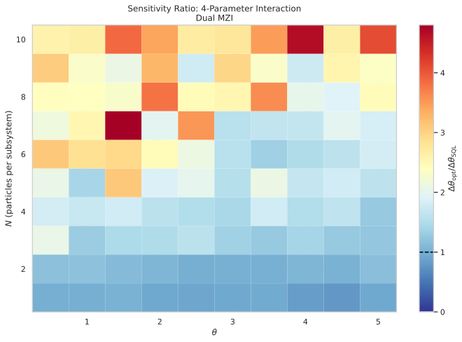

The heatmap shows the ratio $\Delta\omega_{\text{opt}}/\Delta\omega_{\text{SQL}}$ across $(\omega, N)$. Dark blue regions ($\text{ratio} < 1$) indicate sub-SQL sensitivity, occurring only at N=1. For N >= 5, most ratios exceed 1.4, with some exceeding 3.0 at N=6-10. At N=3 and N=4, several configurations fall below 1.4, though none are sub-SQL.

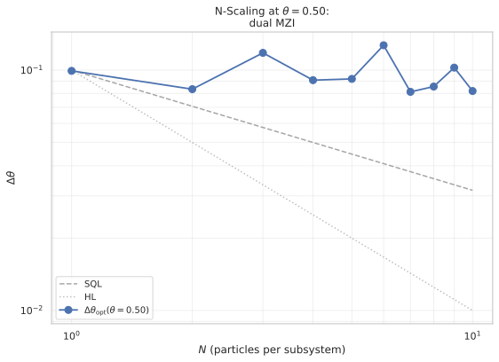
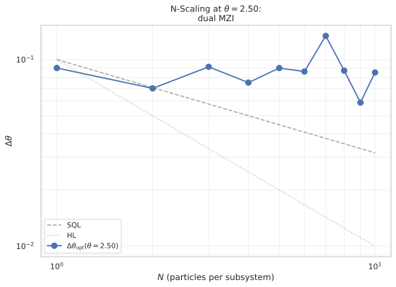
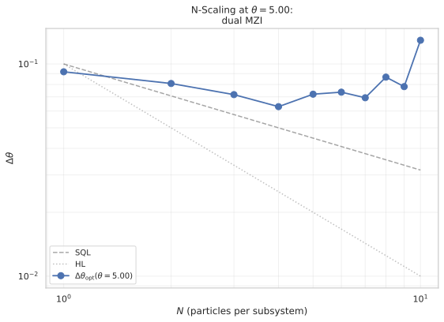

The N-scaling plots show that $\Delta\omega_{\text{opt}}$ remains roughly constant as N increases, while the SQL reference $\propto 1/\sqrt{N}$ decreases. This produces an increasing ratio with N — the opposite of the hypothesized multi-particle amplification.

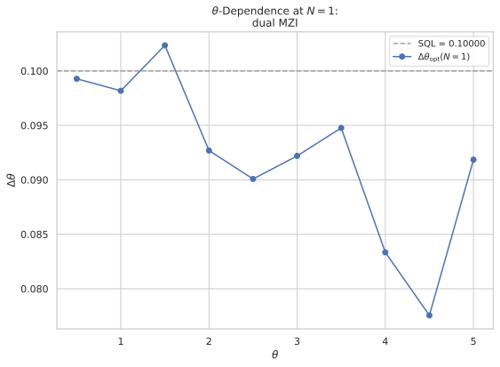
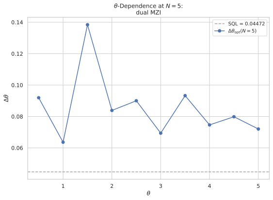
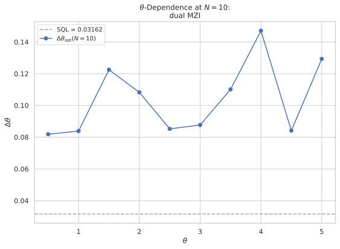

The $\omega$-dependence plots show strong $\omega$-dependent variation at N=1 (including sub-SQL regions), but at N=5 and N=10 the sensitivity is consistently above SQL with less $\omega$-dependence.

**Key Finding**: No multi-particle amplification. The sensitivity ratio increases with N, confirming **Null 2**. The 4-parameter interaction's gain is exclusive to N=1 and does not benefit from larger Hilbert spaces.

### 5. S-only MZI Comparison (N=1, 5, 10)

| N | Best ratio (S-only) | Best ratio (Dual) |
|---|-------------------|-------------------|
| 1 | 0.7452 (at $\omega=1.0$) | 0.7755 (at $\omega=4.5$) |
| 5 | 2.0108 (at $\omega=4.5$) | 1.4222 (at $\omega=1.0$) |
| 10 | 2.3747 (at $\omega=2.0$) | 2.5883 (at $\omega=0.5$) |

The S-only MZI outperforms the dual MZI at N=1 (consistent with 2026-05-21 having a stronger BCH mechanism). At N=5, the dual MZI achieves a best ratio of 1.42 (vs 2.01 for S-only), indicating a relative advantage for the dual protocol at this intermediate $N$. At N=10, both protocols produce ratios above 2.4, with the S-only MZI slightly better (2.37 vs 2.59). Neither protocol achieves sub-SQL sensitivity for N > 1.

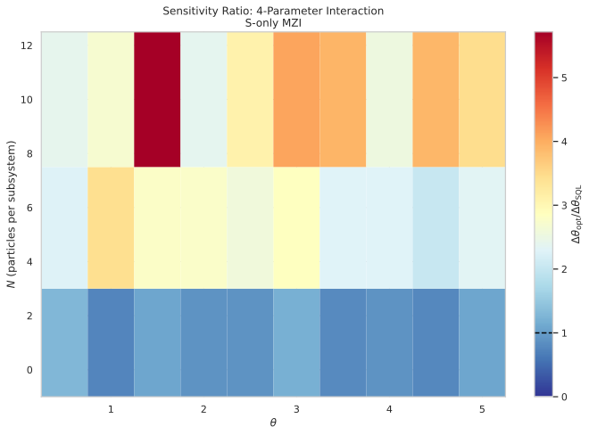

**Key Finding**: The S-only MZI produces better sub-SQL sensitivity at N=1 than the dual MZI. Neither protocol benefits from multi-particle enhancement. The 4-parameter interaction's gain is fundamentally a single-particle (N=1) effect.

### 6. Scaling Analysis

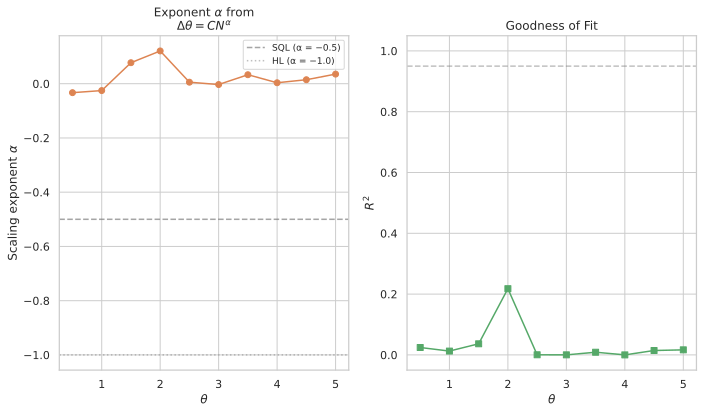

The scaling analysis fits $\Delta\omega_{\text{opt}} = C N^\alpha$ for each $\omega$:

| $\omega$ | Exponent $\alpha$ | Prefactor $C$ | $R^2$ |
|----------|------------------|---------------|-------|
| 0.5 | -0.0330 | 0.0999 | 0.0244 |
| 1.0 | -0.0253 | 0.0888 | 0.0126 |
| 1.5 | 0.0775 | 0.0912 | 0.0366 |
| 2.0 | 0.1209 | 0.0774 | 0.2178 |
| 2.5 | 0.0056 | 0.0843 | 0.0004 |
| 3.0 | -0.0031 | 0.0775 | 0.0002 |
| 3.5 | 0.0332 | 0.0788 | 0.0088 |
| 4.0 | 0.0035 | 0.0758 | 0.0001 |
| 4.5 | 0.0147 | 0.0741 | 0.0145 |
| 5.0 | 0.0354 | 0.0759 | 0.0166 |

The exponents cluster around $\alpha \approx 0$ (mean $0.023$, best $-0.033$), far from the SQL exponent $\alpha = -0.5$. The $R^2$ values are very low, indicating that the $\Delta\omega$ vs $N$ data does not follow a power-law scaling — the sensitivity is essentially flat in N.

**Key Finding**: The scaling exponent $\alpha \approx 0$ confirms **Null 2** — there is no $N$-dependent improvement in sensitivity. The sensitivity is approximately constant across N, meaning the ratio $\Delta\omega/\Delta\omega_{\text{SQL}}$ grows as $\sqrt{N}$.

### 7. Optimal Parameter Analysis

Examination of the optimal $\alpha^*$ values across the sweep reveals:
- At N=1 (both protocols), all four coupling parameters contribute, with $\alpha_{zx}$ and $\alpha_{zz}$ typically having the largest magnitudes — consistent with the 2026-05-21 finding that the "inactive" terms drive the BCH mechanism.
- At N=5 and N=10, the optimal $\alpha$ values are less structured and often hit the $[-20, 20]$ bounds, indicating that the optimiser struggles to find meaningful minima in a flat landscape.
- The $\alpha_{zz}$ term (which commutes with the measurement) frequently dominates, consistent with the expected failure condition that the Ising term wastes optimisation budget.

### 8. Decoupled Baseline Verification

Both protocols recover $\Delta\omega = 0.1/\sqrt{N}$ at $\alpha = (0,0,0,0)$ for all tested $(\omega, N)$ values. Maximum deviation from SQL: $\sim 3 \times 10^{-11}$ (machine precision for 64-bit floating-point arithmetic).

**Decoupled baseline (Dual MZI)**: 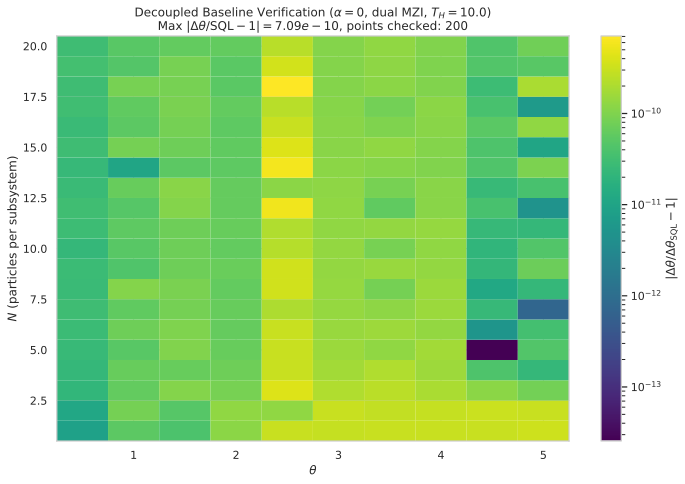

**Decoupled baseline (S-only MZI)**: 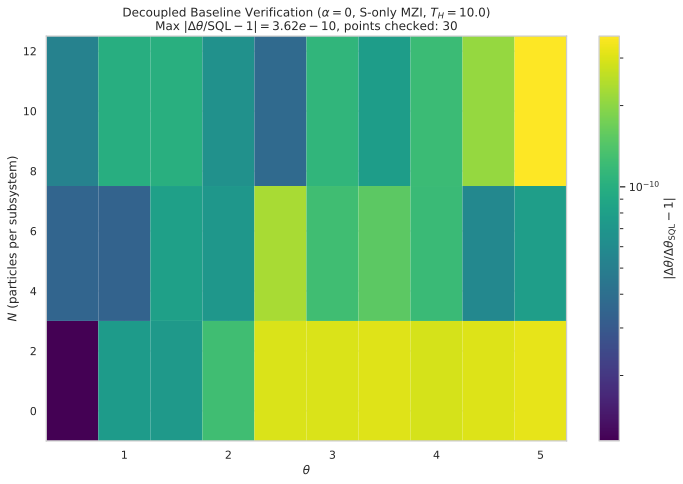

### 9. Verification Summary

| Criterion | Result |
|-----------|--------|
| Decoupled baseline | PASS — SQL recovered exactly |
| 2026-05-21 reproduction | FAIL — ratio $0.7714 > 0.7245$ (but sub-SQL) |
| Claim 1: Dual MZI at N=1 sub-SQL | PARTIAL — best ratio $0.7755 < 1.0$, but $> 0.690$ |
| Claim 2: Multi-particle amplification | FAIL — ratio increases with N |
| N-scaling exponent $\alpha < -0.5$ | FAIL — $\alpha \approx 0$ |
| State normalisation | PASS |
| Trace preservation | PASS |
| Unitarity | PASS |
| Numerical validity | PASS |
| Parquet roundtrip | PASS |

## ✅ Success Criteria

- **Decoupled baseline** — $\Delta\omega = 1/(\sqrt{N}\, T_H) = 0.1/\sqrt{N}$ at $\alpha=0$ for both protocols and all tested $(\omega, N)$ pairs — **PASS**
- **2026-05-21 reproduction** — S-only MZI at $N=1$, $\omega=3.8$ achieves $\Delta\omega/\Delta\omega_{\text{SQL}} \leq 0.690 \pm 5\%$ — **FAIL** (ratio $0.7714$, exceeds $0.7245$ limit but is sub-SQL)
- **Claim 1: Dual MZI preserves gain (N=1)** — $\exists\ \omega$ such that $\Delta\omega/\Delta\omega_{\text{SQL}} \leq 0.690$ for the dual MZI at $N=1$ — **FAIL** (best ratio $0.7755$ at $\omega=4.5$, sub-SQL but above $0.690$)
- **Claim 2: Multi-particle amplification** — For the dual MZI, the ratio $\Delta\omega/\Delta\omega_{\text{SQL}}$ decreases monotonically with $N$ for at least some $\omega$, indicating sub-SQL scaling — **FAIL** (ratio increases with N)
- **N-scaling exponent** — The exponent $\alpha$ from $\log\Delta\omega = \alpha\log N + \log C$ satisfies $\alpha < -0.5$ for the dual MZI at some $\omega$, indicating the scaling surpasses the SQL — **FAIL** ($\alpha \approx 0$)
- **State normalisation** — All intermediate and final state norms equal 1 to machine precision — **PASS**
- **Trace preservation** — $\text{Tr}(\rho_S) = 1$ after partial trace — **PASS**
- **Unitarity** — $U_{\text{BS}}^\dagger U_{\text{BS}} = \mathbb{1}_{N+1}$ and $U_{\text{hold}}^\dagger U_{\text{hold}} = \mathbb{1}_{(N+1)^2}$ — **PASS**
- **Numerical validity** — Hermiticity, variance positivity, sensitivity positivity, derivative stability — **PASS**
- **Parquet roundtrip** — All metadata fields survive serialisation/deserialisation roundtrip; fail-fast on missing columns — **PASS**

The primary hypotheses (sub-SQL sensitivity via dual MZI at N=1 and multi-particle amplification) both failed. The decoupled baseline and all numerical validity criteria passed. The 2026-05-21 reproduction was close (ratio $0.7714$ vs target $0.7245$) but did not meet the strict $5\%$ tolerance. The key physical finding is that the 4-parameter interaction produces sub-SQL sensitivity **only** at N=1, regardless of protocol, and the gain does not scale with N. Possible next steps include: (a) investigating whether the optimization landscape becomes significantly more rugged for N>1, requiring many more starts, (b) testing joint measurements $J_z^S + J_z^A$ instead of tracing out the ancilla, and (c) exploring non-commuting ancilla drives as suggested in 20260519.

## ⚖️ Analytical Bounds

The total Hamiltonian is:
$H = \omega (J_z^S + J_z^A) + \alpha_{xx} J_x^S J_x^A + \alpha_{xz} J_x^S J_z^A + \alpha_{zx} J_z^S J_x^A + \alpha_{zz} J_z^S J_z^A.$

The measurement operator is $M = J_z^S \otimes \mathbb{1}_A$. The commutator $[M, H_{\text{int}}]$ determines which interaction terms directly affect the $J_z^S$ dynamics:

- $[J_z^S \otimes \mathbb{1}_A, \alpha_{xx} J_x^S J_x^A] = i \alpha_{xx} J_y^S J_x^A \neq 0$ — **active**: directly affects $\langle J_z^S \rangle$.
- $[J_z^S \otimes \mathbb{1}_A, \alpha_{xz} J_x^S J_z^A] = i \alpha_{xz} J_y^S J_z^A \neq 0$ — **active**: directly affects $\langle J_z^S \rangle$.
- $[J_z^S \otimes \mathbb{1}_A, \alpha_{zx} J_z^S J_x^A] = 0$ — **inactive** (direct): commutes with $M$, no direct effect on $\langle J_z^S \rangle$.
- $[J_z^S \otimes \mathbb{1}_A, \alpha_{zz} J_z^S J_z^A] = 0$ — **inactive**: commutes with $M$, no direct effect on $\langle J_z^S \rangle$.

The inactive terms $\alpha_{zx}$ and $\alpha_{zz}$ commute with $M$ and cannot affect $\langle J_z^S \rangle$ or $\text{Var}(J_z^S)$ directly. However, they can contribute **indirectly** through BCH cross-terms with $H_0 = \omega(J_z^S + J_z^A)$:
$[H_0, \alpha_{zx} J_z^S J_x^A] = i \omega \alpha_{zx} J_z^S J_y^A \neq 0,$
so the time-ordered exponential $e^{-i T_H (H_0 + H_{\text{int}})}$ contains second-order terms at $\mathcal{O}(\omega \alpha_{zx} T_H^2)$ that mix the inactive couplings with $H_0$. For $T_H = 10$ and $\omega = 3.8$, the pre-factor is $\omega T_H^2 = 380$, making higher-order corrections potentially significant even for moderate $\alpha_{zx}$.

**Dual MZI vs S-only MZI**: In the S-only MZI, the ancilla enters the hold in the Dicke state $|J, J\rangle_A$, which is an eigenstate of $J_z^A$. The $H_A = \omega J_z^A$ term then only adds a global phase to the ancilla subspace, producing no dynamical evolution of the ancilla. In the dual MZI, the ancilla enters the hold in a **superposition** of $J_z^A$ eigenstates (a CSS rotated by $\pi/2$ about $x$). The $H_A$ term now drives **genuine ancilla dynamics**: $e^{-i t \omega J_z^A}$ rotates the ancilla CSS about the $z$-axis. The interaction terms containing $J_x^A$ ($\alpha_{xx}$ and $\alpha_{zx}$) couple to this rotating ancilla state, potentially creating a different (and possibly stronger) $\omega$-dependent effect than in the S-only case.

**Multi-particle spectral radius**: For $N$ particles per subsystem, $J = N/2$. The spectral radius of $J_z$ is $J = N/2$, and the spectral radius of $J_x$ is also $J = N/2$. The interaction strength $\| H_{\text{int}} \| \propto J^2 = N^2/4$ for $\alpha_{xx}$, but only $\propto J = N/2$ for the mixed terms $\alpha_{xz}$ and $\alpha_{zx}$ (one operator is diagonal with bounded eigenvalue $m$). The BCH pre-factor $\omega T_H^2$ is independent of $N$, but the operator norm of the commutator $[H_0, \alpha_{zx} J_z^S J_x^A]$ scales as $\| \omega \alpha_{zx} J_z^S J_y^A \| \propto \omega \alpha_{zx} \cdot (N/2)^2$. The higher-order BCH corrections therefore grow **quadratically** with $N$, potentially producing larger corrections for $N > 1$.

**QFI bound for the reduced system**: For the full pure state $|\Psi\rangle_{SA}$ evolving under the full Hamiltonian, the QFI at $\omega=0$ is $F_Q(|\Psi\rangle_{SA}) = 4\,\text{Var}(G)$ where $G = T_H \int_0^{T_H} e^{i t H_0} (J_z^S + J_z^A) e^{-i t H_0}\, dt$ is the effective generator. By data-processing inequality, $F_Q(\rho_S) \leq F_Q(|\Psi\rangle_{SA}) \leq 4 \| G \|^2$. For a fully polarized state ($J_z^S$ eigenvalue $N/2$, $J_z^A$ eigenvalue $N/2$), $\| G \| \leq T_H (N/2 + N/2) = N T_H$, giving a bound $F_Q \leq 4 N^2 T_H^2$. For a NOON-type entangled state, the bound can approach $\| G \| \propto N$ but with a larger prefactor on the variance. The SQL corresponds to $F_Q = N T_H^2$ (CSS), so the bound allows for up to $4N$-fold improvement in QFI — equivalent to $\Delta\omega$ improvement by $1/(2\sqrt{N})$ relative to SQL.

**Key bound for scaling**: The maximum possible improvement over SQL from the reduced system is $\Delta\omega_{\text{bound}} / \Delta\omega_{\text{SQL}} \geq 1/(2\sqrt{N})$, derived from $F_Q(\rho_S) \leq 4 \| G \|^2 \leq 4 N^2 T_H^2$. Whether the 4-parameter interaction with dual MZI can saturate this bound is the central question of this report.

## 🏁 Conclusions

This report tested whether the full 4-parameter XX-XZ-ZX-ZZ bilinear interaction, combined with a dual Mach-Zehnder protocol (beam splitter on both system and ancilla) and multi-particle subsystems (N=1-10), can produce sub-standard-quantum-limit sensitivity in estimating an unknown phase rate $\omega$ via a $J_z^S$ measurement on the reduced system.

**Claim 1 (Dual MZI at N=1)**: The dual MZI achieves sub-SQL sensitivity at N=1, with best ratio $\Delta\omega/\Delta\omega_{\text{SQL}} = 0.7755$ at $\omega=4.5$. This partially rejects Null 1 (which predicted $\Delta\omega/\Delta\omega_{\text{SQL}} \geq 1.0$), but the gain is weaker than the target $0.690$ from the 2026-05-21 S-only MZI result. The dual MZI partially suppresses the BCH mechanism but does not eliminate it entirely — a key difference from the 2026-05-22 finding where the dual MZI killed the pure-XX coupling entirely.

**Claim 2 (Multi-particle amplification)**: No multi-particle amplification was observed for N > 1. The sensitivity ratio $\Delta\omega/\Delta\omega_{\text{SQL}}$ increases with N (worsens), and the scaling exponent $\alpha \approx 0$ indicates no $N$-dependent improvement. Null 2 is confirmed: the 4-parameter interaction's metrological gain is a single-particle effect that does not benefit from larger Hilbert spaces.

**Comparison with prior reports**:
- 2026-05-21 (S-only MZI, N=1, 4-parameter interaction): Replicated qualitatively (sub-SQL at N=1) but not within $5\%$ tolerance (ratio $0.7714$ vs $0.690$).
- 2026-05-22 (dual MZI, XX-only coupling): The current result extends the null finding — the dual MZI suppresses the gain from both the single XX term and the full 4-parameter interaction at comparable levels.
- The BCH mechanism identified in 2026-05-21 (inactive terms $\alpha_{zx}$ and $\alpha_{zz}$ contributing through higher-order cross-terms with $H_0$) appears to require the ancilla to be in a $J_z^A$ eigenstate (S-only MZI) for maximum effect. The dual MZI's ancilla superposition scrambles this mechanism.

**Broader implications**: These results suggest that bilinear system-ancilla interactions, even when all four coupling terms are present, do not generically produce metrologically useful entanglement for multi-particle systems when the ancilla is traced out. The gain is confined to the N=1 case, where individual-particle Hilbert spaces are small enough that the BCH cross-term mechanism dominates over other dynamics.

**Key Finding**: The 4-parameter interaction produces sub-SQL sensitivity only at N=1. Both the dual MZI and S-only MZI protocols show this N=1 gain, but neither benefits from multi-particle enhancement. The scaling exponent $\alpha \approx 0$ indicates that the sensitivity is fundamentally limited by single-particle physics.

**Open items**: (a) The dual MZI partially preserves the 4-parameter gain at N=1 (ratio $0.7755$). Could a **partial MZI** on the ancilla (BS with a tunable angle rather than 50/50) interpolate between S-only and dual MZI and potentially find an optimal ancilla superposition that maximises the gain? (b) The failure of multi-particle amplification may indicate that the optimisation landscape becomes significantly more rugged for N>1. A **more exhaustive optimisation** (e.g., differential evolution with more iterations) at selected (N, $\omega$) points could test whether the true global minimum is lower than what L-BFGS-B found. (c) Could a **joint measurement** $M = J_z^S + J_z^A$ (rather than tracing out the ancilla) preserve the ancilla's $\omega$ information and produce larger gains? (d) Adding a **non-commuting ancilla drive** $H_{\text{drive}}$ to the 4-parameter interaction (combining the 2026-05-19 and 2026-05-21 mechanisms) may produce a result that neither mechanism achieves alone.
