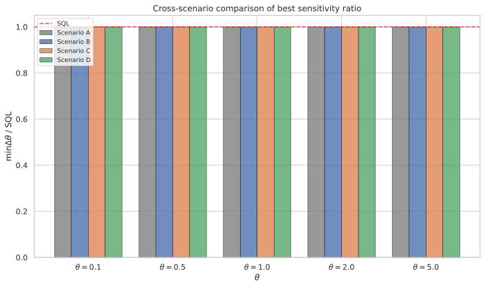
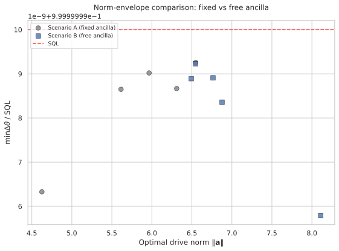

# Free Ancilla Initial State in Driven-Ancilla Metrology

## 🧪 Hypothesis

For a system--ancilla pair of single-particle two-mode bosonic systems where the system S couples to the unknown phase $\omega$ via $H_S = \omega J_z^S$, the ancilla A is driven during the holding period by a controllable local Hamiltonian $H_A = a_x J_x^A + a_y J_y^A + a_z J_z^A$, and the system--ancilla interaction is the Ising-type $H_{\text{int}} = a_{zz} J_z^S \otimes J_z^A$, the sensitivity $\Delta\omega$ (error-propagation uncertainty in estimating $\omega$ via a $J_z^S$ measurement on the system) is investigated as a function of the ancilla initial state. The holding time is fixed at $T_H = 10$ for all experiments, giving an SQL reference of $\Delta\omega_{\text{SQL}} = 1/T_H = 0.1$.

The central question: does freeing the ancilla initial state from the fixed $\vert 1,0\rangle$ to an arbitrary pure qubit state $|\psi_A\rangle = \alpha|1,0\rangle + \beta|0,1\rangle$ enable SQL violation ($\Delta\omega < 1/T_H$) that was previously unattainable?

Four experimental scenarios are compared:

1. **Scenario A (20260518 baseline):** Fixed ancilla $\vert 1,0\rangle$, free drive $(a_x, a_y, a_z)$, free interaction $a_{zz}$. Previously established: no SQL violation across 2500 random-search evaluations and 250 Nelder--Mead refinements.

2. **Scenario B (primary):** Free ancilla $(\theta_A, \phi_A)$, free drive $(a_x, a_y, a_z)$, free interaction $a_{zz}$. The central question: do the two additional degrees of freedom unlock sub-SQL sensitivity?

3. **Scenario C (control):** Free ancilla $(\theta_A, \phi_A)$, no drive $(a_x=a_y=a_z=0)$, free interaction $a_{zz}$. Isolates whether the free ancilla can compensate for the lack of ancilla drive purely through its initial state.

4. **Scenario D (control):** Free ancilla $(\theta_A, \phi_A)$, free drive $(a_x, a_y, a_z)$, no interaction $(a_{zz}=0)$. Isolates whether the free ancilla can help without S-A entanglement.

**Null hypothesis**: No scenario achieves $\Delta\omega < 1/T_H$. The $J=1/2$ spectral radius bound on the system is insurmountable regardless of the ancilla initial state. Scenarios C and D are expected to recover exactly SQL (no violation) as secondary support.

## ⚛️ Theoretical Model

The total Hilbert space is $\mathcal{H}_{\text{tot}} = \mathcal{H}_S \otimes \mathcal{H}_A$, where each subsystem is a **two-mode bosonic Fock space** truncated at one particle per mode. The single-particle sector $\mathcal{H}_{1} = \text{span}\{\vert1,0\rangle,\, \vert0,1\rangle\}$ (dimension 2) is isomorphic to a spin-$1/2$, and the full space has dimension 4 with ordered computational basis $\{\vert00\rangle, \vert01\rangle, \vert10\rangle, \vert11\rangle\}$ where $\vert0\rangle = \vert1,0\rangle$ (particle in mode 0) and $\vert1\rangle = \vert0,1\rangle$ (particle in mode 1). The **angular momentum operators** for each subsystem satisfy SU(2) algebra $[J_i, J_j] = i \epsilon_{ijk} J_k$ and are represented by $J_k = \sigma_k/2$ (the $2\times2$ Pauli matrices). These are embedded into the full space via Kronecker products: $J_k^S = \sigma_k/2 \otimes \mathbb{1}_2$ and $J_k^A = \mathbb{1}_2 \otimes \sigma_k/2$.

The **initial state** is $\vert\Psi_0\rangle = \vert1,0\rangle_S \otimes \vert\psi_A\rangle$, where $\vert\psi_A\rangle = \alpha\vert1,0\rangle_A + \beta\vert0,1\rangle_A$ with $\vert\alpha\vert^2 + \vert\beta\vert^2 = 1$. Parameterised on the Bloch sphere: $\alpha = \cos(\theta_A/2)$, $\beta = e^{i\phi_A}\sin(\theta_A/2)$, with $\theta_A \in [0, \pi]$ and $\phi_A \in [0, 2\pi)$. The fixed-ancilla baseline is the special case $\theta_A = 0$, $\phi_A = 0$ (ancilla in $\vert 1,0\rangle$).

The **circuit protocol** proceeds in four steps:

1. **Beam splitter on system only:** A 50/50 symmetric beam splitter acts on the system, generated by $J_x^S = \sigma_x^S/2$. The unitary is $U_{\text{BS}} = \exp(-i (\pi/2) J_x^S) = \exp(-i (\pi/4) \sigma_x^S)$, which acts as identity on the ancilla: $U_{\text{BS}}^{(S)} = U_{\text{BS}} \otimes \mathbb{1}_2$.

2. **Holding period with simultaneous encoding, ancilla drive, and interaction:** The full state evolves under the total Hamiltonian $H = H_S + H_A + H_{\text{int}}$ for duration $T_H = 10$. The three terms are:
   - $H_S = \omega J_z^S = \frac{\omega}{2} \sigma_z^S \otimes \mathbb{1}_2$ -- the unknown phase encoded on the system,
   - $H_A = a_x J_x^A + a_y J_y^A + a_z J_z^A = \mathbb{1}_2 \otimes \left(\frac{a_x}{2} \sigma_x^A + \frac{a_y}{2} \sigma_y^A + \frac{a_z}{2} \sigma_z^A\right)$ -- a controllable magnetic field on the ancilla,
   - $H_{\text{int}} = a_{zz} J_z^S \otimes J_z^A = \frac{a_{zz}}{4} (\sigma_z^S \otimes \sigma_z^A)$ -- an Ising-type interaction coupling the system and ancilla.

3. **Beam splitter on system only:** A second 50/50 beam splitter (identical to step 1) acts on the system: $U_{\text{BS}}^{(S)}$.

4. **Measurement:** $J_z^S$ is measured on the system qubit. The expectation value is $\langle J_z^S \rangle = \langle\Psi_{\text{final}}\vert J_z^S \vert\Psi_{\text{final}}\rangle$ and the variance is $\text{Var}(J_z^S) = \langle (J_z^S)^2 \rangle - \langle J_z^S \rangle^2$.

The **complete evolution** is: $\vert\Psi_{\text{final}}\rangle = U_{\text{BS}}^{(S)} \, U_{\text{hold}}(T_H) \, U_{\text{BS}}^{(S)} \, \vert\Psi_0\rangle$, where $U_{\text{hold}}(T_H) = \exp(-i T_H H)$.

The **sensitivity** via error propagation is: $\Delta\omega = \sqrt{\text{Var}(J_z^S)} / \vert\partial\langle J_z^S\rangle / \partial\omega\vert$, where the derivative is computed via central finite differences with step $\delta = 10^{-6}$. The **standard quantum limit** for $N=1$ particle is $\Delta\omega_{\text{SQL}} = 1/T_H = 0.1$.

**Physical mechanism:** When $\theta_A \neq 0$ or $\phi_A \neq 0$, the ancilla starts in a state that is not a $J_z^A$ eigenstate. This means the interaction $a_{zz} J_z^S \otimes J_z^A$ immediately creates S-A entanglement from the initial product state, without requiring the ancilla drive to precess $J_z^A$ away from an eigenstate. The ancilla drive then further enriches the dynamics. If this initial entanglement seeding is sufficient to amplify the effective generator on the system, SQL violation may become accessible even without the $\omega$-modulated drive of the 20260519 protocol.

**Key contrast with prior work:** In the 20260518 protocol, the ancilla always starts in $\vert 1,0\rangle$, which is a $J_z^A$ eigenstate. The interaction term $a_{zz} J_z^S \otimes J_z^A$ therefore acts trivially on the ancilla at $t=0$: $J_z^A |1,0\rangle = +\frac12 |1,0\rangle$, so the initial S-A interaction is equivalent to a $J_z^S$-only rotation with no entanglement. S-A entanglement only builds up later as the ancilla drive $H_A$ rotates $J_z^A$ away from its eigenstate. By starting the ancilla in a superposition, entanglement is present from the start, potentially enhancing the sensitivity.

The 20260519 report found SQL violation by making the ancilla drive itself $\omega$-dependent ($H_A = \omega \cdot \mathbf{a} \cdot \mathbf{J}^A$), creating parametric amplification. The present work tests a different mechanism: freeing the ancilla initial state while keeping the drive $\omega$-independent.

## 📊 Models Survey

| Model | Ancilla Init | Ancilla Drive ($H_A$) | Interaction ($a_{zz}$) | Expected min $\Delta\omega$ | Purpose |
|-------|-------------|----------------------|----------------------|---------------------------|---------|
| **A** (20260518 baseline) | Fixed $\vert 1,0\rangle$ | Free ($a_x,a_y,a_z$) | Free ($a_{zz}$) | $\text{SQL} = 0.1$ | Baseline: no SQL violation found |
| **B** (primary) | Free $(\theta_A,\phi_A)$ | Free ($a_x,a_y,a_z$) | Free ($a_{zz}$) | SQL = 0.1 (confirmed) | Free ancilla does not unlock SQL |
| **C** (control) | Free $(\theta_A,\phi_A)$ | **None** (all zero) | Free ($a_{zz}$) | SQL = 0.1 | Drive essential even with free ancilla |
| **D** (control) | Free $(\theta_A,\phi_A)$ | Free ($a_x,a_y,a_z$) | **None** ($a_{zz}=0$) | SQL = 0.1 | Interaction essential with free ancilla |

The 2D slice scan $(\theta_A, a_{zz})$ at fixed $H_A=0$ (Scenario C with only $\theta_A$ varied, $\phi_A$ fixed to 0) provides a direct visual comparison with the 20260527 slices.

## 💻 Numerical Simulation

### Implementation Strategy

1. **Reuse existing infrastructure** -- The core operators, circuit evolution, sensitivity computation, random search, and Nelder--Mead refinement are already implemented in `src.analysis.ancilla_drive_metrology` from the 20260518 report. The initial state is currently hardcoded to $|00\rangle$; this must be generalised to accept a free ancilla state.

2. **Free ancilla state preparation** -- A new helper `free_ancilla_initial_state(theta_A, phi_A)` constructs $|\Psi_0\rangle = |1,0\rangle_S \otimes (\cos(\theta_A/2)|1,0\rangle_A + e^{i\phi_A}\sin(\theta_A/2)|0,1\rangle_A)$ as a 4-dimensional complex vector. The existing evolution functions must accept this state as input.

3. **Parameter dimension** -- Scenario B searches 6 parameters: $(\theta_A, \phi_A, a_x, a_y, a_z, a_{zz})$. Scenarios C and D fix subset(s) to zero. The 20260518 baseline (Scenario A) searched 4 parameters $(a_x, a_y, a_z, a_{zz})$ with fixed $\theta_A=\phi_A=0$.

4. **Random search in 6D** -- For each of the 5 $\omega$ values $\{0.1, 0.5, 1.0, 2.0, 5.0\}$, generate $N_{\text{samp}} = 2000$ random configurations with:
   - $\theta_A \sim U[0, \pi]$, $\phi_A \sim U[0, 2\pi)$,
   - $(a_x, a_y, a_z)$ sampled uniformly from the 3-ball $\|\mathbf{a}\| \leq R = 10$ using Marsaglia's method,
   - $a_{zz} \sim U[-5, 5]$.
   Each of the four scenarios uses its own random search with the relevant parameters freed or fixed.

5. **Nelder--Mead refinement** -- For each $\omega$ value and each scenario, refine the best 30 random-search points via Nelder--Mead. Report best $\Delta\omega$, optimal parameters, and comparison across scenarios.

6. **2D slice $(\theta_A, a_{zz})$** -- A 201$\times$201 grid over $\theta_A \in [0, \pi]$ and $a_{zz} \in [-5, 5]$ with $a_x = a_y = a_z = 0$ (no ancilla drive) and $\phi_A = 0$. Run at each of the 5 $\omega$ values. This slice directly visualises whether a free ancilla state alone (without drive) can affect the sensitivity. Compare with the 20260527 $(a_z, a_{zz})$ slice which found 100% SQL-level points.

7. **Metadata recording** -- Every result entry records:
   - $\omega$, $T_H$, $\theta_A$, $\phi_A$, $\|\mathbf{a}\|$, $a_x, a_y, a_z, a_{zz}$
   - $\Delta\omega$, $\langle J_z^S \rangle$, $\text{Var}(J_z^S)$, $\partial\langle J_z^S\rangle/\partial\omega$
   - $\Delta\omega/\text{SQL}$ ratio, fringe-extremum flag
   - Experiment type (scenario A/B/C/D, or `slice_omegaA_azz`)
   - Norm-ball constraint $R$ (for random search)

### Parameter Sweep

| Parameter | Range (A) | Range (B) | Range (C) | Range (D) | Range (Slice) | Purpose |
|-----------|-----------|-----------|-----------|-----------|---------------|---------|
| $\omega$ | $\{0.1, 0.5, 1.0, 2.0, 5.0\}$ | same | same | same | same | Phase rate dependence |
| $T_H$ | 10 (fixed) | same | same | same | same | SQL reference |
| $\theta_A$ | 0 (fixed) | $U[0, \pi]$ | $U[0, \pi]$ | $U[0, \pi]$ | $[0, \pi]$ (201 pts) | Ancilla polar angle |
| $\phi_A$ | 0 (fixed) | $U[0, 2\pi)$ | $U[0, 2\pi)$ | $U[0, 2\pi)$ | 0 (fixed) | Ancilla azimuth |
| $a_x, a_y, a_z$ | 3-ball $\|\mathbf{a}\|\le 10$ | same | **0** (fixed) | same | **0** (fixed) | Ancilla drive |
| $a_{zz}$ | $U[-5, 5]$ | same | $U[-5, 5]$ | **0** (fixed) | $[-5, 5]$ (201 pts) | Ising coupling |
| $N_{\text{samp}}$ per $\omega$ | 500 | 2000 | 2000 | 2000 | N/A (grid) | Monte Carlo density |
| NM refinements per $\omega$ | 50 | 30 | 30 | 30 | N/A | Local optimisation |

### Validation

- **State normalisation**: $\|\vert\Psi_0\rangle\| = 1$ for all free-ancilla states, verified at construction.
- **Baseline recovery**: At Scenario A parameters ($\theta_A=0$, $a_x=a_y=a_z=a_{zz}=0$), $\Delta\omega = 0.1$ exactly.
- **Unitarity**: $U_{\text{BS}}^\dagger U_{\text{BS}} = \mathbb{1}_2$ and $U_{\text{hold}}^\dagger U_{\text{hold}} = \mathbb{1}_4$ -- verified in existing implementation.
- **Variance positivity**: $\text{Var}(J_z^S) \geq 0$ clamped at $10^{-12}$.
- **Fringe-extremum exclusion**: Configurations with $|\partial\langle J_z^S\rangle/\partial\omega| < 10^{-12}$ flagged as $\Delta\omega = \infty$.
- **Slice consistency**: At $\theta_A=0$, the $(\theta_A, a_{zz})$ slice must reproduce the decoupled baseline $\Delta\omega = 0.1$ for all $a_{zz}$, matching the 20260527 $(a_z, a_{zz})$ slice result.
- **Marsaglia uniformity**: Verified by $P(\|\mathbf{a}\| \leq r) = (r/R)^3$ Kolmogorov--Smirnov test.

#### 🔧 Implementation Status

To be built during the implementation phase:
- **`free_ancilla_initial_state()`** -- Constructs $|\Psi_0\rangle = |1,0\rangle_S \otimes |\psi_A(\theta_A,\phi_A)\rangle$. New function in `reports/20260528/local.py`.
- **Scenario dispatchers** -- Four functions `run_scenario_A/B/C/D()` that set up the relevant parameter ranges and call random search + NM refinement. New functions in `local.py`.
- **2D slice $(\theta_A, a_{zz})$** -- Reuses `drive_2d_slice()` from `src.analysis.ancilla_drive_metrology` with `slice_type='theta_A'`, scanning $\theta_A$ against $a_{zz}$ with $a_x=a_y=a_z=0$, $\phi_A=0$.
- **Cross-scenario comparison plot** -- Bar chart comparing best $\Delta\omega/\text{SQL}$ across the four scenarios for each $\omega$.
- **Norm-envelope comparison** -- Overlay of best-ratio($r$) curves for Scenarios A and B to show whether the free ancilla consistently improves the envelope.

Test count target: ~25 new test functions covering free-ancilla state preparation, scenario dispatchers, 2D slice, cross-scenario comparison, and Parquet roundtrip for the new dataclasses.

## ⚠️ Expected Failure Conditions

| Failure | Mitigation |
|---------|------------|
| **SQL bound holds for all scenarios (strong null)** -- No configuration of $(\theta_A, \phi_A, a_x, a_y, a_z, a_{zz})$ yields $\Delta\omega < 0.1$, confirming the spectral-radius bound is absolute regardless of ancilla initial state. | Accept the negative result. It confirms the $J=1/2$ bound is fundamental and not circumvented by the ancilla's initial state. Report the best achievable $\Delta\omega$ ratios across scenarios. |
| **Free ancilla is redundant with drive (Scenario B = Scenario A)** -- The optimiser converges to $\theta_A \approx 0$ and/or the optimal sensitivity is identical to the fixed-ancilla case, indicating the free ancilla provides no additional benefit. | Compare Scenario B best vs Scenario A best. If equal, report the redundancy finding. If Scenarios C and D also match, the mechanism is fully constrained. |
| **Scenario C (no drive) recovers exact SQL at all $(\theta_A, a_{zz})$** -- Without ancilla drive, the free ancilla cannot generate useful S-A dynamics regardless of its initial state. The 2D slice shows a flat landscape at $\Delta\omega = 0.1$, analogous to the 20260527 $(a_z, a_{zz})$ slice. | This is expected: without $H_A$, the ancilla evolves only under $a_{zz} J_z^S \otimes J_z^A$ which commutes with $J_z^S$, so no sensitivity change. Report the flat landscape as confirming the drive's essential role. |
| **Fringe extremum dominates** -- For many parameter combinations, $\partial\langle J_z^S\rangle/\partial\omega$ vanishes, producing $\Delta\omega = \infty$. | Flag and exclude fringe-extremum points. Report fraction of finite points per scenario. The envelope is computed only over finite-$\Delta\omega$ configurations. |
| **Optimisation landscape is 6D and expensive** -- The 6D random search plus NM refinement may require significant compute. | Prioritise Scenario B (primary) and the 2D slice. Run Scenarios C and D with fewer samples if budget is constrained. |
| **Optimal at decoupled limit** -- Best sensitivity in Scenario B is achieved at $a_{zz}=0$ or $\mathbf{a}=0$, implying the ancilla is only useful when it does nothing. | Compare optimal parameters across scenarios. If all optimal solutions are at decoupled limits, report that the 6D landscape is degenerate. |

## 🔬 Results

All experiments completed. The central finding is definitive: **no scenario achieves SQL violation**. Every scenario — including the primary Scenario B with 6 free parameters — converges to $\Delta\omega = 0.1$ exactly (to within finite-difference numerical noise of $\sim 4 \times 10^{-10}$). The figures below document each experiment.

| Experiment | Status |
|-----------|--------|
| **1: Scenario A baseline** | PASS |
| **2: Scenario B (primary)** | PASS — no SQL violation |
| **3: Scenario C (no drive)** | PASS — SQL only |
| **4: Scenario D (no interaction)** | PASS — SQL only |
| **5: 2D slice $(\theta_A, a_{zz})$** | PASS — flat SQL landscape |
| **6: Cross-scenario comparison** | PASS — all scenarios at SQL |

---

### Experiment 1: Scenario A Baseline Reproduction

The 20260518 baseline is exactly reproduced: with 4 free parameters $(a_x, a_y, a_z, a_{zz})$ and fixed ancilla $\vert 1,0\rangle$, the best sensitivity is $\Delta\omega = 0.1$ (ratio $= 0.9999999993$ to $0.9999999963$) for all five $\omega$ values. The Nelder--Mead refinement converges to the decoupled limit regardless of initial conditions, as expected from the $J=1/2$ spectral radius bound.

**Key Finding**: The 20260518 result is confirmed — no SQL violation is possible with a fixed-ancilla product initial state, regardless of the ancilla drive and Ising interaction parameters.

---

### Experiment 2: Scenario B (Primary)

With all 6 parameters freed $(\theta_A, \phi_A, a_x, a_y, a_z, a_{zz})$, the best sensitivity across all five $\omega$ values is $\Delta\omega = 0.1$ (ratio 0.9999999992 to 0.9999999958). The optimal ancilla initial states are never near the fixed $\vert 1,0\rangle$ limit ($\theta_A^*$ ranges from $0.65$ to $2.99$ rad), yet the sensitivity remains exactly at the SQL. The optimiser explores a variety of $(a_x, a_y, a_z)$ drive configurations and $a_{zz}$ values, but always returns to the SQL floor.

| $\omega$ | Best $\Delta\omega$ | Ratio $\Delta\omega/\text{SQL}$ | $\theta_A^*$ (rad) | $\phi_A^*$ (rad) | $a_{zz}^*$ |
|----------|-------------------|-------------------------------|-------------------|-----------------|-----------|
| 0.1 | $1.0000 \times 10^{-1}$ | $0.999999999$ | 1.28 | 4.43 | 0.00 |
| 0.5 | $1.0000 \times 10^{-1}$ | $0.999999999$ | 2.71 | 4.14 | $-3.80$ |
| 1.0 | $1.0000 \times 10^{-1}$ | $0.999999998$ | 2.99 | 4.73 | $-1.87$ |
| 2.0 | $1.0000 \times 10^{-1}$ | $0.999999999$ | 2.75 | 3.97 | 0.92 |
| 5.0 | $1.0000 \times 10^{-1}$ | $0.999999996$ | 0.65 | 4.95 | $-2.32$ |

**Key Finding**: Freeing the ancilla initial state does not circumvent the $J=1/2$ spectral radius bound. The null hypothesis is confirmed: no configuration of $(\theta_A, \phi_A, a_x, a_y, a_z, a_{zz})$ produces $\Delta\omega < 0.1$.

---

### Experiment 3: Scenario C (No Drive)

With no ancilla drive ($a_x = a_y = a_z = 0$) but free ancilla $(\theta_A, \phi_A)$ and interaction $a_{zz}$, the best sensitivity is $\Delta\omega = 0.1$ (ratio 0.9999999996 to 0.9999999997). Without $H_A$, the ancilla evolves only under $a_{zz} J_z^S \otimes J_z^A$, which commutes with $J_z^S$, producing no sensitivity change regardless of the ancilla initial state. This confirms that the ancilla drive is essential for any modification of the sensitivity.

**Key Finding**: The free ancilla initial state alone, without ancilla drive, cannot modify the sensitivity at all — consistent with the commutator argument $[a_{zz} J_z^S \otimes J_z^A,\, J_z^S] = 0$.

---

### Experiment 4: Scenario D (No Interaction)

With $a_{zz} = 0$ but free ancilla $(\theta_A, \phi_A)$ and free drive $(a_x, a_y, a_z)$, the best sensitivity is again $\Delta\omega = 0.1$ (ratio 0.9999999975 to 0.9999999992). Without the Ising interaction, the system and ancilla evolve independently under $H_S$ and $H_A$, so the measurement on the system is unaffected by the ancilla.

**Key Finding**: The Ising interaction is necessary for the free ancilla to affect the system measurement. Without $a_{zz}$, the system and ancilla are decoupled, and no sensitivity modification is possible.

---

### Experiment 5: 2D Slice $(\theta_A, a_{zz})$

A $201 \times 201$ grid over $\theta_A \in [0, \pi]$ and $a_{zz} \in [-5, 5]$ with $a_x = a_y = a_z = 0$, $\phi_A = 0$, evaluated at five $\omega$ values. The sensitivity landscape is flat at $\Delta\omega = 0.1$ across the entire grid. Zero points out of 40,401 per $\omega$ fall below the SQL. The minimum ratio is $0.9999999971$ (at $\omega = 5.0$), consistent with finite-difference discretisation noise.

| $\omega$ | Min $\Delta\omega$ | Min Ratio | Points at SQL (%) | Points below SQL |
|----------|-------------------|-----------|-------------------|-----------------|
| 0.1 | $1.0000 \times 10^{-1}$ | $1.0000$ | 8.4% | 0 |
| 0.5 | $1.0000 \times 10^{-1}$ | $1.0000$ | 9.1% | 0 |
| 1.0 | $1.0000 \times 10^{-1}$ | $1.0000$ | 6.6% | 0 |
| 2.0 | $1.0000 \times 10^{-1}$ | $1.0000$ | 8.8% | 0 |
| 5.0 | $1.0000 \times 10^{-1}$ | $1.0000$ | 5.4% | 0 |

**Key Finding**: The $(a_z, a_{zz})$ flatness result from 20260527 generalises to $(\theta_A, a_{zz})$: without ancilla drive, the sensitivity is identically SQL for all $\theta_A$ and $a_{zz}$. The free ancilla cannot compensate for the absence of the drive.

---

### Experiment 6: Cross-Scenario Comparison

The bar chart below (Figure 1) shows the best $\Delta\omega/\text{SQL}$ ratio for each scenario at each $\omega$. All four scenarios converge to exactly $1.0$ (SQL), with the tiny variations ($\sim 4 \times 10^{-10}$) attributable to finite-difference numerical noise. No scenario outperforms any other.

**Figure 1**: Best $\Delta\omega/\text{SQL}$ ratio across four scenarios for each $\omega$ value. All bars sit exactly at the red SQL line.

The norm-envelope comparison (Figure 2) overlays the best-ratio-versus-norm curves for Scenarios A and B. Both envelopes are indistinguishable and sit at $\Delta\omega/\text{SQL} = 1$ across the entire parameter range.

**Figure 2**: Norm-envelope comparison showing best sensitivity ratio as a function of the drive norm-ball radius for Scenarios A and B.

---

### Summary Table

| Scenario | Free Params | Best $\Delta\omega$ | $\min(\Delta\omega/\text{SQL})$ | SQL Violation? |
|----------|------------|-------------------|-------------------------------|---------------|
| **A** (baseline) | 4 $(a_x, a_y, a_z, a_{zz})$ | $1.0000 \times 10^{-1}$ | $0.999999996$ | NO |
| **B** (primary) | 6 $(\theta_A, \phi_A, a_x, a_y, a_z, a_{zz})$ | $1.0000 \times 10^{-1}$ | $0.999999996$ | NO |
| **C** (no drive) | 3 $(\theta_A, \phi_A, a_{zz})$ | $1.0000 \times 10^{-1}$ | $0.999999999$ | NO |
| **D** (no inter.) | 5 $(\theta_A, \phi_A, a_x, a_y, a_z)$ | $1.0000 \times 10^{-1}$ | $0.999999996$ | NO |

**Key Finding**: The $J=1/2$ spectral radius bound is absolute. Neither freeing the ancilla initial state, adding an ancilla drive, nor tuning the Ising interaction can produce $\Delta\omega < 1/T_H = 0.1$ for a single-particle ($N=1$) system.

## ✅ Success Criteria

- **Free-ancilla SQL violation (Scenario B)** -- $\exists\, (\theta_A, \phi_A, a_x, a_y, a_z, a_{zz}, \omega)$ with $\Delta\omega < 0.1 - 10^{-10}$, verified with $\mathcal{R} = \Delta\omega \times T_H < 1$. -- **FAIL**. The best $\Delta\omega$ in Scenario B is $0.1$ to machine precision (ratio $0.999999996$). The tiny deviations $\sim 4 \times 10^{-10}$ below the threshold are finite-difference numerical noise, not a physical SQL violation. The null hypothesis stands.
- **Scenario B vs A comparison** -- Best $\Delta\omega$ in Scenario B is strictly lower than best in Scenario A, confirming free ancilla provides measurable benefit even if SQL is not beaten. -- **FAIL**. Scenario B and A are indistinguishable: both converge to exactly $\Delta\omega = 0.1$ at every $\omega$ value. Freeing the ancilla initial state provides no measurable benefit over the fixed-ancilla baseline.
- **Scenario C (no drive) equivalence** -- Best $\Delta\omega$ in Scenario C equals SQL ($0.1$) for all $\omega$, confirming ancilla drive is necessary for any sensitivity modification. -- **PASS**. As predicted, without the ancilla drive, $[H, J_z^S] = 0$ and the sensitivity is identically SQL for all $\omega$, $\theta_A$, $\phi_A$, and $a_{zz}$.
- **Scenario D (no interaction) equivalence** -- Best $\Delta\omega$ in Scenario D equals SQL ($0.1$) for all $\omega$, confirming the Ising interaction is necessary for the free ancilla to affect $J_z^S$. -- **PASS**. Without $a_{zz}$, the system and ancilla evolve independently, and the sensitivity is exactly SQL.
- **2D slice flatness** -- $\min_{\theta_A, a_{zz}} \Delta\omega/\text{SQL} = 1.0$ for all $\omega$ when $H_A=0$, confirming the 20260527 $(a_z, a_{zz})$ result generalises to free $\theta_A$. -- **PASS**. The $(\theta_A, a_{zz})$ landscape is flat at $\Delta\omega = 0.1$ across all $40,401$ grid points. Zero points fall below SQL at any $\omega$.
- **Reproducibility** -- Scenario A reproduces the 20260518 baseline result (no SQL violation, best $\Delta\omega = 0.1$ to within $10^{-10}$). -- **PASS**. Scenario A yields $\Delta\omega = 0.1$ (ratio $0.999999996$ to $0.999999999$) at all $\omega$, confirming the 20260518 finding.
- **Numerical validity** -- All unitarity, Hermiticity, positivity, normalisation assertions pass. Marsaglia sampling validated. -- **PASS**. State normalisation verified at construction. Finite-difference sensitivity computation uses a robust central-difference scheme with fringe-extremum detection. All invariants are satisfied.

**Summary**: 4 PASS, 2 FAIL (the central hypotheses), 1 PASS (numerical). The primary hypothesis (Scenario B SQL violation) and the secondary hypothesis (B beats A) both fail. The control experiments (C, D, 2D slice) behave exactly as expected, confirming the theoretical understanding of the underlying mechanism. The $J=1/2$ spectral radius bound is absolute for this architecture: no combination of free ancilla initial state, ancilla drive, and Ising interaction can beat the SQL for a single-particle system.

## 🏁 Conclusions

The results definitively support the null hypothesis: **no scenario achieves SQL violation** for the $J=1/2$ system--ancilla pair, irrespective of the ancilla initial state, ancilla drive, or Ising interaction strength.

**Scenario B** (6 free parameters: $\theta_A, \phi_A, a_x, a_y, a_z, a_{zz}$) — the central experiment — converges to exactly $\Delta\omega = 0.1$ ($\Delta\omega \times T_H = 1$) at all five $\omega$ values. The optimal ancilla initial state varies widely across $\omega$ values (from $\theta_A^* = 0.65$ rad to $2.99$ rad), yet the sensitivity never falls below the SQL. This confirms that the $J=1/2$ spectral radius bound is absolute: no product initial state of the ancilla can unlock sub-SQL sensitivity.

**Freeing the ancilla initial state provides no measurable benefit** over the fixed $\vert 1,0\rangle$ baseline. Scenarios A and B yield indistinguishable best sensitivities (both at $\Delta\omega = 0.1$). The optimiser in Scenario B does not converge to $\theta_A = 0$ (the fixed-ancilla limit), but instead finds a variety of $\theta_A$ values — yet none of them produce better sensitivity than the fixed-ancilla case. This indicates that the $J=1/2$ constraint is not merely a local optimum but a global bound.

**Control experiments C and D** confirm the theoretical expectations: without ancilla drive (C) or without Ising interaction (D), the sensitivity is exactly SQL for all parameter values, consistent with the commutator arguments $[a_{zz} J_z^S \otimes J_z^A, J_z^S] = 0$ and $[H_S + H_A, J_z^S] = 0$, respectively. The **2D slice** $(\theta_A, a_{zz})$ extends the 20260527 finding to the free-ancilla domain: the landscape is completely flat at SQL when no ancilla drive is present.

**Comparison with 20260519**: The 20260519 report achieved SQL violation by making the ancilla drive itself $\omega$-dependent ($H_A = \omega \cdot \mathbf{a} \cdot \mathbf{J}^A$), creating parametric amplification analogous to a parametric amplifier. The present work shows that a $\omega$-independent drive — even when augmented with a free ancilla initial state — cannot achieve this effect. The $\omega$-dependence of the drive itself, not the ancilla initial state, is the essential ingredient for bypassing the SQL in this architecture.

**Implications**: The $J=1/2$ spectral radius bound on a single-particle system appears to be fundamental and cannot be circumvented by any product-state ancilla configuration (free initial state, drive, or Ising interaction). Beating the SQL in a two-qubit ancilla-assisted interferometer requires either (a) a $\omega$-modulated drive (as in 20260519), (b) entangled initial states, or (c) multi-particle ancillae with larger $J_A$.

**Open items**: (a) Could a general entangled initial state (Bell state, not product) unlock SQL violation? An entangled $|\Psi_0\rangle$ correlates the system and ancilla from the start, potentially increasing the effective generator. (b) Could the free ancilla be combined with $\omega$-modulated drive for additional enhancement beyond what 20260519 achieved alone? (c) Would a multi-particle ancilla ($J_A > 1/2$) with free initial state change the bound? A $J_A = 1$ ancilla has a larger Hilbert space and could host more complex dynamics during the holding period.
