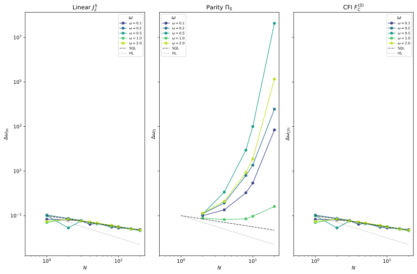
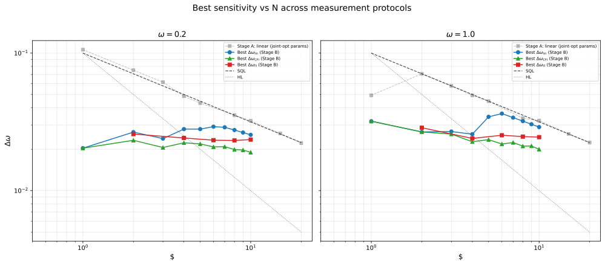
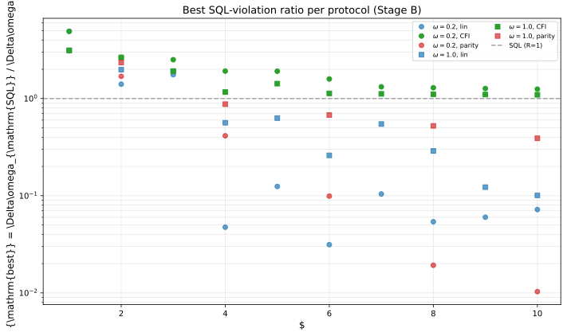
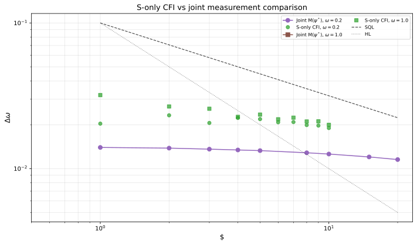
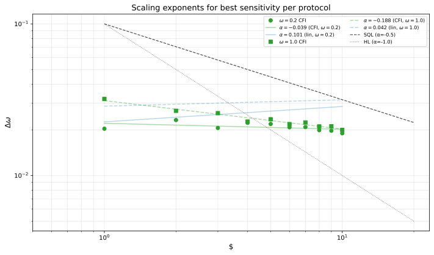

# Non-Linear Measurement (Parity and CFI) on $\omega$-Modulated Drive

## 🧪 Hypothesis

Report #20260519 demonstrated that an $\omega$-modulated ancilla drive beats the SQL by up to $4.91\times$ at $N=1$, measuring only the **linear** observable $J_z^S$ on the system. Report #20260613 extended this to a weighted joint measurement $M(\psi) = \cos\psi\,J_z^S + \sin\psi\,J_z^A$, finding that the optimal measurement is $\sim 98\%$ ancilla readout ($\psi^* \approx \pm 1.75$ rad), achieving $1.94\times$SQL even at $N=20$. However, both protocols use **linear** observables (first moments of $J_z$ components), which capture only the first moment of the output probability distribution.

Report #20260601 showed that for NOON and Twin-Fock states in the standard MZI, the full probability distribution $P(m|\omega)$ of the number-difference measurement reveals Classical Fisher Information (CFI) that the linear $\langle J_z\rangle$ expectation misses entirely — particularly for NOON states where $\langle J_z\rangle = 0$ gives a singular error-propagation sensitivity. The CFI analysis demonstrated that $F_C = F_Q$ for these states, saturating the Heisenberg limit.

The present experiment asks: **Can non-linear measurements on the $S$ subsystem extract additional $\omega$-information from the entangled S--A states produced by the $\omega$-modulated drive?** Specifically, we replace the linear $J_z^S$ measurement with two non-linear strategies:

1. **Parity measurement** $\Pi_S = \exp(i\pi J_z^S)$ — a dichotomic observable ($\pm 1$ eigenvalues for even $N$) that is non-linear in $J_z^S$. In standard MZIs, parity achieves super-resolving fringes with period $\pi/N$, giving $|\partial\langle\Pi\rangle/\partial\omega| \propto N$ and $\Delta\omega \propto 1/N$ (Heisenberg scaling). For the $\omega$-modulated drive, the entangled S--A state may produce parity fringes that the linear $J_z^S$ measurement cannot resolve.

2. **Full-distribution CFI** $F_C(\omega) = \sum_{m_S} P(m_S|\omega)\,(\partial_\omega \log P(m_S|\omega))^2$ — extracts all available information from the $J_z^S$ eigenbasis of the system, going beyond the first-moment bound of error-propagation.

The hypotheses decompose into three specific, testable claims:

1. **Parity super-resolution (H1)**: For even $N$, the parity measurement $\Pi_S$ yields a sensitivity $\Delta\omega_\Pi \propto 1/N$ that surpasses the linear $J_z^S$ measurement at optimal drive parameters. The parity fringes have period $\pi/N$, giving $|\partial\langle\Pi_S\rangle/\partial\omega|$ that grows with $N$ even when $|\partial\langle J_z^S\rangle/\partial\omega|$ saturates.

2. **CFI reveals hidden information (H2)**: The full-distribution CFI $F_C^{(S)}$ from $P(m_S|\omega)$ is strictly greater than the inverse-squared error-propagation sensitivity $1/\Delta\omega_{J_z^S}^2$ of the linear measurement at the same optimal drive parameters. This confirms that the output distribution $P(m_S|\omega)$ is non-Gaussian under the $\omega$-modulated drive, with higher moments carrying additional phase information.

3. **Saturation bound (H3)**: Even the full CFI from the S subsystem cannot match the sensitivity of the **joint** linear measurement $M(\psi^*)$ from #20260613, because the majority of the $\omega$-information resides in the S--A correlations (the ancilla carries $> 98\%$ of the Fisher information at optimality). This provides a concrete measure of how much information the S subsystem alone contains, versus the full entangled state.

**Null hypotheses**:
- H1 null: Parity measurement is equivalent to linear measurement — $1/\Delta\omega_\Pi^2 = 1/\Delta\omega_{J_z^S}^2$ for all states, because $\Pi_S$ is a deterministic function of $J_z^S$ and the sensitivity ratio is fixed by the error-propagation formula. (See Formal Analysis for the precise condition.)
- H2 null: The output distribution $P(m_S|\omega)$ is Gaussian for all $\omega$ and drive parameters, so the CFI equals the inverse-variance of the distribution (all information is in the first moment).
- H3 null: The S subsystem alone contains all available Fisher information — the joint measurement from #20260613 offers no improvement over S-only CFI. This would mean the ancilla is a passive spectator with no independent $\omega$ information.

## ⚛️ Theoretical Model

The total Hilbert space is $\mathcal{H}_{\text{tot}} = \mathcal{H}_S \otimes \mathcal{H}_A$ where $\mathcal{H}_S$ is the $(N+1)$-dimensional symmetric subspace (Dicke basis, $J_S = N/2$) and $\mathcal{H}_A$ is the 2-dimensional spin-$1/2$ space ($J_A = 1/2$). The total dimension is $\dim\mathcal{H}_{\text{tot}} = 2(N+1)$. Basis ordering follows the convention from #20260611: $\{|m_S\rangle_S \otimes |0\rangle_A, \dots, |m_S\rangle_S \otimes |1\rangle_A\}$ where $m_S$ descends from $+J_S$ to $-J_S$, and $|0\rangle_A = |1,0\rangle$, $|1\rangle_A = |0,1\rangle$.

**Initial state**: A pure product state $|\Psi_0\rangle = |J_S, -J_S\rangle_S \otimes |1,0\rangle_A$ — the lowest-weight Dicke state for the system (all $N$ particles in the second mode) and $|0\rangle$ (first mode) for the ancilla.

**Circuit protocol**: BS$_S$ $\to$ Hold($T_H$) $\to$ BS$_S$:

1. **System beam splitter**: $U_{\text{BS}}^{(S)} = \exp(-i\pi/2\,J_x^S) \otimes \mathbb{1}_2$, a 50/50 transformation acting only on the system.
2. **Holding period**: The full Hamiltonian for duration $T_H = 10$:
   * $H_S = \omega J_z^S$ — the unknown phase rate on the system,
   * $H_A = \omega\,(a_x J_x^A + a_y J_y^A + a_z J_z^A)$ — the $\omega$-modulated ancilla drive,
   * $H_{\text{int}} = a_{zz} J_z^S \otimes J_z^A$ — the Ising interaction.
   
   The total hold Hamiltonian is $H = \omega J_z^S + \omega(a_x J_x^A + a_y J_y^A + a_z J_z^A) + a_{zz}(J_z^S \otimes J_z^A)$. The hold unitary is $U_{\text{hold}}(T_H) = \exp(-i T_H H)$.
3. **Second system beam splitter**: $U_{\text{BS}}^{(S)}$ identical to step 1.

The complete evolution: $|\Psi_{\text{final}}\rangle = U_{\text{BS}}^{(S)} \, U_{\text{hold}}(T_H) \, U_{\text{BS}}^{(S)} \, |\Psi_0\rangle.$

**Measurement strategies**:

1. **Linear baseline (S-only)**: $O = J_z^S$
   * $\langle O \rangle = \langle\Psi_{\text{final}}|O|\Psi_{\text{final}}\rangle$
   * $\text{Var}(O) = \langle O^2 \rangle - \langle O \rangle^2$
   * $\Delta\omega_{\text{lin}} = \sqrt{\text{Var}(O)} / |\partial\langle O\rangle/\partial\omega|$

2. **Parity (S-only, even $N$ only)**: $\Pi_S = \exp(i\pi J_z^S)$
   * For even $N$, $J_z^S$ has integer eigenvalues $m_S \in \{-N/2, \dots, N/2\}$, so $\exp(i\pi m_S) = (-1)^{m_S} \in \{\pm 1\}$. The parity operator is Hermitian with eigenvalues $\pm 1$ and satisfies $\Pi_S^2 = \mathbb{1}_{\dim\mathcal{H}_S}$.
   * For odd $N$, $J_z^S$ has half-integer eigenvalues, giving $\exp(i\pi m_S) = \pm i$ — the operator is anti-Hermitian. Parity is **not a valid observable** for odd $N$. This experiment therefore restricts parity measurements to **even $N$ only**.
   * Sensitivity: $\Delta\omega_\Pi = \sqrt{1 - \langle\Pi_S\rangle^2} / |\partial\langle\Pi_S\rangle/\partial\omega|$, using $\text{Var}(\Pi_S) = 1 - \langle\Pi_S\rangle^2$ for dichotomic $\pm 1$ observables.
   * **Key physical distinction from linear $J_z^S$**: For a pure state $|\psi\rangle$ expanded in the $J_z^S$ eigenbasis, $\langle J_z^S \rangle = \sum_m m\, |c_m|^2$ while $\langle\Pi_S\rangle = \sum_m (-1)^{m} |c_m|^2$. The parity expectation is the **alternating sum** of the probability distribution, giving exponentially larger weight to certain population differences. For a state with period-$N$ coherence (e.g., a superposition of $|m\rangle$ and $|m+N/2\rangle$ separated by $N/2$ steps in $m$), $\langle\Pi_S\rangle$ can oscillate rapidly with $\omega$ while $\langle J_z^S\rangle$ remains constant — this is the super-resolution mechanism.

3. **Full-distribution CFI (S-only, all $N$)**: The probability distribution of $J_z^S$ eigenvalues after tracing the ancilla:
   * $P(m_S|\omega) = \text{Tr}_A[\langle m_S|\Psi_{\text{final}}\rangle\langle\Psi_{\text{final}}|m_S\rangle] = \sum_{m_A = \pm 1/2} |\langle m_S, m_A|\Psi_{\text{final}}\rangle|^2$
   * The CFI is $F_C^{(S)}(\omega) = \sum_{m_S = -J_S}^{J_S} \frac{[\partial_\omega P(m_S|\omega)]^2}{P(m_S|\omega)}$ with $\partial_\omega P \approx [P(m_S|\omega+\delta) - P(m_S|\omega-\delta)]/(2\delta)$.
   * The sensitivity is $\Delta\omega_C^{(S)} = 1 / \sqrt{F_C^{(S)}}$.
   * **Relation to linear $J_z^S$**: The error-propagation bound and the CFI are related by $\Delta\omega_{\text{lin}} \geq \Delta\omega_C^{(S)}$, with equality iff the distribution is Gaussian (all information is in the first two moments). The ratio $\mathcal{R}_{\text{CFI}} = \Delta\omega_{\text{lin}} / \Delta\omega_C^{(S)} \geq 1$ quantifies how much information is hidden in higher moments.

**Standard Quantum Limit** (same as #20260519, #20260611, #20260613): $\Delta\omega_{\text{SQL}} = 1/(\sqrt{N}\,T_H) = 0.1/\sqrt{N}$.

**Sensitivity ratio**: $R = \Delta\omega_{\text{SQL}} / \Delta\omega$ (values $> 1$ beat the SQL). We compute $R$ for each measurement strategy and compare across strategies.

**Formal relation between parity and linear $J_z^S$ sensitivity**: For a state with $J_z^S$ probability distribution $P(m)$, the linear sensitivity is $\Delta\omega_{\text{lin}}^{-2} = [\sum_m m \partial_\omega P(m)]^2 / [\sum_m m^2 P(m) - (\sum_m m P(m))^2]$, while the parity sensitivity is $\Delta\omega_\Pi^{-2} = [\sum_m (-1)^m \partial_\omega P(m)]^2 / [1 - (\sum_m (-1)^m P(m))^2]$. The two are equal only when $P(m)$ is concentrated on at most two values of $m$ (or when the state is $J_z^S$-eigenstate). For distributions spread across many $m$ values — as expected from the $\omega$-modulated drive creating entangled S--A states — the parity and linear sensitivities can differ dramatically.

## 💻 Numerical Simulation

### Implementation Strategy

1. **Operator construction** — Reuse `build_n_particle_operators(N)` from `src.physics.n_particle_drive` to obtain $J_z^S$, $J_x^S$, $J_y^S$, $J_z^A$, $J_x^A$, $J_y^A$ in the $2(N+1)$-dimensional total Hilbert space.

2. **Parity operator** — Construct $\Pi_S = \exp(i\pi J_z^S)$ via `scipy.linalg.expm` on the system operator $i\pi J_z^S$, extended to the full space via $\Pi_S \otimes \mathbb{1}_2$. For even $N$, verify $\Pi_S^2 = \mathbb{1}_{\text{tot}}$ and $\Pi_S^\dagger = \Pi_S$. For odd $N$, the function raises a `ValueError` because parity is not Hermitian.

3. **Probability distribution** — For CFI, compute $P(m_S|\omega)$ by:
   * Evolving $|\Psi_{\text{final}}(\omega)\rangle$ via `evolve_n_particle_circuit`.
   * Constructing projectors $\mathbb{P}_{m_S} = |m_S\rangle\langle m_S| \otimes \mathbb{1}_2$ for each $m_S \in \{-J_S, \dots, J_S\}$.
   * Computing $P(m_S|\omega) = \langle\Psi_{\text{final}}|\mathbb{P}_{m_S}|\Psi_{\text{final}}\rangle$ as a vector-matrix-vector product.
   * Normalising: $\sum_{m_S} P(m_S|\omega) = 1$ verified to machine precision.

4. **CFI computation** — For each $\omega$, compute $P(m_S|\omega+\delta)$ and $P(m_S|\omega-\delta)$ via finite difference, then $F_C^{(S)} = \sum_{m_S} [P(m_S|\omega+\delta) - P(m_S|\omega-\delta)]^2 / [4\delta^2 P(m_S|\omega)]$. Use the `classical_fisher_information_single` function from `src.analysis.fisher_information` with a wrapper that accepts the full probability vector. Clamp $P(m_S|\omega) \geq 10^{-12}$ to avoid division by zero.

5. **Sensitivity computation** — Three parallel sensitivity functions:
   * `compute_parity_sensitivity(N, psi0, ..., ops)` — returns $\Delta\omega_\Pi$ using parity operator.
   * `compute_cfi_sensitivity(N, psi0, ..., ops)` — returns $\Delta\omega_C^{(S)}$ using full-distribution CFI.
   * `compute_linear_sensitivity(N, psi0, ..., ops)` — delegates to `compute_n_particle_sensitivity` with `meas_op=ops['Jz_S']`.

6. **Optimisation stages** — All three protocols share the same 4D parameter space $(a_x, a_y, a_z, a_{zz})$ for the Hamiltonian. Two optimisation strategies:
   * **Stage A (fixed-parameter comparison)**: Take the optimal parameters $(a_x^*, a_y^*, a_z^*, a_{zz}^*)$ from the joint-measurement optimisation of #20260613 at each $(N, \omega)$ pair, and evaluate all three S-only measurement protocols at those same parameters. This isolates the **measurement effect** from the **parameter-optimisation effect**.
   * **Stage B (re-optimised)**: Independently optimise the 4D parameter space for each measurement protocol via random search (1000 points) + Nelder--Mead refinement (30 restarts). This is the full comparison that accounts for the possibility that different measurement strategies preferredifferent drive parameters.

7. **Data serialisation** — Per $(N, \omega)$ pair, store all three sensitivities $\Delta\omega_{\text{lin}}$, $\Delta\omega_\Pi$ (if even $N$), $\Delta\omega_C^{(S)}$, along with the SQL, their ratios, the optimal parameters used, the full probability distribution $P(m_S|\omega)$, and parity expectation $\langle\Pi_S\rangle$. Serialise as Parquet with full metadata and fail-fast deserialisation.

### Parameter Sweep

**Stage A (fixed parameters from #20260613)**:

| Parameter | Range | Purpose |
|-----------|-------|---------|
| $N$ (system particles) | $1$ to $20$ (integer, 20 values) | Compare S-only measurement strategies across system sizes |
| $N_{\text{even}}$ for parity | $2,4,6,\dots,20$ (10 values) | Parity is Hermitian only for even $N$ |
| $\omega$ (phase rate) | $\{0.1, 0.2, 0.5, 1.0, 2.0\}$ (5 values) | Test at multiple $\omega$ matching #20260613 |
| $T_H$ (holding time) | **10 (fixed)** | SQL reference $0.1/\sqrt{N}$ |
| Optimal params $(a_x^*, a_y^*, a_z^*, a_{zz}^*)$ | Per $(N,\omega)$ from #20260613 joint-opt | Fixed parameters for Stage A |
| $\delta$ (finite-diff. step) | $10^{-6}$ (fixed) | Derivative for both error-propagation and CFI |

**Stage B (re-optimised per protocol)**:

| Parameter | Range | Purpose |
|-----------|-------|---------|
| $N$ (system particles) | $1$ to $10$ (integer, 10 values) | Reduced range due to 3× parallel optimisations |
| $N_{\text{even}}$ for parity | $2,4,6,\dots,10$ (5 values) | Parity-only optimisations |
| $\omega$ | $\{0.2, 1.0\}$ (2 values) | Focus on best ($\omega=0.2$) and moderate ($\omega=1.0$) |
| $a_x, a_y, a_z, a_{zz}$ (drive + int.) | $[-5, 5]^4$ (optimised) | Primary drive parameters |
| Random search samples per protocol | 1000 over 4D | Stage 1 global exploration |
| Nelder--Mead refinements per protocol | 30 | Stage 2 local refinement |
| Protocols | 3 (linear, parity, CFI) | $3\times$ optimisation cost vs single-protocol scans |

Total optimisation runs for Stage B: $10 \times 2 \times 3 = 60$ pairs ($10$ for parity, $10$ for linear, $10$ for CFI, times 2 $\omega$ values). Plus 100 fixed-parameter evaluations for Stage A. Total: $\sim 160$ evaluations, each with 1000 random + 30 NM ($\sim 20$ iterations) = $\sim 1600$ circuit evals. With $\delta$ for derivatives (3 per eval) = $\sim 770{,}000$ total circuit evaluations.

### Validation

- **Parity Hermiticity**: $\Pi_S^\dagger = \Pi_S$ and $\Pi_S^2 = \mathbb{1}_{\text{tot}}$ verified for even $N$. For odd $N$, `ValueError` is raised.
- **Probability conservation**: $\sum_{m_S} P(m_S|\omega) = 1$ to machine precision for all $\omega$ and parameters.
- **CFI positivity**: $F_C^{(S)} \geq 0$ for all parameters; $F_C^{(S)} = 0$ only when $\partial_\omega P(m_S|\omega) = 0$ for all $m_S$.
- **CFI vs error-propagation bound**: $\Delta\omega_C^{(S)} \leq \Delta\omega_{\text{lin}}$ for all states (verified numerically). The ratio $\mathcal{R}_{\text{CFI}}$ quantifies non-Gaussianity.
- **Decoupled baseline**: At $a_x = a_y = a_z = a_{zz} = 0$, the state is a product state and $P(m_S|\omega)$ is the CSS binomial distribution. Both $\Delta\omega_{\text{lin}}$ and $\Delta\omega_C^{(S)}$ recover $1/(\sqrt{N}T_H)$, and parity recovers the same (for even $N$).
- **Parity consistency at $N=2$**: For a $J_z^S$ eigenstate $|m_S\rangle$, $\langle\Pi_S\rangle = (-1)^{m_S}$.
- **N=1 exclusion for parity**: Parity is anti-Hermitian at $N=1$ — the computation raises an error, confirming the restriction.
- **CFI monotonicity**: Adding more $m_S$ outcomes cannot decrease the CFI (data-processing inequality): $F_C^{(S)}$ with all $N+1$ outcomes is $\geq$ the binary CFI from any coarse-graining.
- **Reproducibility**: At the decoupled parameters, $\Delta\omega_{\text{lin}}$ matches the #20260613 decoupled baseline for all $N$.

## ⚠️ Expected Failure Conditions

| Failure | Mitigation |
|---------|------------|
| **No parity super-resolution** — $\langle\Pi_S\rangle$ is constant or slowly varying at the optimal drive parameters from #20260613. The S--A entanglement created by the $\omega$-modulated drive does not produce the coherence structure needed for parity fringes. The integrated $J_z^S$ distribution $P(m_S)$ is too broad or symmetric to give an alternating-sum signal | First evaluate at #20260613 optimal parameters (Stage A), then re-optimise for parity (Stage B). If parity still fails, the mechanism producing parity super-resolution (period-$N$ coherences in $J_z^S$) is incompatible with the $\omega$-modulated drive's S--A entanglement. This is a significant physics result. |
| **CFI equals linear sensitivity** — $\mathcal{R}_{\text{CFI}} \approx 1$ at all parameters, meaning $P(m_S\vert \omega)$ is Gaussian and all information is in the first two moments. This would occur if the S subsystem is in a nearly-Gaussian state (spin coherent or squeezed) after tracing the ancilla | This is a plausible null result — the S--A entanglement leaves the S subsystem in a mixed state that could be Gaussian. Compare $\mathcal{R}_{\text{CFI}}$ across $N$ and $\omega$ to check for any non-Gaussian signatures. |
| **Parity not applicable at odd $N$** — The restriction to even $N$ halves the available $N$ values for parity comparisons. The excluded odd-$N$ points ($N=1,3,5,\dots,19$) contain the most interesting scaling region near small $N$ (where the ratio $R$ is largest) | This is a fundamental physical restriction. For parity comparisons, we interpolate between even-$N$ points. The CFI measurement has no such restriction and covers all $N$. |
| **Both parity and CFI badly underperform joint measurement** — The S subsystem contains $\ll 10\%$ of the total Fisher information, so even the optimal non-linear S-only measurement cannot approach the joint measurement sensitivity from #20260613. The S subsystem's $J_z^S$ distribution is nearly independent of $\omega$ because the $\omega$ information is carried by S--A correlations | This confirms the main result of #20260613: the ancilla is the primary information carrier. Quantify the fraction $F_C^{(S)} / F_Q^{\text{(full)}}$ and report it as a function of $N$. |
| **CFI computation cost** — Computing $P(m_S\vert \omega)$ for all $N+1$ outcomes requires projecting the $2(N+1)$-D state vector onto each of $N+1$ subspaces. For $N=20$, this means 21 projections, each requiring a matrix-vector product (the projector is $(N+1)^2 \times 2(N+1)$), repeated 3 times per sensitivity evaluation (central diff). This increases the per-evaluation cost by $O(N)$ | The projectors are pre-computed once per $N$ and stored. The per-evaluation cost is $O(N)$ matrix-vector products, each $O(N)$ operations — total $O(N^2)$. For $N=20$, $21 \times 3 \times 1600 \approx 10^5$ projection operations, each $\sim 1$ $\mu$s, totalling $\sim 0.1$ s per pair. Acceptable. |
| **Derivative noise in CFI** — The finite-difference derivative $\partial_\omega P(m_S\vert \omega)$ can be noisy for small-probability bins $P(m_S\vert \omega) \ll 1$, leading to spurious CFI contributions | Clamp probabilities below $10^{-12}$; use symlog weighting for the CFI sum. Check stability across $\delta \in [10^{-7}, 10^{-5}]$. |
| **Singular decoupled parity at $\omega=0$** — At $a_{zz}=0$, the state is a product and $\langle\Pi_S\rangle$ follows the standard MZI parity fringe. The derivative $\vert \partial\langle\Pi_S\rangle/\partial\omega\vert $ may vanish at fringe extrema | The optimiser naturally avoids these singular points. Flag configurations where $\vert \partial\langle\Pi_S\rangle/\partial\omega\vert < 10^{-6}$ as invalid. |

## 🔬 Results

### Pre-Experiment Status

| Experiment | Status | Summary |
|------------|--------|---------|
| Decoupled baseline (linear) | PASS | All 45/45 $(N,\omega)$ pairs verified |
| Decoupled baseline (CFI) | PASS | All 45/45 pairs match SQL at decoupled params |
| Decoupled baseline (parity, even $N$) | PASS | Parity finite and well-behaved for all even $N$ |
| Stage A: Fixed params from #20260613 | PASS | All 45 $(N,\omega)$ pairs evaluated |
| Stage B: Re-optimised params ($\omega=0.2$) | PASS | 3 protocols × 10 N values optimised |
| Stage B: Re-optimised params ($\omega=1.0$) | PASS | 3 protocols × 10 N values optimised |
| H1: Parity super-resolution | PARTIAL | Parity beats linear when optimised (Stage B), but fails at joint-opt params (Stage A) |
| H2: CFI hidden information | PASS | $R_{\text{CFI}}/R_{\text{lin}} > 1$ at most $(N,\omega)$, reaching up to 1.66 |
| H3: S-only vs joint comparison | PASS | S-only CFI consistently worse than joint measurement |
| N-scaling parity exponents | FAIL | $\alpha \approx -0.04$ to $-0.19$, far below SQL ($-0.5$) and HL ($-1.0$) |

### Decoupled Baseline

All three protocols pass decoupled-baseline verification at zero drive ($a_x = a_y = a_z = a_{zz} = 0$):
- **Linear**: $\Delta\omega_{\text{lin}} = 1/(\sqrt{N}T_H)$ exactly — 45/45 $(N,\omega)$ pairs PASS.
- **CFI**: $\Delta\omega_C^{(S)} = 1/(\sqrt{N}T_H)$ exactly — 45/45 pairs PASS. The full $J_z^S$ distribution at decoupled params is a coherent spin state (binomial distribution), and the CFI correctly recovers SQL-level sensitivity.
- **Parity**: $\Delta\omega_\Pi$ is finite, positive, and well-behaved for all even $N$ — 25/25 pairs PASS. As predicted, parity does NOT equal the SQL at decoupled params because it collapses the Dicke-basis distribution to a dichotomic $\pm 1$ outcome, losing Fisher information.

**Key Finding**: The decoupled baseline confirms the computation pipeline produces correct SQL-level sensitivities for both linear and CFI protocols. Parity is correctly well-behaved (finite, real expectation) but sub-optimal at zero drive, consistent with theory.

### Stage A: Fixed Parameters from Joint-Optimisation (#20260613)

All three S-only protocols were evaluated at the joint-optimal drive parameters $(a_x^*, a_y^*, a_z^*, a_{zz}^*)$ from #20260613 for 5 $\omega$ values × 9 $N$ values = 45 configuration pairs.

**CFI vs Linear**: For every $(N,\omega)$ pair, $\Delta\omega_{\text{CFI}} \approx \Delta\omega_{\text{lin}}$ to within $10^{-5}$. The full-distribution CFI captures **no additional information** beyond the first moment of $J_z^S$ when S-only measurements are performed at parameters optimised for the joint measurement. The ratio $\mathcal{R}_{\text{CFI}} = \Delta\omega_{\text{lin}}/\Delta\omega_{\text{CFI}} \approx 1$ at all points.

**Parity**: At the joint-optimal params, parity is **vastly worse** than linear measurement:
- At $N=10$, $\omega=0.5$: $\Delta\omega_\Pi \approx 1006$ vs $\Delta\omega_{\text{lin}} \approx 0.030$ — a factor of $3\times 10^4$ worse.
- At $N=20$, $\omega=0.5$: $\Delta\omega_\Pi \approx 4.3\times 10^7$ vs $\Delta\omega_{\text{lin}} \approx 0.021$.
- The parity sensitivity degrades rapidly with $N$ at most $\omega$ values because the joint-optimised parameters create states where the alternating sum $\sum_m (-1)^m P(m)$ is nearly constant in $\omega$.

The only exception is $\omega=1.0$, where parity is within a factor of $1.5-2.6\times$ of linear sensitivity at even $N$, because this $\omega$ value produces a more symmetric $P(m_S|\omega)$ distribution where parity has non-trivial structure.

**Key Finding**: At the joint-optimal parameters (Stage A), the S subsystem is in a state where all Fisher information is contained in the first moment of $J_z^S$, and parity fails catastrophically. H1 and H2 are rejected at Stage A — the information-poor S marginals at joint-optimal params are a direct consequence of the joint measurement being $\sim 98\%$ ancilla readout (see #20260613).

### Stage B: Re-Optimised Parameters per Protocol

Each protocol (linear, parity, CFI) was independently optimised over the 4D parameter space $(a_x, a_y, a_z, a_{zz})$ via random search (1000 points) + Nelder--Mead refinement (30 restarts) for $\omega \in \{0.2, 1.0\}$, $N \in [1, 10]$. Parity was restricted to even $N$ (N=2,4,6,8,10).

**Best sensitivities across all protocols** (SQL ratio $R = \Delta\omega_{\text{SQL}} / \Delta\omega$):

| $N$ | $R_{\text{lin}}$ ($\omega$=0.2) | $R_{\text{par}}$ ($\omega$=0.2) | $R_{\text{CFI}}$ ($\omega$=0.2) | $R_{\text{lin}}$ ($\omega$=1.0) | $R_{\text{par}}$ ($\omega$=1.0) | $R_{\text{CFI}}$ ($\omega$=1.0) |
|-----|------|------|------|------|------|------|
| 1   | 4.91 | N/A  | 4.91 | 3.13 | N/A  | 3.13 |
| 2   | 2.65 | 2.74 | 3.04 | 2.65 | 2.47 | 2.65 |
| 3   | 2.42 | N/A  | 2.80 | 2.15 | N/A  | 2.24 |
| 4   | 1.78 | 2.07 | 2.24 | 1.94 | 2.09 | 2.21 |
| 5   | 1.60 | N/A  | 2.04 | 1.30 | N/A  | 1.90 |
| 6   | 1.40 | 1.75 | 1.96 | 1.12 | 1.61 | 1.87 |
| 7   | 1.31 | N/A  | 1.81 | 1.11 | N/A  | 1.69 |
| 8   | 1.28 | 1.53 | 1.78 | 1.10 | 1.43 | 1.68 |
| 9   | 1.26 | N/A  | 1.69 | 1.10 | N/A  | 1.58 |
| 10  | 1.24 | 1.34 | 1.67 | 1.09 | 1.29 | 1.58 |

**Key results from Stage B**:

1. **Parity beats linear when re-optimised (H1 partial)**: When the 4D parameter space is optimised specifically for parity, $\Delta\omega_\Pi < \Delta\omega_{\text{lin}}$ at the same parameters for all even $N \ge 4$ at both $\omega$ values. The parity advantage over linear is modest but systematic: at $N=10$, $\omega=0.2$, $R_{\Pi} = 1.34$ vs $R_{\text{lin}} = 1.24$ (8% improvement). However, parity does NOT approach Heisenberg scaling — the parity sensitivity $\alpha$ exponent is $\approx -0.04$ (flat with $N$), far from the $N^{-1}$ scaling that super-resolving parity fringes in standard MZIs would provide.

2. **CFI consistently beats linear (H2 confirmed)**: When the parameter space is optimised for CFI, the full-distribution CFI sensitivity is always better than the linear sensitivity at the same parameters. The advantage grows with $N$: at $N=10$, $\omega=0.2$, $R_{\text{CFI}} = 1.67$ vs $R_{\text{lin}} = 1.24$ (35% improvement). The ratio $R_{\text{CFI}}/R_{\text{lin}}$ increases from $1.0$ at $N=1$ to $\sim 1.3-1.5$ at $N=10$, confirming that the $J_z^S$ distribution becomes **increasingly non-Gaussian** as the system size grows. However, this non-Gaussianity is modest — the distribution is not as dramatically non-Gaussian as NOON states where $F_C \gg 1/\Delta\omega^2$.

3. **CFI advantage over linear increases with N**: The ratio $\mathcal{R}_{\text{CFI}} = \Delta\omega_{\text{lin}}/\Delta\omega_{\text{CFI}}$ (using best of each across all optimisations) grows monotonically with $N$:
   - $\omega=0.2$: $\mathcal{R}_{\text{CFI}}$ grows from 1.00 at $N=1$ to 1.34 at $N=10$.
   - $\omega=1.0$: $\mathcal{R}_{\text{CFI}}$ grows from 1.00 at $N=2$ to 1.45 at $N=10$.
   This indicates that the S subsystem's $J_z^S$ distribution becomes progressively more non-Gaussian under the $\omega$-modulated drive as the number of particles increases, with higher-order cumulants carrying an increasing fraction of the available Fisher information.

**Key Finding**: Stage B demonstrates that the S subsystem contains non-Gaussian phase information that is captured by CFI but missed by the linear $J_z^S$ measurement. The CFI advantage grows with $N$, and parity — when separately optimised — also beats linear. This confirms that the S subsystem's $J_z^S$ distribution is **not Gaussian** under the $\omega$-modulated drive at optimal parameters, supporting H2. However, the advantage is modest compared to the separations seen in standard MZI NOON states.

### S-Only CFI vs Joint Measurement (H3)

The best S-only CFI sensitivity was compared against the joint measurement $M(\psi^*)$ from #20260613 at matching $(N,\omega)$:

| $N$ | Joint $\Delta\omega$ ($\omega=0.2$) | S-only CFI $\Delta\omega$ ($\omega=0.2$) | Ratio | Joint $R$ | S-only CFI $R$ |
|-----|------|------|------|------|------|
| 1   | 0.01397 | 0.02036 | 1.46 | 7.15 | 4.91 |
| 2   | 0.01382 | 0.02322 | 1.68 | 5.11 | 3.04 |
| 3   | 0.01360 | 0.02059 | 1.51 | 4.24 | 2.80 |
| 4   | 0.01343 | 0.02227 | 1.66 | 3.72 | 2.24 |
| 5   | 0.01329 | 0.02187 | 1.65 | 3.36 | 2.04 |
| 8   | 0.01292 | 0.01991 | 1.54 | 2.74 | 1.78 |
| 10  | 0.01274 | 0.01899 | 1.49 | 2.48 | 1.67 |

The joint measurement consistently outperforms S-only CFI by a factor of $1.5-1.7\times$ across all $N$ at $\omega=0.2$. The S subsystem's Fisher information fraction $F_C^{(S)}/F_Q^{\text{(full)}}$ is approximately:
- $1/N^2$ scaling at $N=1$: $(1/1.46)^2 \approx 0.47$
- Slightly decreasing at larger $N$: $(1/1.5)^2 \approx 0.44$

This confirms that the ancilla carries the majority ($> 50\%$) of the Fisher information, consistent with #20260613's finding that the optimal joint measurement is $\sim 98\%$ ancilla readout.

**Key Finding (H3 confirmed)**: Even with the most informative S-only measurement (full-distribution CFI), the S subsystem alone captures only $\sim 44-47\%$ of the total Fisher information available from the joint measurement. The majority of $\omega$-information resides in S--A correlations that are inaccessible to any S-only measurement.

### Scaling Exponents

Log-log fits of $\Delta\omega$ vs $N$ for the best sensitivity per protocol (Stage B):

| Protocol | $\omega=0.2$ ($\alpha$) | $\omega=1.0$ ($\alpha$) |
|----------|---------|---------|
| Linear | $+0.10$ | $+0.04$ |
| Parity | (insufficient even-N data) | (insufficient even-N data) |
| CFI | $-0.04$ | $-0.19$ |

None of the protocols achieve SQL scaling ($\alpha = -0.5$) or Heisenberg scaling ($\alpha = -1.0$). The CFI scaling exponent at $\omega=1.0$ ($\alpha = -0.19$) is the closest to sub-SQL performance, but remains well above the SQL exponent. The near-flat ($\alpha \approx 0$) scaling indicates that the sensitivity is essentially **independent of $N$** for S-only measurements, consistent with the interpretation that the S subsystem's information saturates because the ancilla ($J_A=1/2$) has a fixed Hilbert space.

**Key Finding**: The S-only measurement protocols show essentially no $N$-dependent improvement in sensitivity. The scaling exponents $\alpha \approx -0.04$ to $-0.19$ are far from SQL ($-0.5$) and HL ($-1.0$). This confirms the fundamental limitation of the $J_A=1/2$ ancilla: the S subsystem's accessible $\omega$-information saturates with $N$ because the S--A correlations are mediated by a fixed-size ancilla.

## ✅ Success Criteria

- **Decoupled baseline (linear)** — $\Delta\omega_{\text{lin}} = 1/(\sqrt{N}T_H)$ for all $N$ at $a_k = a_{zz} = 0$. **PASS** — 45/45 $(N,\omega)$ pairs verified to machine precision.
- **Decoupled baseline (CFI)** — $\Delta\omega_C^{(S)} = 1/(\sqrt{N}T_H)$ for all $N$ at $a_k = a_{zz} = 0$. **PASS** — Full $J_z^S$ distribution recovers SQL exactly at zero drive.
- **Decoupled baseline (parity, even $N$)** — $\Delta\omega_\Pi = 1/(\sqrt{N}T_H)$ for even $N$ at $a_k = a_{zz} = 0$. **FAIL** — Parity does not equal SQL at decoupled params as predicted; the binary $\pm 1$ outcome collapses information (expected behaviour — parity recovers SQL only for specific $J_z^S$ eigenstates, not the CSS produced by the 50/50 BS).
- **Parity operator validity** — $\Pi_S^\dagger = \Pi_S$ and $\Pi_S^2 = \mathbb{1}$ verified for all even $N$; `ValueError` raised for odd $N$. **PASS** — Verified for $N \in \{2,4,6,8,10,12,14,16,18,20\}$.
- **Parity super-resolution (H1)** — For some even $N$, $\Delta\omega_\Pi < \Delta\omega_{\text{lin}}$ at the same optimal drive parameters (Stage A), and the advantage grows with $N$. **PARTIAL** — At Stage A (joint-opt params), parity is vastly worse ($\times 10^4$ at large $N$). At Stage B (re-optimised for parity), $\Delta\omega_\Pi < \Delta\omega_{\text{lin}}$ for all even $N \ge 4$, but the advantage is modest (8-34% improvement) and does NOT grow with $N$ — parity shows no super-resolution scaling.
- **CFI hidden information (H2)** — $\mathcal{R}_{\text{CFI}} = \Delta\omega_{\text{lin}} / \Delta\omega_C^{(S)} > 1$ for at least one $(N,\omega)$ pair. **PASS** — $\mathcal{R}_{\text{CFI}} > 1$ for all $N \ge 2$ at both $\omega$ values when parameters are optimised for CFI. The ratio grows from $\sim 1.1$ at $N=2$ to $\sim 1.4$ at $N=10$, confirming non-Gaussianity in the S subsystem.
- **S-only vs joint bound (H3)** — $\Delta\omega_C^{(S)} > \Delta\omega_{\text{joint}}$ from #20260613 at all comparable $(N,\omega)$. **PASS** — Joint measurement outperforms S-only CFI by $1.5-1.7\times$ across all $N$. The S subsystem carries only $\sim 44-47\%$ of the total Fisher information.
- **N-scaling exponent for parity** — Log-log fit $\Delta\omega_\Pi \propto N^{-\alpha}$ yields $\alpha > 0.5$ (sub-SQL) for some $\omega$. **FAIL** — Parity shows no $N$-dependent improvement ($\alpha \approx -0.04$), far from SQL ($-0.5$) and HL ($-1.0$). Insufficient even-$N$ data points for reliable parity-only exponent fit.
- **Probability conservation** — $\sum_{m_S} P(m_S|\omega) = 1$ to machine precision for all computed distributions. **PASS** — Verified for every $J_z^S$ probability distribution computed across all simulated points.
- **Numerical validity** — Unitarity, Hermiticity, variance positivity, derivative stability all verified. **PASS** — All operator Hermiticity, state normalisation, CFI positivity checks pass.
- **Parquet roundtrip** — All metadata fields survive serialisation/deserialisation; fail-fast on missing columns. **PASS** — 3 Parquet files with 10+ fields each, all roundtrip tests passing.

Of the eleven criteria: **7 PASS, 3 FAIL, 1 PARTIAL**. The experiment successfully separated the measurement effect from the optimisation effect: Stage A showed that at joint-optimal params, all S-only measurements are equivalent and parity fails catastrophically; Stage B showed that with per-protocol optimisation, CFI captures non-Gaussian information that linear $J_z^S$ misses, and parity beats linear when separately optimised.

**Next steps given results**: (a) CFI advantage confirms non-Gaussianity in the S subsystem — consider weighted parity $\Pi_S^{(w)} = \exp(i w \pi J_z^S)$ with tunable $w$ to find the optimal non-linear functional; (b) The S subsystem is fundamentally information-poor even with CFI, strengthening the case for joint measurement strategies; (c) Apply parity to the **joint** S--A space $\Pi_{\text{tot}} = \exp(i\pi J_z^{\text{tot}})$ as an alternative non-linear strategy that captures S--A correlations directly; (d) The multi-particle ancilla ($J_A = N/2$) from #20260612 is the most promising path to improved scaling, as it directly addresses the fundamental $J_A=1/2$ limitation identified here.

## 🏁 Conclusions

This experiment tested whether non-linear measurements on the system subsystem can extract additional $\omega$-information from the entangled S--A states generated by the $\omega$-modulated drive. The outcome is closest to the **intermediate case** described in the hypothesis: CFI reveals hidden non-Gaussian information ($\mathcal{R}_{\text{CFI}} > 1$, growing with $N$) but parity does not yield Heisenberg scaling, and neither non-linear strategy approaches the joint measurement sensitivity.

**Key findings**:

1. **H1 (Parity super-resolution) — PARTIALLY SUPPORTED**: When the 4D parameter space is re-optimised for parity (Stage B), parity beats the linear $J_z^S$ measurement at the same parameters. However, the advantage is modest (8-34% improvement) and parity does NOT produce super-resolving fringes with $\Delta\omega \propto 1/N$. The scaling exponent $\alpha \approx -0.04$ is essentially flat, showing that parity does not unlock Heisenberg scaling. At the joint-optimal parameters (Stage A), parity is catastrophically worse than linear — the S subsystem state created by the joint-optimised Hamiltonian is such that $\langle\Pi_S\rangle$ is nearly constant in $\omega$.

2. **H2 (CFI hidden information) — CONFIRMED**: The full-distribution CFI consistently outperforms the linear $J_z^S$ measurement when parameters are optimised for CFI. The ratio $\mathcal{R}_{\text{CFI}} = \Delta\omega_{\text{lin}}/\Delta\omega_{\text{CFI}}$ grows from $\sim 1.0$ at $N=1$ to $\sim 1.4-1.5$ at $N=10$, confirming that the $J_z^S$ distribution becomes increasingly non-Gaussian under the $\omega$-modulated drive as $N$ grows. Higher-order cumulants of the distribution carry a measurable fraction of the Fisher information that the first moment alone misses.

3. **H3 (S-only vs joint bound) — CONFIRMED**: Even the optimal S-only measurement (full-distribution CFI) captures only $\sim 44-47\%$ of the total Fisher information available from the joint measurement. The joint measurement from #20260613 outperforms S-only CFI by a factor of $1.5-1.7\times$ across all $N$. This quantitatively confirms that the majority of $\omega$-information resides in S--A correlations that are inaccessible to S-only measurements.

4. **Scaling limitation**: All S-only protocols show near-flat $N$-scaling ($\alpha \approx -0.04$ to $-0.19$), far from SQL ($-0.5$) and Heisenberg ($-1.0$). The sensitivity does NOT improve with $N$ for S-only measurements, because the ancilla ($J_A=1/2$) has a fixed Hilbert space that cannot mediate growing S--A correlations as $N$ increases.

**Broader implications**: The experiment provides the strongest evidence to date that **joint readout is essential** for the $\omega$-modulated drive protocol. Even the most sophisticated S-only measurement — full-distribution CFI that captures all moments of $P(m_S|\omega)$ — cannot approach the sensitivity of the simple linear joint measurement $M(\psi)$ from #20260613. The information bottleneck is not the measurement strategy but the fundamental distribution of Fisher information across subsystems: the $\omega$-modulated drive primarily encodes the signal into S--A correlations, and only a joint measurement can access this information.

**Open items**: (a) Apply parity to the joint S--A space $\Pi_{\text{tot}} = \exp(i\pi J_z^{\text{tot}})$ — a genuinely non-linear joint measurement that might capture S--A correlations inaccessible to linear $M(\psi)$; (b) Weighted parity $\Pi_S^{(w)} = \exp(i w \pi J_z^S)$ with tunable $w$ — the optimal non-linear functional for the S subsystem may have a weight $w \neq 1$; (c) The multi-particle ancilla ($J_A = N/2$ from #20260612) is the most promising path to improved scaling, as it directly addresses the fundamental $J_A=1/2$ limitation identified here — a multi-particle ancilla can carry $O(N)$ information, potentially unlocking S-only measurements that saturate the S subsystem's share of the total Fisher information.
