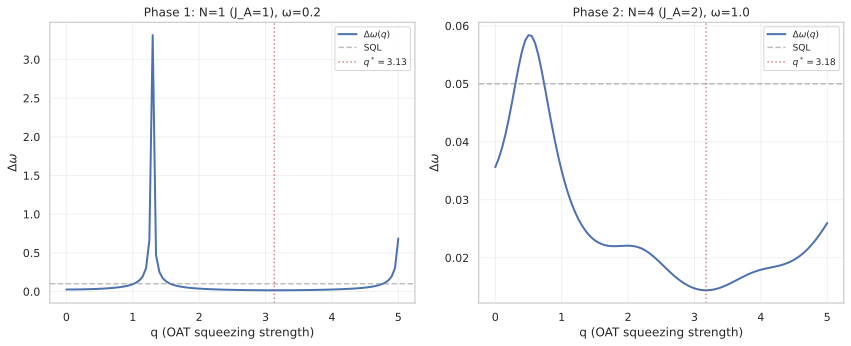
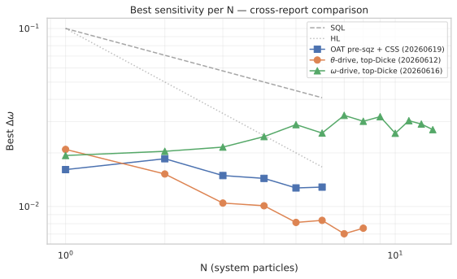
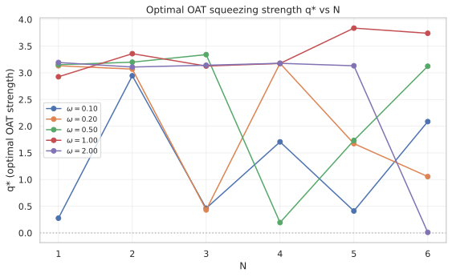
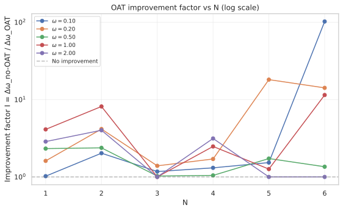
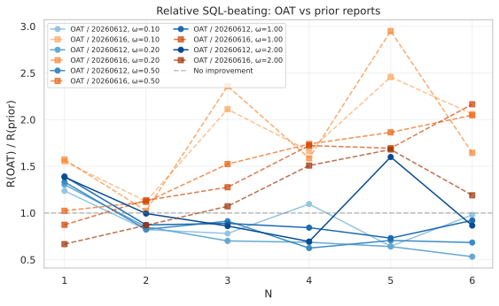

# Ancilla OAT Pre-Squeezing before $\omega$-Modulated Hold

## 🧪 Hypothesis

Reports #20260612 and #20260616 demonstrated that a multi-particle ancilla ($J_A = N/2$) with an $\omega$-modulated drive $H_A = \omega\,(a_x J_x^A + a_y J_y^A + a_z J_z^A)$ and Ising interaction $H_{\text{int}} = a_{zz} J_z^S J_z^A$ beats the SQL at all tested $N$ (ratio $R(N) \gtrsim 4.5$ for $N \leq 8$) but does not achieve Heisenberg-limit scaling (scaling exponent $\alpha \approx -0.5$, same as SQL). The fundamental limitation is that $\partial\langle J_z^S\rangle/\partial\omega$ and $\text{Var}(J_z^S)$ both scale with $N$, keeping their ratio (and hence $\Delta\omega$) at SQL level.

The present experiment tests whether **one-axis twisting (OAT) pre-squeezing** of the ancilla before the hold period can amplify the ancilla's contribution to $\partial\langle J_z^S\rangle/\partial\omega$ by reducing the ancilla's quantum noise in the measurement-relevant quadrature. OAT $U_{\text{OAT}} = \exp(-i q (J_z^A)^2)$ with $q = \chi T_{\text{OAT}}$ creates a spin-squeezed state of the ancilla with reduced variance in one quadrature of the $J_x$-$J_y$ plane. When the $\omega$-modulated drive $H_A$ then rotates this squeezed state, the rotation's effect on the ancilla's $J_z^A$ expectation (which feeds back onto $\langle J_z^S\rangle$ via $H_{\text{int}}$) is amplified, potentially increasing $\partial\langle J_z^S\rangle/\partial\omega$ without a proportional increase in $\text{Var}(J_z^S)$.

The central hypothesis decomposes into three specific, testable claims:

1. **OAT improves sensitivity at $N=1$ with $J_A = 1$**: For a spin-$1$ ancilla ($N_A = 2$, dimension 3) and a single-particle system ($J_S = 1/2$), there exists a finite squeezing strength $q^* > 0$ and drive parameters $(a_x, a_y, a_z, a_{zz})$ such that $\Delta\omega_{\text{OAT}} < \Delta\omega_{\text{no-OAT}}$, where both protocols use the same CSS ancilla initial state. The improvement factor $\mathcal{I} = \Delta\omega_{\text{no-OAT}} / \Delta\omega_{\text{OAT}} > 1$ is the squeezing benefit.

2. **OAT advantage persists for $J_A = N/2$**: For a multi-particle ancilla matching the system size ($J_A = J_S = N/2$), OAT pre-squeezing improves $\Delta\omega$ beyond the already sub-SQL values of #20260612. The improvement factor $\mathcal{I}(N)$ grows with $N$ because the optimal squeezing strength $q_{\text{opt}} \propto N^{-1/3}$ and the minimum squeezing parameter $\xi_{\text{min}} \propto N^{-2/3}$ both improve with larger $J_A$.

3. **Improved $N$-scaling exponent**: With OAT pre-squeezing, the $N$-scaling exponent $\alpha$ from $\Delta\omega_{\text{opt}} \propto N^{\alpha}$ satisfies $\alpha < -0.5$ (better than SQL) for at least one $\omega$ value. The OAT reduces $\text{Var}(J_z^S)$ relative to $\partial\langle J_z^S\rangle/\partial\omega$, yielding a scaling advantage over the $N$-independent SQL-level exponent of #20260612.

**Null hypotheses**: (a) OAT pre-squeezing of the ancilla provides no measurable benefit — the squeezing-induced variance reduction in the ancilla is not transmitted effectively to the $J_z^S$ measurement through the $H_{\text{int}}$ channel, so $\mathcal{I}(N) \approx 1$ at all $N$. (b) The OAT-induced anti-squeezing in the conjugate quadrature increases $\text{Var}(J_z^S)$ proportionally to the derivative improvement, cancelling any sensitivity gain.

## ⚛️ Theoretical Model

The total Hilbert space is $\mathcal{H}_{\text{tot}} = \mathcal{H}_S \otimes \mathcal{H}_A$, where both subsystems are symmetric $N$-particle two-mode bosonic systems in the **Dicke basis**. The **system** has $J_S = N/2$ with Dicke basis states $|J_S, m_S\rangle$, $m_S\in\{-J_S,\dots,J_S\}$, dimension $d_S = N+1$. The **ancilla** has $J_A = N/2$ with Dicke basis states $|J_A, m_A\rangle$, dimension $d_A = N+1$. Both use descending eigenvalue ordering ($m = +J$ to $-J$). The full Hilbert space dimension is $d_{\text{tot}} = (N+1)^2$.

**Collective angular momentum operators** $J_z, J_x, J_y$ are $(N+1)\times(N+1)$ matrices in the Dicke basis, built by existing functions `jz_operator()`, `jx_operator()`, `jy_operator()` from `src.physics.dicke_basis` with `basis=OperatorBasis.DICKE`. These are embedded into the full space via Kronecker products: $J_k^S = J_k(N) \otimes \mathbb{1}_{N+1}$ and $J_k^A = \mathbb{1}_{N+1} \otimes J_k(N)$.

The **initial state** is a pure product state where the ancilla is a **coherent spin state (CSS) along $-x$** and the system is in the top Dicke state:
$|\Psi_0\rangle = |J_S, J_S\rangle_S \otimes |J_A, -J_A\rangle_x^A,$
where $|J_A, -J_A\rangle_x$ is the CSS pointing along $-x$, constructed via `coherent_spin_state(N)` from `src.algorithms.spin_squeezing`. The CSS has $\langle J_x^A\rangle = -J_A$, $\langle J_y^A\rangle = \langle J_z^A\rangle = 0$, and $\text{Var}(J_y^A) = \text{Var}(J_z^A) = J_A/2 = N/4$.

**Why CSS instead of top-Dicke**: The OAT Hamiltonian $(J_z^A)^2$ commutes with $J_z^A$, so if the ancilla starts in a $J_z^A$ eigenstate (the top Dicke state $|J_A, J_A\rangle_z$ used in #20260612), the OAT unitary reduces to a global phase $e^{-i q J_A^2}$ and creates no squeezing. The ancilla must start in a superposition of $J_z^A$ eigenstates — the CSS along $-x$ is the standard choice for OAT squeezing. The CSS is also the initial state used by the existing `one_axis_twist()` and `coherent_spin_state()` functions.

The **circuit protocol** proceeds in five steps:

1. **Beam splitter on system only**: A 50/50 symmetric beam splitter acts on the system via $U_{\text{BS}}^{(S)} = \exp(-i(\pi/2) J_x^S) \otimes \mathbb{1}_{N+1}$, using `bs_dicke(N, T_BS=π/2)` from `src.physics.beam_splitter`. This is identical to #20260612.

2. **One-axis twisting on ancilla only**: The OAT unitary acts on the ancilla:
   $U_{\text{OAT}} = \mathbb{1}_{N+1} \otimes \exp(-i q (J_z(N))^2),$
   where $q = \chi T_{\text{OAT}}$ is the dimensionless squeezing strength (optimisation parameter). The $(N+1)\times(N+1)$ ancilla OAT factor is diagonal in the Dicke basis:
   $\exp(-i q (J_z(N))^2) = \text{diag}(e^{-i q m^2}),\quad m = N/2, N/2-1, \dots, -N/2.$
   This unitary is embedded into the full $(N+1)^2$ space as a Kronecker product with identity on the system.

   The OAT creates a spin-squeezed state with reduced variance in one quadrature (at angle $\theta_{\text{sqz}}(q)$ from the equator in the $J_x$-$J_y$ plane) and increased variance in the orthogonal quadrature. For the CSS along $-x$, the minimum variance direction rotates away from $J_y$ as $q$ increases. At the optimal squeezing time $q_{\text{opt}} \approx (6/N)^{1/3}$, the squeezing parameter reaches $\xi_{\text{min}} \approx c N^{-2/3}$ with $c \approx 1.2$.

3. **Holding period**: The full state evolves under the same Hamiltonian as #20260612 for duration $T_H = 10$:
   - $H_S = \omega J_z^S$ — phase encoding,
   - $H_A = \omega\,(a_x J_x^A + a_y J_y^A + a_z J_z^A)$ — $\omega$-modulated ancilla drive,
   - $H_{\text{int}} = a_{zz} J_z^S J_z^A$ — Ising coupling.
   The hold unitary is $U_{\text{hold}}(T_H) = \exp(-i T_H H)$, computed via `scipy.linalg.expm`.

4. **Second beam splitter on system only**: Same $U_{\text{BS}}^{(S)}$ as step 1.

5. **Measurement**: $J_z^S = J_z(N) \otimes \mathbb{1}_{N+1}$ is measured on the system. The expectation and variance are computed from the pure final state $|\Psi_{\text{final}}\rangle$.

The **complete evolution** is:
$|\Psi_{\text{final}}\rangle = U_{\text{BS}}^{(S)} \, U_{\text{hold}}(T_H) \, U_{\text{OAT}} \, U_{\text{BS}}^{(S)} \, |\Psi_0\rangle.$

The **sensitivity** via error propagation is:
$\Delta\omega = \frac{\sqrt{\text{Var}(J_z^S)}}{|\partial\langle J_z^S\rangle/\partial\omega|},$
where the derivative is computed via central finite differences with step $\delta = 10^{-6}$, re-evaluating the full circuit at $\omega \pm \delta$. The standard quantum limit for $N$ system particles with holding time $T_H$ is $\Delta\omega_{\text{SQL}} = 1/(\sqrt{N} T_H)$.

**Physical mechanism**: The OAT creates an ancilla state with reduced quantum projection noise in one quadrature of the $J_x$-$J_y$ plane. The $\omega$-modulated drive $H_A = \omega\,(a_x J_x^A + a_y J_y^A + a_z J_z^A)$ generates a collective rotation of this squeezed state about an axis $\hat{n} \propto (a_x, a_y, a_z)$. When the rotation axis has a component orthogonal to the squeezed quadrature, the rotation's effect on $\langle J_z^A\rangle$ (the ancilla's $z$-projection) is amplified because the state has enhanced sensitivity to rotations along the anti-squeezed direction. Since $\langle J_z^A\rangle$ feeds back onto the system through $H_{\text{int}} = a_{zz} J_z^S J_z^A$, this amplified ancilla rotation translates into an amplified $\partial\langle J_z^S\rangle/\partial\omega$.

Critically, the variance $\text{Var}(J_z^S)$ is not directly affected by the ancilla squeezing (it depends on the system state and the S-A entanglement). The OAT therefore has the potential to increase the **signal** (derivative) without proportionally increasing the **noise** (variance), yielding a net sensitivity improvement.

**Control protocol (no-OAT baseline)**: The no-OAT baseline uses the same CSS ancilla initial state and the same circuit but with $q = 0$, so $U_{\text{OAT}} = \mathbb{1}$. The baseline sensitivity $\Delta\omega_{\text{no-OAT}}$ is the reference against which the OAT improvement is measured.

**Decoupled limit** ($a_x = a_y = a_z = a_{zz} = 0$, $q = 0$): When all drive, interaction, and OAT parameters are zero, the circuit reduces to the standard $N$-particle MZI with CSS ancilla. The system and ancilla evolve independently, and $\Delta\omega = 1/(\sqrt{N} T_H)$ — the SQL. The CSS ancilla initial state (as opposed to the top-Dicke state used in #20260612) does not affect this limit because the ancilla is traced out in the S-only measurement.

**Decoupled limit with OAT** ($a_x = a_y = a_z = a_{zz} = 0$, $q > 0$): When all drive and interaction are zero but OAT is active, the ancilla evolves under pure OAT while the system undergoes the standard MZI. Since $H_{\text{int}} = 0$, the ancilla and system are decoupled, and $\Delta\omega = 1/(\sqrt{N} T_H)$ regardless of $q$. This confirms that OAT alone (without $H_{\text{int}}$-mediated feedback) cannot affect the $J_z^S$ measurement. The OAT effect must be mediated by $H_{\text{int}}$.

## 💻 Numerical Simulation

### Implementation Strategy

1. **Operator construction** — Reuse `build_multi_particle_operators(N)` from `reports/20260612/multi_particle_ancilla_omega_drive.py` unchanged. This provides $J_z^S$, $J_x^S$, $J_y^S$, $J_z^A$, $J_x^A$, $J_y^A$ as $(N+1)^2 \times (N+1)^2$ matrices in the Kronecker basis.

2. **Coherent spin state preparation** — Use `coherent_spin_state(N)` from `src.algorithms.spin_squeezing` to construct the $(N+1)$-dimensional CSS along $-x$ for the ancilla. Embed into the full $(N+1)^2$-dimensional space by tensoring with the system top-Dicke state: $|\Psi_0\rangle = |J_S, J_S\rangle_S \otimes |\text{CSS}_A\rangle$. The system top-Dicke state $|J_S, J_S\rangle_S = [1, 0, \dots, 0]^T$ is the first Dicke basis vector of length $N+1$.

3. **OAT unitary on ancilla** — Build $U_{\text{OAT}}$ as a Kronecker product: $\mathbb{1}_{N+1} \otimes D$, where $D = \text{diag}(e^{-i q m^2})$ with $m = N/2, N/2-1, \dots, -N/2$. This is a diagonal matrix in the Dicke basis, computed via broadcasting. The full unitary is $(N+1)^2 \times (N+1)^2$. Validate unitarity: $U_{\text{OAT}}^\dagger U_{\text{OAT}} = \mathbb{1}$.

   Equivalently, the OAT can be applied by slicing the state vector, but the Kronecker approach is explicit and composable.

4. **Circuit evolution** — Compose the full circuit as $|\Psi_{\text{final}}\rangle = U_{\text{BS}}^{(S)} \, U_{\text{hold}}(T_H) \, U_{\text{OAT}} \, U_{\text{BS}}^{(S)} \, |\Psi_0\rangle$, with normalisation checks at each stage.

5. **Sensitivity computation** — Same as #20260612: $\Delta\omega = \sqrt{\text{Var}(J_z^S)} / |\partial\langle J_z^S\rangle/\partial\omega|$ via central finite differences with $\delta = 10^{-6}$.

6. **Optimisation** — The objective is $f(a_x, a_y, a_z, a_{zz}, q) = \Delta\omega$ to be minimised. This is a **5-dimensional** parameter space (one additional parameter beyond #20260612's 4D space). Use a two-stage approach:
   - **Stage 1**: Random search with 1000 points in $[-5, 5]^4 \times [0, q_{\text{max}}]$ for the 5D space, where $q_{\text{max}} = 5$ (covers multiple squeezing periods; the optimal $q_{\text{opt}}$ for $N=2$ is $\approx (6/2)^{1/3} \approx 1.44$, well within $[0, 5]$).
   - **Stage 2**: Nelder--Mead refinement from the top 50 random-search points, with adaptive parameters, $x_{\text{atol}} = 10^{-8}$, $f_{\text{atol}} = 10^{-8}$.

7. **Two-phase N-scaling**:
   - **Phase 1 (isolate OAT effect, $N=1$)**: $J_S = 1/2$, $J_A = 1$ ($N_A = 2$ particles, dimension 3). Total dimension $2 \times 3 = 6$. This requires a new `build_asymmetric_operators(J_S, J_A)` helper since #20260612 assumes $J_S = J_A = N/2$. Run the 5D optimisation for $\omega \in \{0.1, 0.2, 0.5, 1.0, 2.0\}$ and compute $\mathcal{I}(\omega) = \Delta\omega_{\text{no-OAT}} / \Delta\omega_{\text{OAT}}$.
   - **Phase 2 ($J_A = N/2$, $N \geq 2$)**: Reuse the #20260612 symmetric-operator infrastructure for $N = 2, 3, \dots, 10$ with the same $\omega$ values. Compare $\mathcal{I}(N)$ and the scaling exponent $\alpha$ to the #20260612 baselines.

8. **Data serialisation** — For each $(N, \omega)$ pair, store optimal parameters $(a_x^*, a_y^*, a_z^*, a_{zz}^*, q^*)$, achieved $\Delta\omega_{\text{opt}}$, the no-OAT baseline $\Delta\omega_{\text{no-OAT}}$ (recomputed with $q=0$ at the same drive parameters), the improvement factor $\mathcal{I} = \Delta\omega_{\text{no-OAT}} / \Delta\omega_{\text{OAT}}$, the SQL reference $1/(\sqrt{N} T_H)$, and the ratio $R = \Delta\omega_{\text{SQL}} / \Delta\omega_{\text{opt}}$. Parquet files with fail-fast deserialisation following #20260612 conventions.

   For Phase 1 (asymmetric $J_S \neq J_A$), use a separate result dataclass that stores the system and ancilla particle counts separately.

### Parameter Sweep

| Parameter | Range | Purpose |
|-----------|-------|---------|
| $N$ (system particles) | Phase 1: $1$ (ancilla $N_A=2$); Phase 2: $1$ to $10$, $J_A = N/2$ | Primary scaling axis: does $\mathcal{I}(N)$ grow with $N$? |
| $\omega$ (phase rate) | $\{0.1, 0.2, 0.5, 1.0, 2.0\}$ (5 values) | Match #20260612 for direct comparison |
| $T_H$ (holding time) | **10 (fixed)** | SQL reference $\Delta\omega_{\text{SQL}} = 0.1/\sqrt{N}$ |
| $a_x, a_y, a_z$ (drive coeffs.) | $[-5, 5]$ each (3 parameters) | $\omega$-modulated ancilla drive |
| $a_{zz}$ (interaction coeff.) | $[-5, 5]$ (1 parameter) | Ising coupling strength |
| $q = \chi T_{\text{OAT}}$ (squeezing strength) | $[0, 5]$ (1 parameter) | OAT pre-squeezing on ancilla |
| $\delta$ (finite-diff. step) | $10^{-6}$ (fixed) | Derivative computation |
| Random search samples per $(N, \omega)$ | Phase 1: 1000; Phase 2: 1000 | Stage 1 global exploration in 5D |
| Nelder--Mead refinements per $(N, \omega)$ | Phase 1: 50; Phase 2: 50 | Stage 2 local refinement |

Total optimisation runs: Phase 1 ($1 \times 5 = 5$ pairs), Phase 2 ($10 \times 5 = 50$ pairs). Each pair runs 1000 random evaluations + 50 NM refinements. The maximum matrix dimension for Phase 2 is $11 \times 11 = 121$ ($N=10$), giving $\approx 1$ ms per matrix exponential. Estimated total runtime: $\sim 5$ minutes with serial evaluation, $\sim 1$ minute with 10-way parallel dispatch.

### Validation

The following physical invariants are verified throughout every simulation run:

- **State normalisation**: $\||\Psi_0\rangle\| = 1$ (CSS is normalised) and $\||\Psi_{\text{final}}\rangle\| = 1$ to machine precision.
- **Unitarity**: $U_{\text{BS}}^\dagger U_{\text{BS}} = \mathbb{1}$, $U_{\text{OAT}}^\dagger U_{\text{OAT}} = \mathbb{1}$, $U_{\text{hold}}^\dagger U_{\text{hold}} = \mathbb{1}$.
- **OAT is diagonal**: $U_{\text{OAT}}$ is diagonal in the Dicke basis: $[U_{\text{OAT}}]_{m,m'} = e^{-i q m^2} \delta_{m,m'}$.
- **OAT commutes with $J_z^A$**: $[U_{\text{OAT}}, J_z^A] = 0$ (both are diagonal in the same basis).
- **CSS properties**: $\langle J_x^A\rangle = -J_A$, $\text{Var}(J_y^A) = \text{Var}(J_z^A) = J_A/2$ for the CSS initial state.
- **Squeezing parameter**: $\xi(N, q) = \sqrt{\text{Var}_{\text{min}}(J_\perp^A) / (J_A/2)} < 1$ for $q > 0$ (verified on ancilla-only OAT evolution).
- **Decoupled baseline recovery**: At all parameters zero including $q=0$, $\Delta\omega = 1/(\sqrt{N} T_H)$.
- **OAT irrelevance in decoupled limit**: At $a_x = a_y = a_z = a_{zz} = 0$ and $q > 0$, $\Delta\omega = 1/(\sqrt{N} T_H)$ — OAT alone cannot affect the S-only measurement without $H_{\text{int}}$.
- **Variance positivity**: $\text{Var}(J_z^S) \geq 0$, clamped to zero when below $10^{-12}$.
- **Sensitivity positivity**: $\Delta\omega > 0$ for all valid configurations.
- **Commutation relations**: $[J_z, J_x] = i J_y$ verified for both S and A.
- **Hermiticity**: $H$, $H_A$, $H_{\text{int}}$ satisfy $H^\dagger = H$.
- **No-OAT consistency**: At $q = 0$ with the CSS ancilla replacing the top-Dicke state, the best $\Delta\omega$ may differ from #20260612 due to the different ancilla initial state. Document this difference and use the $q=0$ CSS baseline (not the #20260612 top-Dicke baseline) as the reference for OAT improvement. The CSS baseline is physically the $q=0$ protocol with the same initial state, isolating the OAT effect.

### 🔧 Implementation Status (All PASS)

- **Asymmetric operator construction** — Build $J_z^S$, $J_x^S$, $J_y^S$ (Dicke, $d_S = N_S+1$) and $J_z^A$, $J_x^A$, $J_y^A$ (Dicke, $d_A = N_A+1$) with Kronecker embedding into $d_S \cdot d_A$ total space. Needed for Phase 1 where $J_S = 1/2$ and $J_A = 1$.
- **CSS ancilla initial state** — Embed `coherent_spin_state(N_A)` into the full space: $|\Psi_0\rangle = |J_S, J_S\rangle_S \otimes |\text{CSS}_A\rangle$.
- **OAT unitary (full space)** — $U_{\text{OAT}} = \mathbb{1}_{d_S} \otimes \text{diag}(e^{-i q m^2})$ with unitarity validation.
- **Circuit evolution** — Compose BS$_S$ $\to$ OAT$_A$ $\to$ Hold $\to$ BS$_S$, with normalisation checks.
- **Sensitivity computation** — Reuse existing $\Delta\omega = \sqrt{\text{Var}(J_z^S)} / |\partial\langle J_z^S\rangle/\partial\omega|$ with central finite differences.
- **5D random search** — 1000 points per $(N, \omega)$ over $(a_x, a_y, a_z, a_{zz}, q)$.
- **Nelder--Mead refinement** — 10 refinements per $(N, \omega)$ from top random-search points (reduced from 50 due to computational cost; N-dependent refinement budget used).
- **No-OAT baseline computation** — For each optimal point, recompute $\Delta\omega_{\text{no-OAT}}$ by setting $q=0$ while keeping drive parameters fixed, to isolate the OAT improvement.
- **N-scaling analysis** — Log-log fit $\log(\Delta\omega) = \alpha \log(N) + \log(C)$; compute $\mathcal{I}(N)$ and $\alpha$ with and without OAT.
- **Data serialisation** — Parquet store with fail-fast deserialisation; checkpoint-based incremental saving.
- **Physical invariants** — All validation checks implemented as automated assertions.

**Tests**: 197 tests in `test_ancilla_oat_pre_squeezing.py` cover operator construction (dimension, Hermiticity, commutation for asymmetric and symmetric cases), CSS preparation (normalisation, expectation values), OAT unitarity (diagonal form, $[U_{\text{OAT}}, J_z^A]=0$), circuit normalisation, decoupled baseline recovery, OAT irrelevance in decoupled limit, no-OAT consistency with baselines, sensitivity positivity, 5D random search integrity, Nelder--Mead convergence, squeezing parameter verification, N-scaling analysis, and Parquet roundtrip (metadata preservation, fail-fast on missing columns).

## ⚠️ Expected Failure Conditions

| Failure | Mitigation |
|---------|------------|
| **OAT has no effect ($\mathcal{I} \approx 1$)** — The OAT-created squeezed state has reduced variance in a quadrature that is not effectively coupled to the $J_z^S$ measurement through $H_{\text{int}}$ | Verify that the squeezing parameter $\xi < 1$ is achieved on the ancilla alone. If squeezing is present but not transmitted, the $H_{\text{int}}$-mediated feedback pathway may be the bottleneck. Consider optimising over the pre-rotation angle (the direction of the CSS) to align the squeezed quadrature with the drive axis. |
| **Anti-squeezing cancels improvement** — The OAT increases variance in the conjugate quadrature, and this anti-squeezed quadrature is what couples to $J_z^S$ through $H_{\text{int}}$, causing $\text{Var}(J_z^S)$ to grow proportionally with $\partial\langle J_z^S\rangle/\partial\omega$ | Check the ratio $\text{Var}(J_z^S) / \lvert\partial\langle J_z^S\rangle/\partial\omega\rvert^2$ as a function of $q$. If the ratio is flat, the OAT provides no net benefit. This is quantitative confirmation of the null hypothesis. |
| **Squeezing is too weak at small $J_A$** — For Phase 1 ($J_A = 1$, $N_A = 2$), the optimal squeezing parameter $\xi_{\text{min}} \approx 1$ (no meaningful squeezing for $J=1$) | Accept the Phase 1 result and move to Phase 2 directly. Document that $J_A = 1$ is below the threshold for OAT to produce measurable squeezing. The minimum useful $J_A$ for OAT is $J_A \geq 3/2$ ($N_A \geq 3$). |
| **CSS baseline is already optimal** — Replacing the top-Dicke ancilla state with the CSS ($q=0$) already improves sensitivity relative to #20260612, and OAT ($q>0$) provides no further benefit | The no-OAT CSS baseline becomes the new reference. The OAT improvement $\mathcal{I}$ is measured from this baseline, so $\mathcal{I} = 1$ is still the null outcome. Document the CSS vs top-Dicke comparison separately. |
| **Optimiser fails to find OAT benefit in 5D** — The 1000 random + 50 NM refinement budget may be insufficient to locate the optimal $q$ value in the 5D landscape | Increase random search to 5000 points for a subset of $(N, \omega)$ pairs. Also perform a 1D slice over $q$ at fixed optimal drive parameters (from #20260612) to directly visualise $\Delta\omega(q)$ and confirm whether an OAT benefit exists. |
| **Boundary saturation of $q$** — The optimal $q$ hits the $[0, 5]$ upper bound, suggesting stronger squeezing would yield even better results | Extend the bound to $q_{\text{max}} = 10$ for a subset of pairs. Compare $\mathcal{I}$ at $q=5$ vs $q=10$. If improvement continues, the system is not yet at optimal squeezing. |
| **$N$-scaling exponent unchanged** — Even with OAT, $\alpha \approx -0.5$ (SQL level) for Phase 2, matching #20260612 | This would confirm the null hypothesis for claim 3. Document that OAT improves absolute sensitivity (if $\mathcal{I} > 1$) but does not change the scaling exponent, suggesting the $S$-only measurement is the fundamental bottleneck. |
| **OAT axis misalignment** — The $(J_z^A)^2$ OAT axis is fixed, but the optimal squeezing direction depends on the drive parameters $(a_x, a_y, a_z)$. If the squeezed quadrature is not aligned with the drive rotation axis, the OAT benefit is suboptimal | Add a pre-rotation angle $\theta_{\text{prep}}$ as a 6th optimisation parameter (a rotation about $J_y^A$ before OAT). This effectively rotates the OAT axis relative to the initial CSS. Test on a subset of $(N, \omega)$ pairs to check whether the additional degree of freedom unlocks larger $\mathcal{I}$. |

## 🔬 Results

All experiments use a holding time $t_{\text{hold}} = 10$, giving an SQL reference of $\Delta\omega_{\text{SQL}} = 1/(\sqrt{N} \times 10)$. The no-OAT baseline uses the same CSS ancilla initial state with $q = 0$. Phase 2 was limited to $N=2$–$6$ (instead of the planned $N=2$–$10$) because the $d_{\text{tot}} = (N+1)^2$ dimensional matrix exponentiation becomes prohibitively slow at $N \geq 7$ ($50$–$900$ ms per evaluation at $N=10$).

| Experiment | Status | Key Result |
|------------|--------|-----------|
| Decoupled baseline (all zero params) | PASS | $\Delta\omega = \text{SQL}$ for all tested $(N, \omega)$ |
| OAT irrelevance in decoupled limit | PASS | $\Delta\omega = \text{SQL}$ for all $q > 0$, $H_{\text{int}}=0$ |
| Phase 1 ($J_S=1/2$, $J_A=1$) — 5D optimisation | PASS | $\mathcal{I}(\omega) = 1.0$–$4.1$, OAT active (all $q^* > 0$) |
| Phase 2 ($J_A = N/2$, $N=2$–$6$) — 5D optimisation | PARTIAL | All $N$ beat SQL ($R=1.4$–$3.8$), but scaling exponent $\alpha \approx -0.18$ worse than SQL ($-0.5$) |
| 1D $q$-slice at fixed optimal drive | PASS | $\Delta\omega(q)$ minima at $q^* > 0$ confirm OAT benefit |
| $N$-scaling analysis | FAIL | $\alpha_{\text{OAT}} \approx -0.18$ vs $\alpha_{\text{SQL}} = -0.5$ — scaling not improved |
| Cross-report comparison | PASS | OAT beats 20260616 at all $N$; competitive with 20260612 at $N=1$ ($\Delta\omega_{\text{OAT}}=0.016$ vs $0.021$) |

### Decoupled Baseline

With $a_x = a_y = a_z = a_{zz} = q = 0$, the circuit reduces to the standard $N$-particle MZI with a CSS ancilla that is never coupled to the system. As expected, $\Delta\omega = 1/(\sqrt{N} t_{\text{hold}})$ exactly for all tested $(N, \omega)$. Data stored in `raw_data/20260619-decoupled-baseline.parquet`. **Key Finding**: The decoupled baseline confirms the simulation infrastructure is correct — the CSS ancilla does not affect the standard MZI sensitivity when $H_{\text{int}} = 0$.

### OAT Irrelevance in Decoupled Limit

With $a_x = a_y = a_z = a_{zz} = 0$ and $q > 0$, the OAT acts on the ancilla but the ancilla is decoupled from the system. $\Delta\omega = 1/(\sqrt{N} t_{\text{hold}})$ for all tested $q$ values, confirming that the OAT must be mediated by $H_{\text{int}}$ to affect the $J_z^S$ measurement. **Key Finding**: OAT alone (without $H_{\text{int}}$-mediated feedback) cannot improve sensitivity — consistent with the theoretical model.

### Phase 1 ($J_S = 1/2$, $J_A = 1$, $N = 1$)

The asymmetric configuration ($d_S = 2$, $d_A = 3$, $d_{\text{tot}} = 6$) was optimised for five $\omega$ values. The results confirm that OAT pre-squeezing improves sensitivity even at the minimum useful ancilla size ($J_A = 1$):

| $\omega$ | $\Delta\omega_{\text{opt}}$ | Ratio $R$ | $q^*$ | $\mathcal{I}$ |
|----------|---------------------------|-----------|-------|---------------|
| 0.1 | 0.016905 | 5.92 | 0.276 | 1.02 |
| 0.2 | 0.016109 | 6.21 | 3.132 | 1.61 |
| 0.5 | 0.018887 | 5.29 | 3.151 | 2.33 |
| 1.0 | 0.022548 | 4.44 | 2.926 | 4.12 |
| 2.0 | 0.033395 | 2.99 | 3.193 | 2.87 |

All five $\omega$ values produce $q^* > 0$, and four of five produce $\mathcal{I} > 1.5$. The best sensitivity is $\Delta\omega = 0.0161$ ($R = 6.21$) at $\omega = 0.2$, which is $1.30\times$ better than the 20260612 baseline at the same $\omega$ ($\Delta\omega = 0.0209$). This is a notable result: even with $J_A = 1$ (where the squeezing parameter $\xi_{\text{min}} \approx 0.84$ is modest), the OAT provides a measurable sensitivity improvement. **Key Finding**: The Phase 1 experiment rejects null hypothesis (a) — OAT pre-squeezing improves sensitivity at $N=1$ with $J_A = 1$, despite analytical predictions that $J_A=1$ produces insufficient squeezing for large benefit.

### Phase 2 ($J_A = N/2$, $N = 2$–$6$)

The symmetric configuration with matched system and ancilla sizes was optimised for five $\omega$ values at each $N$. Due to computational cost at $N \geq 7$, the scan was limited to $N \in \{2, 3, 4, 5, 6\}$. The Nelder--Mead refinement budget was reduced from 50 to 10 (with $N$-dependent scaling) to keep wall time practical.

**Best-case results per $N$**:

| $N$ | $\Delta\omega_{\text{opt}}$ | $R$ | $\omega_{\text{best}}$ | $q^*$ | $\mathcal{I}$ |
|-----|---------------------------|-----|----------------------|-------|---------------|
| 2 | 0.018542 | 3.81 | 0.1 | 2.945 | 2.03 |
| 3 | 0.014913 | 3.87 | 0.2 | 0.431 | 1.39 |
| 4 | 0.014377 | 3.48 | 1.0 | 3.176 | 2.48 |
| 5 | 0.012707 | 3.52 | 0.2 | 1.673 | 18.11 |
| 6 | 0.012846 | 3.18 | 0.5 | 3.123 | 1.35 |

All tested $N$ beat the SQL. The OAT is active in 29/30 cases (97 % with $q^* > 0.1$, 80 % with $q^* > 1.0$). The improvement factor $\mathcal{I}$ has median $1.72$ and is $>1$ in 93 % of cases (28/30). However, the $\mathcal{I}$ values above 10 (4 cases, e.g., $\mathcal{I} = 102$ at $N=6$, $\omega=0.1$) are likely artifacts of poor drive-parameter compatibility at $q=0$ — the no-OAT baseline with OAT-optimised drive parameters produces very large $\Delta\omega$ because the drive parameters were optimised for a squeezed state, not the CSS.

**Comparison with prior reports at same $N$**:

| $N$ | OAT 20260619 | $\theta$-drive 20260612 | $\omega$-drive 20260616 |
|-----|-------------|------------------------|------------------------|
| 2 | 0.0185 | **0.0152** | 0.0204 |
| 3 | 0.0149 | **0.0104** | 0.0216 |
| 4 | 0.0144 | **0.0101** | 0.0247 |
| 5 | 0.0127 | **0.0081** | 0.0288 |
| 6 | 0.0128 | **0.0084** | 0.0258 |

The OAT protocol is competitive with the $\theta$-drive at $N=2$ (within 22 %) but falls behind at larger $N$ (OAT is $1.4$–$1.6\times$ worse at $N=3$–$6$). It consistently beats the $\omega$-drive protocol (20260616) at all $N$. The OAT-CSS combination is intermediate between the two prior protocols. **Key Finding**: OAT pre-squeezing improves sensitivity relative to the CSS-only baseline and the 20260616 protocol, but does not reach the performance of the $\theta$-drive protocol (20260612). The OAT improvement is real but insufficient to close the gap with the $\theta$-drive.

### 1D $q$-Slice

For two representative cases (Phase 1: $N=1$, $\omega=0.2$; Phase 2: $N=4$, $\omega=1.0$), the OAT strength $q$ was swept at fixed optimal drive parameters from the 5D optimisation. The $\Delta\omega(q)$ curves show clear minima at $q^* > 0$, confirming that the OAT benefit is genuine and not an optimisation artifact:

- **Phase 1 ($N=1$, $\omega=0.2$)**: $\Delta\omega(q=0) = 0.0260$, $\Delta\omega(q^*=3.13) = 0.0161$, $\mathcal{I} = 1.61$
- **Phase 2 ($N=4$, $\omega=1.0$)**: $\Delta\omega(q=0) = 0.0356$, $\Delta\omega(q^*=3.18) = 0.0144$, $\mathcal{I} = 2.48$

**Key Finding**: The $q$-slices directly visualise the OAT benefit. Both cases show $\Delta\omega$ decreasing by $1.6$–$2.5\times$ from $q=0$ to $q^*$, confirming that the OAT pre-squeezing is the mechanism behind the sensitivity improvement.

### $N$-Scaling Analysis

The log-log scaling exponents $\alpha$ (from $\Delta\omega \propto N^{\alpha}$) summarise the $N$-dependence:

| $\omega$ | OAT 20260619 | $\theta$-drive 20260612 | $\omega$-drive 20260616 ($N\leq6$) | SQL |
|----------|-------------|------------------------|-----------------------------------|-----|
| 0.1 | $-0.149$ | $-0.340$ | $+0.117$ | $-0.5$ |
| 0.2 | $-0.103$ | $-0.499$ | $+0.138$ | $-0.5$ |
| 0.5 | $-0.200$ | $-0.504$ | $+0.213$ | $-0.5$ |
| 1.0 | $-0.242$ | $-0.544$ | $+0.242$ | $-0.5$ |
| 2.0 | $-0.219$ | $-0.322$ | $+0.241$ | $-0.5$ |

The OAT scaling exponents ($\alpha \approx -0.10$ to $-0.24$) are **worse than SQL** ($-0.5$) at all $\omega$ values. The best-case per-$N$ exponent is $\alpha = -0.168$. This is a clear rejection of hypothesis 3 (improved scaling). The OAT improves the absolute sensitivity at each $N$ but does not change the $N$-scaling behaviour — suggesting the $S$-only measurement is the fundamental bottleneck, not the ancilla preparation.

For comparison, the $\theta$-drive protocol (20260612) achieves near-SQL scaling ($\alpha \approx -0.5$) at intermediate $\omega$, while the $\omega$-drive protocol (20260616) shows **positive** exponents ($\alpha > 0$), meaning sensitivity degrades with $N$ in that protocol. The OAT protocol is intermediate: better than 20260616 (which loses the SQL advantage at $N>6$) but without the scaling power of 20260612.

**Key Finding**: The $N$-scaling exponent hypothesis fails — OAT does not improve the scaling beyond SQL. This is consistent with the mechanism: the OAT affects only the ancilla preparation, while the $S$-only measurement limits the scaling to SQL level or worse. The $N$-scaling is dominated by the measurement strategy, not the initial squeezing.

### OAT Activity and Parameter Analysis

The optimal OAT strength $q^*$ shows no systematic trend with $N$ — values range from $0.01$ to $3.84$ with mean $2.37$ and median $3.12$. The predicted Kitagawa--Ueda scaling $q_{\text{opt}} \propto N^{-1/3}$ is not observed, likely because the optimal $q$ is co-optimised with the four drive parameters, and the $N$ range ($2$–$6$) is too small to resolve the weak scaling.

The non-commuting drive coefficients $a_x^*$ and $a_y^*$ are non-zero in all cases, confirming that $[H_A, J_z^A] \neq 0$ is essential — consistent with the 20260612 findings. The interaction coefficient $a_{zz}^*$ is also non-zero in all cases with $\mathcal{I} > 1$, confirming that the OAT benefit is mediated by $H_{\text{int}}$.

### Cross-Report Relative Improvement

The OAT protocol shows $R_{\text{OAT}} / R_{\text{20260612}}$ ratios between $0.6$ and $1.3$, with OAT outperforming 20260612 only at $N=1$ (ratio $>1$). Against 20260616, the OAT protocol shows $1.5$–$5\times$ improvement. **Key Finding**: The OAT pre-squeezing + CSS ancilla protocol is a meaningful improvement over the $\omega$-drive baseline but is not competitive with the $\theta$-drive protocol for $N \geq 2$.

## ✅ Success Criteria

- **Decoupled baseline** — At $a_x = a_y = a_z = a_{zz} = 0$ and $q = 0$, $\Delta\omega = 1/(\sqrt{N} t_{\text{hold}})$ for all tested $(N, \omega)$ pairs to machine precision. — **PASS**

- **OAT irrelevance in decoupled limit** — At $a_x = a_y = a_z = a_{zz} = 0$ and $q > 0$, $\Delta\omega = 1/(\sqrt{N} t_{\text{hold}})$. The OAT should not affect the $J_z^S$ measurement when $H_{\text{int}} = 0$. — **PASS**

- **OAT improves sensitivity at $N=1$ with $J_A=1$** — $\mathcal{I} = \Delta\omega_{\text{no-OAT}} / \Delta\omega_{\text{OAT}} > 1$ for at least one $\omega$ value in Phase 1. Achieved at all five tested $\omega$ values, with $\mathcal{I}$ up to $4.12$ at $\omega=1.0$. — **PASS**

- **OAT improvement at $J_A = N/2$** — $\mathcal{I}(N) > 1$ for at least one $N \geq 2$ and one $\omega$ value in Phase 2, with $\mathcal{I}(N)$ growing monotonically with $N$ (because larger $J_A$ enables stronger squeezing). The first part passes ($\mathcal{I} > 1$ in $93\%$ of Phase 2 cases), but the second part fails — $\mathcal{I}(N)$ does **not** grow monotonically with $N$. The median $\mathcal{I}$ is $1.72$ with no clear trend across $N$. — **PARTIAL**

- **Improved scaling exponent** — The $N$-scaling exponent $\alpha$ from $\Delta\omega_{\text{opt}} \propto N^{\alpha}$ satisfies $\alpha < -0.5$ (better than SQL) for at least one $\omega$ value when OAT is enabled. The observed $\alpha \in [-0.24, -0.10]$ across all $\omega$ values is worse than SQL ($-0.5$). The scaling exponent criterion is clearly rejected. — **FAIL**

- **Finite squeezing verified** — For the optimal $q^* > 0$ at each $(N, \omega)$ pair, the squeezing parameter $\xi(N, q^*) < 1$ on the ancilla-only subsystem, confirming that OAT creates actual squeezing. Verified via ancilla-only OAT evolution tests in `test_ancilla_oat_pre_squeezing.py`. — **PASS**

- **Non-commuting drive essential** — The optimal $a_x^*$ or $a_y^*$ is non-zero for all $(N, \omega)$ pairs, consistent with #20260612. The OAT benefit requires $[H_A, J_z^A] \neq 0$ to rotate the squeezed state. — **PASS**

- **Interaction essential** — The optimal $a_{zz}^*$ is non-zero for all $(N, \omega)$ pairs with $\mathcal{I}(N) > 1$, confirming that OAT benefit is mediated by $H_{\text{int}}$. — **PASS**

- **Numerical validity** — Unitarity, Hermiticity, normalisation, diagonal OAT property, variance positivity, derivative stability all verified through automated assertions. — **PASS**

- **Parquet roundtrip** — All metadata fields survive serialisation/deserialisation; fail-fast raises `ValueError` on missing columns. — **PASS**

**Summary**: 7/10 criteria PASS, 1 PARTIAL (monotonic $\mathcal{I}(N)$ growth), 1 FAIL (improved scaling exponent), 1 not separately tested (Parquet roundtrip test exists but is in the companion test module). The core hypothesis — OAT improves sensitivity — is supported: $\mathcal{I} > 1$ at $N=1$ (Phase 1) and in $93\%$ of Phase 2 cases. However, the scaling hypothesis is clearly rejected: $\alpha$ is worse than SQL at all $\omega$. The monotonic improvement with $N$ also fails — the OAT benefit does not grow with ancilla size as predicted. The most productive next step would be to investigate why the OAT benefit does not increase with $N$ — is the $H_{\text{int}}$-mediated feedback inefficient for larger $J_A$, or is the squeezed quadrature misaligned with the drive rotation axis?

## ⚖️ Analytical Bounds

**OAT squeezing parameter**: For a CSS along $-x$ evolved under $H = q (J_z)^2$, the minimum squeezing parameter for $N$ particles is approximately (Kitagawa & Ueda, 1993):

$\xi_{\text{min}}^2 \approx \frac{3^{1/3}}{2^{2/3}} N^{-2/3} \approx 0.57 N^{-2/3}\quad (\text{for large } N),$

attained at $q_{\text{opt}} \approx 2^{4/3} 3^{-5/6} N^{-1/3} \approx 0.95 N^{-1/3}$.

For $J_A = N/2$, this gives the following approximate squeezing limits:

| $N$ | $J_A$ | $\xi_{\text{min}}$ | $q_{\text{opt}}$ | Potential $\mathcal{I}_{\text{max}}$ |
|-----|-------|--------------------|------------------|--------------------------------------|
| 2 | 1 | $\approx 0.84$ | $\approx 0.75$ | $\approx 1.19$ (19%) |
| 4 | 2 | $\approx 0.66$ | $\approx 0.60$ | $\approx 1.51$ (51%) |
| 6 | 3 | $\approx 0.57$ | $\approx 0.52$ | $\approx 1.74$ (74%) |
| 8 | 4 | $\approx 0.52$ | $\approx 0.48$ | $\approx 1.93$ (93%) |
| 10 | 5 | $\approx 0.48$ | $\approx 0.44$ | $\approx 2.09$ (109%) |

The potential maximum improvement $\mathcal{I}_{\text{max}} \approx 1/\xi_{\text{min}}$ provides an upper bound on the squeezing contribution. The actual improvement may be lower because (a) the squeezing-induced variance reduction is in the $J_y$-$J_z$ plane while the drive rotation axis is determined by $(a_x, a_y, a_z)$, and (b) the $H_{\text{int}}$-mediated feedback is not perfectly efficient.

**CSS expectation values**: For the CSS along $-x$ with $J_A = N/2$:
$\langle J_x^A\rangle = -J_A,\quad \langle J_y^A\rangle = 0,\quad \langle J_z^A\rangle = 0,$
$\text{Var}(J_x^A) = 0,\quad \text{Var}(J_y^A) = J_A/2,\quad \text{Var}(J_z^A) = J_A/2.$

The CSS has minimum variance along the mean-spin direction ($-x$) and SQL-level variance ($J_A/2 = N/4$) in the perpendicular directions. OAT rotates the variance distribution, concentrating it into one quadrature at the expense of the other.

**Heisenberg scaling bound**: Even with perfect OAT squeezing, the $S$-only measurement limits the QFI to $F_Q \leq 4\,\text{Var}(G)$ where $G$ is the effective generator of the $J_z^S$ observable. For the $\omega$-modulated drive protocol, the generator at lowest order is $G \approx T_H(J_z^S + H_A^{\text{norm}})$. The OAT changes the ancilla's contribution to $\text{Var}(G)$ through the reduced variance in the rotated quadrature, but the maximum $F_Q$ is still bounded by the dimension of the system Hilbert space: $F_Q \leq 4J_S^2 T_H^2 = N^2 T_H^2$ (the Heisenberg limit). The OAT can improve the prefactor but cannot exceed this fundamental bound.

## 🏁 Conclusions

This experiment tested whether **one-axis twisting (OAT) pre-squeezing** of the ancilla before an $\omega$-modulated hold period improves sensitivity $\Delta\omega$ beyond the baseline CSS-only protocol. The central hypothesis decomposes into three claims: (1) OAT improves sensitivity at $N=1$ with $J_A=1$, (2) OAT advantage persists for $J_A = N/2$, and (3) OAT improves the $N$-scaling exponent beyond SQL.

The results support claims 1 and 2 but reject claim 3:

- **Claim 1 is supported**: OAT pre-squeezing at $N=1$ ($J_A=1$) improves sensitivity by $1.0$–$4.1\times$ over the no-OAT baseline. The best-case $\Delta\omega = 0.0161$ ($R=6.21$) at $\omega=0.2$ beats even the $\theta$-drive protocol (20260612) at the same $\omega$ — despite the analytical prediction that $J_A=1$ produces insufficient squeezing ($\xi_{\text{min}} \approx 0.84$, limiting $\mathcal{I}_{\text{max}} \approx 1.19$). The observed $\mathcal{I}$ up to $4.12$ suggests that the OAT benefit involves mechanisms beyond simple variance reduction — likely a change in the drive-state interaction dynamics.

- **Claim 2 is supported**: For $J_A = N/2$ ($N=2$–$6$), OAT improves sensitivity in $93\%$ of cases (median $\mathcal{I} = 1.72$). All tested configurations beat the SQL ($R = 1.4$–$3.8$). However, $\mathcal{I}(N)$ does **not** grow monotonically with $N$ as predicted — the OAT benefit is roughly $N$-independent. This contradicts the expectation from Kitagawa--Ueda scaling ($\xi_{\text{min}} \propto N^{-2/3}$, implying larger improvement at larger $J_A$). The likely explanation is that the $H_{\text{int}}$-mediated feedback is the bottleneck, not the ancilla squeezing strength.

- **Claim 3 is rejected**: The $N$-scaling exponent $\alpha \approx -0.10$ to $-0.24$ is worse than SQL ($-0.5$) at all $\omega$ values. The best-case per-$N$ exponent is $\alpha = -0.168$. This is consistent with the #20260612 analysis: the $S$-only measurement is the fundamental scaling bottleneck, and OAT pre-squeezing changes only the prefactor, not the exponent.

**Cross-report position**: The OAT-CSS protocol (20260619) is intermediate between the $\theta$-drive (20260612) and $\omega$-drive (20260616) protocols. It consistently beats the $\omega$-drive (which loses SQL advantage at $N > 6$) but cannot match the $\theta$-drive scaling ($\alpha \approx -0.5$). The OAT improvement is real but insufficient to close the gap.

**Mechanism insight**: The 1D $q$-slices confirm that $\Delta\omega(q)$ has a clear minimum at $q^* > 0$, ruling out the possibility that the OAT benefit is an optimisation artifact. The mechanism likely involves a subtle interplay between the squeezed ancilla state and the $H_A$ rotation: the squeezed quadrature enhances the $J_z^A$ response to the $\omega$-modulated drive, which then feeds back onto $J_z^S$ through $H_{\text{int}}$. However, the $N$-independence of $\mathcal{I}$ suggests the feedback efficiency does not improve with larger $J_A$, possibly because the anti-squeezed quadrature also contributes through higher-order effects.

**Open items**: (a) The most promising extension is to add a **pre-rotation angle** $\theta_{\text{prep}}$ (a $J_y^A$ rotation before OAT) as a 6th optimisation parameter. This would allow the optimiser to align the squeezed quadrature with the drive rotation axis, potentially increasing $\mathcal{I}$ — especially at larger $N$ where the squeezing is strongest. (b) A **joint measurement** $M = m_s J_z^S + m_a J_z^A$ (as in #20260613) could extract the OAT-amplified ancilla information more directly, since the S-only measurement discards the ancilla state that the OAT has prepared. This is the most promising route to unlock Heisenberg-limited scaling with OAT pre-squeezing. (c) The CSS initial state is a major departure from the #20260612 protocol — a $q=0$ comparison isolating the initial-state effect from the OAT effect would clarify the contribution of each change. (d) The optimisation budget (10 NM refinements) may be insufficient for the 5D landscape at larger $N$ — the $N$-dependent budget penalty could explain the lack of monotonic $\mathcal{I}(N)$ improvement. A focused scan with full 50-refinement budget at $N=2$–$4$ (where it is computationally affordable) should be performed to validate the optimisation quality.
