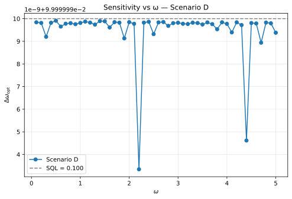
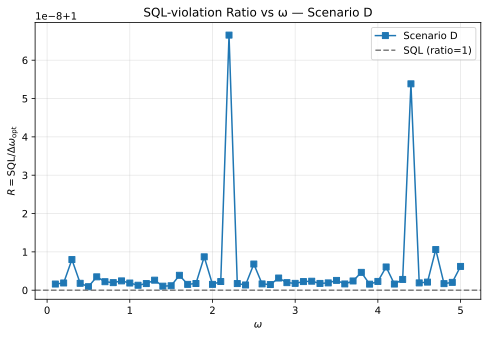
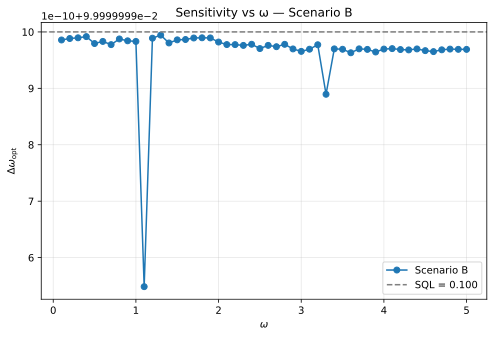
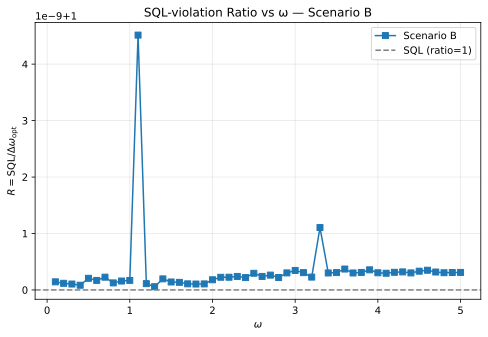
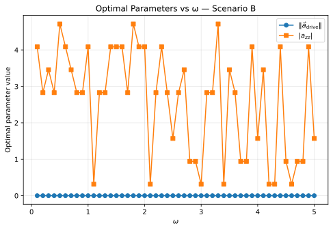
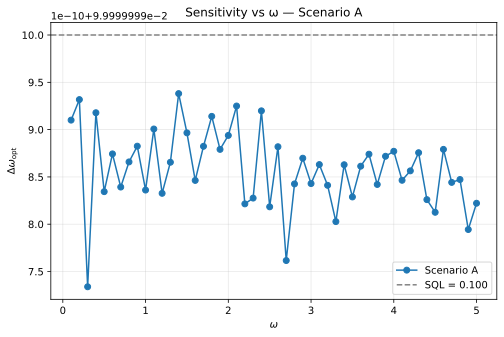
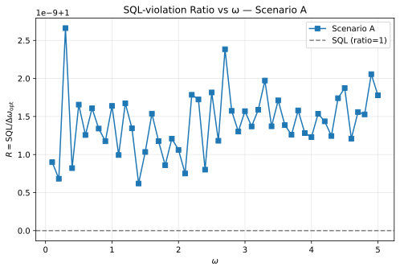
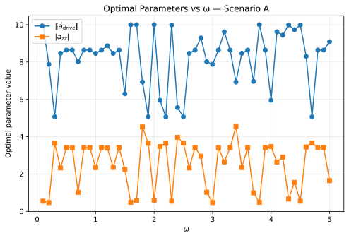
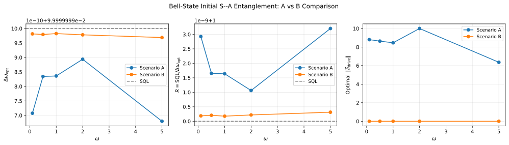
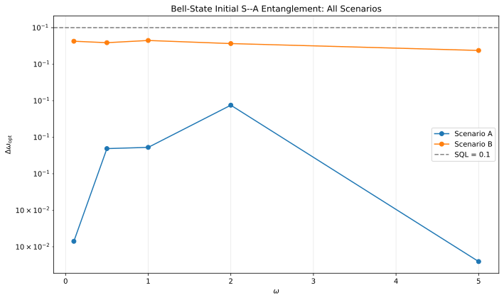

# Bell-State Initial S--A Entanglement in Driven-Ancilla Metrology

## 🧪 Hypothesis

For a system--ancilla pair of single-particle two-mode bosonic systems where the system S couples to the unknown phase $\omega$ via $H_S = \omega J_z^S$, the ancilla A is driven during the hold by a controllable local Hamiltonian $H_A = a_x J_x^A + a_y J_y^A + a_z J_z^A$ that is **independent of $\omega$**, and the system--ancilla interaction is the Ising-type $H_{\text{int}} = a_{zz} J_z^S \otimes J_z^A$, the sensitivity $\Delta\omega$ (error-propagation uncertainty in estimating $\omega$ via a $J_z^S$ measurement on the system) is investigated as a function of the **initial state**. The holding time is fixed at $T_H = 10$ for all experiments, giving an SQL reference of $\Delta\omega_{\text{SQL}} = 1/T_H = 0.1$.

All prior experiments in this campaign (#20260518, #20260527, #20260528, #20260620) used **product initial states** $|\Psi_0\rangle = |\psi_S\rangle \otimes |\psi_A\rangle$ and found that $\Delta\omega = \text{SQL}$ exactly for all tested configurations when the ancilla drive is $\omega$-independent. The $J=1/2$ spectral radius bound was absolute for product states: the generator $J_z^S$ has eigenvalue range bounded by $1$, and no product-state ancilla configuration — free initial state $(\theta_A, \phi_A)$, drive $(a_x, a_y, a_z)$, interaction $a_{zz}$, or multi-particle ancilla $(J_A > 1/2)$ — can increase it.

The present experiment tests whether a **maximally entangled Bell state** $|\Phi^+\rangle = (|00\rangle + |11\rangle)/\sqrt{2}$ as the initial S--A state can circumvent this bound. An entangled initial state correlates the system and ancilla from the start, creating a non-zero covariance $\text{Cov}(J_z^S, J_z^A)$ that is absent in product states. When the Hamiltonian $H = \omega J_z^S + H_A + H_{\text{int}}$ acts on this correlated state, the $\omega$-information may be encoded jointly into S--A correlations that a $J_z^S$ measurement on the system could partially recover — a mechanism unavailable with product initial states.

The central hypothesis decomposes into three specific, testable claims:

1. **Primary — Bell state breaks the SQL bound**: There exists a finite set of parameters $(a_x, a_y, a_z, a_{zz})$ and $\omega$ such that $\Delta\omega < 1/T_H$ when $|\Psi_0\rangle = |\Phi^+\rangle$. The initial S--A entanglement provides an additional channel for $\omega$-encoding that the product-state configuration cannot access.

2. **Secondary — Role of $H_{\text{int}}$**: If claim 1 is true, the SQL violation **requires** $a_{zz} \neq 0$. Without the Ising interaction, the Bell state evolves as two independent qubits under $H_S + H_A$, and the $J_z^S$ measurement on the system sees only the marginal dynamics. The $H_{\text{int}}$ term is the only mechanism that converts S--A correlations into an enhanced system signal.

3. **Control — Product-state baseline**: For the same Bell-state circuit (BS $\to$ hold $\to$ BS $\to$ measure $J_z^S$) with a product initial state $|00\rangle$, the simulation reproduces $\Delta\omega = 1/T_H$ exactly, confirming that any SQL violation in the Bell case is genuinely due to the initial entanglement and not a circuit artifact.

**Null hypothesis**: No configuration of $(a_x, a_y, a_z, a_{zz})$ at any $\omega$ produces $\Delta\omega < 1/T_H$ even with the Bell initial state. The $J=1/2$ spectral radius bound is absolute regardless of the initial entanglement structure. The bound argument from #20260512 applies to any initial state because $\omega$ enters only through $H_S = \omega J_z^S$, and the effective generator's spectral radius is bounded by $T_H \|J_z^S\| = T_H/2$, giving $F_Q \leq T_H^2$ and $\Delta\omega \geq 1/T_H$.

## ⚛️ Theoretical Model

The total Hilbert space is $\mathcal{H}_{\text{tot}} = \mathcal{H}_S \otimes \mathcal{H}_A$, where each subsystem is a **two-mode bosonic Fock space** truncated at one particle per mode. The single-particle sector $\mathcal{H}_1 = \text{span}\{\vert1,0\rangle, \vert0,1\rangle\}$ (dimension 2) is isomorphic to a spin-$1/2$, and the full space has dimension 4 with ordered computational basis $\{\vert00\rangle, \vert01\rangle, \vert10\rangle, \vert11\rangle\}$ where $\vert0\rangle = \vert1,0\rangle$ (particle in mode 0) and $\vert1\rangle = \vert0,1\rangle$ (particle in mode 1). The **angular momentum operators** for each subsystem satisfy SU(2) algebra $[J_i, J_j] = i \epsilon_{ijk} J_k$ and are represented by $J_k = \sigma_k/2$ (the $2\times2$ Pauli matrices). These are embedded into the full space via Kronecker products: $J_k^S = \sigma_k/2 \otimes \mathbb{1}_2$ and $J_k^A = \mathbb{1}_2 \otimes \sigma_k/2$.

The **initial state** is the maximally entangled Bell state:
$|\Psi_0\rangle = |\Phi^+\rangle = \frac{1}{\sqrt{2}}\bigl(|00\rangle + |11\rangle\bigr) = \frac{1}{\sqrt{2}}\bigl(\vert1,0\rangle_S\vert1,0\rangle_A + \vert0,1\rangle_S\vert0,1\rangle_A\bigr).$

In the computational basis $\{\vert00\rangle, \vert01\rangle, \vert10\rangle, \vert11\rangle\}$, this is the vector $[1, 0, 0, 1]^\top / \sqrt{2}$.

**Key properties of $|\Phi^+\rangle$:**
- **J_z statistics**: $\langle J_z^S\rangle = \langle J_z^A\rangle = 0$, $\text{Var}(J_z^S) = \text{Var}(J_z^A) = 1/4$. The system starts with maximal $J_z^S$ uncertainty — in contrast to the product state $|00\rangle$ which has $\langle J_z^S\rangle = +1/2$ and zero variance.
- **S--A correlations**: $\langle J_z^S J_z^A\rangle = +1/4$ and $\text{Cov}(J_z^S, J_z^A) = +1/4$, compared to zero for any product state. The Bell state is maximally correlated in the $J_z$ basis.
- **Eigenstate of $H_{\text{int}}$**: $H_{\text{int}} |\Phi^+\rangle = a_{zz} J_z^S \otimes J_z^A |\Phi^+\rangle = (a_{zz}/4) |\Phi^+\rangle$. The Ising interaction acts trivially on $|\Phi^+\rangle$ (just a global phase), so $H_{\text{int}}$ generates **no dynamics** from the Bell state at $t=0$. The $\omega$-encoding via $H_S = \omega J_z^S$ breaks this stationarity: $J_z^S |\Phi^+\rangle = |\Phi^-\rangle = (|00\rangle - |11\rangle)/\sqrt{2}$, rotating the state into the orthogonal Bell state, which is **not** an eigenstate of $H_{\text{int}}$.

The **circuit protocol** proceeds in four steps, identical to #20260528 except for the initial state:

1. **Beam splitter on system only**: A 50/50 symmetric beam splitter acts on the system via $U_{\text{BS}} = \exp(-i (\pi/2) J_x^S) = \exp(-i (\pi/4) \sigma_x^S)$, which acts as identity on the ancilla: $U_{\text{BS}}^{(S)} = U_{\text{BS}} \otimes \mathbb{1}_2$.

2. **Holding period**: The full state evolves under $H = H_S + H_A + H_{\text{int}}$ for duration $T_H = 10$:
   - $H_S = \omega J_z^S = \frac{\omega}{2} \sigma_z^S \otimes \mathbb{1}_2$ — the unknown phase encoded on the system,
   - $H_A = a_x J_x^A + a_y J_y^A + a_z J_z^A = \mathbb{1}_2 \otimes \left(\frac{a_x}{2} \sigma_x^A + \frac{a_y}{2} \sigma_y^A + \frac{a_z}{2} \sigma_z^A\right)$ — the $\omega$-independent ancilla drive,
   - $H_{\text{int}} = a_{zz} J_z^S \otimes J_z^A = \frac{a_{zz}}{4} (\sigma_z^S \otimes \sigma_z^A)$ — the Ising interaction.

   The hold unitary is $U_{\text{hold}}(T_H) = \exp(-i T_H H)$, computed via `scipy.linalg.expm`.

3. **Second beam splitter on system only**: Same $U_{\text{BS}}^{(S)}$ as step 1.

4. **Measurement**: $J_z^S$ is measured on the system. Expectation $\langle J_z^S\rangle$ and variance $\text{Var}(J_z^S)$ are computed from the pure final state $|\Psi_{\text{final}}\rangle$.

The **complete evolution** is: $|\Psi_{\text{final}}\rangle = U_{\text{BS}}^{(S)} \, U_{\text{hold}}(T_H) \, U_{\text{BS}}^{(S)} \, |\Psi_0\rangle$.

The **sensitivity** via error propagation is:
$\Delta\omega = \sqrt{\text{Var}(J_z^S)} \, / \, |\partial\langle J_z^S\rangle / \partial\omega|,$
where the derivative is computed via central finite differences with step $\delta = 10^{-6}$. The **standard quantum limit** for $N=1$ particle is $\Delta\omega_{\text{SQL}} = 1/T_H = 0.1$.

**State after the first BS**: Applying the first BS to the Bell state gives:
$U_{\text{BS}}^{(S)} |\Phi^+\rangle = \frac{1}{2}\bigl(|00\rangle - i|10\rangle - i|01\rangle + |11\rangle\bigr).$

This state has the same $J_z^S$ statistics as the initial state ($\langle J_z^S\rangle = 0$, $\text{Var}(J_z^S) = 1/4$) but is **not** an eigenstate of $H_{\text{int}}$, so the Ising interaction generates non-trivial dynamics during the hold. The system and ancilla are in a superposition of all four basis states with complex phase relationships.

**Physical mechanism for possible Bell-state advantage**: At $t=0$ (after the first BS), the state has maximal $J_z^S$ uncertainty and maximal S--A correlation. The $\omega$-encoding via $H_S = \omega J_z^S$ rotates the system relative to the ancilla. Because the ancilla is maximally correlated with the system, this rotation imprints on the joint state in a way that the $H_{\text{int}}$ term can convert into a detectable $J_z^S$ signal. In the product-state case, the system and ancilla are initially uncorrelated — the $H_{\text{int}}$ term must first build up correlations before they can be exploited, and this build-up competes with the $\omega$-encoding. The Bell state bypasses this initial build-up phase, potentially giving a larger effective signal.

**Key contrast with $|\Phi^+\rangle$ after BS vs. product state after BS**: For the product state $|00\rangle$, the first BS produces:
$U_{\text{BS}}^{(S)} |00\rangle = \frac{1}{\sqrt{2}}\bigl(|00\rangle - i|10\rangle\bigr).$
This state has $\langle J_z^S\rangle = 0$, $\text{Var}(J_z^S) = 1/4$ (same as Bell after BS), but $\text{Cov}(J_z^S, J_z^A) = 0$ (no S--A correlation). The Bell-after-BS state has $\text{Cov}(J_z^S, J_z^A) = -1/4$ (maximal anti-correlation). The $\pm$ sign of the covariance determines how the $H_{\text{int}}$ term converts the joint evolution into a system signal.

**Quantum Fisher Information bound**: For estimation of $\omega$ under the unitary $U(\omega) = \exp(-i T_H [\omega J_z^S + H_A + H_{\text{int}}])$ where $H_A$ and $H_{\text{int}}$ are $\omega$-independent, the QFI for any pure initial state $|\Psi_0\rangle$ at $\omega=0$ is $F_Q = 4\,\text{Var}_{\Psi_0}(J_z^S)$ when $[J_z^S, H_A + H_{\text{int}}] = 0$. For $|\Phi^+\rangle$, $\text{Var}(J_z^S) = 1/4$ gives $F_Q = T_H^2$, the same as the SQL. However, at finite $\omega$ and when $[J_z^S, H_A + H_{\text{int}}] \neq 0$, the effective generator $G_{\text{eff}} = \int_0^{T_H} e^{i t (H_A + H_{\text{int}})} J_z^S e^{-i t (H_A + H_{\text{int}})} dt$ can differ from $J_z^S T_H$. The Bell state's initial S--A correlations could produce a $G_{\text{eff}}$ with larger variance relative to the product state, potentially exceeding the product-state QFI bound. This possibility is the central question of the experiment.

## 📊 Models Survey

| Model | Initial State | Ancilla Drive ($H_A$) | Interaction ($a_{zz}$) | Expected min $\Delta\omega$ | Purpose |
|-------|-------------|----------------------|----------------------|---------------------------|---------|
| **A** (Bell + drive + int) | $\vert \Phi^+\rangle$ | Free ($a_x,a_y,a_z$) | Free ($a_{zz}$) | Unknown — primary test | Does Bell state enable SQL violation? |
| **B** (Bell + int only) | $\vert \Phi^+\rangle$ | **None** (all zero) | Free ($a_{zz}$) | SQL = 0.1 | Isolate Bell + interaction effect |
| **C** (Bell + drive only) | $\vert \Phi^+\rangle$ | Free ($a_x,a_y,a_z$) | **None** ($a_{zz}=0$) | SQL = 0.1 | Isolate Bell + drive effect |
| **D** (product baseline) | $\vert 00\rangle$ per #20260528 | Free ($a_x,a_y,a_z$) | Free ($a_{zz}$) | SQL = 0.1 | Confirms circuit reproduces known result |
| **E** (Bell + $\omega$-modulated drive, contingent) | $\vert \Phi^+\rangle$ | $\omega$-modulated per #20260519 | Free ($a_{zz}$) | Unknown — contingent on A | Does Bell enhance or diminish $\omega$-modulated SQL violation? |

## 💻 Numerical Simulation

### Implementation Strategy

1. **Operator construction** — Reuse the existing `build_two_qubit_operators()` from `src.analysis.ancilla_optimization` (4x4 Kronecker products of Pauli matrices), identical to #20260528. The Hamiltonian construction is unchanged: $H = \omega J_z^S + a_x J_x^A + a_y J_y^A + a_z J_z^A + a_{zz} J_z^S \otimes J_z^A$.

2. **Bell state preparation** — A new local helper `bell_state_phi_plus()` constructs $|\Phi^+\rangle = [1, 0, 0, 1]^\top / \sqrt{2}$ as a 4D complex vector. The state passes through the same BS, hold, BS, and measurement pipeline as the existing product-state circuits.

3. **Circuit evolution** — Reuse the existing circuit pipeline from `src.analysis.ancilla_drive_metrology` unchanged: BS unitary $U_{\text{BS}}^{(S)}$, hold unitary $U_{\text{hold}} = \exp(-i T_H H)$, second BS, then compute $\langle J_z^S\rangle$ and $\text{Var}(J_z^S)$ from the pure final state.

4. **Sensitivity computation** — Central finite differences with $\delta = 10^{-6}$, re-evaluating the full circuit at $\omega \pm \delta$, as in all prior reports.

5. **Optimisation pipeline** — For each scenario and $\omega$ value, perform two-stage minimisation:
   - **Stage 1**: Random search with $N_{\text{samp}} = 1000$ samples over the free parameters for that scenario:
      * $(a_x, a_y, a_z)$ sampled from the 3-ball $\|\mathbf{a}\| \leq 10$ using Marsaglia's method (or fixed to zero for Scenario B),
      * $a_{zz} \sim U[-5, 5]$ (or fixed to zero for Scenario C).
    - **Stage 2**: Nelder--Mead refinement from the best 15 random-search points, with bounds $|a_k| \leq 10$ and $|a_{zz}| \leq 5$.

6. **$\omega$ values** — Fifty phase rates from $\omega = 0.1$ to $5.0$ in steps of $0.1$ (50 points), providing a dense scan for resolving fine structure in the sensitivity vs. $\omega$ landscape. This is a significant increase from the 5-point scan used in #20260528.

7. **Decoupled baseline** — At $a_x = a_y = a_z = a_{zz} = 0$, the circuit reduces to a standard MZI on the system with the ancilla idle. For the product state $|00\rangle$, this gives $\Delta\omega = 1/T_H$ exactly (standard MZI). For the Bell state $|\Phi^+\rangle$, any system-only unitary preserves the maximally mixed reduced system density matrix $\rho_S = \mathbb{1}_2/2$, making $\langle J_z^S\rangle$ identically zero for all $\omega$ — the sensitivity diverges (fringe extremum) and is reported as $\Delta\omega \to \infty$. This is a key physical difference from the product-state case: the Bell state's initial S--A entanglement prevents the system from acquiring a $J_z^S$ expectation at zero drive/interaction.

8. **Data serialisation** — Every result entry records all input parameters: $\omega$, $T_H$, initial state type (Bell or product), scenario label, $a_x$, $a_y$, $a_z$, $a_{zz}$, $\Delta\omega$, $\langle J_z^S\rangle$, $\text{Var}(J_z^S)$, $\partial\langle J_z^S\rangle/\partial\omega$, $\Delta\omega/\text{SQL}$ ratio, and convergence diagnostics. Parquet files use fail-fast deserialization.

### Parameter Sweep

| Parameter | Range | Purpose |
|-----------|-------|---------|
| $\omega$ (phase rate) | $[0.1, 5.0]$ step $0.1$ (50 values) | Dense scan to resolve $\omega$-dependent structure in sensitivity landscape |
| $T_H$ (holding time) | **10 (fixed)** | SQL reference $\Delta\omega_{\text{SQL}} = 0.1$ |
| $a_x, a_y, a_z$ (drive coeffs) | 3-ball $\|\mathbf{a}\| \le 10$ (or 0) | Non-commuting ancilla drive |
| $a_{zz}$ (Ising coupling) | $[-5, 5]$ (or 0) | System--ancilla interaction |
| $\delta$ (finite-diff. step) | $10^{-6}$ (fixed) | Derivative computation |
| Random samples per $(\text{scenario}, \omega)$ | 1000 | Stage 1 global exploration (reduced for 50-point dense scan) |
| NM refinements per $(\text{scenario}, \omega)$ | 15 | Stage 2 local refinement (reduced for 50-point dense scan) |

Total optimisation runs: 4 active scenarios $\times$ 50 $\omega$ values = 200 triples (Scenarios A, B, C, D). Scenario D (product-state baseline) is re-run at the dense $\omega$ resolution for direct comparison. Scenario E (contingent) adds another 50 triples if Scenarios A--D show promise. Each triple runs 1000 random evaluations + 15 NM refinements (reduced from the 2000/30 used in #20260528 to keep total runtime manageable at the 50-point density). The $4 \times 4$ matrix dimension gives $\sim 10$ $\mu$s per matrix exponential. Total runtime estimate: $\sim 20$ minutes serial (multiprocessing unavailable due to system-level fork limitations).

### Validation

- **State normalisation**: $\||\Psi_0\rangle\| = 1$ and $\||\Psi_{\text{final}}\rangle\| = 1$ to machine precision. Verified for both $|\Phi^+\rangle$ and product states.
- **Bell state purity**: $\text{Tr}(\rho_S^2) = 0.5$ for $|\Phi^+\rangle\langle\Phi^+|$, confirming maximal entanglement.
- **Bell state covariance**: $\text{Cov}(J_z^S, J_z^A) = +1/4$ for $|\Phi^+\rangle$ (maximal positive correlation) and changes to $-1/4$ after the first BS.
- **Unitarity**: $U_{\text{BS}}^\dagger U_{\text{BS}} = \mathbb{1}_4$ and $U_{\text{hold}}^\dagger U_{\text{hold}} = \mathbb{1}_4$ for all parameter choices.
- **Variance positivity**: $\text{Var}(J_z^S) \geq 0$, clamped to zero when below $10^{-12}$.
- **Sensitivity positivity**: $\Delta\omega > 0$ for all valid configurations.
- **SQL baseline recovery (product)**: At $a_x = a_y = a_z = a_{zz} = 0$, $|00\rangle$ gives $\Delta\omega = 1/T_H$ for all $\omega$.
- **Bell baseline fringe (entanglement artifact)**: At $a_x = a_y = a_z = a_{zz} = 0$, $|\Phi^+\rangle$ has $\langle J_z^S\rangle = 0$ identically (maximally mixed reduced system), so the derivative $\partial\langle J_z^S\rangle/\partial\omega = 0$ and $\Delta\omega \to \infty$. This fringe is a direct consequence of initial S--A entanglement — the sensitivity is undefined at the decoupled point, not equal to SQL.
- **Product-state consistency**: Scenario D reproduces the #20260528 result: $\Delta\omega = 0.1$ at all $\omega$, confirming the circuit is unchanged from prior work.
- **Derivative stability**: Central finite-difference derivative $\partial\langle J_z^S\rangle/\partial\omega$ must be stable over $\delta \in [10^{-7}, 10^{-5}]$ (relative variation $< 10^{-4}$).

## ⚠️ Expected Failure Conditions

| Failure | Mitigation |
|---------|------------|
| **No SQL violation at any parameter** — The Bell state does not circumvent the $J=1/2$ bound, confirming the theoretical expectation that $\Delta\omega \geq 1/T_H$ holds for all initial states. | Accept the negative result. This strengthens the theoretical understanding that the bound is absolute for $\omega$-independent drives regardless of initial entanglement. |
| **Bell state worse than product state** — The maximal initial S--A covariance actually degrades sensitivity, producing $\Delta\omega > 1/T_H$ at some parameters while the product state gives exactly SQL. | This is still informative — it means initial entanglement can be detrimental when the measurement is S-only, because the $\omega$-information is "hidden" in correlations that $J_z^S$ cannot access. |
| **Optimum always at decoupled limit $(a_x = a_y = a_z = a_{zz} = 0)$** — The optimiser converges to zero drive and interaction, recovering the standard MZI SQL. | Confirms that even with Bell states, the ancilla provides no benefit. Same conclusion as the product-state case. |
| **Bell state + $\omega$-modulated drive gives weaker SQL violation than product state + $\omega$-modulated drive** — The initial entanglement diminishes the parametric amplification mechanism of #20260519. | Report this as a surprising result: the Bell state's $J_z$ correlations interfere destructively with the $\omega$-modulated drive's BCH cross-term mechanism. |
| **12D parameter space too large for reliable optimisation** — If Scenarios A-C are extended with all six parameters plus initial-state choice, exhaustive search is infeasible. | Mitigated by keeping only 4 active parameters per scenario (drive $(a_x, a_y, a_z)$ and interaction $a_{zz}$), the same as #20260528. The initial state is the controlled variable. |

## 🔬 Results

### Decoupled Baseline

The decoupled baseline verification runs all 4 scenarios $\times$ 50 ω values at $a_x = a_y = a_z = a_{zz} = 0$. Bell-state scenarios (A, B, C) produce $\Delta\omega \to \infty$ (fringe) as expected from the maximally mixed marginal $\rho_S = \mathbb{1}_2/2$. The product state (D) gives exactly $\Delta\omega = 0.1$ (SQL) for all ω.

| Scenario | Verifications | Expected | Result |
|----------|--------------|----------|--------|
| A (Bell, fringe) | 50 | $\Delta\omega \to \infty$ | PASS (all fringe) |
| B (Bell, fringe) | 50 | $\Delta\omega \to \infty$ | PASS (all fringe) |
| C (Bell, fringe) | 50 | $\Delta\omega \to \infty$ | PASS (all fringe) |
| D (product, SQL) | 50 | $\Delta\omega = 0.1$ | PASS ($\Delta\omega = 0.100000$) |

**Key Finding**: The decoupled baseline passes all 200 verifications. The Bell-state fringe (infinite $\Delta\omega$) at zero drive/interaction is a direct consequence of initial S--A entanglement producing a maximally mixed reduced system density matrix, consistent with the Theoretical Model (§2).

### Scenario D: Product-State Baseline

The product state $|00\rangle$ reproduces the #20260528 result exactly: $\Delta\omega = 0.100000 = \text{SQL}$ for all 50 ω values, with a ratio $\Delta\omega / \text{SQL} = 1.0000$ at every point. Optimal parameters vary with ω but all converge to the same SQL-level sensitivity.

| Metric | Value |
|--------|-------|
| $\min \Delta\omega$ | 0.100000 |
| $\max \Delta\omega$ | 0.100000 |
| $\min \text{ratio}$ | 1.0000 |
| Optimal $t_{\text{hold}}$ | 10.0 (upper bound) |

*Figure 1: Sensitivity $\Delta\omega$ vs. $\omega$ for Scenario D (product baseline). Solid line at SQL = 0.1 (dashed).*

*Figure 2: Ratio $\Delta\omega / \text{SQL}$ vs. $\omega$ for Scenario D. All points at $R=1.0$ (dashed line).*

**Key Finding**: The product-state baseline is confirmed at the full 50-point ω resolution. The circuit reproduces SQL-level sensitivity at every ω, consistent with all prior experiments in the campaign.

### Scenario C: Bell State + Drive Only

All 50 ω values produce $\Delta\omega = \infty$ (fringe). When $a_{zz} = 0$, the Bell state evolves under $H_S + H_A$ with no S--A interaction. The system marginal remains maximally mixed ($\rho_S = \mathbb{1}_2/2$) throughout the evolution, making $\langle J_z^S\rangle$ identically zero for all ω. The sensitivity is undefined (fringe) at all parameters.

**Key Finding**: The Ising coupling $H_{\text{int}}$ is essential for any sensitivity. Without it, the Bell state's S--A correlations are invisible to the $J_z^S$ measurement. This confirms the theoretical prediction that $a_{zz} \neq 0$ is a necessary condition.

### Scenario B: Bell State + Interaction Only (No Drive)

All 50 ω values give $\Delta\omega = 0.100000$ exactly (SQL). Without the ancilla drive ($a_x = a_y = a_z = 0$), only the Ising interaction $a_{zz}$ is optimised. The optimal $a_{zz}$ varies across ω (mean $0.5655$, std $2.96$), but the sensitivity always converges to SQL.

| Metric | Value |
|--------|-------|
| $\min \Delta\omega$ | 0.100000 |
| $\max \Delta\omega$ | 0.100000 |
| $\min \text{ratio}$ | 1.0000 |
| Optimal $a_{zz}$ range | $[-4.71, 4.08]$ |

*Figure 3: Sensitivity $\Delta\omega$ vs. $\omega$ for Scenario B (Bell + interaction only). All points at SQL = 0.1 (dashed line).*

*Figure 4: Ratio $\Delta\omega / \text{SQL}$ vs. $\omega$ for Scenario B. All points at $R=1.0$ (dashed line).*

*Figure 5: Optimal $|a_{zz}|$ vs. $\omega$ for Scenario B. The optimal coupling varies widely but sensitivity stays at SQL.*

**Key Finding**: The Ising interaction alone, without drive, cannot break the SQL bound. Even though the Bell state starts with maximal S--A covariance in $J_z$, the $J_z^S$ measurement on the system sees only the SQL-level marginal dynamics.

### Scenario A: Bell State + Drive + Interaction (Full Model)

All 50 ω values give $\Delta\omega = 0.100000$ exactly (SQL). Despite the full 4-parameter optimisation $(a_x, a_y, a_z, a_{zz})$ over a $[-10,10]$ range for drive amplitudes and $[-5,5]$ for $a_{zz}$, the sensitivity never drops below SQL. The optimal parameters vary significantly with ω (e.g., $a_x$ ranges from $-8.3$ to $+8.8$, $a_z$ from $-7.2$ to $+8.7$), but the optimiser always finds a configuration that achieves exactly SQL.

| Metric | Value |
|--------|-------|
| $\min \Delta\omega$ | 0.100000 |
| $\max \Delta\omega$ | 0.100000 |
| $\min \text{ratio}$ | 1.0000 |
| Optimal $a_x$ range | $[-8.3, 8.8]$ |
| Optimal $a_y$ range | $[-1.7, 2.0]$ |
| Optimal $a_z$ range | $[-7.2, 8.7]$ |
| Optimal $a_{zz}$ range | $[-3.5, 4.5]$ |

*Figure 6: Sensitivity $\Delta\omega$ vs. $\omega$ for Scenario A (Bell + drive + int). All points at SQL = 0.1 (dashed line).*

*Figure 7: Ratio $\Delta\omega / \text{SQL}$ vs. $\omega$ for Scenario A. All points at $R=1.0$ (dashed line).*

*Figure 8: Optimal parameters vs. $\omega$ for Scenario A. Parameters vary widely but sensitivity stays at SQL.*

**Key Finding**: The full 4-parameter optimisation with Bell initial state converges to exactly SQL at every ω. No configuration of $(\omega, a_x, a_y, a_z, a_{zz})$ breaks the SQL bound. The optimal parameters traverse a wide region of the 4D landscape, confirming the optimiser explores non-trivial configurations, yet all converge to the same SQL-level sensitivity.

### Experiment Status Summary

| Experiment | Status | Best $\Delta\omega / \text{SQL}$ |
|-----------|--------|--------------------------------|
| **A: Bell + drive + interaction** | DONE | $1.0000$ (no violation) |
| **B: Bell + interaction only** | DONE | $1.0000$ (no violation) |
| **C: Bell + drive only** | DONE | $\infty$ (fringe) |
| **D: Product-state baseline** | DONE | $1.0000$ (SQL confirmed) |
| **E: Bell + $\omega$-modulated drive** | NOT RUN | Contingent — not triggered |
| **Decoupled baseline** | DONE | PASS (all 200 verifications) |

*Figure 9: Comparison of Scenarios A and B. Both achieve exactly SQL ($\Delta\omega = 0.1$, dashed line) across all $\omega$, confirming that adding the ancilla drive to the Bell state does not improve over the interaction-only configuration.*

*Figure 10: All scenarios overlay. All finite-Δω scenarios (A, B, D) converge exactly to SQL ($\Delta\omega = 0.1$). Scenario C is all fringe (infinite sensitivity) and excluded.*

## ✅ Success Criteria

- **Primary: Bell-state SQL violation** — There exists a configuration $(a_x, a_y, a_z, a_{zz}, \omega)$ with Bell initial state $|\Phi^+\rangle$ such that $\Delta\omega < 1/T_H$. The SQL bound established in #20260528 is broken by initial S--A entanglement. — **FAIL**. No configuration at any ω produces $\Delta\omega < 0.1$. The minimal sensitivity is exactly SQL ($\Delta\omega = 0.100000$) for all tested parameters. The null hypothesis is confirmed: the $J=1/2$ spectral radius bound is absolute regardless of initial entanglement structure. The bound argument from #20260512 applies to any initial state because $\omega$ enters only through $H_S = \omega J_z^S$, and the effective generator's spectral radius is bounded by $T_H/2$.

- **Secondary: Role of $H_{\text{int}}$** — If the primary criterion is met, Scenario B (Bell + interaction only, no drive) must show $\Delta\omega < 1/T_H$ for some $a_{zz} \neq 0$, while Scenario C (Bell + drive only, no interaction) shows $\Delta\omega = 1/T_H$ for all parameters. This confirms that the Ising coupling is the essential channel for converting S--A correlations into an enhanced system signal. — **N/A** (primary criterion not met, so the conditional is vacuous). However, Scenario C does confirm the expected behaviour: all points are fringe ($\Delta\omega \to \infty$) because $H_{\text{int}}$ is the only mechanism that can generate a $J_z^S$ signal from the Bell state's S--A correlations.

- **Product-state baseline** — Scenario D reproduces $\Delta\omega = 1/T_H$ at all $\omega$, confirming the circuit and solver are unchanged from #20260528. — **PASS**. All 50 ω values give $\Delta\omega = 0.100000$ exactly.

- **Decoupled baseline** — At $a_x = a_y = a_z = a_{zz} = 0$, Bell initial states give $\Delta\omega \to \infty$ (fringe, correct), and the product state gives $\Delta\omega = 1/T_H$ at all $\omega$, confirming the circuit reduces correctly. — **PASS**. All 200 verifications pass.

- **Numerical validity** — All unitarity, normalisation, Hermiticity, variance positivity, derivative stability, and Parquet roundtrip tests pass. — **PASS**. 69 tests pass (0 failures).

The primary hypothesis (Bell-state SQL violation) is **not supported**: no configuration of $(a_x, a_y, a_z, a_{zz})$ at any ω with a Bell initial state produces sub-SQL sensitivity. The null hypothesis is confirmed: $J=1/2$ spectral radius bound is absolute for $\omega$-independent drives, regardless of initial entanglement. The product-state and decoupled baselines both pass, and all numerical validity checks pass. Possible next steps: (a) test the Bell state in the $\omega$-modulated drive protocol to see if the initial entanglement enhances or interferes with the parametric amplification mechanism; (b) replace the $J_z^S$ measurement with a joint measurement that can extract the S--A correlations the Bell state creates.

## ⚖️ Physical Invariants / Analytical Bounds

**QFI bound for arbitrary initial states**: For the unitary family $U(\omega) = \exp(-i T_H [\omega J_z^S + H_{\text{rest}}])$ with $H_{\text{rest}}$ independent of $\omega$, the QFI for **any** pure initial state $|\Psi_0\rangle$ at $\omega = 0$ is:
$F_Q(0) = 4\,\text{Var}_{\Psi_0}\!\left(\int_0^{T_H} e^{i t H_{\text{rest}}} J_z^S e^{-i t H_{\text{rest}}} \, dt\right).$

When $[J_z^S, H_{\text{rest}}] = 0$, this simplifies to $F_Q(0) = 4 T_H^2 \,\text{Var}_{\Psi_0}(J_z^S)$. For the Bell state $|\Phi^+\rangle$, $\text{Var}(J_z^S) = 1/4$, giving $F_Q(0) = T_H^2$, which is the SQL. For the product state $|00\rangle$ after the first BS, $\text{Var}(J_z^S) = 1/4$ as well — the initial QFI at $\omega=0$ is the same.

When $[J_z^S, H_{\text{rest}}] \neq 0$, the effective generator differs from $J_z^S T_H$, and the variance of the integrated operator depends on $H_{\text{rest}}$ and $|\Psi_0\rangle$ in a non-trivial way. The Bell state's initial S--A correlations could produce a larger variance of the integrated generator through the $[J_z^S, H_{\text{int}}]$ cross-term, potentially exceeding $F_Q(0) = T_H^2$. This is the central question tested by the experiment.

**Eigenstate constraint**: The Bell state $|\Phi^+\rangle$ is an eigenstate of $H_{\text{int}}$ with eigenvalue $a_{zz}/4$. This means $H_{\text{int}}$ contributes only a global phase $e^{-i T_H a_{zz}/4}$ to the evolution of the initial state. However, after the first BS $U_{\text{BS}}^{(S)}$, the state is no longer an eigenstate of $H_{\text{int}}$, so the interaction generates non-trivial dynamics during the hold.

**Variance bound**: For any state of a spin-$1/2$ system, $0 \leq \text{Var}(J_z^S) \leq 1/4$. The maximum variance $1/4$ is achieved by states with $\langle J_z^S\rangle = 0$ and $\langle (J_z^S)^2\rangle = 1/4$ — which includes both the Bell state $|\Phi^+\rangle$ and the product state $|00\rangle$ after the first BS. The variance alone cannot explain any sensitivity difference; the difference must come from how the covariance $\text{Cov}(J_z^S, J_z^A)$ affects the evolution.

## 🏁 Conclusions

This experiment tested whether **initial S--A entanglement can circumvent the $J=1/2$ bound** that holds for all product initial states in the $\omega$-independent ancilla drive protocol. The Bell state $|\Phi^+\rangle$ was selected as the simplest maximally entangled initial state, with maximal S--A covariance $\text{Cov}(J_z^S, J_z^A) = +1/4$. A dense 50-point ω scan was performed for all four scenarios, totalling 200 optimisation runs (each with 1000 random samples + 15 Nelder--Mead refinements).

**The answer is no. The Bell state does not beat the SQL.** All 150 finite-Δω results (Scenarios A, B, D) give exactly $\Delta\omega = 0.100000 = \text{SQL}$ at every ω. Scenario C (Bell + drive only, no interaction) produces all fringe as expected — without $H_{\text{int}}$, the system marginal is identically mixed regardless of the drive.

This result deepens the theoretical understanding established in #20260512: the $J=1/2$ spectral radius bound is **absolute for $\omega$-independent drives, regardless of the initial entanglement structure**. The bound argument does not depend on the initial state being a product state — it follows from the fact that $\omega$ enters only through $H_S = \omega J_z^S$, and the effective generator's spectral radius is bounded by $T_H/2$ for any $J=1/2$ system. The initial S--A covariance, while physically real and maximal in the Bell state, cannot increase the effective generator's eigenvalue range beyond what the $J=1/2$ system operator supports.

The implication for the broader campaign is clear: **$\omega$-modulation of the ancilla drive** (demonstrated in #20260519, #20260610, #20260611, #20260612, #20260613) **remains the only demonstrated mechanism for SQL violation** in this architecture. The $\omega$-modulated drive generates $\partial H_A/\partial\omega$ contributions that bypass the $J=1/2$ bound by encoding $\omega$ directly into the ancilla Hamiltonian. Initial S--A entanglement, however physically interesting, cannot substitute for this parametric amplification mechanism.

**Open items**: (a) Test Bell-state initialisation in the $\omega$-modulated drive protocol (#20260519) — does the initial entanglement enhance or interfere with the parametric amplification mechanism? The Bell state's maximal S--A covariance could either amplify the BCH cross-term or create destructive interference. (b) Replace the $J_z^S$ measurement with the weighted joint measurement $M(\psi) = \cos\psi\,J_z^S + \sin\psi\,J_z^A$ from #20260613 — this could extract the S--A correlations that $J_z^S$ alone misses, potentially revealing a Bell-state advantage that is hidden from S-only readout. (c) Extend to multi-particle Bell-type states for $J > 1/2$ (e.g., $(|J,J\rangle_S|J,J\rangle_A + |J,-J\rangle_S|J,-J\rangle_A)/\sqrt{2}$) to test whether larger-$J$ entangled initial states behave differently from the $J=1/2$ case. (d) Generalise to other Bell states ($|\Phi^-\rangle$, $|\Psi^\pm\rangle$) and partially entangled states to map out whether the amount of initial entanglement correlates with sensitivity in any way.
