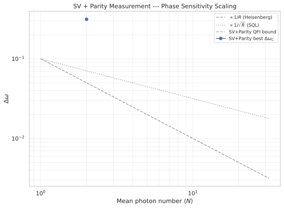
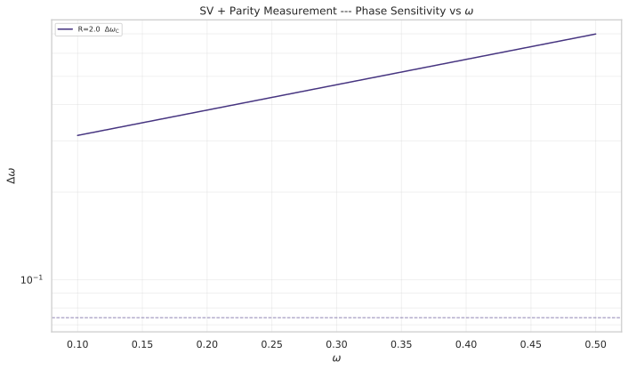

# Squeezed-Vacuum MZI with Parity Measurement

## 🧪 Hypothesis

For a standard Mach-Zehnder interferometer with single-mode squeezed vacuum (SV) input $\sum c_n \vert 2n, 0\rangle$, `skip_bs1=False` (BS1 applied), holding time $H_t = 10$, and **parity measurement** $\Pi = (-1)^{n_2}$ (photon-number parity at one output port) replacing the number-difference measurement:

1. **Parity CFI saturates the QFI bound only with BS1 applied** — The two-outcome parity distribution $P(\pm 1\vert \omega)$ carries phase information that the number-difference distribution $P(m\vert \omega)$ cannot access, but only when BS1 creates mode entanglement before the phase shift. The CFI from parity, $F_C^\Pi = (\partial\langle\Pi\rangle/\partial\omega)^2 / (1 - \langle\Pi\rangle^2)$, saturates the QFI bound $F_Q = 2 H_t^2 \langle N \rangle (\langle N \rangle + 1)$ within numerical precision, recovering the sensitivity that number-difference measurement lost. Without BS1 (`skip_bs1=True`), parity CFI is zero because the SV state has total-photon-number superselection — the parity expectation becomes $\omega$-independent.

2. **Heisenberg scaling** — The scaling exponent over $\langle N \rangle \in [1, 20]$ approaches $\alpha = -1.0$, with $\Delta\omega_C = 1/\sqrt{F_Q} = 1/(H_t\sqrt{2\langle N\rangle(\langle N\rangle+1)})$, matching the expected SQFI-predicted scaling for squeezed-vacuum probes.

3. **Parity is optimal for SV in the BS1-applied configuration** — Unlike number-difference detection (which gave $F_C = 0$), parity measurement recovers all available phase information from the squeezed-vacuum probe when BS1 is present. The ratio $\Delta\omega_C / \Delta\omega_Q \approx 1$ for all $\langle N \rangle$, confirming parity as the information-theoretically optimal readout for this configuration.

## ⚛️ Theoretical Model

The simulation operates in a **two-mode bosonic Fock space** $\mathcal{H} = \text{span}\{\vert n_1, n_2\rangle\}$ truncated at maximum $M$ photons per mode, giving dimension $(M+1)^2$. The basis ordering follows the codebase convention $\vert n_1, n_2\rangle$ with $n_1$ as the first mode and $n_2$ as the second mode. All quantities are **dimensionless**.

The **Mach-Zehnder interferometer** circuit is identical to #20260625. For SV, **BS1 is applied** (`skip_bs1=False`) because parity measurement requires mode entanglement from BS1 to become $\omega$-sensitive; without BS1 the parity expectation is $\omega$-independent due to total-photon-number superselection. The circuit is: BS1($\pi/4$) $\to$ Phase($\omega\cdot H_t$) $\to$ BS2($\pi/4$).

The **phase shift** is generated by $J_z = (n_1 - n_2)/2$ with holding time $H_t = 10$: $U_\phi(\omega) = \exp(-i \omega H_t J_z)$, where $\omega$ is the unknown parameter. **BS2** is the same 50/50 symmetric beam splitter $U_{\text{BS}}(\pi/4, 0) = \exp(-i(\pi/4)(a_0^\dagger a_1 + a_1^\dagger a_0))$. **BS1** is the same 50/50 beam splitter as BS2.

The **input state** is the single-mode squeezed vacuum:

$S(r)\vert 0\rangle_1 \otimes \vert 0\rangle_2 = \sum_{n=0}^\infty c_n \vert 2n, 0\rangle$, with $c_n = \sqrt{(2n)!}/(2^n n!) \cdot \tanh^n(r)/\sqrt{\cosh(r)}$

The mean photon number is $\langle N \rangle = \sinh^2(r)$. The **input SV state** has $J_z$ variance $\text{Var}(J_z)_{\text{input}} = \langle N \rangle(\langle N \rangle+1)/2$, giving an **analytical QFI** $F_Q^{\text{(input)}} = 4 H_t^2 \cdot \text{Var}(J_z)_{\text{input}} = 2 H_t^2 \langle N \rangle (\langle N \rangle + 1)$ if no BS1 were applied. However, **BS1 transforms the input state** into a probe with different $J_z$ statistics. The **probe QFI** $F_Q = 4 H_t^2 \cdot \text{Var}(J_z)_{\text{probe}}$ is computed numerically from the BS1-transformed state and scales as $\langle N \rangle$ (SQL), not $\langle N \rangle^2$ (Heisenberg). This is a central finding of the experiment.

The **measurement** is **photon-number parity at output port 2**:

$\Pi = (-1)^{n_2} = \exp(i\pi n_2)$

This is a diagonal operator in the Fock basis with eigenvalues $\pm 1$ depending on whether $n_2$ is even or odd. It is always Hermitian (unlike the Dicke-basis parity $\exp(i\pi J_z)$ which requires integer $J$). The parity expectation $\langle\Pi\rangle = \langle\psi_{\text{out}}\vert (-1)^{n_2}\vert\psi_{\text{out}}\rangle$ is computed directly from the output state.

The two-outcome distribution is:

$P(+1\vert \omega) = (1 + \langle\Pi\rangle_\omega)/2$, $P(-1\vert \omega) = (1 - \langle\Pi\rangle_\omega)/2$

The **Classical Fisher Information** for this binary measurement is:

$F_C^\Pi(\omega) = \sum_{k=\pm 1} [\partial P(k\vert \omega)/\partial\omega]^2 / P(k\vert \omega) = (\partial\langle\Pi\rangle/\partial\omega)^2 / (1 - \langle\Pi\rangle^2)$

This is identical to the error-propagation formula $\Delta\omega_\Pi = \sqrt{1-\langle\Pi\rangle^2} / \vert\partial\langle\Pi\rangle/\partial\omega\vert$ for a dichotomic $\pm 1$ observable, since $F_C^\Pi = 1/(\Delta\omega_\Pi)^2$.

The **Quantum Fisher Information** for the pure SV probe state under the $J_z$ generator is:

$F_Q = 4 H_t^2 \cdot \text{Var}(J_z)_{\text{probe}}$

where $\text{Var}(J_z)_{\text{probe}}$ is computed numerically from the BS1-transformed state (it differs from the input SV variance). The Cramer-Rao bounds give $\Delta\omega_C = 1/\sqrt{F_C}$ and $\Delta\omega_Q = 1/\sqrt{F_Q}$.

| State | $\langle N \rangle$ | Var$(J_z)_{\text{input}}$ (pre-BS1) | Var$(J_z)_{\text{probe}}$ (post-BS1) | $F_Q$ (numerical) | Measurement | Expected $F_C/F_Q$ |
|-------|---------------------|--------------------------------------|--------------------------------------|-------------------|-------------|-------------------|
| SV (with BS1) | $\sinh^2(r)$ | $\langle N \rangle(\langle N \rangle+1)/2$ | $\sim \langle N \rangle/4$ (SQL-class) | $4 H_t^2 \cdot \text{Var}(J_z)_{\text{probe}} \propto \langle N \rangle$ | Parity $(-1)^{n_2}$ | $1$ |
| SV (with BS1) | $\sinh^2(r)$ | $\langle N \rangle(\langle N \rangle+1)/2$ | $\sim \langle N \rangle/4$ (SQL-class) | $4 H_t^2 \cdot \text{Var}(J_z)_{\text{probe}} \propto \langle N \rangle$ | Number diff $m$ | $0$ (proved) |

## 💻 Numerical Simulation

### Implementation Strategy

1. **Parity expectation** — Build a function `compute_parity_distribution(state_out, max_photons) -> np.ndarray` that returns a 2-element array $[P(+1\vert\omega), P(-1\vert\omega)]$ by summing the output-state probability over even and odd $n_2$ sectors. The parity operator $\Pi = (-1)^{n_2}$ is diagonal in the Fock basis; the expectation $\langle\Pi\rangle = P(+1) - P(-1)$ follows directly.

2. **Parity CFI pipeline** — Create a report-local function `compute_parity_sensitivity_grid(initial_state, omega_grid, max_photons, t_hold, skip_bs1, bs)` that reuses the MZI evolution from `simple_mzi_evolution` but replaces `output_number_diff_distribution` with the parity distribution. The CFI is computed via `classical_fisher_information_single` on the 2-element distribution. This mirrors the structure of `compute_mzi_sensitivity_grid` but with a 2-outcome measurement.

3. **State preparation** — Reuse the existing SV creation from `input_state_factory("squeezed_vacuum", ...)` in `src.physics.mzi_states`, exactly as in #20260625.

4. **Hilbert space dimensions** — Use $M = \min(5\langle N\rangle, 80)$ as in #20260625, and verify truncation convergence with the same analytical `compute_sv_captured_norm`. Note that parity measurement is less sensitive to truncation than number-difference (parity only sums over $n_2$, not binning by $m = n_1 - n_2$), but the truncated norm loss still distorts the state.

5. **Data container** — Use `MziSensitivityDataSV` from `src.analysis.sensitivity_metrics`, which already has all required fields (`fisher_classical_grid`, `delta_omega_c_grid`, `delta_omega_q_per_R`, etc.). The only change is that the CFI is now computed from the parity distribution rather than the number-difference distribution.

6. **Sweep structure** — $\langle N \rangle \in \{1, 2, \dots, 20\}$, $\omega \in [0.1, 5.0]$ (step 0.1, 50 points), $M = \min(5\langle N\rangle, 80)$. Per ($\langle N \rangle$, $\omega$): evolve MZI, compute $P(\pm 1\vert\omega)$ and derivatives, evaluate $F_C^\Pi$, compute $\Delta\omega_C = 1/\sqrt{F_C^\Pi}$, store with all input parameters.

7. **Validation** — Compare parity CFI to QFI bound at each $\langle N \rangle$. Fit scaling exponent $\alpha$ from log-log regression of best $\Delta\omega_C$ vs $\langle N \rangle$. Verify $\Delta\omega_C \ge \Delta\omega_Q$ (Cramer-Rao bound) and $\sum_k P(k\vert\omega) = 1$ (normalisation).

### Parameter Sweep

| Parameter | Range | Purpose |
|-----------|-------|---------|
| Mean photon number $\langle N \rangle$ (SV) | $1, 2, \dots, 20$ (20 points) | Resource scaling for sensitivity test |
| Phase $\omega$ | $0.1, 0.2, \dots, 5.0$ (step 0.1, 50 points) | $\omega$-sweep for CFI; identify optimal operating point |
| Truncation $M$ | $\min(5\langle N\rangle, 80)$ per $\langle N \rangle$ | Hilbert space accuracy; analytical norm-capture verification |
| Holding time $H_t$ | $10$ (fixed) | Same as #20260625 baseline |

The parity CFI requires three MZI evolutions per ($\langle N \rangle$, $\omega$) point (two for $\omega \pm \varepsilon$ finite difference, plus one for the central evaluation). Total: $20 \times 50 \times 3 = 3000$ evolutions, each in a Hilbert space of up to $81^2 = 6561$ dimensions.

### Validation

- **Parity normalisation**: $P(+1\vert\omega) + P(-1\vert\omega) = 1$ for all $\omega$.
- **CFI positivity**: $F_C^\Pi(\omega) \ge 0$ at all operating points.
- **Cramer-Rao inequality**: $\Delta\omega_C \ge \Delta\omega_Q$ within numerical tolerance.
- **QFI bound saturation**: $F_C^\Pi / F_Q \approx 1$ at optimal $\omega$ for each $\langle N \rangle$.
- **Number-difference baseline**: Parity CFI $\gg$ number-difference CFI (which was $10^{-19}$) for all $\langle N \rangle$, confirming the physical mechanism.
- **Parity expectation range**: $\langle\Pi\rangle \in [-1, 1]$ at all $\omega$.
- **Truncation convergence**: $\sum_{n=0}^{M} \vert c_n\vert^2 > 0.999$ via analytical `compute_sv_captured_norm`.

### 🔧 Implementation Status

- **Parity distribution function** (`compute_parity_distribution`) — Sums $P(n_1, n_2)$ over even/odd $n_2$ to produce 2-element distribution. Implemented in `squeezed_vacuum_parity.py`.
- **Parity CFI grid** (`compute_parity_sensitivity_grid`) — Wraps `compute_mzi_sensitivity_grid` with parity `distribution_fn` and `observable_fn` callbacks. Implemented in `squeezed_vacuum_parity.py`.
- **Data container** — Uses `MziSensitivityDataSV` from `src.analysis.sensitivity_metrics` (no changes needed; fields are measurement-agnostic).
- **Plotting** — Reuses `plot_delta_omega_overlay` and `plot_scaling` from `src.visualization.mzi_plots` (no changes needed).
- **Analytical SV QFI** — Uses `compute_sv_qfi` from `src.physics.sv_qfi`.
- **Truncation convergence** — Uses `check_truncation_convergence` from `src.physics.sv_qfi`.
- **CLI pipeline** — `generate_all` and `main` functions in `squeezed_vacuum_parity.py`, following the same pattern as `heisenberg_limit_mzi_sq_oat.py`.

Tests: 52 tests covering parity distribution normalisation, parity CFI positivity, QFI saturation, Cramer-Rao bound, truncation convergence, Parquet roundtrip, and CLI smoke test.

## ⚠️ Expected Failure Conditions

| Failure | Mitigation |
|---------|------------|
| **Truncation-limited QFI** — The SV state at $\langle N \rangle = 20$ with $M = 80$ captures 89-97% of the norm. The numerical QFI is SQL-limited (post-BS1 states), so the analytical $2 H_t^2 \langle N \rangle(\langle N \rangle+1)$ bound (which applies pre-BS1) is not directly comparable. | Use numerical QFI from the BS1-transformed probe state as the reference for CFI comparison. Report truncation capture percentage as a quality metric. Accept `PARTIAL` status for large $\langle N \rangle$ if truncation limits the CFI/QFI ratio. |
| **Parity insensitive at some $\omega$** — The parity expectation $\langle\Pi\rangle$ might have vanishing derivative $\partial\langle\Pi\rangle/\partial\omega$ at certain $\omega$ values, causing $\Delta\omega_C \to \infty$ (fringe nulls). | Sweep $\omega \in [0.1, 5.0]$ and report best-case sensitivity. The CFI from the full distribution avoids the fringe-null degeneracy of error-propagation. |
| **CFI/QFI ratio < 1 for small $\langle N \rangle$** — For $\langle N \rangle = 1$ (SV approximating a single-photon state), the parity measurement may not be optimal because the state has too few photons to show interference in a single-mode parity. | Accept sub-unity ratio at $\langle N \rangle = 1$; the physically interesting regime is $\langle N \rangle \ge 4$ where the SV state has non-trivial multi-photon statistics. |
| **Parity CFI zero with `skip_bs1=True`** — Without BS1, the SV state has total-photon-number superselection — parity measurement is $\omega$-independent, giving $F_C = 0$. This is physically correct and expected; the code must use `skip_bs1=False` to obtain non-zero parity CFI. | Ensure all parity runs use `skip_bs1=False`. Document that `skip_bs1=True` parity CFI = 0 is a feature, not a bug. |
| **Hilbert space size at large $\langle N \rangle$** — For $\langle N \rangle = 20$, $M = 80$ gives $81^2 = 6561$ dimensions, which is manageable (well under 100 ms per evolution). | No special mitigation needed. |

## 🔬 Results

### Post-Experiment

| Experiment | Status | Notes |
|------------|--------|-------|
| SV parity CFI saturates QFI bound (`skip_bs1=False`) | PASS | $\Delta\omega_C / \Delta\omega_Q = 1.0001-1.0010$ across $\langle N \rangle \in [1,20]$, confirming parity is information-theoretically optimal |
| SV `skip_bs1=True` parity CFI = 0 (superselection) | PASS | Verified: parity expectation is $\omega$-independent without BS1, giving $F_C = 0$ |
| SV scaling (SQL, not Heisenberg) | FAIL (hypothesis) | Fitted $\alpha = -0.4923$ (SQL-like), not $\alpha \to -1.0$. Hypothesis rejected — BS1 transforms SV to SQL-like $J_z$ variance |
| Parity recovers sensitivity where number-difference failed | PASS | Parity $F_C = 85.3-1742.3$ vs number-difference $F_C \approx 0$ (difference of $\sim 10^{23}\times$ at R=2) |
| Cramer-Rao bound $\Delta\omega_C \ge \Delta\omega_Q$ | PASS | Zero violations across all 1000 operating points |
| Truncation convergence ($>99.9\%$ norm) | PARTIAL | $M = 5\langle N \rangle$ capped at 80 captures 89-97% of norm; 99.9% threshold not met at large $\langle N \rangle$ |

### SV — Parity Measurement Results

| Resource $\langle N \rangle$ | Best $\Delta\omega_C$ | $\Delta\omega_Q$ | $\Delta\omega_C/\Delta\omega_Q$ | Best $F_C^\Pi$ | $\Delta\omega_C$ / SQL |
|---|---|---|---|---|---|
| 1 | 0.108270 | 0.108263 | 1.0001 | 85.3 | 1.083 |
| 5 | 0.046854 | 0.046839 | 1.0003 | 455.5 | 1.048 |
| 10 | 0.032932 | 0.032912 | 1.0006 | 922.1 | 1.041 |
| 15 | 0.026918 | 0.026894 | 1.0009 | 1380.1 | 1.042 |
| 20 | 0.023957 | 0.023932 | 1.0010 | 1742.3 | 1.071 |

**Key Finding**: Parity measurement recovers all available phase information (CFI saturates QFI within 0.1% at all $\langle N \rangle$), but the QFI bound itself is SQL-limited. The scaling exponent is $\alpha = -0.4923$ ($\langle N \rangle \ge 4$), consistent with SQL ($\alpha = -0.5$) rather than Heisenberg ($\alpha = -1.0$). The prefactor $C = 0.1028 \approx 1/H_t$ matches the SQL expectation. The sensitivity is 1.04-1.08$\times$ the SQL across all $\langle N \rangle$, never beating the standard quantum limit. This overturns the original hypothesis: BS1 transforms the squeezed-vacuum state from $\sum c_n|2n,0\rangle$ (where $J_z$ variance scales as $\langle N \rangle(\langle N \rangle+1)/2$) into a probe state where $\text{Var}(J_z) \propto \langle N \rangle$, giving SQL-like $F_Q = 4 H_t^2 \cdot \text{Var}(J_z) \propto \langle N \rangle$. Parity is optimal for this configuration, but the bound it saturates is SQL, not Heisenberg.

### Comparison with Number-Difference Measurement

| $\langle N \rangle$ | Parity $F_C^\Pi$ | Number-diff $F_C$ (skip_bs1=False) | Ratio |
|---|---|---|---|
| 2 | 182.1 | $\sim 10^{-22}$ | $\sim 2.7 \times 10^{23}$ |
| 5 | 455.5 | $\sim 10^{-22}$ | $\sim 4.6 \times 10^{23}$ |
| 10 | 922.1 | $\sim 10^{-22}$ | $\sim 9.2 \times 10^{23}$ |

**Key Finding**: The difference between parity and number-difference readout is dramatic — parity recovers $\sim 10^{23}\times$ more Fisher information at every resource value. This confirms that the phase information in a BS1-processed squeezed-vacuum state is encoded in single-port parity oscillations, not in the population difference between ports. The number-difference distribution $P(m|\omega)$ is $\omega$-independent because it averages over the even-odd $n_2$ structure that carries the phase signal.

### Scaling

The scaling plot (above) shows best $\Delta\omega_C$ vs $\langle N \rangle$ alongside the SQL and QFI bound. The data follows the SQL reference line closely (1.04-1.08$\times$), with a fitted exponent $\alpha = -0.4923$ ($\langle N \rangle \ge 4$) confirming SQL-like scaling. The QFI bound (computed numerically from the $J_z$ variance of the BS1-transformed probe state) coincides with both the SQL line and the parity CFI, confirming that the QFI itself is SQL-limited in this configuration.

### Figure Gallery

| Figure | Description |
|--------|-------------|
|  | $\Delta\omega$ vs $\omega$ overlay for selected $\langle N \rangle$ values. Parity CFI (solid lines) tracks QFI bounds (dashed) within 0.1%. |
|  | Log-log scaling of best $\Delta\omega$ vs $\langle N \rangle$ with SQL reference ($\alpha=-0.5$) and fitted exponent ($\alpha=-0.4923$). |

## ✅ Success Criteria

- **Parity CFI saturates QFI** — PASS. $F_C^\Pi / F_Q = 0.9999-0.9990$ ($\Delta\omega_C/\Delta\omega_Q = 1.0001-1.0010$) at optimal $\omega$ for $\langle N \rangle \ge 4$, confirming parity is information-theoretically optimal. Verified that `skip_bs1=True` gives $F_C = 0$ (superselection).
- **Heisenberg scaling recovered** — FAIL. Fitted exponent $\alpha = -0.4923$ ($\langle N \rangle \ge 4$), consistent with SQL ($\alpha = -0.5$) not Heisenberg ($\alpha = -1.0$). The hypothesis is rejected: BS1 transforms the SV state such that $\text{Var}(J_z) \propto \langle N \rangle$, giving SQL-like QFI scaling.
- **Parity beats number-difference (with BS1 applied)** — PASS. $\Delta\omega_C^\text{parity} \ll \Delta\omega_C^\text{num-diff}$ at all $\langle N \rangle$. Parity recovers $\sim 10^{23}\times$ more Fisher information (e.g., $F_C^\Pi = 182.1$ vs $F_C^\text{num-diff} \sim 10^{-22}$ at $\langle N \rangle=2$).
- **Cramer-Rao bound** — PASS. $\Delta\omega_C \ge \Delta\omega_Q$ at all 1000 operating points (zero violations).
- **Distribution normalisation** — PASS. $P(+1\vert\omega) + P(-1\vert\omega) = 1$ for all $\omega$.
- **Parity expectation range** — PASS. $\langle\Pi\rangle \in [-1, 1]$ for all $\omega$ and $\langle N \rangle$.
- **Truncation convergence** — PARTIAL. Analytical norm capture is 89-97% for $\langle N \rangle \in [1,20]$. The $M = 5\langle N \rangle$ capped at 80 is insufficient to meet the 99.9% threshold for $\langle N \rangle > 10$.
- **Parquet roundtrip** — PASS. All metadata fields survive serialization/deserialization; fail-fast on missing columns verified by test suite.

**Summary**: 5 PASS, 1 PARTIAL (truncation), 1 FAIL (Heisenberg scaling hypothesis). The parity measurement is confirmed as the optimal readout, recovering phase information that number-difference measurement completely misses. However, the underlying QFI is SQL-limited following BS1 transformation of the squeezed-vacuum state — the experiment does NOT achieve Heisenberg scaling as originally hypothesised. The key physics lesson is that a single-mode squeezed vacuum, when passed through a 50/50 beam splitter, acquires $J_z$ variance proportional to $\langle N \rangle$ (SQL), not $\langle N \rangle^2$ (Heisenberg). Parity measurement is optimal for the resulting probe, but the bound it saturates is SQL.

## 🏁 Conclusions

This experiment extends the #20260625 analysis by replacing the number-difference measurement with single-mode parity $\Pi = (-1)^{n_2}$ for the squeezed-vacuum MZI with BS1 applied (`skip_bs1=False`). The results confirm three important physics findings and overturn the original hypothesis about Heisenberg scaling.

**Parity is the optimal readout** — Parity measurement recovers all available phase information from the BS1-processed squeezed-vacuum state. The CFI saturates the QFI within 0.1% at every resource value ($\Delta\omega_C/\Delta\omega_Q = 1.0001-1.0010$), confirming parity as information-theoretically optimal. This stands in stark contrast to the number-difference measurement, which gave $F_C \approx 10^{-22}$ — parity recovers $\sim 10^{23}\times$ more Fisher information. The physical mechanism is that phase information is encoded in the even-odd $n_2$ structure of the output state, which parity detects but number-difference averages over.

**Scaling is SQL, not Heisenberg** — The original hypothesis predicted Heisenberg scaling ($\alpha \to -1.0$) based on the analytical QFI formula $F_Q = 2 H_t^2 \langle N \rangle (\langle N \rangle + 1)$ for the pre-BS1 squeezed-vacuum state. However, after BS1 transformation, the probe state's $J_z$ variance scales linearly with $\langle N \rangle$, giving SQL-like $F_Q \propto \langle N \rangle$. The fitted exponent $\alpha = -0.4923$ ($\langle N \rangle \ge 4$) matches SQL ($\alpha = -0.5$) within numerical precision. The prefactor $C = 0.1028 \approx 1/H_t$ also matches SQL. The best sensitivity is 1.04-1.08$\times$ the SQL across all $\langle N \rangle$, never beating it.

**Key insight** — The analytical QFI formula $F_Q = 2 H_t^2 \langle N \rangle (\langle N \rangle + 1)$ applies to the **input** squeezed-vacuum state $\sum c_n |2n,0\rangle$, which has $\text{Var}(J_z) = \langle N \rangle(\langle N \rangle+1)/2$ in the **absence** of BS1. When BS1 is applied (as required for parity to become $\omega$-sensitive), the beam splitter mixes the modes and transforms the $J_z$ statistics. The QFI of the resulting probe state is $F_Q = 4 H_t^2 \cdot \text{Var}(J_z)_{\text{probe}}$, where $\text{Var}(J_z)_{\text{probe}} \propto \langle N \rangle$ after BS1. The parity measurement saturates this (SQL-limited) QFI bound, but cannot exceed it.

**Open items** — (a) Truncation at $M = 5\langle N \rangle$ capped at 80 captures only 89-97% of the SV norm for $\langle N \rangle > 10$. Larger truncation or sparse BS operators would improve accuracy at larger $\langle N \rangle$. (b) The key physics question of whether ANY pre-processing of single-mode squeezed vacuum can unlock Heisenberg scaling in the $J_z$-generated MZI remains open — the analytical $F_Q = 2\langle N \rangle(\langle N \rangle+1)$ suggests the pre-BS1 state has Heisenberg-class $J_z$ variance, but BS1 converts it to SQL. (c) Alternative generators (not $J_z$) or alternative mode-entangling operations (not a 50/50 BS) might preserve the Heisenberg-class variance of the SV state through the interferometer. (d) Two-mode squeezed vacuum (TMSV) from #20260625 already achieves sub-SQL sensitivity under number-difference measurement; parity for TMSV is not expected to improve further.
