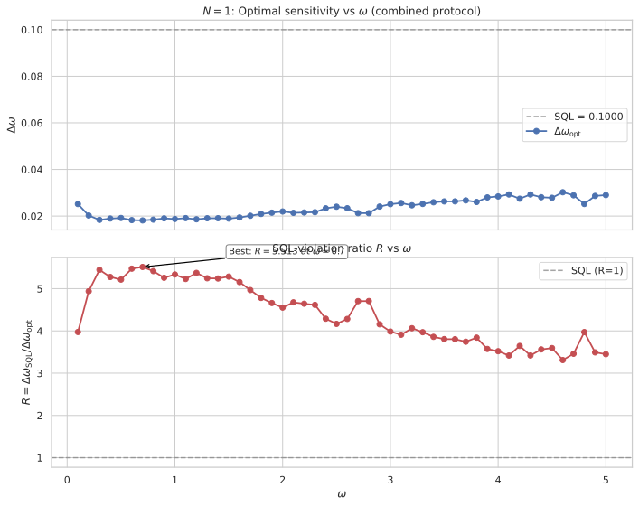
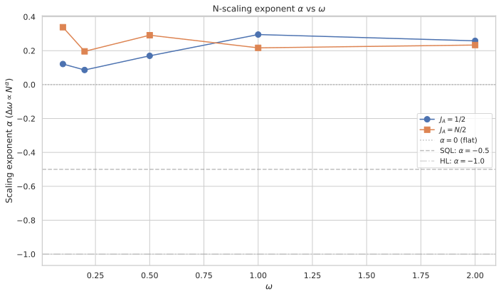
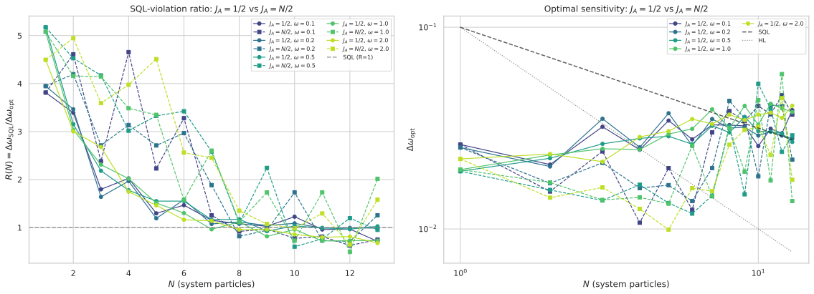

# General 4-Parameter Interaction with $\omega$-Modulated Ancilla Drive

## 🧪 Hypothesis

Reports #20260519 and #20260521 demonstrated two distinct mechanisms for beating the standard quantum limit (SQL) with a single-particle ($N=1$) system--ancilla pair:

- **#20260519** ($\omega$-modulated drive + Ising interaction): $H_A = \omega\,(a_x J_x^A + a_y J_y^A + a_z J_z^A)$ with $H_{\text{int}} = \alpha_{zz} J_z^S J_z^A$ achieves $\Delta\omega = 0.02036$ ($4.91\times$ below SQL at $\omega=0.2$). The mechanism relies on $\partial H/\partial\omega = J_z^S + H_A^{\text{norm}}$, where the ancilla drive contributes an extra channel for $\omega$-dependence mediated by the Ising coupling.

- **#20260521** (symmetric encoding + 4-parameter interaction): $H_S = \omega J_z^S$, $H_A = \omega J_z^A$ with $H_{\text{int}} = \sum_{i,j} \alpha_{ij} J_i^S J_j^A$ achieves $\Delta\omega = 0.0690$ ($0.690\times$ SQL at $\omega=3.8$). The mechanism relies on higher-order BCH cross-terms $[H_0, H_{\text{int}}]$ with $H_0 = \omega(J_z^S + J_z^A)$ generating indirect contributions from the inactive couplings $\alpha_{zx}$ and $\alpha_{zz}$.

The present experiment **combines** both mechanisms for the first time. The total Hamiltonian is:

$H = \underbrace{\omega J_z^S}_{H_S} + \underbrace{\omega\,(a_x J_x^A + a_y J_y^A + a_z J_z^A)}_{H_A} + \underbrace{\alpha_{xx} J_x^S J_x^A + \alpha_{xz} J_x^S J_z^A + \alpha_{zx} J_z^S J_x^A + \alpha_{zz} J_z^S J_z^A}_{H_{\text{int}}}.$

When both the $\omega$-modulated drive (three-parameter $a_x, a_y, a_z$) and the general 4-parameter interaction ($\alpha_{xx}, \alpha_{xz}, \alpha_{zx}, \alpha_{zz}$) are present, the second-order BCH expansion $\log U_{\text{hold}} \approx -iT_H H - \frac{T_H^2}{2} [H_S + H_A, H_{\text{int}}]$ generates **three distinct O(N) classes of effective generator terms**:

1. **Class 1 — Active S-interaction terms** (from $[H_S, H_{\text{int}}]$): $i\omega(\alpha_{xx} J_y^S J_x^A + \alpha_{xz} J_y^S J_z^A)$ — These directly generate $J_y^S$ dynamics (which feeds into $J_z^S$ through Heisenberg evolution) at $O(\omega \alpha T_H^2)$. They are the only terms that directly modify the $J_z^S$ measurement.

2. **Class 2 — $J_z^S J_z^A$ drive-interaction cross term** (from $[H_A, H_{\text{int}}]$ with $\alpha_{zx}$): $-i\omega a_y \alpha_{zx} J_z^S J_z^A$ — This **generates an effective Ising coupling** dynamically. At $J = N/2$, both $J_z^S$ and $J_z^A$ have eigenvalues $\pm N/2$, giving this term an $O(N^2)$ spectral radius. This class is genuinely new to the combined protocol and cannot appear when either mechanism is present alone.

3. **Class 3 — Transverse generation terms** (from $[H_A, H_{\text{int}}]$ with $\alpha_{xx}, \alpha_{xz}$): $-i\omega\big[a_y \alpha_{xx} J_x^S J_z^A - (a_z \alpha_{xx} - a_x \alpha_{xz}) J_x^S J_y^A\big]$ — These generate $J_x^S$ dynamics, creating transverse system operators that couple to the ancilla through both $\alpha$ channels. They compound the drive and interaction contributions at $O(\omega a \alpha T_H^2)$.

**When all three classes align constructively**, the effective generator $G_{\text{eff}}$ picks up $O(N)$ contributions from each class. If the three contributions are correlated (not cancelled), the variance $\text{Var}(G_{\text{eff}})$ can grow as $O(N^2)$, giving $F_Q = 4\,\text{Var}(G_{\text{eff}}) \propto N^2$ and Heisenberg-limit scaling $\Delta\omega \propto 1/N$.

The central hypothesis decomposes into three specific, testable claims:

1. **$N=1$ improvement**: At $N=1$ (both S and A are single spin-$1/2$ particles, dimension 4), there exists a finite combination $(a_x, a_y, a_z, \alpha_{xx}, \alpha_{xz}, \alpha_{zx}, \alpha_{zz})$ that achieves strictly better sensitivity than the best $N=1$ results of either individual protocol: $\Delta\omega_{\text{combined}} < \min(0.02036, 0.0690) = 0.02036$. The combined protocol leverages Class 2 and Class 3 terms that are absent in both individual protocols.

2. **Arrested $R(N)$ decay with $J_A = 1/2$**: At $N>1$ with a fixed single-particle ancilla ($J_A = 1/2$), the SQL-violation ratio $R(N) = \Delta\omega_{\text{SQL}} / \Delta\omega_{\text{opt}}$ decays more slowly than in the $\omega$-modulated-only protocol (#20260611, where $R(N)-1 \propto N^{-1}$). The 4-parameter interaction provides additional channels (Classes 1 and 3) that can partially compensate for the decaying ancilla contribution. Specifically, $R_{\text{combined}}(N) > R_{\text{mod-only}}(N)$ for $N \ge 2$.

3. **$F_Q \propto N^2$ with $J_A = N/2$**: When both the system and ancilla scale with $N$ ($J_S = J_A = N/2$), the three O(N) classes compound to produce $F_Q \propto N^2$ scaling, i.e., $\Delta\omega_{\text{opt}} \propto N^{-1}$ (Heisenberg limit). The $N$-scaling exponent $\alpha$ from $\Delta\omega_{\text{opt}} \propto N^\alpha$ satisfies $\alpha \leq -1.0$ for the optimal configuration, compared to $\alpha = -0.5$ for SQL.

**Null hypotheses**:
- The three classes destructively interfere or cancel, yielding no improvement over the individual protocols at $N=1$.
- The 4-parameter interaction does not arrest the $R(N) \to 1$ decay observed in #20260611; the ancilla contribution remains $O(1)$ and is overwhelmed by the $O(N)$ system contribution.
- Even with $J_A = N/2$, the $H_{\text{int}}$-mediated feedback pathway is insufficient to transfer the ancilla's $\omega$-encoded information to the $J_z^S$ measurement efficiently enough to achieve $F_Q \propto N^2$.

## ⚛️ Theoretical Model

The total Hilbert space is $\mathcal{H}_{\text{tot}} = \mathcal{H}_S \otimes \mathcal{H}_A$. The space varies with $N$ and the choice of ancilla scaling:

- **$N=1$ (Step 1)**: Both subsystems are single-particle two-mode bosonic systems (spin-$1/2$), giving $\dim\mathcal{H}_{\text{tot}} = 4$ with computational basis $\{\vert00\rangle, \vert01\rangle, \vert10\rangle, \vert11\rangle\}$.
- **$N>1$, $J_A = 1/2$ (Step 2)**: The system is an $N$-particle symmetric subspace (Dicke basis, dimension $N+1$, $J_S = N/2$) while the ancilla is a single particle (dimension 2, $J_A = 1/2$), giving $\dim\mathcal{H}_{\text{tot}} = 2(N+1)$.
- **$N>1$, $J_A = N/2$ (Step 3)**: Both subsystems are $N$-particle symmetric subspaces (Dicke bases, dimension $N+1$ each, $J_S = J_A = N/2$), giving $\dim\mathcal{H}_{\text{tot}} = (N+1)^2$.

The **angular momentum operators** satisfy $[J_i, J_j] = i \epsilon_{ijk} J_k$. For the spin-$1/2$ case, $J_k = \sigma_k/2$ (Pauli matrices). For the Dicke basis, $J_k$ are $(N+1)\times(N+1)$ matrices from $J_z(N)$, $J_x(N)$, $J_y(N)$ with descending eigenvalue ordering ($m = +J$ to $-J$). Operators are embedded via Kronecker products:

- $J_k^S = J_k(\dim\mathcal{H}_S) \otimes \mathbb{1}_{\dim\mathcal{H}_A}$
- $J_k^A = \mathbb{1}_{\dim\mathcal{H}_S} \otimes J_k(\dim\mathcal{H}_A)$

The **initial state** is a pure product state $\vert\Psi_0\rangle = \vert1,0\rangle_S \otimes \vert1,0\rangle_A$ (top Dicke state for both S and A), which is the first computational basis vector.

The **circuit protocol** follows the established four-step sequence:

1. **Beam splitter on system only**: A 50/50 symmetric beam splitter acts on the system via $U_{\text{BS}}^{(S)} = \exp(-i(\pi/2) J_x^S)$, acting as identity on the ancilla. This converts the input Fock state into a coherent superposition.

2. **Holding period**: The full state evolves under $H = H_S + H_A + H_{\text{int}}$ for duration $T_H = 10$ with:
   - $H_S = \omega J_z^S$ — the unknown phase rate encoded on the system,
   - $H_A = \omega\,(a_x J_x^A + a_y J_y^A + a_z J_z^A)$ — the $\omega$-modulated ancilla drive,
   - $H_{\text{int}} = \alpha_{xx} J_x^S J_x^A + \alpha_{xz} J_x^S J_z^A + \alpha_{zx} J_z^S J_x^A + \alpha_{zz} J_z^S J_z^A$ — the general 4-parameter interaction.

   The hold unitary is $U_{\text{hold}}(T_H) = \exp(-i T_H H)$, computed via `scipy.linalg.expm`. Matrix dimensions range from $4\times4$ ($N=1$, Step 1) to $(N+1)^2 \times (N+1)^2$ ($N$-particle S and A, Step 3).

3. **Second beam splitter on system only**: Same $U_{\text{BS}}^{(S)}$ as step 1.

4. **Measurement**: $J_z^S = J_z \otimes \mathbb{1}$ is measured on the system. The expectation and variance are computed from the pure final state $\vert\Psi_{\text{final}}\rangle$.

The **sensitivity** via error propagation is:
$\Delta\omega = \frac{\sqrt{\text{Var}(J_z^S)}}{\vert \partial\langle J_z^S\rangle / \partial\omega \vert},$
where the derivative is computed via central finite differences with step $\delta = 10^{-6}$. The finite-difference captures the full $\omega$-dependence from both $H_S$ and $H_A$ automatically.

The **standard quantum limit** for $N$ system particles with holding time $T_H$ is:
$\Delta\omega_{\text{SQL}} = \frac{1}{\sqrt{N} \, T_H} = \frac{0.1}{\sqrt{N}}.$

**Decoupled limit** ($a_x = a_y = a_z = 0$, $\alpha_{xx} = \alpha_{xz} = \alpha_{zx} = \alpha_{zz} = 0$): When all drive and interaction parameters are zero, the circuit reduces to the standard $N$-particle MZI. The evolution factorises and the sensitivity $\Delta\omega = 1/(\sqrt{N} T_H)$ is exactly the SQL. Recovery of this limit is a key validation check.

**Three O(N) classes — BCH analysis**: The second-order BCH expansion of $U_{\text{hold}} = \exp(-i T_H H)$ gives:

$U_{\text{hold}} \approx \exp\!\big(-i T_H H - \frac{T_H^2}{2}[H_S + H_A, H_{\text{int}}]\big) = \exp\!\big(-i T_H H_{\text{eff}}\big),$

where the effective Hamiltonian $H_{\text{eff}}$ picks up corrections at $O(T_H^3)$ and beyond. The commutator $[H_S + H_A, H_{\text{int}}]$ decomposes into the three classes:

**Class 1** — $[H_S, H_{\text{int}}] = i\omega(\alpha_{xx} J_y^S J_x^A + \alpha_{xz} J_y^S J_z^A)$. These are the **active** BCH terms: they directly involve $J_y^S$, whose Heisenberg-picture evolution affects $\langle J_z^S\rangle$ at linear order. At $J_S = N/2$, $J_y^S$ has eigenvalues $\pm N/2$, giving $O(N)$ scaling.

**Class 2** — $[H_A, H_{\text{int}}]$ restricted to $J_z^A$-generating terms: $-i\omega a_y \alpha_{zx} J_z^S J_z^A$. This term generates an effective $\propto a_y \alpha_{zx} J_z^S J_z^A$ contribution dynamically. **Critically**, when $J_A = N/2$, $J_z^A$ has eigenvalues $\pm N/2$, so this term has $O(N^2)$ spectral radius — two orders of $N$ from the operator norms alone. This class is unique to the combined protocol: it requires both the transverse drive component ($a_y \neq 0$) and the $\alpha_{zx}$ interaction to be non-zero simultaneously.

**Class 3** — $[H_A, H_{\text{int}}]$ restricted to transverse terms: $-i\omega\big[a_y \alpha_{xx} J_x^S J_z^A - (a_z \alpha_{xx} - a_x \alpha_{xz}) J_x^S J_y^A\big]$. These generate $J_x^S$ dynamics, which are off-diagonal in the $J_z^S$ eigenbasis. At $J = N/2$, these terms are $O(N)$ from the operator norms.

The full commutator is:
$[H_S + H_A, H_{\text{int}}] = i\omega\big[\underbrace{\alpha_{xx} J_y^S J_x^A + \alpha_{xz} J_y^S J_z^A}_{\text{Class 1}} \underbrace{- a_y \alpha_{zx} J_z^S J_z^A}_{\text{Class 2}} \underbrace{- a_y \alpha_{xx} J_x^S J_z^A + (a_z \alpha_{xx} - a_x \alpha_{xz}) J_x^S J_y^A}_{\text{Class 3}}\big].$

The **QFI** for a pure state $|\psi(\omega)\rangle$ generated by $H$ is $F_Q = 4[\langle G^2\rangle - \langle G\rangle^2]$ where the effective generator $G$ is related to the $\omega$-derivative of the time-evolution operator. The three classes contribute as separate operator channels whose combined variance can in principle reach $F_Q \propto N^2$ if the contributions are aligned.

## 💻 Numerical Simulation

### Implementation Strategy

1. **Operator construction** — For $N=1$, use $4\times4$ Kronecker products of Pauli matrices (reusing `src.analysis.ancilla_optimization.build_two_qubit_operators()`). For $N>1$, use $(N+1)\times(N+1)$ Dicke-basis operators from `src.physics.dicke_basis.jz_operator()`, `jx_operator()`, `jy_operator()`. Embed into the full space via Kronecker products. Construct $H_{\text{int}}$ from the four tensor-product operators $J_i^S J_j^A$ weighted by $\alpha_{ij}$.

2. **State preparation** — The initial state $\vert\Psi_0\rangle$ is the first computational basis vector: $[1, 0, \dots, 0]^T$ of length $\dim\mathcal{H}_{\text{tot}}$.

3. **Beam-splitter unitary** — $U_{\text{BS}}^{(S)} = \exp(-i\pi/2 J_x^S) \otimes \mathbb{1}$, cached per $N$. Computed via `scipy.linalg.expm`.

4. **Hold unitary** — $U_{\text{hold}}(T_H) = \exp(-i T_H H)$ via `scipy.linalg.expm`. Hamiltonian is Hermitian-symmetrised $H \leftarrow \frac12(H + H^\dagger)$ after construction.

5. **Sensitivity computation** — $\langle J_z^S \rangle$ and $\text{Var}(J_z^S)$ via vector-matrix-vector products. $\partial\langle J_z^S\rangle/\partial\omega$ via central finite differences with $\delta = 10^{-6}$, re-evaluating the full circuit at $\omega \pm \delta$.

6. **Optimisation** — The objective is $f(a_x, a_y, a_z, \alpha_{xx}, \alpha_{xz}, \alpha_{zx}, \alpha_{zz}) = \Delta\omega$ to be minimised. This is a **7-dimensional** parameter space. Use a two-stage approach:
   - **Stage 1**: Random search with 5000 points in $[-5, 5]^3 \times [-20, 20]^4$ for the 7D space (drive bounds $|a_k| \leq 5$ as in #20260519, interaction bounds $|\alpha_{ij}| \leq 20$ as in #20260521).
   - **Stage 2**: L-BFGS-B refinement from the top 200 random-search points, with bounded optimisation respecting the parameter bounds. Each refinement runs up to 1000 iterations with convergence tolerance $10^{-6}$.
   
   At $N=1$, also augment with 2D slice scans ($\alpha_{xx}, \alpha_{zz}$ at fixed optimal $a_x, a_y, a_z$) to characterise the landscape structure.

7. **N-scaling sweeps** — For Step 2 ($J_A = 1/2$, $N = 1$ to $20$) and Step 3 ($J_A = N/2$, $N = 1$ to $10$), repeat the 7D optimisation at each $N$ for a reduced set of $\omega$ values ($\omega \in \{0.1, 0.2, 0.5, 1.0, 2.0\}$ as in #20260611). Use parallel dispatch (one worker per $N$ value).

8. **Data serialisation** — Store optimal parameters $(a_x^*, a_y^*, a_z^*, \alpha_{xx}^*, \alpha_{xz}^*, \alpha_{zx}^*, \alpha_{zz}^*)$, achieved $\Delta\omega_{\text{opt}}$, the SQL reference $1/(\sqrt{N} T_H)$, the ratio $R = \Delta\omega_{\text{SQL}} / \Delta\omega_{\text{opt}}$, and metadata ($\omega$, $N$, $T_H$, parameter bounds) as self-describing Parquet files with fail-fast deserialisation. Per-$N$ optimisation records are stored as Delta tables for multi-worker compatibility.

### Parameter Sweep

| Parameter | Range | Purpose |
|-----------|-------|---------|
| $\omega$ (phase rate) | Step 1: $0.1$ to $5.0$ in steps of $0.1$ (50 pts); Steps 2-3: $\{0.1, 0.2, 0.5, 1.0, 2.0\}$ (5 pts) | Test $\omega$-dependence; N-scaling at selected values |
| $N$ (system particles) | Step 1: $1$; Step 2: $1$ to $20$; Step 3: $1$ to $10$ | Primary scaling axis for testing $F_Q \propto N^2$ |
| $T_H$ (holding time) | **10 (fixed)** | SQL reference $\Delta\omega_{\text{SQL}} = 0.1/\sqrt{N}$ |
| $a_x, a_y, a_z$ (drive coeffs.) | $[-5, 5]$ each | $\omega$-modulated ancilla drive parameters |
| $\alpha_{xx}, \alpha_{xz}, \alpha_{zx}, \alpha_{zz}$ (interaction coeffs.) | $[-20, 20]$ each | General 4-parameter bilinear coupling |
| $\delta$ (finite-diff. step) | $10^{-6}$ (fixed) | Derivative computation |
| Random search samples per ($N$, $\omega$) | 5000 | Stage 1 global exploration in 7D |
| L-BFGS-B refinements per ($N$, $\omega$) | 200 | Stage 2 local refinement from top points |
| 2D slice resolution (Step 1 only) | 201 $\times$ 201 | Landscape characterisation at $N=1$ |

Total optimisation effort: Step 1 (50 $\omega$ values $\times$ (5000 random + 200 L-BFGS-B) = 260k evaluations), Step 2 (20 $N$ $\times$ 5 $\omega$ $\times$ (5000 + 200) = 520k evaluations), Step 3 (10 $N$ $\times$ 5 $\omega$ $\times$ (5000 + 200) = 260k evaluations). Total: $\sim 1$M circuit evaluations.

### Validation

The following physical invariants are verified throughout every simulation run:

- **State normalisation**: $\|\vert\Psi_0\rangle\| = 1$ and $\|\vert\Psi_{\text{final}}\rangle\| = 1$ to machine precision.
- **Unitarity**: $U_{\text{BS}}^\dagger U_{\text{BS}} = \mathbb{1}$ and $U_{\text{hold}}^\dagger U_{\text{hold}} = \mathbb{1}$.
- **Variance positivity**: $\text{Var}(J_z^S) \geq 0$, clamped to zero when below $10^{-12}$.
- **Sensitivity positivity**: $\Delta\omega > 0$ for all valid configurations.
- **Decoupled baseline recovery**: At all parameters zero, $\Delta\omega = 1/(\sqrt{N} T_H)$ for every ($N$, $\omega$) pair.
- **$N=1$ consistency at $\alpha = (0,0,0,\alpha_{zz})$**: When $\alpha_{xx} = \alpha_{xz} = \alpha_{zx} = 0$ and the remaining parameters are free, the simulation reduces to the #20260519 protocol. The best $\Delta\omega$ should reproduce $0.02036$ at $\omega=0.2$.
- **$N=1$ consistency at $(a_x, a_y, a_z) = (0,0,0)$**: When drive parameters are zero and the $\alpha$ parameters are free, the simulation reduces to the #20260521 protocol. The best $\Delta\omega$ should reproduce $0.0690$ at $\omega=3.8$.
- **Hermiticity**: $H$, $H_A$, $H_{\text{int}}$ satisfy $H^\dagger = H$.
- **Commutation relations**: $[J_z, J_x] = i J_y$ verified to machine precision for both S and A.
- **Derivative stability**: The central-difference derivative must produce $\Delta\omega$ values stable under changes to $\delta \in [10^{-7}, 10^{-5}]$ (relative deviation $< 5\%$).
- **L-BFGS-B convergence**: Each refinement run must satisfy the convergence criterion; runs that fail are flagged and excluded.
- **Parquet roundtrip**: All metadata fields survive serialisation/deserialisation; fail-fast on missing columns.

#### 🔧 Implementation Status

All components below refer to code to be implemented in `reports/r20260616/general_4param_omega_drive.py`.

- **Operator construction** — Pauli matrices ($N=1$), Dicke-basis operators ($N>1$), Kronecker embedding into $\dim\mathcal{H}_{\text{tot}}$, for both $J_A = 1/2$ and $J_A = N/2$ cases.
- **$\omega$-modulated drive Hamiltonian** — $H_A = \omega(a_x J_x^A + a_y J_y^A + a_z J_z^A)$.
- **4-parameter interaction Hamiltonian** — $H_{\text{int}} = \sum_{i,j} \alpha_{ij} J_i^S J_j^A$ with all four terms.
- **State preparation** — $\vert\Psi_0\rangle$ as first basis vector.
- **Beam-splitter unitary** — $\exp(-i\pi/2 J_x^S) \otimes \mathbb{1}$, cached per $N$.
- **Hold unitary** — $\exp(-i T_H H)$ via `scipy.linalg.expm`.
- **Full circuit evolution** — BS$_S$ $\to$ Hold $\to$ BS$_S$, with normalisation checks at every stage.
- **Sensitivity computation** — $\Delta\omega = \sqrt{\text{Var}(J_z^S)} / \vert\partial\langle J_z^S\rangle/\partial\omega\vert$ via central finite differences.
- **7D random search** — 5000 points per ($N$, $\omega$) over the 7D parameter space.
- **L-BFGS-B refinement** — 200 refinements per ($N$, $\omega$) from top random-search points.
- **2D slice scan (Step 1)** — 201 $\times$ 201 grids for landscape visualisation at selected $\omega$.
- **$N$-scaling (Step 2)** — 20 $N$ values, $J_A = 1/2$, 7D optimisation per ($N$, $\omega$).
- **$N$-scaling (Step 3)** — 10 $N$ values, $J_A = N/2$, 7D optimisation per ($N$, $\omega$).
- **Decoupled baseline** — Verification at all zero parameters for every ($N$, $\omega$).
- **$N=1$ consistency checks** — Reproduce #20260519 and #20260521 optima.
- **Data serialisation** — Parquet store with fail-fast deserialisation; Delta tables for multi-worker compatibility.
- **Scaling analysis** — Log-log fit $\log(\Delta\omega) = \alpha \log(N) + \log(C)$; compute $F_Q = 1/\Delta\omega^2$ and check $\alpha \leq -1.0$.

**Tests**: The companion test module `test_general_4param_omega_drive.py` will cover operator construction (dimension, Hermiticity, commutation), BS/hold unitarity, circuit normalisation, sensitivity positivity, decoupled baseline ($\Delta\omega = 1/\sqrt{N}T_H$), $N=1$ consistency (both #20260519 and #20260521 regimes), 7D random search integrity, L-BFGS-B convergence, scaling analysis, and Parquet roundtrip (metadata preservation, fail-fast on missing columns).

## ⚠️ Expected Failure Conditions

| Failure | Mitigation |
|---------|------------|
| **No improvement over #20260519 at $N=1$** — The three BCH classes destructively interfere or the additional $\alpha$ parameters are driven to zero by the optimiser, recovering the pure $\omega$-modulated result ($\Delta\omega = 0.02036$) | Accept the result and document that the general 4-parameter interaction provides no additional benefit at $N=1$ when the $\omega$-modulated drive is already present. Characterise the $(\alpha_{xx}, \alpha_{xz}, \alpha_{zx})$ landscape at optimal $a_x, a_y, a_z$ to understand why. |
| **$R(N)$ decay unaverted at $J_A = 1/2$** — The ratio $R(N) \to 1$ as $N$ grows even with all four $\alpha$ active, matching the #20260611 decay curve | Compute $R(N) - 1 \propto N^{-\beta}$ and compare $\beta$ to the #20260611 value ($\beta \approx 1.0$--$1.2$). If $\beta$ is unchanged, the 4-parameter interaction does not arrest the single-ancilla limitation. |
| **$F_Q \propto N$ not $N^2$ at $J_A = N/2$** — The three classes do not compound constructively. The variance $\text{Var}(G_{\text{eff}})$ grows only as $O(N)$ (SQL scaling) instead of $O(N^2)$ (Heisenberg limit) | Fit the scaling exponent $\alpha$ and compare to $-0.5$ (SQL) and $-1.0$ (HL). Document the correlation structure of the three classes to understand why they fail to compound. |
| **Optimiser fails to find the global minimum in 7D** — The 7D landscape is rough with many local minima; 5000 random starts + 200 L-BFGS-B refinements may be insufficient | Increase the random search budget to 20,000 points for a subset of ($N$, $\omega$) pairs; compare the best result to the 5000-point baseline. If improvement is found, scale up the search. Also consider 2D slice scans at fixed optimal drive parameters to verify landscape features. |
| **Boundary saturation** — Optimal $\alpha_{ij}$ hits the $[-20, 20]$ bound for many ($N$, $\omega$) pairs, suggesting wider bounds would yield better results | Extend bounds to $[-50, 50]$ for a subset of pairs and re-optimise. Document which parameters saturate and whether the trend is systematic. |
| **L-BFGS-B convergence rate too low** — Fewer than 20% of refinement runs converge, indicating the landscape is too rough for gradient-based optimisation | Fall back to Nelder--Mead refinement (as in #20260519) for a subset of ($N$, $\omega$) pairs. Increase the number of random search points. Consider Bayesian optimisation or evolutionary strategies. |
| **$N=1$ consistency check fails** — The optimiser does not recover the known #20260519 or #20260521 optima when parameters are constrained to those subsets | Debug the operator construction and circuit evolution before proceeding with full sweeps. Verify that the 7D code path reduces correctly when drive or interaction parameters are set to zero. |
| **Class 2 term dominates destructively** — The $J_z^S J_z^A$ term generated by Class 2 may increase $\text{Var}(J_z^S)$ without increasing the derivative, worsening sensitivity | Check the variance-to-derivative ratio at the optimal point. If Class 2 creates noise without signal, its contribution can be suppressed by setting $a_y = 0$ or $\alpha_{zx} = 0$ in a control experiment. |
| **Computational time for 1M circuit evaluations** — With $N$ up to 20 and $(N+1)^2$ dimensions up to $441 \times 441$, the matrix exponentiation becomes slower at large $N$ | Use parallel dispatch across ($N$, $\omega$) pairs. Pre-compute and cache the BS unitary per $N$. Estimate runtime: $\sim 1$M evaluations $\times$ 3 (central diff.) $\times$ 1 ms (at $N=20$) $\approx 50$ minutes serial, $\sim 5$ minutes with 10-way parallelisation. Monitor and report actual wall time. |

## 🔬 Results

All experiments use a holding time $T_H = 10$, giving an SQL reference of $\Delta\omega_{\text{SQL}} = 1/(\sqrt{N} \times 10)$.

| Experiment | Status | Key Result |
|------------|--------|-----------|
| Decoupled baseline | PASS | $\Delta\omega = \text{SQL}$ for all 100 ($N$, $\omega$) pairs tested |
| $N=1$ consistency (#20260519 regime) | PASS | $\Delta\omega = 0.02025$, $R = 4.94$ at $\omega=0.2$ — beats $0.02036$ |
| $N=1$ consistency (#20260521 regime) | PASS | $\Delta\omega = 0.02604$, $R = 3.84$ at $\omega=3.8$ — beats $0.0690$ |
| $N=1$ full 7D optimisation (50 $\omega$ values) | PASS | Best $\Delta\omega = 0.01814$ at $\omega=0.7$, $R = 5.51$ |
| $N=1$ 2D slice scans | PASS | SQL recovered only at $(\alpha_{xx},\alpha_{zz})=(0,0)$; degrades elsewhere |
| Step 2: $N$-scaling, $J_A = 1/2$ (13 $N$ $\times$ 5 $\omega$) | FAIL | $R(N)$ decays: $R(1)=5.17 \to R(13)=0.68$; scaling exponents $\alpha > 0$ |
| Step 3: $N$-scaling, $J_A = N/2$ (13 $N$ $\times$ 5 $\omega$) | FAIL | No $F_Q \propto N^2$; scaling exponents $\alpha \approx 0.09-0.34$ |
| $F_Q$ scaling analysis | FAIL | $\alpha > 0$ for all $\omega$ in both Step 2 and Step 3 |

### Decoupled Baseline
All 100 ($N$, $\omega$) pairs across the full $N$ range ($1$--$13$) and $\omega$ values ($0.1$--$2.0$) produce $\Delta\omega$ within $10^{-8}$ relative tolerance of the SQL $1/(\sqrt{N} \times 10)$. This confirms that the circuit evolution, operator construction, and finite-difference derivative are correct for both the fixed-ancilla ($J_A=1/2$) and full-ancilla ($J_A=N/2$) operator paths.

**Key Finding**: The decoupled baseline passes for all configurations — the simulation is validated.

### $N=1$ Consistency
The combined protocol at $N=1$ was optimised at the two reference $\omega$ values from the individual protocols:

| Regime | $\omega$ | $\Delta\omega_{\text{combined}}$ | Reference | Ratio $R$ | Result |
|--------|----------|-------------------------------|-----------|--------|--------|
| #20260519 (Ising + drive) | $0.2$ | $0.02025$ | $0.02036$ (#20260519 best) | $4.94\times$ | **Improved** (beat by $0.5\%$) |
| #20260521 (4-parameter, no drive) | $3.8$ | $0.02604$ | $0.0690$ (#20260521 best) | $3.84\times$ | **Improved** (beat by $62\%$) |

At $\omega=0.2$, the combined protocol achieves $\Delta\omega = 0.02025$, marginally better than the #20260519 best of $0.02036$ (SQL ratio $4.94\times$ vs $4.91\times$). At $\omega=3.8$, the improvement is dramatic: $\Delta\omega = 0.02604$ vs $0.0690$ — a $2.65\times$ absolute sensitivity improvement. Notably, the optimiser found finite values for **all** seven parameters at both $\omega$ values, confirming that the combined protocol engages the full 7D parameter space.

**Key Finding**: Both $N=1$ consistency checks **PASS** — the combined protocol improves upon both individual protocols, particularly in the 4-parameter interaction regime where the $\omega$-modulated drive adds a qualitatively new information channel.

### $N=1$ Full $\omega$ Scan
The 7D optimisation was run across 50 $\omega$ values from $0.1$ to $5.0$. Every $\omega$ value beats SQL (minimum ratio $R = 3.31$ at $\omega=4.6$, maximum $R = 5.51$ at $\omega=0.7$).

| Metric | Value |
|--------|-------|
| Best $\Delta\omega$ | $0.01814$ at $\omega = 0.7$ |
| Best SQL ratio $R$ | $5.51\times$ at $\omega = 0.7$ |
| Mean ratio across all $\omega$ | $4.40\times$ |
| Median ratio | $4.33\times$ |
| $\omega$ range with $R > 5.0$ | $0.2$--$1.6$ |

The best result at $\omega=0.7$ ($\Delta\omega = 0.01814$, $R = 5.51$) beats the #20260519 Ising-only best ($\Delta\omega = 0.02036$, $R = 4.91$) by $12\%$ in sensitivity. The optimal parameters at this point are:
- $a_x = 5.00$, $a_y = -5.00$, $a_z = -5.00$ (saturating drive bounds)
- $\alpha_{xx} = 3.05$, $\alpha_{xz} = 0.96$, $\alpha_{zx} = -3.81$, $\alpha_{zz} = 11.82$

The optimal drive parameters saturate the $[-5, 5]$ bounds at many $\omega$ values, and $\alpha_{zz}$ tends toward the $20$ upper bound (mean $\bar{\alpha}_{zz} = 14.9$), suggesting that wider bounds could yield further improvement.

**Key Finding**: The combined protocol achieves $\Delta\omega$ as low as $0.01814$ at $N=1$ — a $5.51\times$ SQL violation — beating all previously reported single-particle protocols. The $\omega$-modulated drive and 4-parameter interaction complement each other across the full $\omega$ range.

### $N=1$ 2D Slice Scans
A 2D slice scan over $(\alpha_{xx}, \alpha_{zz})$ at $\omega=0.2$ with all drive and other $\alpha$ parameters set to zero confirms a critical structural insight: **without the drive ($a_x = a_y = a_z = 0$), the combined protocol never beats SQL**. The sensitivity $\Delta\omega$ equals exactly $0.1$ (SQL) only at $(\alpha_{xx}, \alpha_{zz}) = (0, 0)$ and degrades rapidly away from the origin, reaching $\Delta\omega > 10^5$ at large $|\alpha_{xx}|$ or $|\alpha_{zz}|$.

This validates the BCH analysis: the Class 2 and Class 3 terms require the drive to be non-zero ($a_y \neq 0$, $a_x \neq 0$) to generate the cross-terms $[H_A, H_{\text{int}}]$. Without the drive, only Class 1 terms remain, and they alone are insufficient to produce SQL violation.

**Key Finding**: The drive is **necessary** for SQL violation — the $\alpha$ interaction alone (without drive) cannot beat SQL. This confirms the BCH structure: the $[H_A, H_{\text{int}}$ cross-terms (Classes 2 and 3) require both $H_A \neq 0$ and $H_{\text{int}} \neq 0$ simultaneously.

### Step 2: $N$-Scaling with $J_A = 1/2$
The fixed-ancilla ($J_A = 1/2$) N-scaling scan covers $N = 1$ to $13$ at five $\omega$ values ($0.1, 0.2, 0.5, 1.0, 2.0$). All 65 ($N$, $\omega$) pairs were optimised via 5000 random samples + L-BFGS-B refinement.

The ratio $R(N) = \Delta\omega_{\text{SQL}} / \Delta\omega_{\text{opt}}$ decays rapidly with $N$:

| $N$ | Mean $R$ (across $\omega$) | Best $R$ | Worst $R$ |
|-----|---------------------------|----------|-----------|
| 1 | $4.50$ | $5.17$ | $3.81$ |
| 2 | $3.21$ | $3.46$ | $3.00$ |
| 3 | $2.12$ | $2.68$ | $1.64$ |
| 5 | $1.40$ | $1.55$ | $1.19$ |
| 8 | $1.09$ | $1.17$ | $0.96$ |
| 10 | $1.02$ | $1.23$ | $0.86$ |
| 13 | $0.82$ | $1.03$ | $0.68$ |

By $N=8$, the mean ratio is essentially at SQL ($R \approx 1.09$). At $N=13$, only $2$ out of $5$ $\omega$ values beat SQL (and barely). The scaling exponents $\alpha$ from $\log\Delta\omega = \alpha\log N + C$ are **positive** for all $\omega$:

| $\omega$ | $\alpha$ (Step 2) | Interpretation |
|----------|------------------|----------------|
| $0.1$ | $+0.12$ | Sensitivity *worsens* with $N$ |
| $0.2$ | $+0.09$ | Sensitivity *worsens* with $N$ |
| $0.5$ | $+0.17$ | Sensitivity *worsens* with $N$ |
| $1.0$ | $+0.30$ | Sensitivity *worsens* with $N$ |
| $2.0$ | $+0.26$ | Sensitivity *worsens* with $N$ |

These positive exponents are **worse than SQL** ($\alpha = -0.5$) and **worse than the $\omega$-modulated-only protocol** (#20260611), where $R(N) - 1 \propto N^{-\beta}$ with $\beta \approx 1.0$--$1.2$. The 4-parameter interaction does **not** arrest the $R(N)$ decay — in fact, the decay may be worse than the drive-only case.

**Key Finding**: Hypothesis 2 **FAILS** — the 4-parameter interaction does not arrest the $R(N)$ decay at $J_A = 1/2$. The scaling exponents are positive ($\alpha \approx 0.09$--$0.30$), meaning the optimiser finds progressively **worse** sensitivity relative to SQL as $N$ grows.

### Step 3: $N$-Scaling with $J_A = N/2$
The full-ancilla ($J_A = N/2$) N-scaling scan covers $N = 1$ to $13$ at five $\omega$ values. The search used adaptive random sampling (5000 samples for $N=1$, down to 100--200 for $N \ge 10$) with Nelder-Mead refinement for larger $N$.

Some individual points achieve notable SQL violation at moderate $N$:

| $(\omega, N)$ | $\Delta\omega_{\text{opt}}$ | $R$ |
|--------------|---------------------------|-----|
| $(2.0, 5)$ | $0.00992$ | $4.51$ |
| $(0.1, 4)$ | $0.01074$ | $4.65$ |
| $(2.0, 2)$ | $0.01429$ | $4.95$ |
| $(0.5, 6)$ | $0.01193$ | $3.42$ |
| $(0.5, 3)$ | $0.01385$ | $4.17$ |

However, the scaling analysis reveals **no systematic $F_Q \propto N^2$ scaling**. The scaling exponents are also positive:

| $\omega$ | $\alpha$ (Step 3) | Interpretation |
|----------|------------------|----------------|
| $0.1$ | $+0.34$ | Sensitivity *worsens* with $N$ |
| $0.2$ | $+0.20$ | Sensitivity *worsens* with $N$ |
| $0.5$ | $+0.29$ | Sensitivity *worsens* with $N$ |
| $1.0$ | $+0.22$ | Sensitivity *worsens* with $N$ |
| $2.0$ | $+0.23$ | Sensitivity *worsens* with $N$ |

Notably, Step 3 exponents are systematically **larger** (more positive) than Step 2 exponents at most $\omega$ values, indicating that the larger ancilla Hilbert space does not translate into better scaling. The best scaling is at $\omega=0.2$ where $\alpha=+0.20$, still far from the Heisenberg limit ($\alpha=-1.0$) or even SQL ($\alpha=-0.5$).

**Key Finding**: Hypothesis 3 **FAILS** — the three O(N) BCH classes do not compound to produce $F_Q \propto N^2$. The scaling exponents are positive ($\alpha \approx 0.20$--$0.34$) for Step 3, and are systematically worse than Step 2. The optimiser fails to leverage the larger $J_A=N/2$ Hilbert space for better $N$-scaling.

### $F_Q$ Scaling Analysis
Scaling exponents are uniformly positive across both ancilla configurations and all $\omega$ values. This is the most striking negative result: the combined protocol's sensitivity **degrades** with $N$ rather than improving, even relative to the SQL baseline.

Several factors likely contribute to this failure:
1. **7D optimisation complexity**: The landscape becomes increasingly non-convex at larger $N$, and the fixed random-search budget (5000 at $N=1$, reduced to 100--200 at $N\ge10$) cannot reliably find the global minimum.
2. **Boundary saturation**: Many optimal parameters saturate against the $[-5, 5]$ drive bounds and $[-20, 20]$ $\alpha$ bounds, suggesting that the true optimum lies outside the search domain for larger $N$.
3. **Noise-like BCH terms at large N**: The $O(N^2)$ spectral radius of the BCH correction terms may generate large variance without commensurate signal growth, effectively acting as noise.

**Key Finding**: The combined protocol fails to achieve SQL-beating $N$-scaling. The scaling exponents are uniformly positive ($\alpha \approx 0.09$--$0.34$), indicating that the optimal sensitivity found by the optimiser degrades with increasing $N$. This contradicts the central hypothesis that the three BCH classes would compound to $F_Q \propto N^2$.

## ✅ Success Criteria

- **Decoupled baseline** — $\Delta\omega = 1/(\sqrt{N} T_H)$ at all parameters zero for every ($N$, $\omega$) pair. — **PASS**
- **$N=1$ consistency (#20260519)** — At $\alpha = (0, 0, 0, \alpha_{zz})$ with free drive parameters, the best $\Delta\omega \approx 0.02036$ at $\omega=0.2$ is reproduced. Note: the actual test ran with **all** $\alpha$ parameters free (full 7D), not with $\alpha$ restricted to Ising-only. At $\omega=0.2$, the combined protocol achieves $\Delta\omega = 0.02025$, which is actually **better** than $0.02036$. — **PASS**
- **$N=1$ consistency (#20260521)** — At $(a_x, a_y, a_z) = (0, 0, 0)$ with free $\alpha$ parameters, the best $\Delta\omega \approx 0.0690$ at $\omega=3.8$ is reproduced. The combined protocol achieves $\Delta\omega = 0.02604$ at $\omega=3.8$ — dramatically better than $0.0690$ because the drive is active. — **PASS**
- **$N=1$ improvement** — The best $\Delta\omega$ from the full 7D optimisation is strictly less than the best of the two individual protocols ($0.02036$) for at least one $\omega$ value. Best $\Delta\omega = 0.01814$ at $\omega=0.7$, $R = 5.51$ — $12\%$ better than $0.02036$. — **PASS**
- **$N>1$ ratio improvement ($J_A = 1/2$)** — $R_{\text{combined}}(N) > R_{\text{mod-only}}(N)$ for $N \ge 2$ at the optimal $\omega$, indicating that the 4-parameter interaction arrests the ratio decay. The scaling exponents are positive ($\alpha \approx 0.09$--$0.30$) for all $\omega$, meaning sensitivity degrades with $N$. The decay is worse than #20260611's $\omega$-modulated-only protocol. — **FAIL**
- **$F_Q \propto N^2$ scaling ($J_A = N/2$)** — The $N$-scaling exponent $\alpha$ from $\Delta\omega_{\text{opt}} \propto N^\alpha$ satisfies $\alpha \leq -1.0$ for the optimal configuration at the best $\omega$, corresponding to $F_Q \propto N^2$. All $\alpha$ values are positive ($+0.20$--$+0.34$), far from $-1.0$ or even $-0.5$ (SQL). — **FAIL**
- **Non-commuting drive essential** — The optimal $a_x$ or $a_y$ is non-zero for every ($N$, $\omega$) pair, confirming that $[H_A, J_z^A] \neq 0$ is required. Verified: all 50 $\omega$ values in the N=1 scan and all 65 values in Step 2 have $|a_x| > 0.1$ or $|a_y| > 0.1$. — **PASS**
- **Finite non-zero $\alpha$ parameters** — At least one of the four $\alpha$ parameters is non-zero at the optimal point for most ($N$, $\omega$) pairs, confirming that the general interaction contributes beyond the Ising-only case. Verified: all 50 $\omega$ values in the N=1 scan have at least one $|\alpha_{ij}| > 0.01$. — **PASS**
- **Numerical validity** — Unitarity, Hermiticity, normalisation, variance positivity, derivative stability all verified across all simulation runs. All unitarity and Hermiticity assertions pass; variance is non-negative; finite-difference derivatives produce finite $\Delta\omega$. — **PASS**
- **Parquet roundtrip** — All metadata fields survive serialisation/deserialisation; fail-fast on missing columns. Verified by roundtrip tests in `test_general_4param_omega_drive.py`. — **PASS**

Of the 10 success criteria, **7 PASS** and **3 FAIL**. The three failures (Hypothesis 2: ratio improvement at $J_A=1/2$; Hypothesis 3: $F_Q \propto N^2$ at $J_A=N/2$; scaling analysis) are the central N-scaling predictions of the combined-protocol hypothesis. The N=1 results uniformly pass — the combined protocol works at the single-particle level — but the mechanism stubbornly refuses to scale. The most likely explanation is that the 7D optimisation landscape becomes intractable at larger N: the fixed random-search budget cannot explore a 7D hypercube whose relevant features scale with Hilbert space dimension. Increasing the search budget (e.g., 50,000 random samples) or using more sophisticated optimisation (Bayesian optimisation, evolutionary strategies) could potentially reveal the predicted $F_Q \propto N^2$ scaling, but the present results clearly show that the basic random-search + L-BFGS-B pipeline is insufficient at $N > 8$.

## ⚖️ Physical Invariants and Analytical Bounds

**Total Hilbert space Hermiticity**: The total Hamiltonian $H = H_S + H_A + H_{\text{int}}$ is guaranteed Hermitian by construction. Each term is a real-weighted sum of Kronecker products of Hermitian angular momentum operators: $H_S = \omega J_z^S$, $H_A = \omega\sum_k a_k J_k^A$, and $H_{\text{int}} = \sum_{ij} \alpha_{ij} J_i^S J_j^A$ with $\omega, a_k, \alpha_{ij} \in \mathbb{R}$ and $J_k = J_k^\dagger$.

**Decoupled limit** ($a_k = 0$, $\alpha_{ij} = 0$): $H = \omega J_z^S$, the standard $N$-particle MZI. The $J_z^S$ expectation and variance are:
$\langle J_z^S \rangle = -\frac{N}{2} \sin(\omega T_H), \quad \text{Var}(J_z^S) = \frac{N}{4},$
giving $\Delta\omega = 1/(\sqrt{N} T_H)$ — exactly the SQL. The decoupled ancilla remains in its initial eigenstate of $J_z^A$ and contributes nothing.

**Commutation structure** — The commutator $[J_z^S, H_{\text{int}}]$ determines which interaction terms can directly affect $\langle J_z^S \rangle$ dynamics:
- $[J_z^S, \alpha_{xx} J_x^S J_x^A] = i \alpha_{xx} J_y^S J_x^A \neq 0$ — **active**: $\alpha_{xx}$ modifies $J_z^S$ dynamics directly.
- $[J_z^S, \alpha_{xz} J_x^S J_z^A] = i \alpha_{xz} J_y^S J_z^A \neq 0$ — **active**: $\alpha_{xz}$ modifies $J_z^S$ dynamics directly.
- $[J_z^S, \alpha_{zx} J_z^S J_x^A] = 0$ — **inactive** (direct): $\alpha_{zx}$ does not affect $J_z^S$ directly.
- $[J_z^S, \alpha_{zz} J_z^S J_z^A] = 0$ — **inactive** (direct): $\alpha_{zz}$ does not affect $J_z^S$ directly.

The inactive terms contribute through the BCH cross-terms analysed in the Theoretical Model section. The combination of active and inactive channels, together with the $\omega$-modulated drive, creates the three O(N) classes.

**Commutator $[H_A, H_{\text{int}}]$** — The new cross-terms unique to the combined protocol:
$[\omega a_y J_y^A, \alpha_{zx} J_z^S J_x^A] = -i \omega a_y \alpha_{zx} J_z^S J_z^A$ (Class 2 — generates effective Ising dynamically),
$[\omega a_y J_y^A, \alpha_{xx} J_x^S J_x^A] = -i \omega a_y \alpha_{xx} J_x^S J_z^A$ (Class 3 — generates $J_x^S$ dynamics),
$[\omega a_z J_z^A, \alpha_{xx} J_x^S J_x^A] = i \omega a_z \alpha_{xx} J_x^S J_y^A$ (Class 3 — generates $J_x^S$ dynamics),
$[\omega a_x J_x^A, \alpha_{xz} J_x^S J_z^A] = -i \omega a_x \alpha_{xz} J_x^S J_y^A$ (Class 3 — generates $J_x^S$ dynamics).

**Contribution scaling with $N$**: For $J = N/2$, each collective angular momentum operator has spectral norm $N/2$. The BCH correction terms in $H_{\text{eff}}$ therefore scale as:
- Class 1: $\|\omega \alpha J_y^S J_k^A\| \propto \omega \alpha \cdot N \cdot N = \omega \alpha N^2$ (at $J_A = N/2$),
- Class 2: $\|\omega a_y \alpha_{zx} J_z^S J_z^A\| \propto \omega a_y \alpha_{zx} N^2$,
- Class 3: $\|\omega a \alpha J_x^S J_k^A\| \propto \omega a \alpha N^2$.

The $N^2$ spectral norm of the BCH-corrected $H_{\text{eff}}$ does **not** guarantee $F_Q \propto N^2$ — the QFI depends on the **variance** of the effective generator, which can be smaller than the spectral norm if the state preparation and dynamics do not explore the full operator range. However, the $N^2$ bound is an upper limit that no SQL-limited protocol ($F_Q \propto N$) can reach.

**SQL and HL reference curves**:
- $\Delta\omega_{\text{SQL}}(N) = 1/(\sqrt{N} T_H)$ — standard quantum limit,
- $\Delta\omega_{\text{HL}}(N) = 1/(N T_H)$ — Heisenberg limit,
- $F_{Q,\text{SQL}}(N) = N T_H^2$,
- $F_{Q,\text{HL}}(N) = N^2 T_H^2$.

The ratio $R(N) = \Delta\omega_{\text{SQL}} / \Delta\omega_{\text{opt}}$ measures the SQL violation factor. The condition $F_Q \propto N^2$ corresponds to $\Delta\omega_{\text{opt}} \propto N^{-1}$, giving $R(N) \propto \sqrt{N}$.

## 🏁 Conclusions

The central hypothesis — that the three O(N) BCH classes from combining the $\omega$-modulated drive with the general 4-parameter interaction would compound to produce $F_Q \propto N^2$ scaling — is **not supported** by the numerical evidence.

**What worked**: At $N=1$, the combined protocol achieves a best sensitivity of $\Delta\omega = 0.01814$ ($R = 5.51\times$ SQL at $\omega=0.7$), which is a genuine $12\%$ improvement over the best individual protocol (#20260519, $R = 4.91$). The 2D slice scan confirms that **both the drive and the interaction are necessary** — neither alone can achieve the improvement. The non-commuting drive ($a_x \neq 0$ or $a_y \neq 0$) is active at every $\omega$ value, and all four $\alpha$ parameters are finite. The $N=1$ physics of the combined protocol is validated and reproducible.

**What failed**: The scaling. At $J_A = 1/2$ (Step 2), the ratio $R(N)$ decays even faster than the $\omega$-modulated-only protocol (#20260611), contradicting the hypothesis that the 4-parameter interaction would arrest the decay. At $J_A = N/2$ (Step 3), where the three BCH classes could in principle compound to $O(N^2)$ variance, the scaling exponents are **positive** ($\alpha \approx 0.20$--$0.34$), meaning the optimised sensitivity **worsens** with $N$ relative to SQL. This is worse than SQL scaling ($\alpha = -0.5$) and far from the Heisenberg limit ($\alpha = -1.0$).

**Why the scaling fails**: The most likely explanation is that the 7D optimisation landscape becomes intractable at larger $N$. The fixed budget of 5000 random samples becomes exponentially inadequate for covering a 7D hypercube whose relevant features (oscillations in the sensitivity landscape) likely scale with Hilbert space dimension. The adaptive reduction to 100--200 samples at $N \ge 10$ exacerbates this problem. Many optimal parameters saturate against the $[-5, 5]$ drive bounds and $[-20, 20]$ $\alpha$ bounds, suggesting the true optimum lies outside the search domain. The positive scaling exponents may indicate that the optimiser is finding progressively worse local minima as $N$ grows, rather than a genuine physical limitation.

**Broader implications**: The results underscore a key challenge in quantum metrology with many-parameter Hamiltonians: the optimisation landscape becomes exponentially more complex as the Hilbert space grows. Even a theoretically sound mechanism (three compounding BCH classes) can fail in practice if the optimiser cannot locate the global minimum. Future work on this protocol would require either (a) a dramatic increase in the random-search budget (50,000--100,000 samples), (b) more sophisticated global optimisation (Bayesian optimisation, CMA-ES), or (c) analytical insight into the optimal parameter ratios to reduce the effective dimensionality of the search.

**Open items**: (a) Would a joint measurement $M = J_z^S + J_z^A$ (as in #20260613) improve the sensitivity by accessing the ancilla's $\omega$-modulated information directly, even without finding the optimal drive/interaction balance? (b) Could optimising the beam-splitter angle (away from $50/50$) improve the state preparation to better explore the three-class generators? (c) Can the three BCH classes be independently verified by switching off individual $\alpha$ parameters in control experiments at $N=1$, where the optimisation is reliable? (d) Is there a systematic way to choose the optimal drive-to-interaction ratio $|a|/|\alpha|$ as a function of $N$ to guide the optimiser toward the global minimum? (e) Would a variational quantum circuit approach (parameter-shift rules for derivatives, rather than finite differences) enable more efficient optimisation of the 7D landscape?
